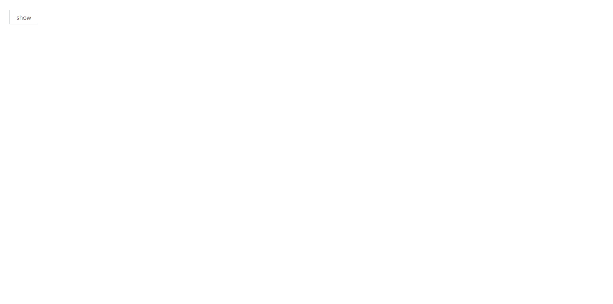
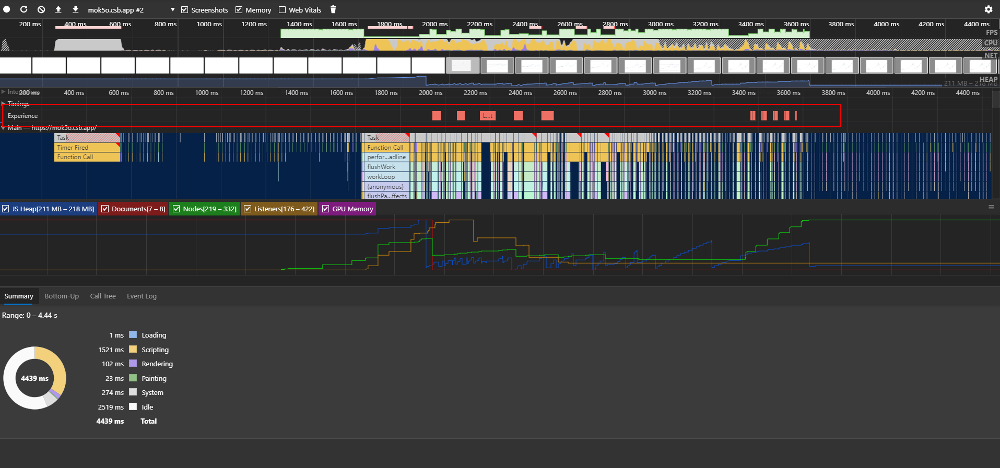
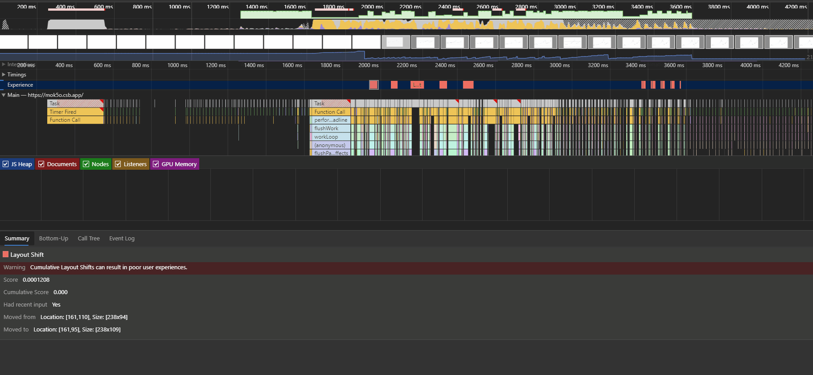
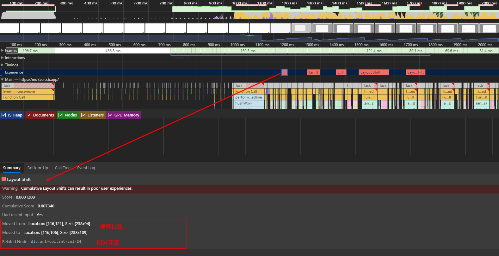
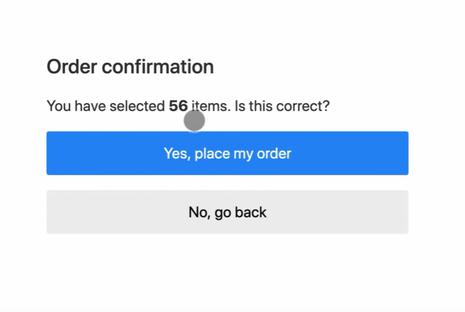
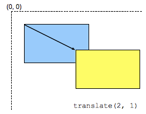

## 问题来源

当我使用下面一段代码来绘制打开的`Modal`展示图表的时候，出现了严重的`CLS`问题

```jsx | pure
<Modal
  title="表格"
  destroyOnClose
  visible={visible}
  footer={null}
  onCancel={() => setVisible(false)}
  width={1000}
>
  <Row style={{ height: 500 }}>
    <Col span={24}>{title}</Col>
    <Col span={24}>
      <Line {...config} />
    </Col>
  </Row>
</Modal>
```



## 排查

一开始并不知道这是什么问题，想法是可能`Modal`没有设置定高导致的，当给`Line`和`Modal`设置给定高度以后，效果明显改善了

```jsx | pure
<Modal
  title="表格"
  destroyOnClose
  visible={visible}
  footer={null}
  onCancel={() => setVisible(false)}
  width={1000}
  bodyStyle={{
    height: 500
  }}
  >
  <Row style={{ height: 500 }}>
    <Col span={24}>
      {title}
    </Col>
    <Col span={24}>
      <Line
        height={480},
        autoFit={false},
        {...config}
      />
    </Col>
  </Row>
</Modal>
```


### devtool-performance

这种动态变化的东西最好还是用浏览器的`devtool`来排查一下最精确，于是打开 Chrome 的`devtool/performance`面板，开始整个`Modal`显示过程的排查，整个过程也就`2~3`秒吧，生成了一张分析图如下



可以看到并没有内存泄漏的存在，毕竟前端那些问题总能扯到内存泄漏上去…

但是很明显的有几块红色的区域比较显眼，在这几块红色区域的位置正好处于`Modal`展开的状态



而下方对红色区域的分析则是`Warning: Cumulative Layout Shifts can result in poor user experiences.`（累积的布局偏移会导致很差的用户体验），貌似找到问题所在了。赶紧查查`Cumulative Layout Shifts`是啥。

## CLS

### 布局偏移

> LS：layout shift，布局偏移

布局偏移是在[Layout Instability API](https://github.com/WICG/layout-instability)中定义的，表现是在**浏览器可视窗口中的一个可见元素在渲染的两帧画面之间其起始位置发生改变**的情况，这样的一个元素就被认为是不稳定的元素。需要注意的是其针对的目标元素是一个可见的元素，如果一个元素是后续新增到 DOM 中，或者一个存在的元素改变尺寸，这就不能叫布局偏移。

布局偏移经常发生在因为资源是异步加载的或者 DOM 元素是动态添加到网页中的，通常是`img`或者`video`没有设置固定的尺寸，第三方的插件动态改变自身的大小。

但是这些问题在开发过程中通常很难感知，因为开发过程中的网络环境不一样，例如`img`，`video`这些在开发环境都可以被浏览器缓存下来，从而以很快的速度读取，进而无法感知到它们带来的布局偏移问题。

并不是所有的布局偏移都是坏事，实际上使用 CSS 的`transform`本身也属于布局偏移的一种，但是网页并不会将其定义为布局偏移，这是允许范围内的行为。

### CLS 是啥

> [Cumulative Layout Shift (CLS)](https://web.dev/cls/)
>
> 累积布局偏移（CLS）是一项重要的以用户为中心的指标，用于衡量视觉稳定性

`CLS`就是用来评价布局偏移的计算分数，从`devtool`中可以详细得知，例如上面的`Modal`网页加载，发生偏移的元素，便宜的位置都可以从`performance`的报告中得知。



### 如何避免 LS

为了避免发生布局偏移，应该注意以下几点：

- 使用 `width`、`height` 设置图像加载的尺寸，以确保图像被加载之前页面的布局是稳定的

```jsx | pure

```

- 或者使用[CSS aspect ratio boxes（长宽比框）](https://css-tricks.com/aspect-ratio-boxes/)为这些经常使用异步加载的元素预留其需要的尺寸大小的位置
- 不要在已存在的 DOM 元素上方插入元素



- 使用 CSS 的`transform`动画来保证元素的正常偏移

```css
// 横坐标向右偏移120px，纵坐标向下偏移50%
transform: translate(120px, 50%);
```


