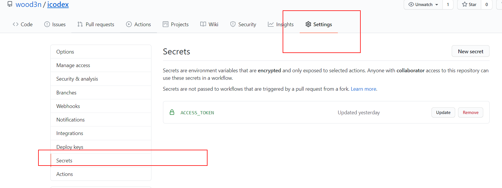
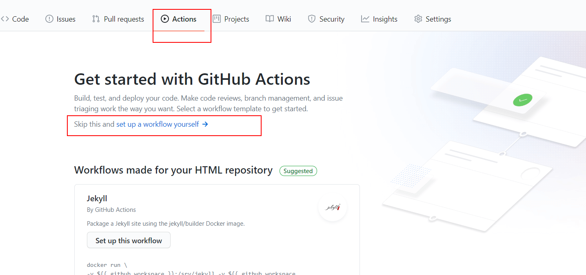
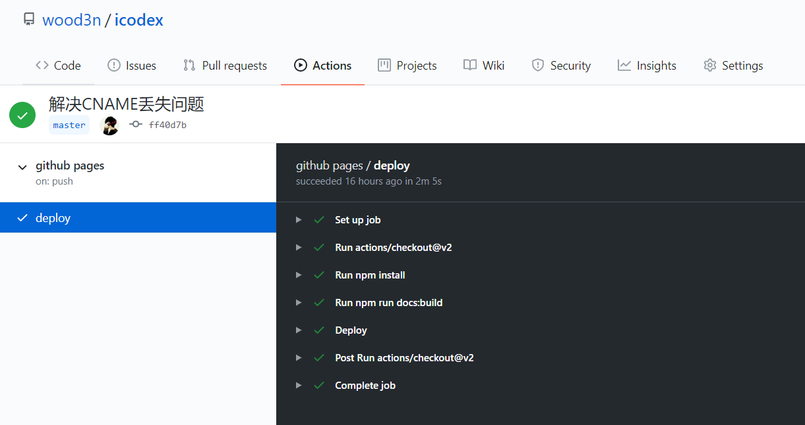
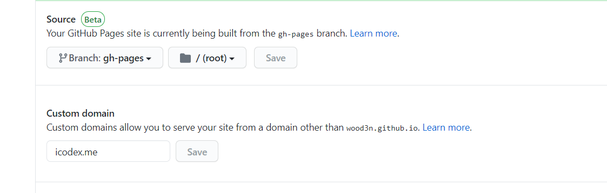
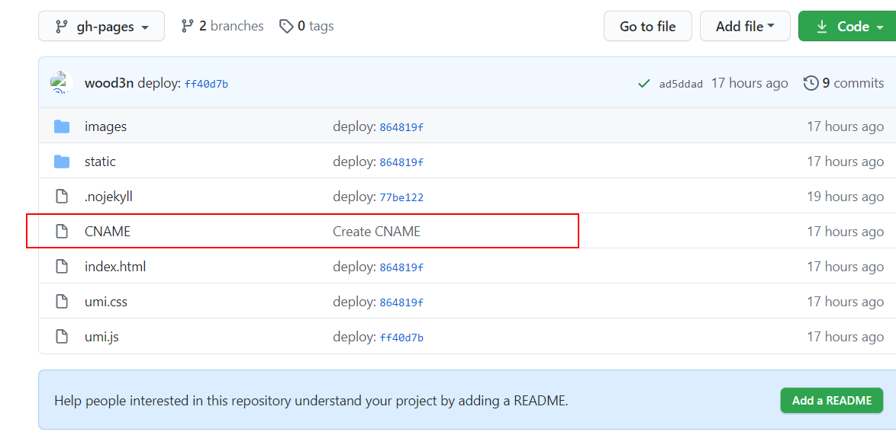
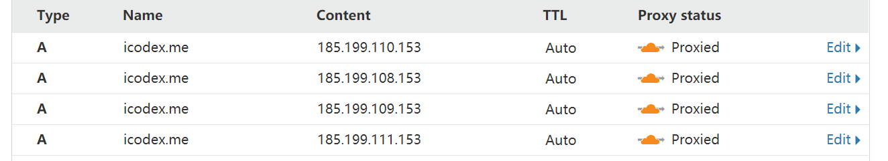

### dumi

> [dumi](https://d.umijs.org/)

花了一天时间，把自己的部分笔记弄到 dumi 上来了，这下爽了，之前一直在找在博客里写 demo 的方法，终于等到 dumi 了。

dumi 主要是为了 React 组件开发和文档撰写的前端工具，但是也提供`site`模式建站，很多 antd 系的在线文档都是利用 dumi 搭建的。

之前使用的是 hexo+next 主题来写博客，hexo 也很简介，配合 Typora 本地编辑的完美支持，图片什么的上传也不是问题；但是我一直想在博客嵌入 demo，毕竟有些代码怎么说都没有演示直观，终于 dumi 帮了我这个忙。

### 建站的流程

#### dumi 脚手架

利用 dumi 提供的脚手架分分钟在本地文件夹就搭建一个站点出来

- 安装脚手架并初始化项目结构

```powershell
yarn create @umijs/dumi-lib --site
```

- 安装依赖

```shell
yarn install
```

- 运行站点

```shell
yarn start
```

#### GitHub 部署

利用 GitHub Actions 来持续部署站点，需要先新建一个 GitHub 仓库，将本地文件夹利用 Git 上传，下面是本地文件夹连接 GitHub 仓库的 Git 命令

```shell
git init

git remote add origin https://xxx.git

git add .																		//所有文件暂存

git commit -m "初始化提交"				 							//提交

git push --set-upstream origin master
```

如果提示“Updates were rejected because the remote contains work that you do not have locally.“说明 GitHub 仓库不是空的，此时可以做两种操作：

- 一是强行`push`，这会导致 GitHub 仓库已有的代码被清空

```shell
git push -f origin master
```

- 或者先将 GitHub 仓库的代码拉下来，手动合并冲突然后再提交

```shell
git pull origin master --allow-unrelated-histories

git add .

git commit -m "merge"

git push -u origin master
```

代码上传到 GitHub 仓库以后，需要给仓库设置一个密钥，待会自动化部署需要使用，在当前仓库的`Setting`里面找到`Secret`，新建密钥



#### 自动化部署

接下来就可以使用 GitHub Actions 进行自动化部署了。dumi 团队还是极其贴心的，官网放了 GitHub Actions 自动化部署的配置，他的这个配置使用的是一个第三方撰写好的配置——[GitHub Pages action](https://github.com/marketplace/actions/github-pages-action)，能自动将代码部署到`gh-pages`分支，即使`gh-pages`分支不存在会自动新建（因为我当前使用的仓库分支建站的方式，站点必须放到`gh-pages`分支才能访问）：

> [dumi - FAQ - 自动部署](<[https://d.umijs.org/guide/faq#%E8%87%AA%E5%8A%A8%E9%83%A8%E7%BD%B2](https://d.umijs.org/guide/faq#自动部署)>)

这里有两种方式，一种是在代码里新建`.github/workflows`两个文件夹，里面放一个`yml`文件，作为自动化部署的配置文件，另一种是直接在 GitHub 仓库界面操作，为了方便，直接操作吧：

- 找到 Actions 里的`set up a workflow yourself`这行提示



- `set up a workflow yourself`点进去以后就是部署文件，把 dumi 提供的部署配置复制进去

```yaml
name: github pages
on:
  push:
    branches:
      - master # default branch
jobs:
  deploy:
    runs-on: ubuntu-18.04
    steps:
      - uses: actions/checkout@v2
      - run: npm install
      - run: npm run docs:build
      - name: Deploy
        uses: peaceiris/actions-gh-pages@v3
        with:
          github_token: ${{ secrets.GITHUB_TOKEN }}
          publish_dir: ./docs-dist
```

- 这里要注意下这个配置，这个配置是使用的第三方撰写的配置——[GitHub Pages action](https://github.com/marketplace/actions/github-pages-action)，可以在 GitHub 的 Marketplace 找到这个配置，如果你不用 GitHub 提供的仓库域名来访问站点，要使用自定义的域名，那么这个配置下面要加一行，这个原因下面解释：

```yaml
keep_files: true
```

配置文件写好以后，提交就能在仓库目录看到`.github/workflows`这个文件夹了


然后回到本地先`git pull`代码，把`.github/workflows`这个文件夹拉下来，尝试自己撰写一篇 markdown 文件，然后提交，就能在 GitHub Actions 观察代码的构建部署过程了，如果流程失败，GitHub 还有邮件提醒哦！！！



###自定义域名

关于自定义域名，看个人喜好了，我是在 godaddy 买了一个 20 块钱的域名`icodex.me`，不过最近 godaddy 好像没法登录，有点麻烦。

有了自己的域名之后，大致分为以下几步来完成域名替换：

#### 仓库 CNAME 替换域名

在站点 GitHub 的仓库的`Setting`点进去一直往下拉，找到`GitHub Pages`这部分的配置，首先将站点来源设置到`gh-pages`分支，然后设置`Custom domain`为自定义的域名：



这里解释上面说的`.github/workflows`的配置最后要加上`keep_files: true`的原因，因为[GitHub Pages action](https://github.com/marketplace/actions/github-pages-action)这个配置在每次部署的时候会清空`gh-pages`分支里的所有文件，替换域名一个必要的文件是当前`gh-pages`分支下的`CNAME`文件，这个文件是用来保存替换后的域名的，它里面的内容也就是一个域名，如果你每次 deploy 把`gh-pages`分支提前清空了，那这个文件就没了，自定义的域名就不生效了，所以必须加上`keep_files: true`，保留当前仓库的旧文件才行。



#### DNS 解析

去域名管理商进行 DNS 解析，将域名的 IP 地址解析到 GitHub 提供的`GitHub Pages`的地址；之前我的博客使用的是阿里云的域名，买了以后要备案，HTTPS 证书也是阿里云免费提供的，CDN 加速用的又拍云的，说实话整套流程下来很费时间，主要是域名备案费时间，域名备案要花一个时间左右。

现在我用的是 godaddy+cloudflare 的组合，godaddy 能买到`.me`的域名，并且不用备案，nice！cloudflare 同时提供 HTTPS 证书，免费 CDN 加速的功能，不过 cloudflare 的 CDN 加速对国内来说是反向加速，就是不用还行，用了国内访问更卡，但是我无所谓，我也不是说要百度收录我网站，只是想个人整理笔记做 demo 用，而且我日常 FQ，不存在卡的问题。

因为 cloudflare 的 CDN 加速会接管 godaddy 的域名管理，所以要去 cloudflare 的 DNS 解析域名，做这么一条解析就行了，当然了把`github.io`的 IP 地址全添加上也行：


