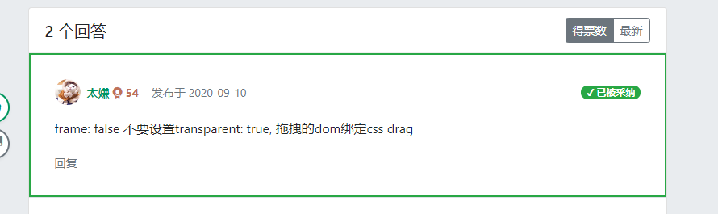
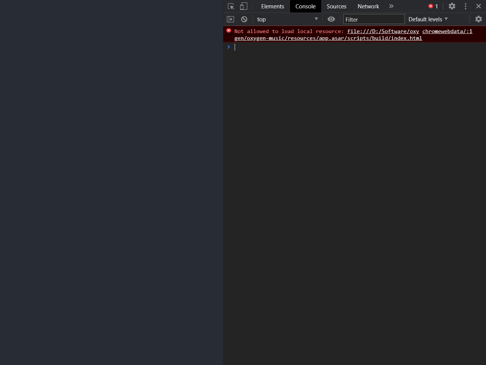
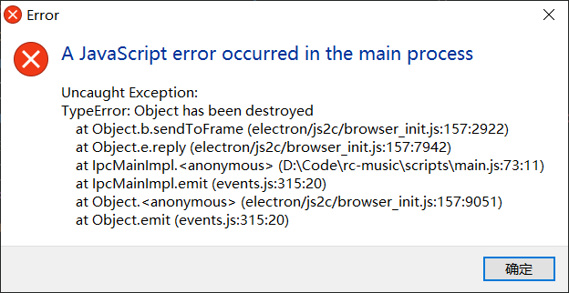
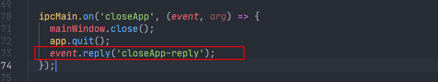
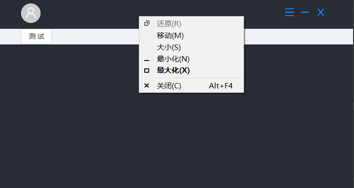

## Q&A


### 隐藏electron自带框架

https://www.electronjs.org/docs/api/frameless-window

### 拖拽

https://www.electronjs.org/docs/api/frameless-window#%E5%8F%AF%E6%8B%96%E6%8B%BD%E5%8C%BA

### 拖拽到窗口边缘自动放大



### 本地网页无法打开

`window.require is not a function`问题，在`electron`中使用`preload`属性在页面运行其他脚本之前预先加载指定的脚本无论页面是否集成Node，此脚本都可以访问所有Node API 脚本路径为文件的绝对路径。

```javascript
// 向网页window注入electron api
window.electron = window.require('electron');
```

网页 js 使用的话，直接从`window`对象上获取`electron`的API

```javascript
const { remote, ipcRenderer } = window.electron;
```

### 网页加载失败导致白屏

可以看到这个路径是相对于`app.asar`的，ASAR文件是一个归档文件，用于使用Electron打包应用程序的源代码，这样应用程序打包在存档而不是文件夹中，从而保护了应用程序的源代码不暴露给用户。

下面这个报错说明`electron`启动以后找不到`react`打包程序，可能有两个原因：

1. `react`程序和`electron`启动程序里加载的路径不一致，也就是使用[`lodeURL`](https://www.electronjs.org/docs/api/browser-window#winloadurlurl-options)里设置的路径

```javascript
mainWindow.loadURL(
  process.env.NODE_ENV === 'development'
  ? 'http://localhost:5000'
  : url.format({
    pathname: path.join(__dirname, '../build/index.html'),
    protocol: 'file:',
    slashes: true,
  })
);
```

2. `react`程序根本就没打包进`.asar`，`electron-builder`打包配置涉及到路径的主要就是[`directories`](https://www.electron.build/configuration/configuration#MetadataDirectories-buildResources)，以及[`files`](https://www.electron.build/configuration/contents#files)，其中`files`用于指定一个目录用于复制进打包完的程序`app.asar`，所以需要在这里指定`react`打包以后的程序再复制进`electron`的程序`app.asar`。

```javascript
files: ['build', 'scripts/main.js', 'scripts/preload.js'],
```



### 单例问题

在安装应用程序以后，多次点击`electron`应用会创建多个实例，这算是`electron`很常见的问题。`electron`目前发展到了`11.x`的版本，在`3.x`版本及以前可以使用`app.makeSingleInstance`这个方法；`4.x`版本以后这个方法被弃用了，目前比较合适的解决方式是通过[单例锁](https://www.electronjs.org/docs/api/app#apprequestsingleinstancelock)来解决。

`app.requestSingleInstanceLock()`这个方法会在启动新实例的时候请求单例锁，如果没有请求到锁会返回`false`，表示另一个应用实例已经取得了锁并且仍旧在运行，那么当前启动的实例就应该直接`quit`。这时候就可以使用[`second-instance`事件](https://www.electronjs.org/docs/api/app#%E4%BA%8B%E4%BB%B6-second-instance)在监听到第二个实例启动时激活主实例窗口而不是创建新的窗口

```javascript
// 单例模式
const gotTheLock = app.requestSingleInstanceLock();
if (!gotTheLock) {
  app.quit();
} else {
  app.on('second-instance', (event, commandLine, workingDirectory) => {
    // 当运行第二个实例时,将会聚焦到mainWindow这个窗口
    if (mainWindow) {
      if (mainWindow.isMinimized()) mainWindow.restore();
      mainWindow.focus();
    }
  });
}

```

### 关闭electron的时候弹出错误




由这个错误堆栈信息可以看出报错点位于`electron`程序启动的入口文件`main.js`，并且是和`ipc`通信模块有关，所以可以推断出错误原因大致为在`electron`已经退出以后还存在调用`ipc`通信模块的事件，找到在`main.js`里注册的`ipc`事件以后，发现在`close`事件中有这样一句代码，在`app.quit`以后回调事件发出信息，把这段代码注释掉以后就正常了。



### 屏蔽自定义title的右键菜单

