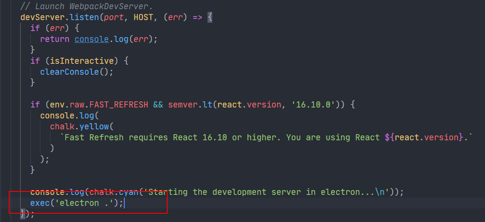

## init

### 安装electron

使用`create-react-app`和`eleactron`搭建项目开发环境：

```
yarn create react-app my-app
```

```
yarn add electron -D
```

### 执行eject

由于项目对 CRA 本身的`webpack`配置需要做定制修改，所以这里直接`eject`项目配置文件。

```
yarn eject
```

### 创建electron入口执行文件

按照`electron`官方文档的示例在`create-react-app`中创建`electron`的[执行入口程序](https://www.electronjs.org/docs/tutorial/quick-start#%E5%88%9B%E5%BB%BA%E4%B8%BB%E8%84%9A%E6%9C%AC%E6%96%87%E4%BB%B6)，由于开发环境下`react`项目使用到了`webpack-dev-server`，所以这里`electron`的执行文件要稍做调整

```javascript
const { app, BrowserWindow } = require('electron');
const path = require('path');
const url = require('url');

// 创建一个浏览器窗口
function createWindow() {
  // 此处用let，因为exit时这里赋值null
  let mainWindow = new BrowserWindow({
    width: 800,
    height: 600,
    webPreferences: {
      nodeIntegration: true,
    },
  });

  // 监听本地 URL
  mainWindow.loadURL('http://localhost:5000');

  // 默认打开devtool
  mainWindow.webContents.openDevTools();

  mainWindow.on('closed', () => {
    mainWindow = null;
  });
}

// 在electron app初始化的时候即创建一个窗口
app.whenReady().then(createWindow);

app.on('window-all-closed', () => {
  if (process.platform !== 'darwin') {
    app.quit();
  }
});

app.on('activate', () => {
  // 只有当应用程序激活后没有可见窗口时，才能创建新的浏览器窗口
  if (BrowserWindow.getAllWindows().length === 0) {
    createWindow();
  }
});

```

## 修改 WDS

接下来修改 WDS 的部分很关键，`WDS`的执行走的是`yanr start`命令，其使用到了`scripts/start.js`这个文件，里面主要是开启 WDS 的代码，我们可以关闭 WDS 打开浏览器的代码部分，选择让其打开`electron`界面程序，其实就跟打开浏览器一样，这样在打开的`electron`程序中由于上文`loadURL`的配置，就可以在`electron`桌面程序中直接监听本地 WDS 热更新机制，perfect！

找到`scripts/start.js`文件里的`openBrowser`部分，将其修改成执行`electron`程序，大功告成，这样后续执行`yarn start`命令开启 WDS 以后就会直接打开`electron`程序了！



