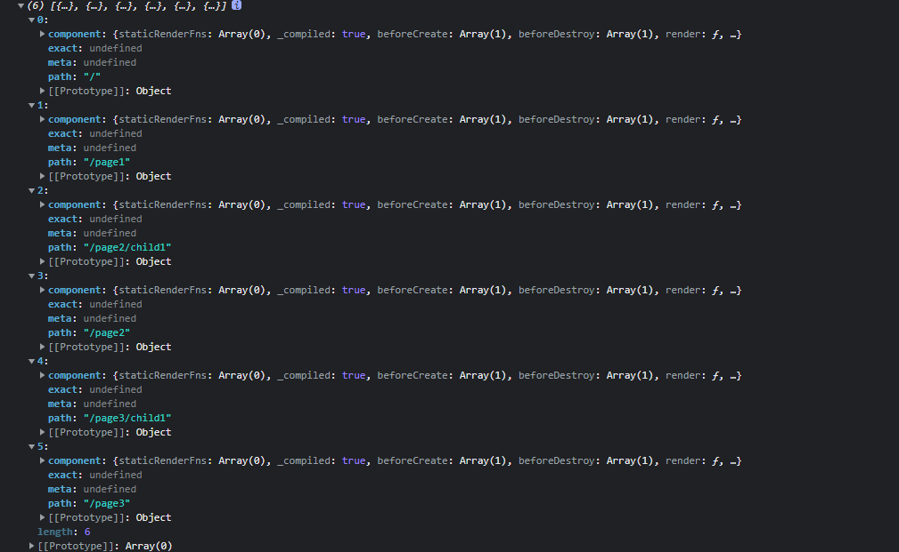

## 什么是 context

在`webpack`中有基础目录`context`的配置项，`webpack`默认使用`webpack.config.js`所在的目录，也就是`webpack`执行的路径。

`webpack`构建的时候会使用`context`作为`entry`和`loader`的根目录，然后去解析`import`、`import()`，`require`的模块，最后一个模块依赖关系图。

例如对于下面的目录结构：

```
├─ public
│    ├─ favicon.ico
│    └─ index.html
├─ src
│    ├─ App.vue
│    ├─ assets
│    │    └─ logo.png
│    ├─ components
│    │    └─ HelloWorld.vue
│    ├─ main.js
│    └─ pages
│           ├─ Home
│           ├─ Page1
│           ├─ Page2
│           └─ Page3
└─ package.json
├─ webpack.config.js
```

`webpack`默认使用当前所在的目录作为基础目录，但是如果指定的`context`为`src`，那么`extry`就是相对于`src`的。

```js
const path = require('path');

module.exports = {
  //...
  context: path.resolve(__dirname, 'src'),
  entry: './main.js',
};
```

## 什么是 require.context

[`require.context`](https://webpack.docschina.org/guides/dependency-management/#requirecontext)是`webpack`提供的可以在运行时解析指定的`context`上下文的函数。通过安装`@types/webpack-env`查看其类型定义如下：

> ```typescript
> interface RequireContext {
>   keys(): string[];
>   (id: string): any;
> 	<T>(id: string): T;
> 	resolve(id: string): string;
>   /** The module id of the context module. This may be useful for module.hot.accept. */
>   id: string;
> }
>
> function requireContext(
> 	path: string,
>   deep?: boolean,
>   filter?: RegExp,
>   mode?: "sync" | "eager" | "weak" | "lazy" | "lazy-once
> ): RequireContext;
> ```

`require.context`接收三个参数：

- `context`：指定的解析根目录路径；
- `deep`：是否递归解析子目录的文件；
- `filter`：要匹配的文件路径模式，例如`.vue`、`.jsx`等
- `mode`：这里提供几种模式和[`webpack`解析`import()`语句指定的模式](https://webpack.docschina.org/api/module-methods/#dynamic-expressions-in-import)一样
  - `sync`：默认值，同步解析模块文件并直接打包在一起；
  - `lazy`：`require.context`将返回一个 Promise 对象，且每个导入的模块分别构建成单个 chunk 文件，以便按需加载；
  - `lazy-once`：将所有导入的模块都打包到一个 chunk 文件，此 chunk 将在第一次 `import()` 时调用时获取，随后的 `import()` 则使用相同的网络响应。即只需加载一次，后续关联模块都直接读取；
  - `eager`：返回 Promise，不会生成额外的 chunk。所有的模块都被当前的 chunk 引入，并且没有额外的网络请求；与静态导入相比，在调用 `import()` 完成之前，该模块不会被执行。
  - `weak`：首先尝试加载模块，如果该模块函数已经以其他方式加载（即另一个 chunk 导入过此模块，或包含模块的脚本被加载）。会返回 Promise，但是只有在客户端上已经有该 chunk 时才会成功解析，如果该模块不可用，则返回 rejected 状态的 `Promise`，且网络请求永远都不会执行。

`require.context`返回一个函数，这个函数接收一个模块路径`id`作为参数，就相当于`require(id)`方法，可用于加载模块文件，并且函数附加了两个方法：

- `keys()`：解析`context`下匹配的所有模块相对于`context`的路径，可以作为`id`传入`require.context`返回的函数
- `resolve()`：返回模块解析的完整路径

## 实践

下面结合`vue-router/v3`版本来使用`require.context`自动从配置的模块路径导入模块文件。

### 配置环境目录

我的目标是希望解析`src/pages`下的所有模块


### 查看 require.context 返回了什么

通过在`vue`入口文件中执行下面一段函数可以得到`require.context`的结果为下面所示

```js
function resolveContext() {
  const webpackRequire = require.context('../src/pages', true, /.vue/);
  console.log(webpackRequire);
  console.log(webpackRequire.keys());
  webpackRequire.keys().forEach(item => {
    console.log(item);
  });
}
```

`require.context`返回的就是下面的编译后的`webpackContext`函数，可以看出该函数解析相对于`context`的所有`vue`文件模块并建立模块路径映射关系，并通过`__webpack_require__`加载指定`id`的模块并返回。

`resolve`返回模块的完整路径。

```js
var map = {
  './Home/index.vue': './src/pages/Home/index.vue',
  './Page1/index.vue': './src/pages/Page1/index.vue',
  './Page2/Child1/index.vue': './src/pages/Page2/Child1/index.vue',
  './Page2/index.vue': './src/pages/Page2/index.vue',
  './Page3/Child1/index.vue': './src/pages/Page3/Child1/index.vue',
  './Page3/index.vue': './src/pages/Page3/index.vue',
};

function webpackContext(req) {
  var id = webpackContextResolve(req);
  return __webpack_require__(id);
}
function webpackContextResolve(req) {
  if (!__webpack_require__.o(map, req)) {
    var e = new Error("Cannot find module '" + req + "'");
    e.code = 'MODULE_NOT_FOUND';
    throw e;
  }
  return map[req];
}
webpackContext.keys = function webpackContextKeys() {
  return Object.keys(map);
};
webpackContext.resolve = webpackContextResolve;
module.exports = webpackContext;
webpackContext.id = './src/pages sync recursive .vue';
```

### 生成 routes

通过了解`require.context`自动加载模块的机制，下面我们来自动生成`vue-router`需要的`routes`配置

首先项目配置的`routes`文件如下：

```js
export default [
  {
    title: '主页',
    icon: 'xxxx',
    path: '/',
    component: './pages/Home',
  },
  {
    title: '页面一',
    path: '/page1',
    component: './pages/Page1',
  },
  {
    title: '页面二',
    path: '/page2',
    component: './pages/Page2',
    children: [
      {
        title: '页面二-Child1',
        path: '/page2/child1',
        component: './pages/Page2/Child1',
      },
    ],
  },
  {
    title: '页面三',
    path: '/page3',
    component: './pages/Page3',
    children: [
      {
        name: '页面二-Child1',
        path: '/page3/child1',
        component: './pages/Page3/Child1',
      },
    ],
  },
];
```

`component`就对应模块路径，对这个配置的`routes`数组进行递归解析，然后通过`require.context`加载指定模块

> 这里需要注意的一个点是`vue-router`的`children`配置是会被渲染在上层路由组件内部，所以这里不采用`children`

```js
/**
 * 格式化路由配置，生成vue-router的routes配置项
 * @param {Array} routes
 * @returns
 */
export function formatRoute(routesCfg) {
  return routesCfg.reduce(
    (result, { meta, path, exact, component, children }) => {
      if (path && component) {
        const route = {
          exact,
          path,
          component: webpackRequire(component),
          meta,
        };

        // 子路由
        if (children) {
          result.push(...formatRoute(children));
        }

        result.push(route);
      }

      return result;
    },
    [],
  );
}

/**
 * 加载模块
 * @param {string} id 模块路径
 * @returns 模块
 */
function webpackRequire(id) {
  // vue-router的配置项
  const webpackRequire = require.context('../src', true, /.vue/);
  let moduleId = id;
  // 没有指定文件后缀，默认串接 index.vue
  if (!/.vue/.test(moduleId)) {
    moduleId = `${moduleId}/index.vue`;
  }

  return webpackRequire(moduleId).default;
}
```



最终效果见 —— [wood3n/vue-router: make vue-router automaticly (github.com)](https://github.com/wood3n/vue-router)
