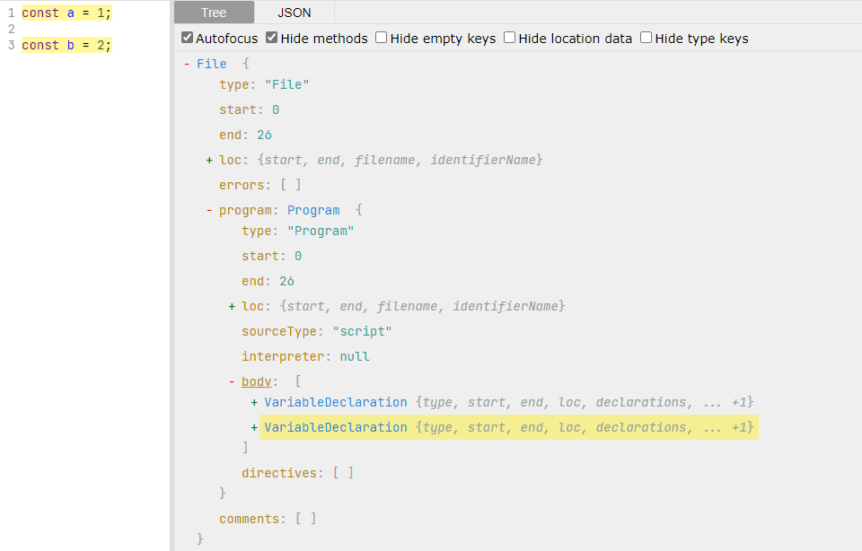
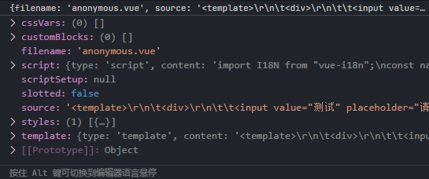
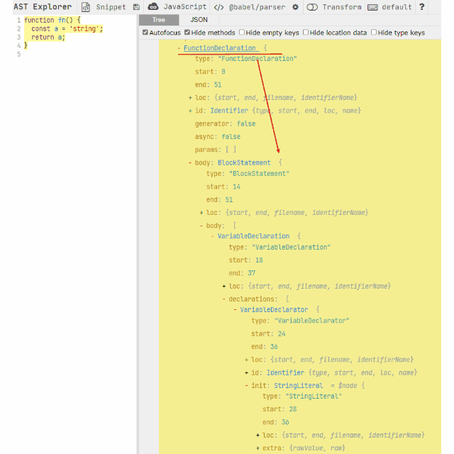
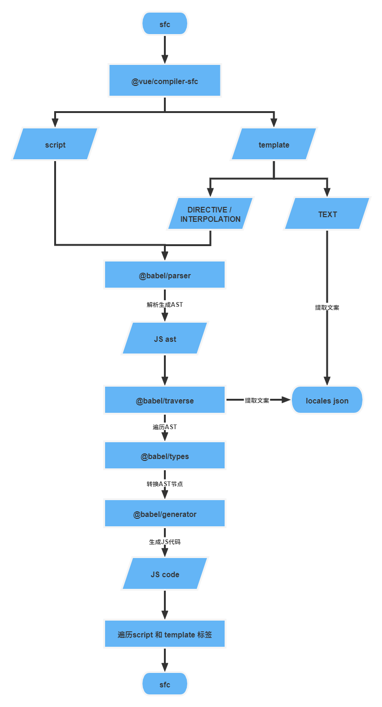

## 国际化解决方案

## 什么是 AST

在编译原理中，编译过程一般从词法分析（lexical analysis）开始，由编译器的`scanner`或者`tokenizer`按照语言的特殊标记符号，例如定义的关键词等，对源代码的字符串的每个字符进行分析并组合，最后形成一个个*单词*`token`，`token`就是 AST 的节点，它们之间相互关联形成 AST。

## JS-AST

目前主流编译器例如`@babel/parser`定义的 AST 节点都是根据[estree/estree: The ESTree Spec (github.com)](https://github.com/estree/estree)规范来的，可以在[AST explorer](https://astexplorer.net/)演示。AST 节点主要包含以下类型的节点：

### 公共属性

以下是所有节点都具有的属性

```typescript
interface Position {
  line: number; // 多少行
  column: number; // 多少列
}

interface SourceLocation {
  start: Position;
  end: Position;
  filename: string;
  identifierName: string;
}

export interface NodeBase {
  start: number; // 当前节点在代码中开始的位置
  end: number; // 当前节点在代码中结束的位置
  loc: SourceLocation; // 具体的位置坐标，多少行多少列
  range: [number, number];
  leadingComments?: Array<Comment>;
  trailingComments?: Array<Comment>;
  innerComments?: Array<Comment>;
}
```

### File

无论 JS 程序如何，顶级的 AST 节点都是`File`类型，然后`File`下面会包含程序属性`Program`。当然了`@babel.parser`提供了一个额外的方法 —— `parseExpression`来解析单个语句，那么生成的 AST 也就不会包含`File`、`Program`这些。

### Program

`Program`内部包含`body`属性，`body`属性是一个数组，代表不同的程序块，例如声明两个变量，则`body`就会包含两个元素。此外还可能具有`directives`属性，存放`"use strict"`这样的特殊语句。



### Declaration

`Declaration`是声明的意思，也就是定义变量，函数，`class`，`import`和`export`这些声明语句，和声明容易混淆的是`Expression`

### Expression

`Expression`是表达式的意思，表达式和语句的区别就是表达式有值，而语句不常有。

表达式具有很多形式：

- `UnaryExpression`：一元表达式

```js
"-"  "+"  "!"  "~"  "typeof"  "void"  "delete"  "throw"
```

- `BinaryExpression`：二元表达式

```js
export type BinaryOperator =
  | '=='
  | '!='
  | '==='
  | '!=='
  | '<'
  | '<='
  | '>'
  | '>='
  | '<<'
  | '>>'
  | '>>>'
  | '+'
  | '-'
  | '*'
  | '/'
  | '%'
  | '|'
  | '^'
  | '&'
  | 'in'
  | 'instanceof';
```

- `AssignmentExpression`：赋值表达式

```js
export type AssignmentOperator =
  | '='
  | '+='
  | '-='
  | '*='
  | '/='
  | '%='
  | '<<='
  | '>>='
  | '>>>='
  | '|='
  | '^='
  | '&=';
```

- `UpdateExpression`：累加`++`或者累减`--`表达式
- `LogicalExpression`：逻辑运算表达式`||`或`&&`
- `ConditionalExpression`：条件（三元）表达式`?:`
- `CallExpression`：函数调用表达式

在 VUE 模板语法中需要注意的特殊表达式就是在`v-on`里直接写的表达式。

```vue
<div @click="msg = '你好'">
  
</div>
```

### Identifier

`Identifier`也就是标识符，在 JS 里的标识符必须使用数字、字母，下划线或者`$`，并且不能以数字开头

### Statement

`Statement`是语句块的意思，例如`if/else`，`switch/case`，`for`，`try...catch`等

### Literal

`Literal`也就是字面量的意思，针对国际化文案的解析，这里就是`StringLiteral`和`TemplateLiteral`，其中`TemplateLiteral`还具有`quasis`和`expressions`两个属性：

- `quasis`代表模板字符串里的普通字符串文本，被`${}`分隔的部分；
- `expressions`则是内插 JS 语句，可能是单纯的变量，也可能是一个表达式

```typescript
export type Literal =
  | RegExpLiteral
  | NullLiteral
  | StringLiteral
  | BooleanLiteral
  | NumericLiteral
  | BigIntLiteral;

export type TemplateLiteral = NodeBase & {
  type: 'TemplateLiteral';
  quasis: $ReadOnlyArray<TemplateElement>;
  expressions: $ReadOnlyArray<Expression>;
};

export type TemplateElement = NodeBase & {
  type: 'TemplateElement';
  tail: boolean;
  value: {
    cooked: string;
    raw: string;
  };
};
```

## template-AST

对于 VUE SFC 内部模板语法解析得到的 AST 和 JS 的 AST 区别很大，主要是因为 VUE 没有任何规范，属于社区解决方案，所以其提供的解析 AST 的方式也比较单一。

在 VUE SFC 内部主要存在以下几张类型的 AST ：



### template

`template`也就是解析`<template>`内部得到的 AST，其内部的 AST 节点类型主要分为两种类型`props`和`children`。`children`也就是各种 AST 节点，而`props`就是元素内部传递的各种指令或者 html 元素的属性。

```typescript
export enum NodeTypes {
  ROOT = 0,
  // 元素节点，包括template元素
  ELEMENT = 1,
  // 文本类型，包括代码里的一切空白字符，例如换行，空格等
  TEXT = 2,
  // 注释
  COMMENT = 3,
  // 表达式，包括模板字符串等
  SIMPLE_EXPRESSION = 4,
  // 插值
  INTERPOLATION = 5,
  ATTRIBUTE = 6,
  // 指令的值
  DIRECTIVE = 7,
  COMPOUND_EXPRESSION = 8,
  IF = 9,
  IF_BRANCH = 10,
  FOR = 11,
  TEXT_CALL = 12,
  VNODE_CALL = 13,
  JS_CALL_EXPRESSION = 14,
  JS_OBJECT_EXPRESSION = 15,
  JS_PROPERTY = 16,
  JS_ARRAY_EXPRESSION = 17,
  JS_FUNCTION_EXPRESSION = 18,
  JS_CONDITIONAL_EXPRESSION = 19,
  JS_CACHE_EXPRESSION = 20,
  JS_BLOCK_STATEMENT = 21,
  JS_TEMPLATE_LITERAL = 22,
  JS_IF_STATEMENT = 23,
  JS_ASSIGNMENT_EXPRESSION = 24,
  JS_SEQUENCE_EXPRESSION = 25,
  JS_RETURN_STATEMENT = 26,
}
```

### script

`script`就是解析`<script>`标签内部 JS 得到的内容，只不过`@vue/compiler-dom`或者`@vue/compiler-sfc`没有将这部分直接解析成 AST，也就是我们还需要利用`@babel/parser`去解析。

### scriptSetup

`scriptSetup`是 VUE3 以后组件的写法，会在`<script>`标签内部添加`setup`属性，这样解析得到的代码就会包含在`scriptSetup`中而不是在`script`中。

### styles

`styles`也就是多个`<style>`标签内部的 CSS 代码。其余的还有`customBlocks`和`cssVars`这些都包含的一样的属性，也就是`content`和`attrs`，`attrs`就是标签内部的属性，`content`就是标签内部的所有格式化代码。

## babel

`babel`是目前最主流的 JS 编译器。

### @babel/parser

`@babel/parser`是 babel 的核心工具之一，原来叫 Babylon，babel6 以后迁移到了 babel 的 menorepo 架构里，作为单独的一个 package 维护。

`@babel/parser`提供两种解析代码的方法：

- `babelParser.parse(code, [options])`：解析生成的代码含有完整的 AST 节点，包含`File`和`Program`层级。
- `babelParser.parseExpression(code, [options])`：解析单个 js 语句，这里需要注意的是`parseExpression`生成的 AST 不完整，所以使用`@babel/traverse`必须提供`scope`属性，限定 AST 节点遍历的范围。

```js
import parser from '@babel/parser';

const code = `function square(n) {
  return n * n;
}`;

parser.parse(code);
```

### @babel/types

`@babel/types`用于判断节点类型，生成 AST 节点等操作，例如生成一个函数调用表达式：

```js
import * as t from '@babel/types';

t.callExpression(t.identifier('xxx'), ...arguments);
```

### @babel/traverse

`@babel/traverse`提供遍历 JS AST 节点的方法，用它来遍历指定类型的节点非常方便，主要是其提供的`Visitor`模式大大简化了递归的过程。

所谓`Visitor`模式就是 babel 提供了一个`visitor`对象来访问指定类型的 AST 节点，例如下面的例子，定义一个`visitor`，其内部有一个`StringLiteral`的方法，那么意思就是`visit StringLiteral`，也就是访问所有字符串类型节点的时候都会触发调用这个定义的`StringLiteral`方法。

```typescript
import babelTraverse, { Visitor } from '@babel/traverse';

const MyVisitor: Visitor = {
  StringLiteral() {
    console.log('这是一个字符串');
  },
};

babelTraverse(ast, MyVisitor);
```

并且由于 babel 采用的深度优先遍历的算法，所以在每个类型的 AST 节点内部还具有两种访问方向 —— `enter`和`exit`，即进入和离开。

```typescript
const MyVisitor: Visitor = {
  Identifier: {
    enter() {
      console.log('Entered!');
    },
    exit() {
      console.log('Exited!');
    },
  },
};
```



### @babel/generator

`@babel/generator`就负责将 AST 转换生成代码，同时支持定义生成的部分代码的风格，例如分号结尾、双引号和单引号的使用等。

## 详细设计



### 中文 unicode 码点范围

利用 unicode 码点值来检测代码中是否包含中文字符：

- `4E00`~`9FA5`是基本汉字

- `9FA6`~`9FFF`是补充汉字
- 其他乱七八糟奇形怪状的汉字暂不考虑

```js
/[\u{4E00}-\u{9FEF}]/gu;
```

### 编译 SFC

在 VUE SFC 里只需要处理`template`和`script`部分的 AST 来提取中文字符。可以使用`@vue/compiler-sfc`编译 VUE SFC 文件，可以同时提取出`template`和`script`部分的代码。

`template`需要处理的文本分为两种情况：

- 属性字符串
  - 指令内部的 JS 表达式，需要**按照 JS 代码解析**
  - 普通属性内部的文本字符串，如果包含中文字符，则**全部提取**
- 文本子元素
  - 普通的文本子元素，如果包含中文字符，则**全部提取**
  - 双大括号的文本插值，也要**按照 JS 代码解析**

`script`里的代码全部按照 JS 代码解析生成 AST，这样无论是`template`还是`script`最终复杂的部分就是针对 JS 代码生成的 AST 的解析。

### 遍历 JS AST

通过遍历`StringLiteral`或者`TemplateLiteral`两种类型的节点就能覆盖所有中文字符的情况，因为标识符不可能用中文。

```typescript
const visitor: Visitor = {
  StringLiteral: {
    exit(path) {
      if (hasChineseCharacter(path.node.extra?.rawValue as string)) {
        const locale = (path.node.extra?.rawValue as string).trim();
        const key = generateHash(locale);
        locales[key] = locale;
        // 如果是在template内部的JS表达式，使用插值语法
        if (!isInScript) {
          path.replaceWith(
            t.callExpression(t.identifier('$t'), [t.stringLiteral(key)]),
          );
        } else {
          path.replaceWith(
            t.callExpression(
              t.memberExpression(t.identifier('I18N'), t.identifier('t')),
              [t.stringLiteral(key)],
            ),
          );
        }
      }
    },
  },
  TemplateLiteral: {
    exit(path) {
      // 检测模板字符串内部是否含有中文字符
      if (path.node.quasis.some(q => hasChineseCharacter(q.value.cooked))) {
        // 生成替换字符串，注意这里不需要过滤quasis里的空字符串
        const replaceStr = path.node.quasis.map(q => q.value.cooked).join('%s');
        const key = generateHash(replaceStr);
        locales[key] = replaceStr;
        // 如果模板字符串内部含有JS表达式，将整个模板字符串转换成函数调用
        if (path.node.expressions?.length) {
          path.replaceWith(
            t.callExpression(
              t.memberExpression(t.identifier('I18N'), t.identifier('tExtend')),
              [
                t.stringLiteral(key),
                t.arrayExpression(path.node.expressions as t.Expression[]),
              ],
            ),
          );
        } else {
          // 如果没有内插JS表达式，则使用vue-i18n的简单函数，只填充文案的key
          path.replaceWith(
            t.callExpression(
              t.memberExpression(t.identifier('I18N'), t.identifier('t')),
              [t.stringLiteral(key)],
            ),
          );
        }
      }
    },
  },
};
```

### 生成 key 值

目前的解决方案是利用 Nodejs 内部的 hash 函数根据提取的中文字符生成 hash 值，来保证不重复保存相同的中文文案。

```js
'use strict';

const { createHash } = require('crypto');

export function generateHash(char) {
  const hash = createHash('md5');
  hash.update(char);
  return hash.digest('hex');
}
```

### 代码转换

代码转换目前采用和`vue-i18n`结合的方式，在生成唯一的 key 以后，就可以将原来代码中的中文字符转换成`vue-i18n`的`$t(xxx)`函数。而对于字符串中含有参数的形式，需要通过拓展`vue-i18n`导出的对象方法来进行转换，例如这样一个模板字符串：

```js
`${active ? '测试' : msg}内插字符串外层中文字符`;
```

生成的代码和提取的 json 内容为：

```js
// vue-i18n导出的对象
import I18N from 'xxxx';

I18N.tExtend('9bc3414df7e000c9cbd21084e13306a4', [
  active ? $t('c086b3008aca0efa8f2ded065d6afb50') : msg,
])

// locales.json
{
 	"c086b3008aca0efa8f2ded065d6afb50": "测试",
	"9bc3414df7e000c9cbd21084e13306a4": "%s内插字符串外层中文字符",
}
```
