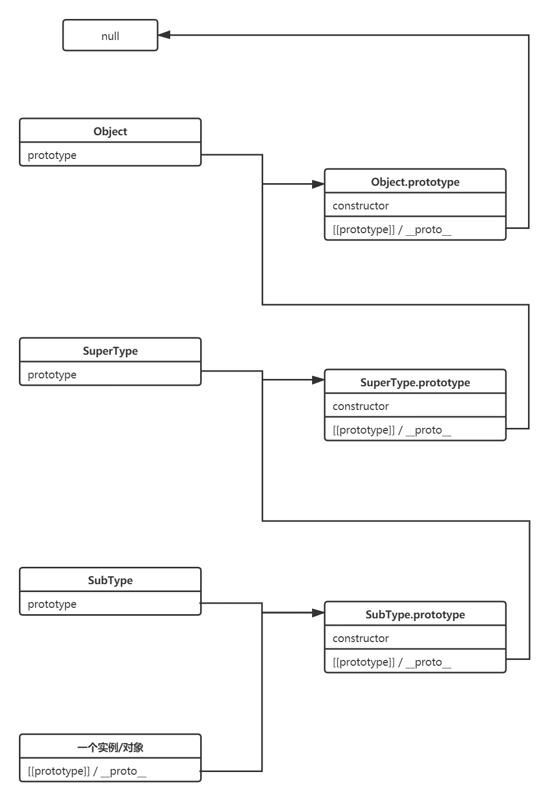
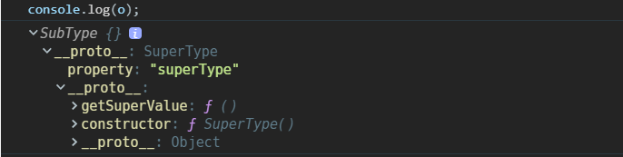
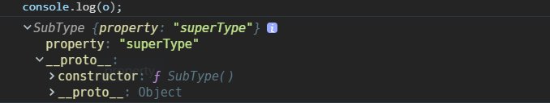
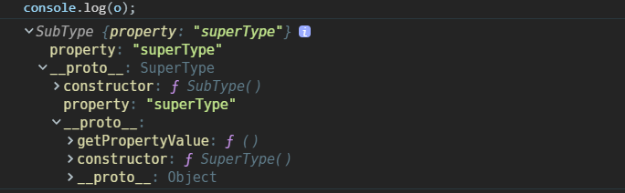
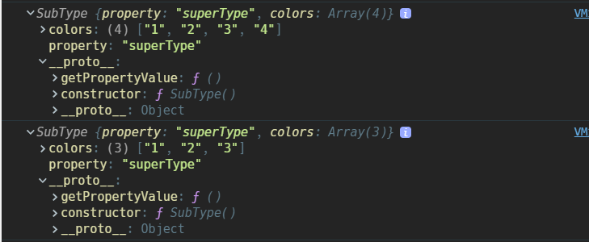

## 原型链



## 原型链继承

优点是简单，缺点是创建出来的对象四不像，其原型`[[prototype]]`直接指向`SuperType`，并且本应该在实例上的自有属性却在原型上；并且存在多个实例之间的原型对象由于是指向同一个`SuperType`的实例，所以引用类型属性存在相互篡改的风险。

```javascript
function SuperType() {
  this.name = 'oxygen';
}

function SubType() {}

SubType.prototype = new SuperType();
```



## 借用构造函数继承

优点是简单，多个实例不存在属性篡改的情况；但是无法继承`SuperType`原型对象上的属性

```javascript
function SuperType() {}

function SubType() {
  SuperType.call(this);
}
```



## 组合继承

把原型链和构造函数调用组合起来，就是组合继承。
这种方式优点是弥补了原型链和借用构造函数继承的缺陷，但是两次调用`SuperType`，有一定性能损失，并且创建出来的对象本身自有属性和原型上的属性存在相同重复的情况，但是由于属性屏蔽，导致原型上的属性没用到，浪费内存空间。

```javascript
function SuperType() {}

function SubType() {
  SuperType.call(this);
}

SubType.prototype = new SuperType();
SubType.prototype.constructor = SubType;
```



## 原型式继承

原型式继承其实就是复制父构造函数的原型对象，原理和原型链继承相同。ES5 的`Object.create()`方法可以代替下面的实现

```javascript
function create(proto) {
  function SubType() {}

  Subtype.prototype = proto;

  return new SubType();
}
```

## 寄生继承

寄生继承是在原型式继承的基础上完善子构造函数的自有属性

```javascript
function create(proto) {
  function SubType() {}

  Subtype.prototype = proto;

  const obj = new SubType();
  // 增强对象自有属性
  obj.color = 'blue';
  return obj;
}
```

## 寄生组合继承

寄生组合式继承也就是综合上述所有类型的实现，也是目前模拟`class`继承的一种实现方式

```javascript
function SuperType() {}

function SubType() {
  SuperType.call(this);
}

SubType.prototype = Object.create(SuperType.prototype);
Subtype.prototype.constructor = SubType;
```


