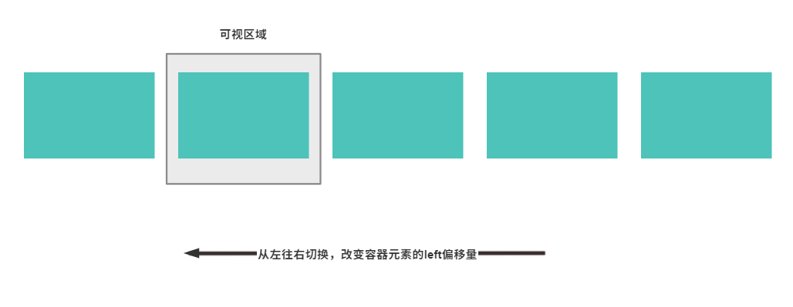

## 轮播组件

### float 实现

如果设计上要求实现左右切换的效果，那么可以通过`float`和`position:absolute`的偏移来实现。

- 三层 DOM 结构
- 利用`float`实现子元素在容器内部排列成一行元素，最外层元素通过`overflow:hidden`来隐藏视觉外的子元素
- 利用`position:absolute`元素的偏移量`left`等（可控制切换方向）来实现切换效果
- 利用 CSS transitions 做到改变`left`时的切换动画



根据以上思路，可以简单封装一个轮播图组件

```tsx | pure
import React, { useState, useEffect } from 'react';

/**
 * 轮播组件
 */
const Carousel: React.FC = ({ children }) => {
  const [current, setCurrent] = useState(0);

  useEffect(() => {
    const timerId = window.setInterval(() => {
      // 访问到当前的 state 的值：https://zh-hans.reactjs.org/docs/faq-state.html#what-is-the-difference-between-passing-an-object-or-a-function-in-setstate
      setCurrent(current => current + 1);
    }, 2000);

    return () => {
      window.clearInterval(timerId);
    };
  }, []);

  return (
    <div
      style={{
        position: 'relative',
        width: 600,
        height: 160,
        // 隐藏超出宽度的子元素
        overflow: 'hidden',
      }}
    >
      <div
        style={{
          position: 'absolute',
          // 通过改变left来切换
          left: -(current * 600),
          // 计算容器元素宽度，这里还有一种方式是设置成无限宽，反正至少要等于所有子元素宽度和
          width: React.Children.count(children) * 600,
          height: '100%',
          transition: 'left 0.5s',
        }}
      >
        {/* @ts-expect-error */}
        {React.Children.map(children, (child: React.ReactElement) => {
          // 子元素设置 float 按顺序从左往右排布
          return <div style={{ float: 'left', height: '100%' }}>{child}</div>;
        })}
      </div>
    </div>
  );
};

export default Carousel;
```

组件使用方法如下，可以实现如下图所示的效果

```tsx | pure
import React from 'react';
import Carousel from './components/Carousel';

const contentStyle: React.CSSProperties = {
  display: 'inline-block',
  width: 600,
  height: '100%',
  background: '#364d79',
  textAlign: 'center',
  color: '#fff',
};

function App() {
  return (
    <div
      style={{
        display: 'flex',
        justifyContent: 'center',
        alignItems: 'center',
        height: '100vh',
      }}
    >
      <Carousel>
        <div style={contentStyle}>1</div>
        <div style={contentStyle}>2</div>
        <div style={contentStyle}>3</div>
        <div style={contentStyle}>4</div>
      </Carousel>
    </div>
  );
}

export default App;
```


问题是这样在切换到最后一个子元素的时候，索引就超出了子元素长度，那么此时正确的效果是无缝过渡到第一个元素，视觉上要做到无限循环的效果。

这里常见的解决方式是将第一个子元素复制一份放在最后，在轮播图切换到最后一个元素的时候，下一个元素就是第一个元素，此时正常改变偏移量`left`到最后一个元素，但是将子元素索引重置到第一个元素，这样下次循环就会从起始元素重新开始了。

### absolute + opacity 实现

## 拖拽

## 滑块
