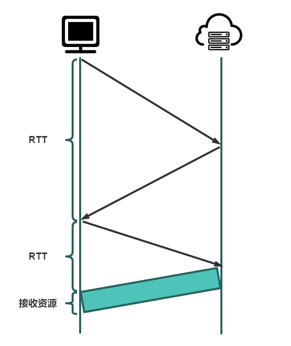

## HTTP 协议概况

HTTP，HyperText Transfer Protocal，超文本传输协议，所谓[超文本](https://www.w3.org/WhatIs.html)也就是超越文本的格式，例如音频，视频，超链接等。

## HTTP 版本

HTTP/1.0：[【RFC 1945】](https://tools.ietf.org/html/rfc1945)

HTTP/1.1：[【RFC 2616】](https://tools.ietf.org/html/rfc2616)

HTTP/2：[【RFC 7540】](https://tools.ietf.org/html/rfc7540)

## HTTP 报文

### HTTP 请求报文

HTTP 请求报文总体可以分为两部分：请求行和首部行。

请求行包含三个字段：

- 方法字段：GET、HEAD、POST、PUT、DELETE、CONNECT、OPTIONS、TRACE、PATCH
- URL 字段：请求的 URL
- HTTP 版本字段：HTTP/2.0、HTTP/1.1、HTTP/1.0

首部行也就是一系列[HTTP 首部字段](https://developer.mozilla.org/en-US/docs/Web/HTTP/Headers)

### HTTP 响应报文

HTTP 响应报文总体分为三部分：状态行、首部行和响应体

状态行有三个字段：

- 协议版本：HTTP/2.0、HTTP/1.1、HTTP/1.0
- 状态码：100，[200...](https://developer.mozilla.org/en-US/docs/Web/HTTP/Status)

- 状态码对应的状态描述词：OK，[`Not Modified`](https://developer.mozilla.org/en-US/docs/Web/HTTP/Status/304)，[`Not Found`](https://developer.mozilla.org/en-US/docs/Web/HTTP/Status/404)

首部行也就是一些[HTTP 首部字段](https://developer.mozilla.org/en-US/docs/Web/HTTP/Headers)

响应体也就是服务器发送的超文本资源

## HTTP 的特点

### 无状态但有会话

HTTP 有两个程序主体实现：客户端和服务器。服务器默认并不会保存客户的任何信息，所以服务器和客户端之间的连接没有状态保持。为了解决这个问题，HTTP 协议引入了 cookie，在[【RFC6265】](https://tools.ietf.org/html/rfc6265)中定义。

### 可靠传输

HTTP 协议建立在运输层 TCP 协议的基础上，TCP 为 HTTP 提供了可靠的数据传输。

### 可持续连接

HTTP 可以使用非持续连接，也可以使用持续连接，但是默认状态下使用非持续连接。

HTTP /1.1 之前 HTTP 只能采用非持续连接，这意味着客户端和服务器之间每次发送和接收完资源就会自动断开，再次请求则要重新建立连接。

以`RTT`表示三次握手中单次往返传递报文段需要的时间，则完成一次连接所需的时间大致为：

$$
2*RTT + 文件传输的时长
$$

由此可见非持续连接至少具有以下缺点：

- 服务器必须为每一个客户端的请求维护一个连接，当并发数高的时候，服务器负担巨大；
- 客户端和服务器之间每次都需要耗费额外的建立连接的时间

HTTP/1.1 发展了持续连接，服务器在发送响应后保持该 TCP 连接打开，如果一条连接经过一个可配置的时间未再使用，则服务器会自动断开该连接。

HTTP/2 又在 HTTP/1.1 上进行了拓展，允许相同连接中多个请求和回答交错，并增加了在该连接中优化 HTTP 报文请求和回答的机制。
