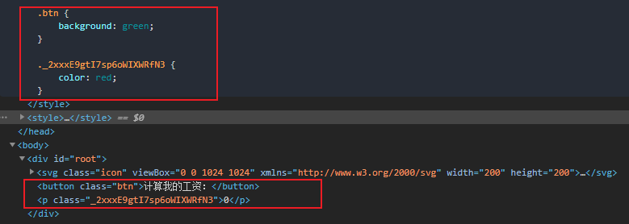
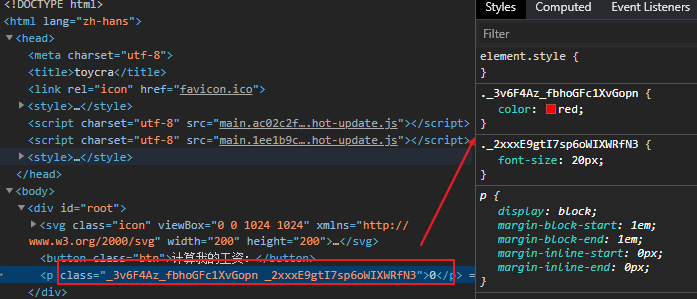

## CSS 代码规范

- [NEC](http://nec.netease.com/standard/css-sort.html)
- [BEM](http://getbem.com/introduction/)

## 什么是 CSS Modules

根据[CSS Module](https://github.com/css-modules/css-modules)的介绍，一个 CSS Module 就是一个 CSS 文件，在当前文件中的`class`，`animation`会被限制在当前模块作用域内。所有在`url()`和`@import url()`设置的路径也会是相当于 CSS Module 文件所在路径。

本质上来说，CSS 并不会存在作用域，CSS Module 是使用全局唯一的 hash 值替换原有的`class`或者`id`名称来达到解决命名冲突等问题，也就相当于限定了模块作用域。

## CSS Modules 语法

### CSS 对象

如果在 JS 中`import`一个 CSS Module 文件，CSS Module 会`export`一个对象，保存着当前 JS 模块内部`class`命名和产生的全局名称的映射关系。

```css
/* style.css */
.btn {
}

.user-login {
}
```

```jsx | pure
import styles from './style.css';

export default class extends Component {
  render() {
    return (
      <div className={styles['user-login']}>
        <button className={styles.btn}>按钮</button>
      </div>
    );
  }
}
```

### 驼峰命名

CSS `class`的命名建议使用驼峰命名形式，但是 CSS 命名广泛采用的是烤肉串形式也可以，对于烤肉串形式的`class`名称需要上面示例那样的方括号`[]`去访问。常见的命名格式：

- camelCase：也就是驼峰格式，第一个单词的首字母需要小写，其余单词首字母大写，例如

```css
.userLogin {
}
```

- PascalCase：帕斯卡命名格式，所有单词首字母必须大写，例如

```css
.UserLogin {
}
```

- snake*case：（蛇形）要求使用下划线`*`连接所有单词，要大写就全部大写，要小写就全部小写，例如

```css
.user_login {
}
```

- kebab-case：（烤肉串形式）要求使用连字符`-`连接所有单词，一般来说**在 CSS 里广泛使用的是这种形式**，例如

```css
.user-login {
}
```

### local 和 global

CSS Modules 默认是对类名自动添加`:local(...)` 的模块作用域；也允许使用`:global()`切换到全局作用域，下面是两种形式的使用，`:global()`包裹的`class`或者`id`不会被 hash 处理，也就不具有模块作用域了。

```css
:global(.btn) {
  background: green;
}

.p {
  color: red;
}
```

```jsx | pure
import styles from "./styles.css";

<button className="btn" onClick={this.handleClick}>
<p className={styles.p}>{this.state.value}</p>
```



如果使用`less`预处理器，那么`:global()`还支持嵌套的语法：

```less
:global {
  .global-class-name {
    color: green;
  }
}
```

### 组合 class

使用`composes`可以继承已经存在的`class`定义，最终在 HTML 标签上定义的`class`会是几个 class 名称组合在一起

```css
.p {
  font-size: 20px;
}

.p1 {
  composes: p;
  color: red;
}
```



同时也支持继承其它文件的`class`规则，但是要注意不要为来自不同文件的多个类名中的同一属性定义不同的值。而且还需要注意避免循环依赖的问题，所以通常一般不建议这么干

```css
.otherClassName {
  composes: className from './style.css';
}
```

## 使用 CSS Modules

### css-loader

CSS Modules 需要构建工具的支持，以 webpack 为例，需要使用`css-loader`来处理，这在[搭建 React 项目](https://icodex.me/react/%E6%90%AD%E5%BB%BAreact%E9%A1%B9%E7%9B%AE%EF%BC%883%EF%BC%89#css-loader-%E9%85%8D%E7%BD%AE)中提到过。`css-loader`默认是对匹配`/\.module\.\w+$/i`（也就是以`.module`形式命名，例如`style.module.css`）的 CSS 文件使用 CSS Modules 的处理规则，CRA 就是用的这样的默认配置。

### modules 配置项

通过`css-loader`的`modules`配置项可以自定义 webpack 对 CSS Modules 的支持，该配置项默认值是基于文件名，对匹配`/\.module\.\w+$/i`的 CSS 模块为`true`。

#### Boolean

如果直接设置成`true`就表示在 JS 引入的 CSS 都会看作 CSS Module 去处理，那么就需要按照 CSS Module 的语法了。设置为 `false` 值会提升 webpack 构建的性能，因为避免了 webpack 去额外处理 CSS Module 的语法。

```javascript
module.exports = {
  module: {
    rules: [
      {
        test: /\.css$/i,
        loader: 'css-loader',
        options: {
          modules: true,
        },
      },
    ],
  },
};
```

#### String

可选`"local"`或者`"global"`，指定`"local"`的效果和`true`是一样的，指定`"global"`不会对 CSS Modules 的`class`进行 hash 编码，直接使用原来的`class`名称，也就是不具有模块作用域。需要注意的是设置`"global"`就要按照 CSS Modules global 的语法来写，详情见上文`local`和`global`的区别。

#### Object

可以传入一个对象来设置不同的属性值。

```javascript
module.exports = {
  module: {
    rules: [
      {
        test: /\.css$/i,
        loader: 'css-loader',
        options: {
          esModule: true,
          modules: {
            auto: true,
            localIdentName: isDevelopment
              ? '[path][name]__[local]'
              : '[hash:base64]',
          },
        },
      },
    ],
  },
};
```

| 属性                     | 类型                      | 默认值          | 含义                                                                                                                                                                                                                                                     |
| ------------------------ | ------------------------- | --------------- | -------------------------------------------------------------------------------------------------------------------------------------------------------------------------------------------------------------------------------------------------------- |
| `compileType`            | `String`                  | `"module"`      | 控制样式的编译级别                                                                                                                                                                                                                                       |
| `auto`                   | `Boolean|RegExp|Function` | `true`          | 默认是自动根据 CSS 文件名启用 CSS Modules，也就是`/\.module\.\w+$/i`匹配规则；可以传入一个自定义的 RegExp 来匹配项目的 CSS Module 文件名；还可以传入一个函数，函数会接收每个 CSS 文件名字符串作为参数，从而返回`true`/`false`判断是否对其启用 CSS Module |
| `mode`                   | `String|Function`         | `"local"`       | 设置 CSS Module 的作用域，默认是模块作用域，也可以是`"global"`设置全局作用域，或者`"pure"`设置纯 CSS，不包含任何 CSS Module；如果传入一个函数会接收 CSS 文件路径字符串，以根据文件名设置不同的 `mode` 选项值                                             |
| `localIdentName`         | `String`                  | `[hash:base64]` | 设置 CSS Module 转换后的`class`名称形式                                                                                                                                                                                                                  |
| `localIdentContext`      | `String`                  |                 | 定义 loader 的当前执行上下文，默认是 webpack 的执行上下文配置                                                                                                                                                                                            |
| `localIdentHashPrefix`   | `String`                  | `undefined`     | 设置转换后名称的前缀形式                                                                                                                                                                                                                                 |
| `localIdentRegExp`       | `String|RegExp`           | `undefined`     |                                                                                                                                                                                                                                                          |
| `getLocalIdent`          | `Function`                | `undefined`     |                                                                                                                                                                                                                                                          |
| `namedExport`            | `Boolean`                 | `false`         | 是否使用 ES module 进行 CSS 模块导出，这个配置项已经没用了                                                                                                                                                                                               |
| `exportGlobals`          | `Boolean`                 | `false`         | 允许 `css-loader` 从全局类或 ID 导出名称                                                                                                                                                                                                                 |
| `exportlocalsConvention` | `String`                  | `"asIs"`        | 导出的类名称的样式，默认是按照原来的`class`或者`id`名称，其他可选的值如下表所示                                                                                                                                                                          |
| `exportOnlyLocals`       | `Boolean`                 | `false`         | 仅导出局部环境                                                                                                                                                                                                                                           |

`exportlocalsConvention`的可选值：

| 名称                  | 类型       | 描述                                       |
| :-------------------- | :--------- | :----------------------------------------- |
| **`'asIs'`**          | `{String}` | 类名将按原样导出。                         |
| **`'camelCase'`**     | `{String}` | 类名将被驼峰化，原类名不会从局部环境删除   |
| **`'camelCaseOnly'`** | `{String}` | 类名将被驼峰化，原类名从局部环境删除       |
| **`'dashes'`**        | `{String}` | 类名中只有破折号会被驼峰化                 |
| **`'dashesOnly'`**    | `{String}` | 类名中破折号会被驼峰，原类名从局部环境删除 |

## React CSS Modules

> [React CSS Modules](https://github.com/gajus/react-css-modules#react-css-modules)

React CSS Modules 其实和 CSS Module 差不多，从 React CSS Modules 介绍文档里来看，CSS Module 存在以下问题：

- 在 React 中使用时，必须以`styles`对象的形式导入 CSS；且`className`也必须用对象属性的形式；
- 模块 CSS 和全局 CSS 混合在一起会很难维护
- 引用未定义 CSS 模块没有任何警告信息

`react-css-modules`是一个高阶组件，它使用`styleName`替代 React 中的`className`，并且在 webpack 打包的时候，利用`styleName`去找样式对象中的 CSS 模块，并把这些模块的属性再填充到`className`中，个人看法，比原始 CSS Module 还麻烦一点。

```jsx | pure
import React from 'react';
import CSSModules from 'react-css-modules';
import styles from './table.css';

class Table extends React.Component {
  render() {
    return (
      <div styleName="table">
        <div styleName="row">
          <div styleName="cell">A0</div>
          <div styleName="cell">B0</div>
        </div>
      </div>
    );
  }
}

export default CSSModules(Table, styles);
```

## babel-plugin-react-css-modules

> [babel-plugin-react-css-modules](https://github.com/gajus/babel-plugin-react-css-modules#babel-plugin-react-css-modules)

`babel-plugin-react-css-modules`是一个 babel 的 plugin，能在解析 CSS 模块的时候，自动将`styleName`转换成`className`。

相比`react-css-modules`，用法更简单，体积更小，性能也更好。

### 原理

- 为每个在 React 导入的`.css`或者`.scss`文件创建索引；
- 使用 postcss 将匹配的 CSS 文件解析为对 CSS 模块引用的查找；
- 遍历所有 JSX 元素的定义；
- 将`styleName`属性值解析为匿名和命名 CSS 模块引用
- 查找与 CSS 模块匹配的 CSS 类名称
- 从元素中删除`styleName`属性
- 将`className`属性插入到 JSX 元素中

### 配置项

| 配置项                       | 类型      | <span style="white-space:nowrap">默认值</span> | 含义                                                                                                                        |
| ---------------------------- | --------- | ---------------------------------------------- | --------------------------------------------------------------------------------------------------------------------------- |
| `context`                    | `String`  |                                                | 必须和 webpack 的`context`配置项想匹配                                                                                      |
| `exclude`                    | `String`  |                                                | 排除的文件名，例如`node_modules`                                                                                            |
| `filetypes`                  | `String`  |                                                | 配置 PostCSS 使用的其它 CSS 预处理的 loader                                                                                 |
| `generateScopedName`         | `String`  | `"[path]___[name]__[local]___[hash:base64:5]"` | 配置转换后的`class`或者`id`的名称，必须和`css-loader`的`localIdentName`一致                                                 |
| `removeImport`               | `Boolean` | `false`                                        | 删除匹配的样式导入。此选项用于启用服务器端渲染                                                                              |
| `webpackHotModuleReloading`  | `Boolean` | `false`                                        | 启用 webpack 中 CSS 的热重载                                                                                                |
| `handleMissingStyleName`     | `String`  | `"throw"`                                      | 在 React 中使用了未定义的 CSS 时候的提示；`"throw"`会抛出错误，会被 WDS 捕获，`"warn"`仅在 CLI 中提示，`"ignore"`会直接忽略 |
| `attributeNames`             | `Object`  | `{"styleName": "className"}`                   | 自定义插件转换 JSX 属性的映射关系                                                                                           |
| `skip`                       | `boolean` | `false`                                        | 如果在文件中找不到匹配的属性名，是否应用插件                                                                                |
| `autoResolveMultipleImports` | `boolean` | `false`                                        | 允许使用命名规则从多个引入的 CSS 文件中导出 CSS 对象                                                                        |

### 使用

```shell
yarn add babel-plugin-react-css-modules -D
```

```javascript
module.exports = {
  module: {
    rules: [
      {
        test: /\.m?jsx?$/,
        exclude: /(node_modules)/,
        loader: 'babel-loader',
        options: {
          plugins: [
            '@babel/plugin-transform-runtime',
            '@babel/plugin-proposal-class-properties',
            [
              'react-css-modules',
              {
                generateScopedName: isDevelopment
                  ? '[path][name]__[local]'
                  : '[hash:base64]',
                webpackHotModuleReloading: true,
                handleMissingStyleName: 'warn',
              },
            ],
          ],
        },
      },
    ],
  },
};
```

```jsx | pure
import React from 'react';
import './table.css';

export default class Table extends React.Component {
  render() {
    return (
      <div styleName="table">
        <div styleName="row">
          <div styleName="cell">A0</div>
          <div styleName="cell">B0</div>
        </div>
      </div>
    );
  }
}
```

如果是同时引入多个 CSS Module，可以使用具体的对象引用`class`

```javascript
import foo from './foo1.css';
import bar from './bar1.css';

<div styleName="foo.a"></div>;

<div styleName="bar.a"></div>;
```
