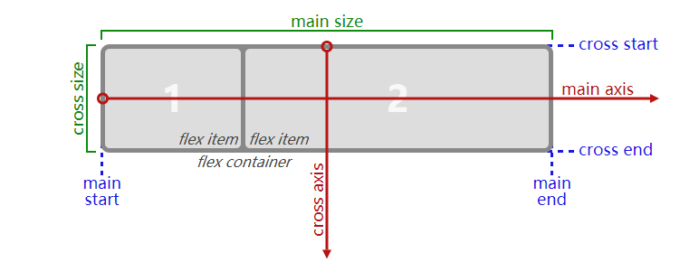
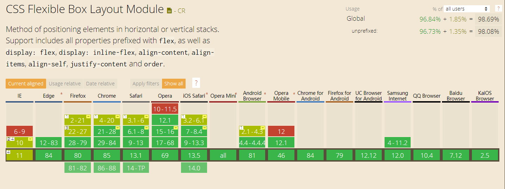

## flex 布局

flex 布局是 CSS 规范定义的第五种布局模式：

- `block layout`，在于整体布局
- `inline layout`，在于布局行内文本等行内元素
- `table layout`
- `position`属性修改的布局，例如绝对定位和相对定位
- `flex layout`

### flex box model

在 flex 布局中，指定的`display:flex`或者`display:inline-flex`的元素被称为 flex 容器（flex container），flex 容器中的子项称为 flex 项目（flex items），并使用 flex 布局模型进行布局。

flex 布局取决于 flex direction，flex direction 可以使用 [`flex-flow`](https://drafts.csswg.org/css-flexbox-1/#propdef-flex-flow) 和 [`writing mode`](https://drafts.csswg.org/css-writing-modes-4/#writing-mode) 来定义，下图是默认情况下 flex 容器和子项的排布概念。

- **main axis**：主轴，定义 flex 项在 flex 容器中放置的方向
- **cross axis**：交叉轴，垂直于主轴方向
- main-start，main-end：flex 容器的起始点
- cross-start，cross-end：[flex lines](https://drafts.csswg.org/css-flexbox-1/#flex-lines)和 flex 项从 cross-start 填充到 cross-end
- **main size**：flex 容器或者 flex 项在主轴方向上的尺寸
- **cross size**：flex 容器或者 flex 项在交叉轴方向上的尺寸

### 兼容性

## display:flex

设置为`display:flex`的 flex 容器会在内部建立弹性格式化上下文（**flex formatting context**），在弹性格式化上下文中：

- `float`属性和`clear`属性失效
- `vertical-align`属性失效
- 伪元素选择器`::first-line`（首行）和`::first-letter`（首字母）失效
- flex 容器的外边距不会和 flex 项的外边距发生折叠（margin collapse）

<code src="@/demo/flex" inline/>

## flex-flow

`flex-flow`属性是`flex-direction`属性和`flex-wrap`属性的缩写，默认值为`row nowrap`，也就是默认`flex-direction`为横向，项目都排在一条线。

### flex-direction

<code src="@/demo/flex/flexdirection" inline/>

`flex-direction`定义主轴反向

- `row`：默认值，水平方向，子项排列是**从左往右**

- `row-reverse`：水平方向，但是子项排列是**从右往左**

- `column`：垂直方向，子项排列是**从上往下**

- `column-reverse`：垂直方向，子项排列是**从下往上**

### flex-wrap

<code src="@/demo/flex/flexwrap" inline/>

`flex-wrap`属性定义，如果一条轴线排不下，是否换行

- `nowrap`：默认值，单行排列，内容可能发生溢出

- `wrap`：多行排列

- `wrap-reverse`：多行排列，但是排布的起始位置对调

-

## flex

`flex`是`flex-grow`，`flex-shrink`，`flex-basis`的简写，**用于 flex 项**上。

`flex`这个属性默认值是`initial`，即`flex: 0 1 auto`，默认 flex 项自动根据内容宽度作为初始宽度，同时不会伸长分享 flex 容器中的剩余空间，但会在所有 flex 项宽度总和大于 flex 容器宽度时发生收缩以适应填满 flex 容器。

### 单值语法

- 一个无单位数字：它会被当作`flex-grow`的值
- 一个单位宽度值：它会被当作 `flex-basis`的值
- 关键字`none`，`auto`或`initial`

| 关键字           | 实际值            | 解释                                                                                                                         |
| :--------------- | ----------------- | ---------------------------------------------------------------------------------------------------------------------------- |
| `flex: none;`    | `flex: 0 0 auto;` | 元素会根据自身宽高来设置尺寸。它是完全非弹性的：既不会缩短，也不会伸长来适应 flex 容器                                       |
| `flex: auto;`    | `flex: 1 1 auto;` | 元素会根据自身的宽度与高度来确定尺寸，同时会伸长并吸收 flex 容器中额外的自由空间，也会缩短自身来适应 flex 容器               |
| `flex: initial;` | `flex: 0 1 auto;` | 默认值；元素会根据自身宽高设置尺寸，它会缩短自身以适应 flex 容器，但不会伸长并吸收 flex 容器中的额外自由空间来适应 flex 容器 |

### 双值语法

- 第一个值必须为一个无单位数，并且它会被当作 `flex-grow` 的值。第二个值可以是以下二选一

- 一个无单位数字：它会被当作 `flex-shrink` 的值
- 一个有效的宽度值: 它会被当作 `flex-basis` 的值

### 三值语法

- 第一个值必须为一个无单位数，并且它会被当作 `flex-grow` 的值
- 第二个值必须为一个无单位数，并且它会被当作 `flex-shrink` 的值
- 第三个值必须为一个有效的宽度值， 并且它会被当作 `flex-basis` 的值

### flex-basis

- 用于 flex 容器内子元素，指定其在容器主轴方向上的初始宽高，也就是该元素最小宽高；当 flex 容器有剩余空间时，元素的实际宽高可能会发生变化
- 默认值是`auto`，即根据内容宽度选择自身的宽度
- `flex-basis`比 `width`和`height` 优先级更高；但是如果`flex-basis`是`auto`，那么`width`设置多少元素宽度就是多少

| 值                         | 解释                                                                                                                                                   |
| -------------------------- | ------------------------------------------------------------------------------------------------------------------------------------------------------ |
| `flex-basis: auto;`        | 有设置`width`则占据空间就是`width`，没有设置就按内容宽度来                                                                                             |
| `flex-basis: 300px;`       | 元素初始宽度，即容器为 flex 项预留的最小宽度                                                                                                           |
| `flex-basis: 50%;`         | 可以是百分比数值，元素初始宽度，即容器为 flex 项预留的最小宽度                                                                                         |
| `flex-basis: max-content;` | 采用内容宽度最大的元素的宽度作为自身宽度                                                                                                               |
| `flex-basis: min-content;` | 采用内部元素的内容最小宽度值最大的那个元素的宽度作为自身的宽度                                                                                         |
| `flex-basis: fit-content;` | 当内容宽度不超过一行时，采用内容宽度最大的元素宽度作为自身宽度； 当内容宽度超过一行时，会压缩内部宽度最大的元素的宽度，使其不超过最外层容器的宽度 |

> 关于 width 属性值的解释

- `auto`：默认值
  - 对于块级元素，宽度默认 100%充满父级元素
  - 浮动`float`，绝对定位`position:absolute`，`inline-block`水平元素或`table`表格会根据内容宽度收缩自身宽度到合适的宽度，**shrink-to-fit**
- `max-content：采用内容宽度最大的元素的宽度作为自身宽度`
- `min-content`：采用内部元素的内容最小宽度值最大的那个元素的宽度作为自身的宽度
  - 图片的最小宽度值就是图片呈现的宽度，对于文本元素
  - 如果全部是中文，则最小宽度值就是一个中文的宽度值
  - 如果包含英文，因为默认英文单词不换行，所以，最小宽度可能就是里面最长的英文单词的宽度
- `fit-content`：类似于`display:inline-block`一样的收缩规则
  - 当内容宽度不超过一行时，采用内容宽度最大的元素宽度作为自身宽度
  - 当内容宽度超过一行时，会压缩内部宽度最大的元素的宽度，使其不超过最外层容器的宽度

### flex-grow

- 用于 flex 容器内子元素，设置该元素在容器内的分享容器剩余空间的比例值
- 默认是`0`；只能是数字，负值无效

> 具体规则

- 所有剩余空间总量是`1`。
- 如果只有一个 flex 子项设置了`flex-grow`属性值
  - 如果`flex-grow`值小于 1，则扩展的空间就总剩余空间和这个比例的计算值
  - 如果`flex-grow`值大于 1，和`flex-grow: 1`的意义是一样的，都是独享所有剩余空间
- 如果有多个 flex 设置了`flex-grow`属性值
  - 如果`flex-grow`值总和小于 1，则每个子项扩展的空间就按总剩余空间和当前元素设置的`flex-grow`比例的计算值
  - 如果`flex-grow`值总和大于 1，则所有剩余空间被利用，分配比例就是`flex-grow`属性值的比例。例如所有的 flex 子项都设置`flex-grow:1`，则表示剩余空白间隙大家等分，如果设置的`flex-grow`比例是 1:2:1，则中间的 flex 子项占据一半的空白间隙，剩下的前后两个元素等分

### flex-shrink

- 用于 flex 容器内子元素，设置该元素在容器内收缩的比例
- **注意默认是`1`，也就是默认所有的 flex 子项都会收缩**；只能是数字，负值无效

> 具体规则

- 如果`flex-shrink`值的总和小于 1，则收缩的尺寸不完全，每个元素收缩尺寸比例就是设置的`flex-shrink`的值
- 如果`flex-shrink`值的总和大于 1，则收缩完全，每个元素收缩尺寸的比例和`flex-shrink`值的比例一样

### order

- 用于 flex 项，指定其在 flex 容器中的顺序；例如圣杯布局中中间 DOM 结构先写，但是布局中左侧的`order`其实是第一位的；如果相同 `order` 属性值的元素按照它们在源代码中出现的顺序进行布局

## justify-content

<code src="@/demo/flex/justify" inline/>

`justify-content`属性设置 flex 项目在主轴上的对齐方式

- `flex-start`：默认值，flex 项向 main-start 对齐，第一个 flex 项的`margin`边缘和 main-start 重合
- `flex-end`：flex 项向 main-end 对齐，最后一个 flex 项的`margin`边缘和 main-end 重合
- `center`：中心对齐，flex 项向行的中心对齐，第一个 flex 项和 main-start 之间的距离和最后一个 flex 项和 main-end 之间的距离相等
- `space-between`：在每行上均匀分配弹性元素。相邻元素间距离相同。每行第一个元素与 main-start 对齐，每行最后一个元素与 main-end 对齐
- `space-around`：在每行上均匀分配弹性元素。相邻元素间距离相同。每行第一个元素到 main-start 的距离和每行最后一个元素到 main-end 的距离将会是相邻元素之间距离的`1/2`

## align-items

<code src="@/demo/flex/alignitems" inline/>

`align-items`定义 flex 项在交叉轴方向上的对齐方式

- `stretch`：默认值，`stretch`是伸展，拉伸的意思，表示 flex 项在交叉轴上尽可能的拉伸以接近交叉轴方向的高度或者宽度
- `flex-start`：flex 项在交叉轴上向 cross-start 对齐
- `flex-end`：flex 项在交叉轴上向 cross-end 对齐
- `center`：flex 项在交叉轴的中点对齐，向 cross-end 对齐
- `baseline`：flex 项在主轴的基线上对齐

## align-content

<code src="@/demo/flex/aligncontent" inline/>

`align-content`定义 flex 容器中多行或者多列在交叉轴上的对齐方式

- `stretch`：默认值，flex 容器中每行或者每列等分 flex 容器的剩余空间
- `flex-start`：flex 容器中每行或者每列向 flex 容器的 cross-start 对齐
- `flex-end`：flex 容器中每行或者每列向 flex 容器的 cross-end 对齐
- `center`：flex 容器中每行或者每列向 flex 容器的中心对齐
- `space-between`：第一行或者第一列与 flex 容器的 cross-start 对齐，最后一行或者对后一列与 cross-end 对齐，相邻两行或两列间距相等
- `space-around`：相邻两行或两列间距相等，容器的垂直轴起点边和终点边分别与第一行和最后一行的距离是相邻两行间距的一半

## 测试

<code src="@/demo/flex/mix" inline/>
