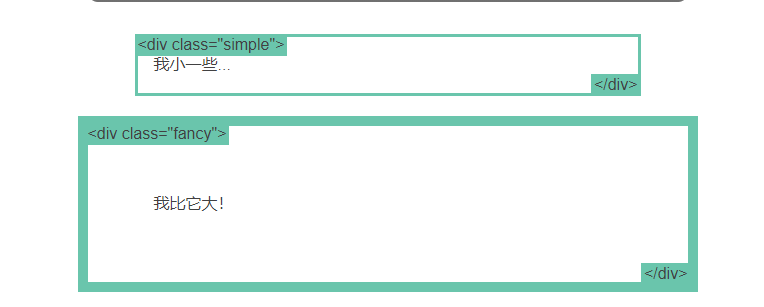
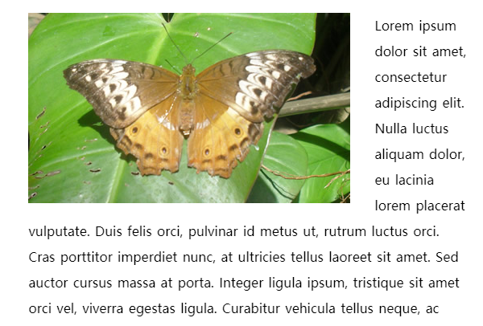
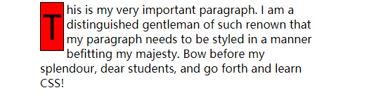
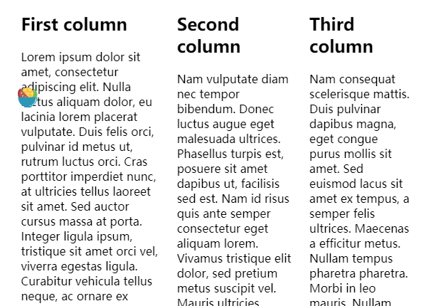
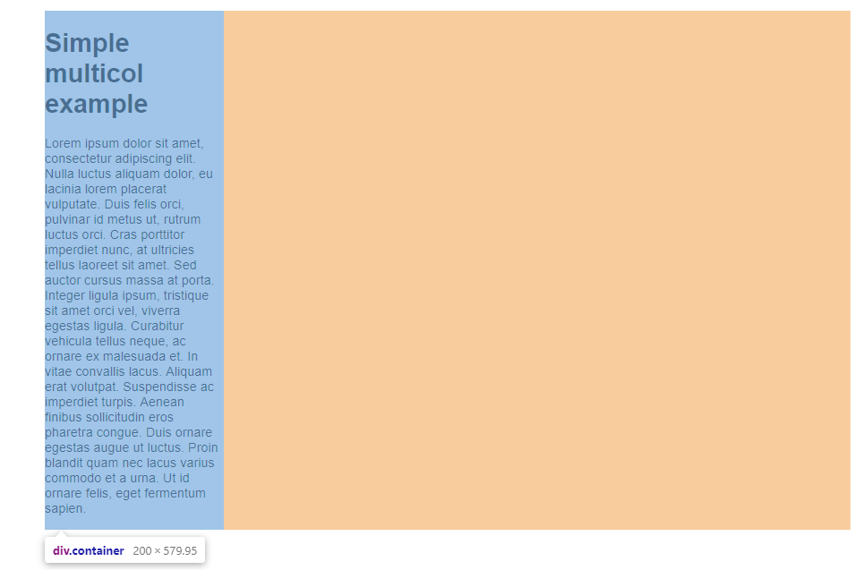
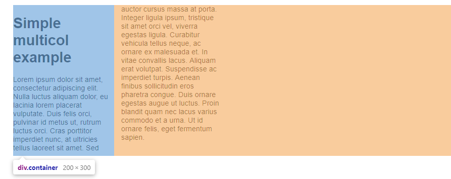
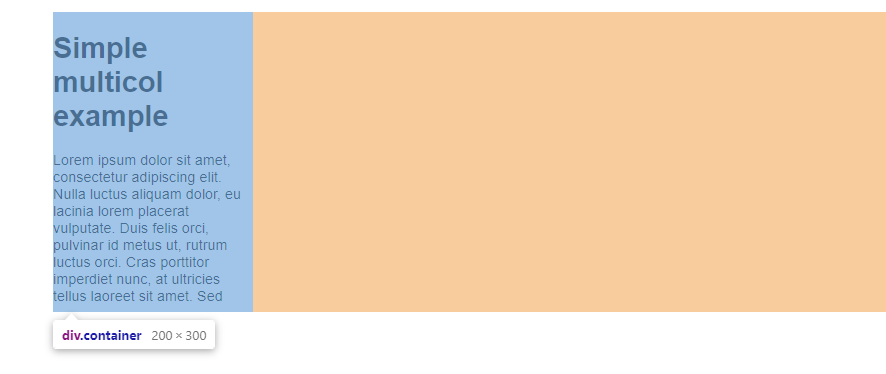

### 正常布局流

- 不对页面进行任何布局控制时，浏览器默认的 HTML 布局方式
- 那么使用行内元素和块级元素会默认根据`display`的各自默认属性进行计算；即行内元素只要在父级元素的内部有足够的空间，就会与其他行内元素，相邻文本被安排在同一行；如果空间不够，溢出的文本或者元素就会移到新一行；而每个块级元素会在上一个元素下另起一行
- 网页文字内容会变得难以控制，因为会充满整个屏幕，不便于阅读

### 盒模型

- 默认的块级元素`padding`和`border`会影响到元素的实际宽度，即设置的宽度会被设置的`padding`和`border`的值撑开

```css
// 这样的两个元素虽然设置了宽度一样，但是第二个元素因为padding和border，仍然会使宽度被撑开

.simple {
  width: 500px;
  margin: 20px auto;
}

.fancy {
  width: 500px;
  margin: 20px auto;
  padding: 50px;
  border-width: 10px;
}
```



- 可以通过设置`box-sizing`属性来抵消 padding 和 border 的冲突

```CSS
// 一般通过全局设置来使所有元素都生效

* {
  -webkit-box-sizing: border-box;
     -moz-box-sizing: border-box;
          box-sizing: border-box;
}
```

### 弹性盒子

> 弹性盒子的概念


- 设置了`display:flex`的父元素被称为**flex 容器**；在容器中的块级元素是**flex 项**
- flex 布局只有两种方向，默认主轴是横向，即`flex-direction:row`；当然还可以是`flex-direction:column`
- 此外还有交叉轴方向，即垂直于 flex 元素主轴方向
- 弹性盒子布局使得内部子元素自动按主轴方向排布，通过压缩或者伸展自己的宽度/高度来适应并填满主轴方向的空间
- 在 Flex 布局中，flex 子元素的设置`float`，`clear`以及`vertical-align`属性都是没有用的

> 弹性盒子解决了以下三个问题

- 使用 CSS 在父容器内简洁的垂直居中一个块级元素
- 使容器内所有子项占用等量的可用宽度/高度，而不管有多少宽度/高度可用
- 使多列布局中所有列采用相同的高度，即使它们包含的内容量不同

### 网格布局

- 网格布局是一个二维层面的，不同于 flex 只是单轴方向；网格布局具有列`column`和行`row`，以及在每列和行之间的间隙`gutter`


- 网格布局可以通过`float`来实现，现在主流的方式是通过`flex`来做
- 如果用 flex 容器来实现一个栅格系统，通常需要三个组件：`container`，`row`和`col`；但是 flex 容器只是单向布局，也就是只能侧重一行，如果多行的话，仍然需要为每列都提供计算来的宽度值`width`替代`flex-basis`的值，这样才能保障整体的自适应

```css
.container {
  padding-right: 2.08333333%;
}

.row {
  display: flex;
}

.col {
  margin-left: 2.08333333%;
  margin-bottom: 1em;
  width: 6.25%;
  flex: 1 1 auto;
  background: rgb(255, 150, 150);
}
```


### 浮动

- 浮动元素会脱离正常的文档布局流，并吸附在其父容器的左边；在正常布局中位于该浮动元素下的内容，此时会围绕着浮动元素，填满其右侧空间
- 浮动元素仍然对`margin`，`border`等有效
- 常用的情况

```css
//文字环绕图片
img {
  float: left;
  margin-right: 30px;
}

<div>
    

    <p> Lorem ipsum dolor sit amet, consectetur adipiscing elit. Nulla luctus aliquam dolor, eu lacinia lorem placerat vulputate. Duis felis orci, pulvinar id metus ut, rutrum luctus orci. Cras porttitor imperdiet nunc, at ultricies tellus laoreet sit amet. Sed auctor cursus massa at porta. Integer ligula ipsum, tristique sit amet orci vel, viverra egestas ligula. Curabitur vehicula tellus neque, ac ornare ex malesuada et. In vitae convallis lacus. Aliquam erat volutpat. Suspendisse ac imperdiet turpis. Aenean finibus sollicitudin eros pharetra congue. Duis ornare egestas augue ut luctus. Proin blandit quam nec lacus varius commodo et a urna. Ut id ornare felis, eget fermentum sapien.</p>
</div>
```



```css
//首字母突出特效
p {
  width: 400px;
  margin: 0 auto;
}

p::first-letter {
  font-size: 3em;
  border: 1px solid black;
  background: red;
  float: left;
  padding: 2px;
  margin-right: 4px;
}

<p>
    This is my very important paragraph. I am a distinguished gentleman
    of such renown that my paragraph needs to be styled in a manner
    befitting my majesty. Bow before my splendour, dear students, and go
    forth and learn CSS!
</p>
```



```css
//创建多列布局
body {
  width: 90%;
  max-width: 900px;
  margin: 0 auto;
}

div:nth-of-type(1) {
  width: 36%;
  float: left;
}

div:nth-of-type(2) {
  width: 30%;
  float: left;
  margin-left: 4%;
}

div:nth-of-type(3) {
  width: 26%;
  float: right;
}

<div>
  <h2>First column</h2>
  <p> Lorem ipsum dolor sit amet, consectetur adipiscing elit. Nulla luctus aliquam dolor, eu lacinia lorem placerat vulputate. Duis felis orci, pulvinar id metus ut, rutrum luctus orci. Cras porttitor imperdiet nunc, at ultricies tellus laoreet sit amet. Sed auctor cursus massa at porta. Integer ligula ipsum, tristique sit amet orci vel, viverra egestas ligula. Curabitur vehicula tellus neque, ac ornare ex malesuada et. In vitae convallis lacus. Aliquam erat volutpat. Suspendisse ac imperdiet turpis. Aenean finibus sollicitudin eros pharetra congue. Duis ornare egestas augue ut luctus. Proin blandit quam nec lacus varius commodo et a urna. Ut id ornare felis, eget fermentum sapien.</p>
</div>

<div>
  <h2>Second column</h2>
  <p> Lorem ipsum dolor sit amet, consectetur adipiscing elit. Nulla luctus aliquam dolor, eu lacinia lorem placerat vulputate. Duis felis orci, pulvinar id metus ut, rutrum luctus orci. Cras porttitor imperdiet nunc, at ultricies tellus laoreet sit amet. Sed auctor cursus massa at porta. Integer ligula ipsum, tristique sit amet orci vel, viverra egestas ligula. Curabitur vehicula tellus neque, ac ornare ex malesuada et. In vitae convallis lacus. Aliquam erat volutpat. Suspendisse ac imperdiet turpis. Aenean finibus sollicitudin eros pharetra congue. Duis ornare egestas augue ut luctus. Proin blandit quam nec lacus varius commodo et a urna. Ut id ornare felis, eget fermentum sapien.</p>
</div>

<div>
  <h2>Third column</h2>
  <p>Nam vulputate diam nec tempor bibendum. Donec luctus augue eget malesuada ultrices. Phasellus turpis est, posuere sit amet dapibus ut, facilisis sed est. Nam id risus quis ante semper consectetur eget aliquam lorem. Vivamus tristique elit dolor, sed pretium metus suscipit vel. Mauris ultricies lectus sed lobortis finibus. Vivamus eu urna eget velit cursus viverra quis vestibulum sem. Aliquam tincidunt eget purus in interdum. Cum sociis natoque penatibus et magnis dis parturient montes, nascetur ridiculus mus.</p>
</div>
```



#### 浮动影响

- **float 元素在正常文档流中所占的有效宽高都是 0，也就是脱离了正常文档流，这也是浮动影响其相邻元素位置排版的根本原因**
- 使用 float 多列布局，可能因为盒模型的宽度计算问题而导致设置`padding`，`margin`等属性后布局可能会被破坏
- float 布局会影响相邻元素在页面中的排布，因为 float 元素脱离了正常的文档流，所以块级元素会按照正常文档流的布局方式与 float 元素发生重叠
- 相邻的非浮动元素不能通过`margin`来创建与浮动元素之间的间隔空间

#### 消除浮动带来的影响

- 清除**相邻**元素浮动影响，为相邻元素设置`clear`属性

```css
clear: none;
clear: left;
clear: right;
clear: both;
```

- 清除**相邻**元素浮动影响，通过添加一个无用的`div`块并设置其`clear`属性来清除随后元素的浮动影响

```html
.clearfix { clear: both; }

<div class="clearfix"></div>
<!-- 此后的div将不受浮动影响 -->
<div>
  <p>
    ©2016 your imagination. This isn't really copyright, this is a mockery of
    the very concept. Use as you wish.
  </p>
</div>
```

- 清除**内部图片**浮动影响；如果 div 内有一张浮动的图片，那么 div 的高度会发生塌陷，有以下 5 种方法清除浮动图片造成的影响

```css
No.1   div使用float

<div style="float:left; background:#f0f3f9; padding:20px;">
    
</div>

No.2   div使用position:absolute

<div style="position:absolute; background:#f0f3f9; padding:20px;">
    
</div>

No.3   div使用display:inline-block

<span style="display:inline-block; background:#f0f3f9; padding:20px;">
    
</span>

No.4   div使用overflow，这里auto，hidden都可以，具体看其他内容

<div style="overflow:hidden; background:#f0f3f9; padding:20px;">
    
</div>

No.5   使用伪类:after，以下代码一句都不能少

.clearfix:after {
    content: ".";
    display: block;
    height: 0;
    clear: both;
    visibility: hidden;
}

<div class="clearfix">
    
</div>

No.6   只针对IE6/7以下还可使用zoom，对webkit的浏览器无效

<div style="zoom:1; background:#f0f3f9; padding:20px;">
    
</div>
```

### 定位

- 改变元素的`display`属性

### 多列布局

- 多列布局非常特殊，有别于传统布局方法，它将包括包括所有子元素在内的所有内容拆分为列；也就是说即使一段`<p>`内的文字也会被拆开成多列进行显示

- 有点类似于报纸排版的效果

#### column-count

- 用于容器，表示内部元素会被划分为几列

```css
column-count: auto; //用来表示列的数量由其他CSS属性指定, 例如 column-width

column-count: 3; //一个数字，最大列数
```

#### column-width

- 用于容器，指定每列宽度；如果只设定`column-width`，浏览器会自动根据现有容器宽度划分栏目的个数

```css
column-width: <length>; //指定的长度单位值，注意不支持百分比数字

column-width: auto; //指定的长度单位值
```

- 关于`column-width`和`column-count`，同时使用的时候，优先级是通过统一转换`column-count`值，哪个小就使用哪一个

#### columns

- `columns`是`column-width`和`column-count`属性的缩写

```css
columns: 2 auto; //第一个是column-width，第二个是column-count

//相当于
columns: auto;
columns: 2;
```

#### column-rule-color

- `column-rule-color`表示每列中间分隔线的颜色
- 支持的属性值和`border-color`是一模一样的

```css
column-rule-color: <color>;
```

#### column-rule-style

- `column-rule-style`表示每列中间分隔线的类型
- 支持的属性值和`border-style`是一模一样的，具体参见[border-style](https://developer.mozilla.org/en-US/docs/Web/CSS/border-style#Values)

```css
column-rule-style: none;
column-rule-style: hidden;
column-rule-style: dotted;
column-rule-style: dashed;
column-rule-style: solid;
column-rule-style: double;
column-rule-style: groove;
column-rule-style: ridge;
column-rule-style: inset;
column-rule-style: outset;
```

#### column-rule-width

- `column-rule-width`表示每列中间分隔线的宽度大小
- 支持的属性值和`border-width`是一模一样

```css
/* 关键字值 */
column-rule-width: thin;
column-rule-width: medium; /* 默认值 */
column-rule-width: thick;

/* 具体长度值 */
column-rule-width: 1px;
column-rule-width: 2.5em;
```

#### column-rule

- `column-rule`是`column-rule-width`，`column-rule-style`和`column-rule-color`这 3 个 CSS 属性的缩写；类似于正如`border`是`border-style`，`border-width`和`border-color`的缩写一样

#### column-span

- 表示某一个内容是否跨多栏显示

```css
// 默认值
column-span: none;

// 横跨所有垂直列
column-span: all;
```

#### column-gap

- 表示每列之间的空白间隙大小

```css
// 默认值。在多栏布局中为1em，也就是大约16px
column-gap: normal;

/* 长度值 */
column-gap: 3px;
column-gap: 3em;

/* 百分比值 */
column-gap: 3%;
```

#### column-fill

- 当内容分列的时候，如何平衡每一列填充的内容；不是常用的属性，仅了解

```css
// 按顺序填充每一列。内容只占用它需要的空间
column-fill: auto;

// 默认值,尽可能在列之间平衡内容；然而在分隔断开的上下文中，只有最后一个片段是平衡的
column-fill: balance;
column-fill: balance-all;
```

#### 多列布局的应用场景之一——移动端 APP 文章左右滑动浏览

- 如果我们只对容器设置宽度而不设置高度，在设置了`column-width`后会因为内容总和的宽度大于容器宽度，向下排布在一列排布

```html
.container { width: 200px; column-width: 200px; }

<div class="container">
  <h1>Simple multicol example</h1>
  <p>
    Lorem ipsum dolor sit amet, consectetur adipiscing elit. Nulla luctus
    aliquam dolor, eu lacinia lorem placerat vulputate. Duis felis orci,
    pulvinar id metus ut, rutrum luctus orci. Cras porttitor imperdiet nunc, at
    ultricies tellus laoreet sit amet. Sed auctor cursus massa at porta. Integer
    ligula ipsum, tristique sit amet orci vel, viverra egestas ligula. Curabitur
    vehicula tellus neque, ac ornare ex malesuada et. In vitae convallis lacus.
    Aliquam erat volutpat. Suspendisse ac imperdiet turpis. Aenean finibus
    sollicitudin eros pharetra congue. Duis ornare egestas augue ut luctus.
    Proin blandit quam nec lacus varius commodo et a urna. Ut id ornare felis,
    eget fermentum sapien.
  </p>
</div>
```



- 这时我们为容器加上固定高度，就实现了完美分页效果



- 然后设置容器的`overflow:hidden`，就会隐藏不在容器固定宽度内的列部分

```css
.container {
  width: 200px;
  height: 300px;
  column-width: 200px;
  overflow: hidden;
}
```



- 然后就可以通过监听 JS 在移动端的`touch`等事件，控制容器元素的`translateX`位移值，实现左右滑屏浏览文章内容的效果了

### 响应式布局

- RWD，responsive web design；设计适应不同屏幕宽度的网页

#### 媒体查询

- 使用`@media`属性或者`@import`指定一个媒体查询和一个 CSS 块，当且仅当该媒体查询与正在使用其内容的设备匹配时，该 CSS 块才能应用于该文档
- 用`media` 属性为[`style`](https://developer.mozilla.org/zh-CN/docs/Web/HTML/Element/style), [`link`](https://developer.mozilla.org/zh-CN/docs/Web/HTML/Element/link), [`source`](https://developer.mozilla.org/zh-CN/docs/Web/HTML/Element/source)指定特定的媒体类型 ，`media`属性可以指定该样式或者资源应用于哪个媒体类型
- 使用[`Window.matchMedia()`](https://developer.mozilla.org/zh-CN/docs/Web/API/Window/matchMedia) 和[`MediaQueryList.addListener()`](https://developer.mozilla.org/zh-CN/docs/Web/API/MediaQueryList/addListener) 方法来[测试和监控媒体状态](https://developer.mozilla.org/en-US/docs/Web/CSS/Media_Queries/Testing_media_queries)
- 媒体查询的语法

```css
@media media-type and (media-feature-rule) {
  /* 这里放对应规则的CSS */
}

/* 当屏幕宽度小于640px时，footer的高度变为50px */
@media screen and (max-width: 640px) {
  footer {
    min-height: 50px;
    max-height: 50px;
  }
}
```

##### 媒体类型（media-type）

| 值               | 解释                                               |
| ---------------- | -------------------------------------------------- |
| `media = all`    | 默认值，适用于所有设备                             |
| `media = print`  | 适用于在打印预览模式下在屏幕上查看的分页材料和文档 |
| `media = screen` | 主要用于屏幕                                       |
| `media = speech` | 主要用于语音合成器                                 |

##### 逻辑操作符

| 值     | 解释                                                                            |
| ------ | ------------------------------------------------------------------------------- |
| `and`  | 将多个媒体查询规则组合成单条媒体查询，当每个查询规则都为真时则该条媒体查询为真  |
| `not`  | 否定媒体查询，如果使用`not`运算符，则还必须指定媒体类型                         |
| `only` | 仅在整个查询匹配时才用于应用样式，如果使用`only`运算符，则还必须指定媒体类型    |
| `,`    | 逗号，作用类似于`or`，如果列表中的任何查询为 true，则整个 media 语句均返回 true |

##### 媒体特性（media-feature-rule）

- 媒体特性（Media features）描述了 [user agent](https://developer.mozilla.org/zh-CN/docs/Glossary/User_agent)、输出设备，或是浏览环境的具体特征

- **每条媒体特性表达式都必须用括号括起来**

| 值             | 解释                                                                       |
| -------------- | -------------------------------------------------------------------------- |
| `min-width`    | 所有大于这个宽度的设备                                                     |
| `max-width`    | 所有小于这个宽度的设备                                                     |
| `aspect-ratio` | 视窗（viewport）的宽高比，不一定是浏览器窗口大小，可能是一个 iframe        |
| `width`        | 视窗（viewport）的宽度，包括纵向滚动条的宽度                               |
| `orientation`  | 视窗（viewport）的旋转方向                                                 |
| `hover`        | 主要输入模式是否允许用户在元素上悬停；因为触摸屏和键盘导航是没法实现悬浮的 |
| `any-hover`    | 是否有任何可用的输入机制允许用户（将鼠标等）悬停在元素上                   |

#### 弹性盒、网格和多栏布局

- 弹性盒、网格和多栏布局都给了你建立可伸缩的甚至是响应式组件的方式，而不需要媒体查询

- 使用多列布局`column-xxx`等属性；
- 使用`flexbox`伸缩盒布局
- 使用`grid`布局

#### 响应式排版

- 使用字体相对长度单位`em`和`rem`
- 使用视口单位`vw`来实现响应式排版，`1vw`等同于视口宽度的百分之一；目前，主流方式已经从`rem`变为使用`vw`和`vh`进行响应式布局；

#### 视口元标签

- 使用`meta`标签告诉移动端浏览器，它们应该将视口宽度设定为设备的宽度，将文档放大到其预期大小的 100%

```html
<meta
  name="viewport"
  content="width=device-width, initial-scale=1, maximum-scale=1"
/>
```
