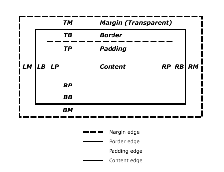
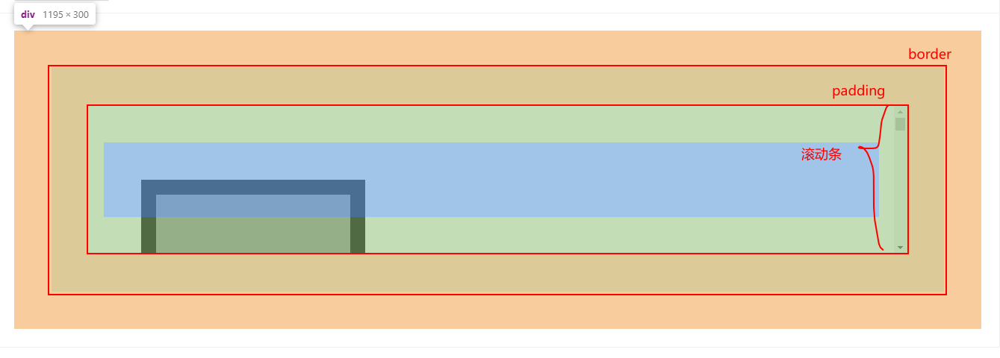
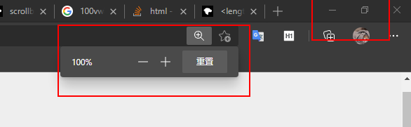
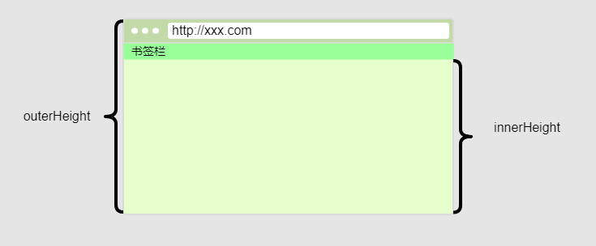
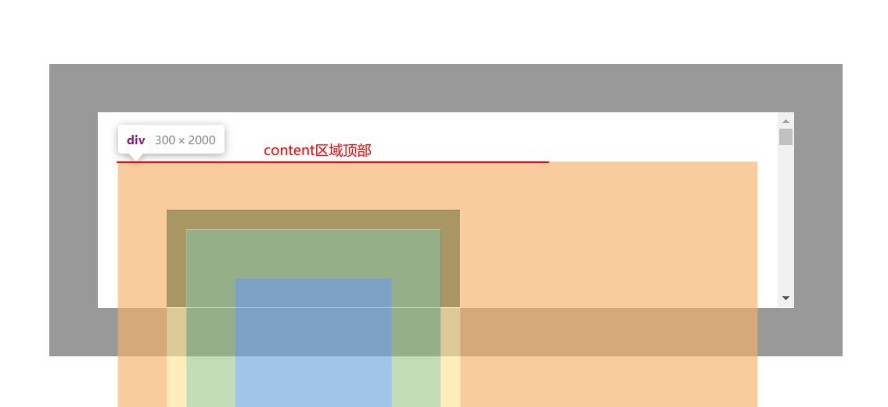
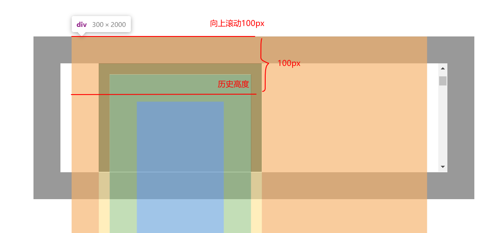
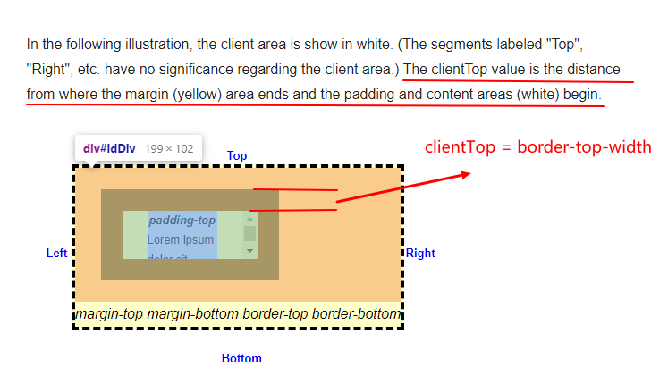
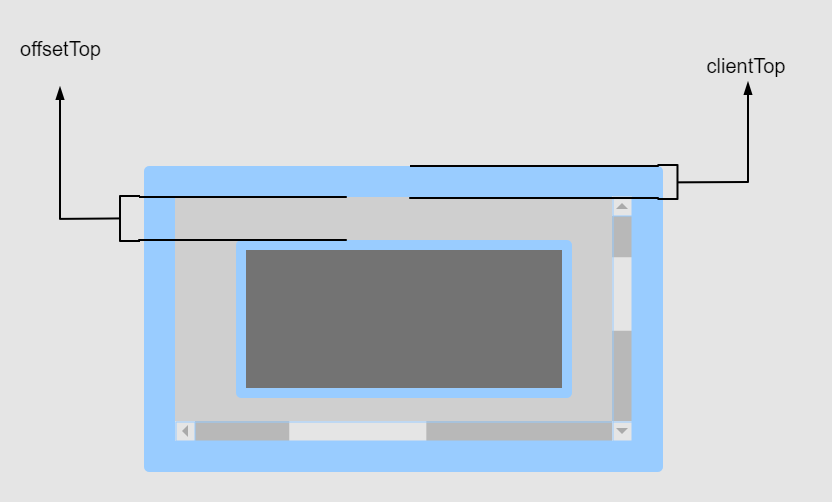

## 盒模型



## scrollbar

元素的滚动条是嵌入在`padding`和`border`之间的元素，滚动条的厚度会影响元素`content`区域的大小。

对于使用`webkit`作为排版引擎的浏览器（Chrome，Safari），可以使用`::-webkit-scrollbar`来定义**滚动槽**的样式，如果通过`::-webkit-scrollbar`指定`width`则是垂直滚动条的宽度，如果指定`height`则是元素水平滚动条的高度。

其他属性还有：

- `::-webkit-scrollbar-button` — 滚动条上的按钮 (上下箭头).
- `::-webkit-scrollbar-thumb` — 滚动条上的滚动滑块.
- `::-webkit-scrollbar-track` — 滚动条轨道.
- `::-webkit-scrollbar-track-piece` — 滚动条没有滑块的轨道部分.
- `::-webkit-scrollbar-corner` — 当同时有垂直滚动条和水平滚动条时交汇的部分.

<code src="@/demo/boxmodel/scrollbar" inline />



## 几种 height 的区别

### window.innerHeight

表示浏览器视口高度像素值，包括水平方向滚动条的高度，不包括浏览器 UI 组件（地址栏，书签栏等），会随着浏览器窗口的缩放比例，以及浏览器本身调节窗口大小而改变。



### window.outerHeight

整个浏览器的高度，包括地址栏，书签栏等部分，且不会随着浏览器缩放比例或者浏览器标签页大小改变而改变，所以这是一个**固定**值。



### scrollHeight **readonly**

元素内容区域的整体高度，包括溢出父元素的隐藏区域；包含元素的`padding`部分，不包含`border`，`margin`以及水平方向滚动条的高度，如果有伪元素`::before`，`::after`等，也会包含在内。


### clientHeight **readonly**

```javascript
CSS height + CSS padding - 水平方向滚动条高度
```

包含元素的`padding`部分，不包含`border`，`margin`以及水平方向滚动条的高度。

根元素`html`的`clientHeight`就是`viewport`的高度，也不包含水平方向滚动条高度。


### offsetHeight **readonly**

包含元素`padding`，`border`和水平滚动条高度，不包含`margin`，伪元素的高度。


## Top

### top

`top`用于 CSS 元素设置位置顶部偏移量。

- `position:static`（初始值）：无效果
- `position:relative`：元素`margin box`相对于其正常流布局位置的顶部偏移量，在正常流布局中，块级盒子会在父元素的`padding box`内部从左往右从上往下放置。
- `position:absolute`：子元素的`margin box`相对于最近的非`position:static`的父元素的`border box`的党部偏移量
- `position:fixed`：子元素的`margin box`相对于视口顶部的偏移量，如果有`iframe`则是相对于`iframe`内部的视口

### scrollTop **writeable**

获取或**设置**一个父元素的`content`区域顶部垂直向上滚动的高度，同理`scrollLeft`也是这样的原理。需要注意以下两点：

- `scrollTop`作用在父元素上，也就是产生滚动条的元素，一般其`overflow`属性不为`visible`
- `scrollTop`表示`content`区域顶部向上滚动的像素数，不要管什么可见不可见的问题

<code src="@/demo/boxmodel/scrollTop" inline />





### clientTop **readonly**

`clientTop`表示元素本身`border-top-width`加上顶部滚动条厚度，如果没有滚动条就是顶部`border`的宽度。如果也没有`border`，那就是`0`。



### offsetTop **readonly**

`offsetTop`是一个相对距离，表示元素自身顶部`border`外边缘到`offsetParent`顶部`border`内边缘的距离。`offsetParent`就是最近的父元素。


