## padding

`padding`一共有四个方向值：

- `padding-top`
- `padding-right`
- `padding-bottom`
- `padding-left`

`padding`的颜色值跟随内容区域的`background`，无法设置自己的颜色。

`padding`的值可以设置成`<length>`里的值，例如 PC 常用的`px`；

`padding`也可以设置成百分比值，设置成百分比值是相对于父元素**内容的宽度**，需要正确理解这里的内容宽度指的是父元素内容区域`content`的宽度，也就是受到`box-sizing`的影响

```css
/* box-sizing:content-box */
content width = width;

/* box-sizing:border-box */
content width = width - padding width;
```

<code src="@/demo/boxmodel/percentPD" inline />

## margin

### px

最常见的`px`，正值表示远离相邻元素，负值表示与相邻元素拉近，可能发生重叠。

### 负 margin

`margin-top/margin-left`被赋予负值时，该**元素自身**将向设置 margin 负值的方向进行平移

```css
/*向上平移10px*/
#main {
  margin-top: -10px;
}

/*向左平移10px*/
#main {
  margin-left: -10px;
}
```

当设置`margin-bottom/right`为负数，**会对负值`margin`方向的相邻元素产生影响**；`margin-bottom`会使后续元素上移，而`margin-right`会使后续元素左移

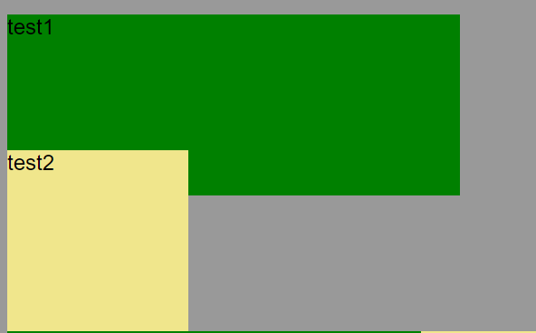

```html
<style>
  #test1 {
    width: 500px;
    height: 200px;
    margin-bottom: -50px;
    background: green;
  }

  #test2 {
    width: 200px;
    height: 200px;
    background: khaki;
  }
</style>

<div id="test1"></div>
<div id="test2"></div>
```

### 百分比

> The size of the margin as a percentage, relative to the _width_ of the containing block——**取决于其包含块的宽度**

我们来看一个例子，圣杯布局中`margin-left:-100%`的使用；当我们用 float 来定位三栏以后，布局大致呈现如下

```html
<style>
  #main > article {
    float: left;
    width: 100%;
    background: #ffeebb;
  }

  #main > nav {
    float: left;
    width: 200px;
    background: #dddd88;
  }

  #main > aside {
    float: left;
    width: 200px;
    background: #dddd88;
  }
</style>

<div id="main">
  <article>
    article
  </article>
  <nav>
    nav <br />nav <br />nav <br />nav <br />nav <br />nav <br />nav <br />nav
    <br />nav <br />
  </nav>
  <aside>
    aside
  </aside>
</div>
```

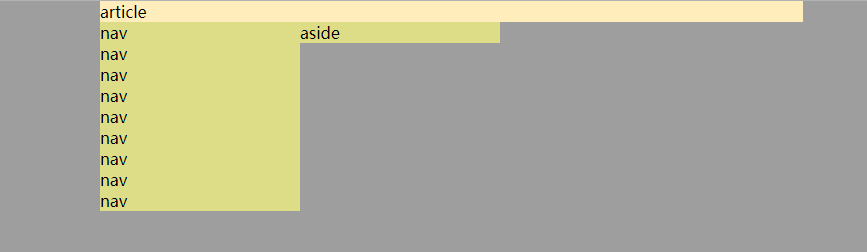

我们使用`margin-left:-100%`将左侧栏提升到和中间区域同一高度的位置；由于百分比的含义是**相对于包含容器的宽度的百分比值来计算的**，所以`margin-left:-100%`表示左侧栏整体向左偏移包含块的宽度，而由于主体部分宽度为`width:100%`占据容器全部宽度，所以剩余部分就给了左栏

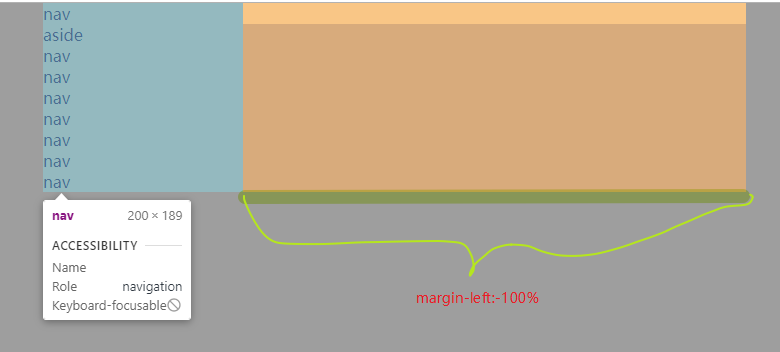

### auto

设置块级元素的 `width` 可以防止它从左到右撑满整个容器。然后你就可以设置左右外边距为 `auto` 来使其水平居中

```css
#main {
  max-width: 600px; //避免在小屏幕上出现滚动条
  margin: 0 auto;
}
```

在`flex`项上使用可以让`flex`项居右，远离相邻的`flex`项

```css
.last {
  margin-left: auto;
}
```

### margin 失效

- `table-*`
- 行内元素，左右有效，上下无效
- `float`影响
- 绝对定位元素`position:absolute`和`position:fixed`
- margin 重叠现象

> 解决方法

- `padding`代替
- `table-*`可以用边框属性

```css
border-collapse: separate;
border-spacing: 5px; //指定边框距离，相当于margin了，值也能是上，右，下，左四个值
```

## border

`border`是`border-width`，`border-style`，`border-color`三个属性的缩写

```css
border: 1px solid #f0f0f0; //细灰色边框常用值
```

### border-width

`border-width`可以设置两种值

#### 单位具体值

遵循上右下左的顺序，分别是`border-top`，`border-right`，`border-bottom`，`border-left`

```css
/* 当给定两个宽度时，该宽度分别依次作用于选定元素的横边与纵边 */

border-width: 2px 1.5em;
```

#### 关键字

| 关键字   | 实例                                                                 | 说明     |
| -------- | -------------------------------------------------------------------- | -------- |
| `thin`   | 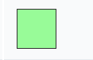 | 细边线   |
| `medium` | 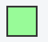 | 中等边线 |
| `thick`  | 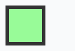 | 宽边线   |

### border-style

语法上只支持关键字，默认值是`none`

| 值       | 样式                                                                 | 含义                                                                                                                                                                                                 |
| -------- | -------------------------------------------------------------------- | ---------------------------------------------------------------------------------------------------------------------------------------------------------------------------------------------------- |
| `none`   | 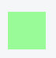 | 默认值，不显示边框。在单元格边框重叠情况下，`none` 值优先级最低，意味着如果存在其他的重叠边框，则会显示为那个边框。                                                                                  |
| `hidden` |  | 和关键字 `none` 类似，不显示边框。优先级最高                                                                                                                                                         |
| `dotted` | 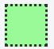 | 显示为一系列圆点。标准中没有定义两点之间的间隔大小，视不同实现而定。圆点半径是 [`border-width`](https://developer.mozilla.org/zh-CN/docs/Web/CSS/border-width) 计算值的一半。                        |
| `dashed` | 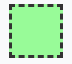 | 显示为一系列短的方形虚线。标准中没有定义线段的长度和大小，视不同实现而定。                                                                                                                           |
| `solid`  | 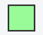 | 显示为一条实线。                                                                                                                                                                                     |
| `double` | 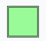 | 显示为一条双实线，宽度是 [`border-width`](https://developer.mozilla.org/zh-CN/docs/Web/CSS/border-width) 。                                                                                          |
| `groove` | 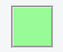 | 显示为有雕刻效果的边框，样式与 `ridge` 相反。                                                                                                                                                        |
| `ridge`  | 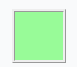 | 显示为有浮雕效果的边框，样式与 `groove` 相反。                                                                                                                                                       |
| `inset`  | 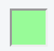 | 显示为有陷入效果的边框，样式与 `outset` 相反。当它指定到 [`border-collapse`](https://developer.mozilla.org/zh-CN/docs/Web/CSS/border-collapse) 为 `collapsed` 的单元格时，会显示为 `groove` 的样式。 |
| `outset` |  | 显示为有突出效果的边框，样式与 `inset` 相反。当它指定到 [`border-collapse`](https://developer.mozilla.org/zh-CN/docs/Web/CSS/border-collapse) 为 `collapsed` 的单元格时，会显示为 `ridge` 的样式。   |

<code src="@/demo/boxmodel/border" inline />

### border-color

也是上右下左四个值组成

## border-radius

设置边框圆角，同样是四个值的缩写， [左上角-`border-top-left-radius`](https://developer.mozilla.org/zh-CN/docs/Web/CSS/border-top-left-radius)、[右上角-`border-top-right-radius`](https://developer.mozilla.org/zh-CN/docs/Web/CSS/border-top-right-radius)、[右下角-`border-bottom-right-radius`](https://developer.mozilla.org/zh-CN/docs/Web/CSS/border-bottom-right-radius)，和 [左下角-`border-bottom-left-radius`](https://developer.mozilla.org/zh-CN/docs/Web/CSS/border-bottom-left-radius)

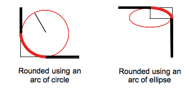

- `border-radius`的值是这么来定义的，使用圆形半径或者椭圆半径来确定这个圆形效果，所以[`border-top-left-radius`](https://developer.mozilla.org/zh-CN/docs/Web/CSS/border-top-left-radius)、[`border-top-right-radius`](https://developer.mozilla.org/zh-CN/docs/Web/CSS/border-top-right-radius)、[`border-bottom-right-radius`](https://developer.mozilla.org/zh-CN/docs/Web/CSS/border-bottom-right-radius)，和 [`border-bottom-left-radius`](https://developer.mozilla.org/zh-CN/docs/Web/CSS/border-bottom-left-radius)这四个属性都可以由两个值或者一个值来组成；简写成`border-radius`后的组合就非常多

| 值                          | 解释                                                   |
| --------------------------- | ------------------------------------------------------ |
| `border-radius: 30px;`      | 定义圆形半径或椭圆的半长轴，半短轴                     |
| `border-radius: 10% / 50%;` | 水平半轴相对于盒模型的宽度；垂直半轴相对于盒模型的高度 |

```css
border-radius: 1em/5em;

/* 等价于： */

border-top-left-radius: 1em 5em;
border-top-right-radius: 1em 5em;
border-bottom-right-radius: 1em 5em;
border-bottom-left-radius: 1em 5em;

border-radius: 4px 3px 6px / 2px 4px;

/* 等价于： */

border-top-left-radius: 4px 2px;
border-top-right-radius: 3px 4px;
border-bottom-right-radius: 6px 2px;
border-bottom-left-radius: 3px 4px;
```

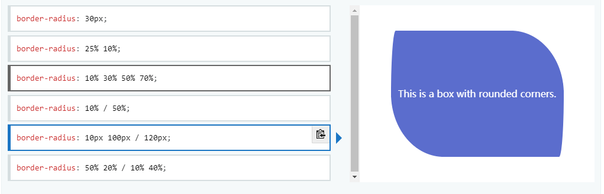

#### 需要注意这么几点

- 即使元素没有边框，圆角也可以用到 [`background`](https://developer.mozilla.org/zh-CN/docs/Web/CSS/background) 上面，具体效果受 [`background-clip`](https://developer.mozilla.org/zh-CN/docs/Web/CSS/background-clip) 影响
- 当 [`border-collapse`](https://developer.mozilla.org/zh-CN/docs/Web/CSS/border-collapse) 的值为 `collapse` 时，`border-radius` 属性不会被应用到表格元素`display:table-cell`上

## box-shadow

设置盒子的阴影；该属性是五个值的缩写，x 偏移量 | y 偏移量 | 阴影模糊半径 | 阴影扩散半径 | 阴影颜色

```css
box-shadow: 2px 2px 2px 1px rgba(0, 0, 0, 0.2);
```

| 值         | 描述                                     |
| :--------- | :--------------------------------------- |
| _h-shadow_ | 必需。水平阴影的位置。允许负值。         |
| _v-shadow_ | 必需。垂直阴影的位置。允许负值。         |
| _blur_     | 可选。模糊距离。                         |
| _spread_   | 可选。阴影的尺寸。                       |
| _color_    | 可选。阴影的颜色。请参阅 CSS 颜色值。    |
| inset      | 可选。将外部阴影 (outset) 改为内部阴影。 |

### 常用值

```css
box-shadow: 0 2px 8px #f0f1f2;
```
