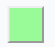

## content

### background

`background`这个属性可以说是 CSS 里最繁琐的，包含了一系列乱七八糟的其他属性。

### background-attachment

`background-attachment`这个属性决定元素背景图像是跟随滚动条滚动还是一直固定显示在背景中。

- `scroll`：**默认值**，表示背景相对于元素本身固定，不会随元素本身的滚动条滚动
- `fixed`：表示背景相对于视口固定，即只会跟随页面整体的滚动条滚动，这也是移动端常用的窗口下广告的实现方法之一。
- `local`：表示背景相对于元素的内容固定，背景将会随着元素的内容滚动。如果元素本身没有溢出的子元素，这个值的效果和`scroll`是一样的。

<code src="@/demo/boxmodel/ba" inline />

### background-color

`background-color`设置元素的背景颜色值。

- `transparent`：默认值，透明
- [`<color>`](https://developer.mozilla.org/zh-CN/docs/Web/CSS/color_value)

### background-image

`background-image`为一个元素设置一个或者**多个背景图像**。在绘制时，**先指定的图像会在之后指定的图像上面绘制**，然后按照`z`轴负方向堆叠。需要注意的是。不过需要注意的是这种堆叠绘制的方式并非真的是`z-index`那样的图层关系，它们始终还是在一个图层上。

<iframe frameborder="0" height="360" src="https://interactive-examples.mdn.mozilla.net/pages/css/background-image.html" width="100%" loading="lazy"></iframe>

关于`border`，`background-image`和`background-color`的绘制关系如下：


### background-clip

`background-clip` 设置元素的背景（背景图片或颜色）是否延伸到到`border box`、`padding box`或者只显示在`content-box`里面。

`background-clip`可以设置以下四种值：

- `border-box`：**默认值**，表示`background-image`和`background-color`对`border`生效，但是位于`border`下方，也就是会被`border`本身的`color`或者`image`覆盖
- `padding-box`：表示`background-image`和`background-color`只会对`padding box`内部的内容生效
- `content-box`：表示`background-image`和`background-color`限制在`content-box`内部
- `text`：实验性功能，当文字`color:transparent`透明的时候，`background-image`和`background-color`只会作为内容区域文字的背景

<iframe width="100%" height="360" frameborder="0" src="https://interactive-examples.mdn.mozilla.net/pages/css/background-clip.html" loading="lazy"></iframe>

### background-origin

`background-origin`设置背景的起始坐标点，其具有以下三个属性值：

- `border-box`：表示背景相对于`border`开始绘制，即从`border`左上角开始
- `padding-box`：**默认值**，表示背景相对于`padding`开始绘制
- `content-box`：表示背景相对于`content`区域开始绘制

当`background-attachment:fixed`的时候，也就是背景固定显示在视口内，`background-origin`的设置无效。

<iframe width="100%" height="400" frameborder="0" src="https://interactive-examples.mdn.mozilla.net/pages/css/background-origin.html" loading="lazy"></iframe>

### background-position

`background-position`设置每一个背景图片的初始位置，但是相对于`background-origin`设置的起始点。

`background-position`只能使用方位值[`<position>`](https://developer.mozilla.org/en-US/docs/Web/CSS/position_value)，可以设置`1~4`个值。

#### 一个值

- `center`：使背景居中
- `top`, `left`, `bottom`, `right`：这些值单个出现时，另一方位的值将自动设为`50%`，也就是在这些方向上自动具有居中效果
- [`length`](https://developer.mozilla.org/en-US/docs/Web/CSS/length) 或 [`percentage`](https://developer.mozilla.org/en-US/docs/Web/CSS/percentage)的单个值相对于左边缘的 X 坐标，并将 Y 坐标设置为 50％

#### 两个值

- 如果其中一个值是`left`或者`right`，则其表示水平方向，另一个值表示垂直方向；如果其中一个值是`top`或者`bottom`，则其表示垂直方向，另一个值表示水平方向
- 如果两个值都是长度单位或者百分比，则第一个值表示水平方向，第二个值表示垂直方向

#### 四个值

第一个和第三个值是方位关键字`top`, `left`, `bottom`, `right`，定义水平方向和垂直方向的位置；第二个和第四个值分别用来对应第一个和第三个定义的方位上的位置偏移量。

- 例如，如果第一个值是`left`或者`right`，则其表示水平方向，那么第三个值设置的偏移量就是在水平方向的偏移量；如果第一个值是`top`或者`bottom`，那么第三个值设置的偏移量就是在垂直方向的偏移量

<iframe width="100%" height="360" frameborder="0" src="https://interactive-examples.mdn.mozilla.net/pages/css/background-position.html" loading="lazy"></iframe>

## padding

`padding`一共有四个方向值：

- `padding-top`
- `padding-right`
- `padding-bottom`
- `padding-left`

`padding`的颜色值跟随内容区域的`background`，无法设置自己的颜色。

`padding`的值可以设置成`<length>`里的值，例如 PC 常用的`px`；

`padding`也可以设置成百分比值，设置成百分比值是相对于父元素**内容的宽度**，需要正确理解这里的内容宽度指的是父元素内容区域`content`的宽度，也就是受到`box-sizing`的影响

```css
/* box-sizing:content-box */
content width = width;

/* box-sizing:border-box */
content width = width - padding width;
```

<code src="@/demo/boxmodel/percentPD" inline />

## margin

### px

最常见的`px`，正值表示远离相邻元素，负值表示与相邻元素拉近，可能发生重叠。

### 负 margin

`margin-top/margin-left`被赋予负值时，该**元素自身**将向设置 margin 负值的方向进行平移

```css
/*向上平移10px*/
#main {
  margin-top: -10px;
}

/*向左平移10px*/
#main {
  margin-left: -10px;
}
```

当设置`margin-bottom/right`为负数，**会对负值`margin`方向的相邻元素产生影响**；`margin-bottom`会使后续元素上移，而`margin-right`会使后续元素左移


```html
<style>
  #test1 {
    width: 500px;
    height: 200px;
    margin-bottom: -50px;
    background: green;
  }

  #test2 {
    width: 200px;
    height: 200px;
    background: khaki;
  }
</style>

<div id="test1"></div>
<div id="test2"></div>
```

### 百分比

> The size of the margin as a percentage, relative to the _width_ of the containing block——**取决于其包含块的宽度**

我们来看一个例子，圣杯布局中`margin-left:-100%`的使用；当我们用 float 来定位三栏以后，布局大致呈现如下

```html
<style>
  #main > article {
    float: left;
    width: 100%;
    background: #ffeebb;
  }

  #main > nav {
    float: left;
    width: 200px;
    background: #dddd88;
  }

  #main > aside {
    float: left;
    width: 200px;
    background: #dddd88;
  }
</style>

<div id="main">
  <article>
    article
  </article>
  <nav>
    nav <br />nav <br />nav <br />nav <br />nav <br />nav <br />nav <br />nav
    <br />nav <br />
  </nav>
  <aside>
    aside
  </aside>
</div>
```


我们使用`margin-left:-100%`将左侧栏提升到和中间区域同一高度的位置；由于百分比的含义是**相对于包含容器的宽度的百分比值来计算的**，所以`margin-left:-100%`表示左侧栏整体向左偏移包含块的宽度，而由于主体部分宽度为`width:100%`占据容器全部宽度，所以剩余部分就给了左栏


### auto

设置块级元素的 `width` 可以防止它从左到右撑满整个容器。然后你就可以设置左右外边距为 `auto` 来使其水平居中

```css
#main {
  max-width: 600px; //避免在小屏幕上出现滚动条
  margin: 0 auto;
}
```

在`flex`项上使用可以让`flex`项居右，远离相邻的`flex`项

```css
.last {
  margin-left: auto;
}
```

### margin 失效

- `table-*`
- 行内元素，左右有效，上下无效
- `float`影响
- 绝对定位元素`position:absolute`和`position:fixed`
- `margin collapse`

> 解决方法

- `padding`代替
- `table-*`可以用边框属性

```css
border-collapse: separate;
border-spacing: 5px; //指定边框距离，相当于margin了，值也能是上，右，下，左四个值
```

## border

`border`是`border-width`，`border-style`，`border-color`三个属性的缩写

```css
border: 1px solid #f0f0f0; //细灰色边框常用值
```

### border-width

`border-width`可以设置两种值

#### 单位具体值

遵循上右下左的顺序，分别是`border-top`，`border-right`，`border-bottom`，`border-left`

```css
/* 当给定两个宽度时，该宽度分别依次作用于选定元素的横边与纵边 */

border-width: 2px 1.5em;
```

#### 关键字

| 关键字   | 实例                                                                 | 说明     |
| -------- | -------------------------------------------------------------------- | -------- |
| `thin`   |  | 细边线   |
| `medium` |  | 中等边线 |
| `thick`  |  | 宽边线   |

### border-style

语法上只支持关键字，默认值是`none`

| 值       | 样式                                                                 | 含义                                                                                                                                                                                                 |
| -------- | -------------------------------------------------------------------- | ---------------------------------------------------------------------------------------------------------------------------------------------------------------------------------------------------- |
| `none`   |  | 默认值，不显示边框。在单元格边框重叠情况下，`none` 值优先级最低，意味着如果存在其他的重叠边框，则会显示为那个边框。                                                                                  |
| `hidden` |  | 和关键字 `none` 类似，不显示边框。优先级最高                                                                                                                                                         |
| `dotted` |  | 显示为一系列圆点。标准中没有定义两点之间的间隔大小，视不同实现而定。圆点半径是 [`border-width`](https://developer.mozilla.org/zh-CN/docs/Web/CSS/border-width) 计算值的一半。                        |
| `dashed` |  | 显示为一系列短的方形虚线。标准中没有定义线段的长度和大小，视不同实现而定。                                                                                                                           |
| `solid`  |  | 显示为一条实线。                                                                                                                                                                                     |
| `double` |  | 显示为一条双实线，宽度是 [`border-width`](https://developer.mozilla.org/zh-CN/docs/Web/CSS/border-width) 。                                                                                          |
| `groove` |  | 显示为有雕刻效果的边框，样式与 `ridge` 相反。                                                                                                                                                        |
| `ridge`  |  | 显示为有浮雕效果的边框，样式与 `groove` 相反。                                                                                                                                                       |
| `inset`  |  | 显示为有陷入效果的边框，样式与 `outset` 相反。当它指定到 [`border-collapse`](https://developer.mozilla.org/zh-CN/docs/Web/CSS/border-collapse) 为 `collapsed` 的单元格时，会显示为 `groove` 的样式。 |
| `outset` |  | 显示为有突出效果的边框，样式与 `inset` 相反。当它指定到 [`border-collapse`](https://developer.mozilla.org/zh-CN/docs/Web/CSS/border-collapse) 为 `collapsed` 的单元格时，会显示为 `ridge` 的样式。   |

<code src="@/demo/boxmodel/border" inline />

### border-color

也是上右下左四个值组成，属性值可以是 CSS `<color>`值，如果不设置的话，默认是黑色。

## border-radius

`border-radius`使用圆形半径或者椭圆半径来确定这个圆形效果，其值依然由四部分组成：

- 左上角：[`border-top-left-radius`](https://developer.mozilla.org/zh-CN/docs/Web/CSS/border-top-left-radius)
- 右上角：[`border-top-right-radius`](https://developer.mozilla.org/zh-CN/docs/Web/CSS/border-bottom-right-radius)
- 右下角：[`border-bottom-right-radius`](https://developer.mozilla.org/zh-CN/docs/Web/CSS/border-bottom-right-radius)
- 左下角：[`border-bottom-left-radius`](https://developer.mozilla.org/zh-CN/docs/Web/CSS/border-bottom-left-radius)

### border-\*-radius

这里的每个`border-*-radius`都具有额外的两个属性值用来定义四个方向上椭圆的`1/4`部分的半径，所以各自都又具有两个属性值：

- 椭圆的`1/4`部分的水平方向的半径值
- 垂直方向的半径值，如果这个值被忽略则自动继承自水平方向的半径值，也就是半角形状将会是圆形


关于几个不同方向的`border-*-radius`的值，需要注意以下几点：

- 如果两个值其中一个为`0`则半角的形状将会是正方形，等于这个属于没起作用
- 如果水平方向指定的是**百分比值**，则相对于元素自身`border box`的`width`；如果垂直方向上指定的是百分比值，则相对于元素自身`border box`的`height`

<code src="@/demo/boxmodel/borderRadius" />

### border-radius

`border-radius`的缩写形式有以下两种：

1. 使用`/`分隔的两个值，斜线前的值代表四个方向水平方向上的半径值，斜线后的值代表四个方向垂直方向上的半径值

2. 如果没有斜线分割，则表示值同时设置水平方向和垂直方向的半径值，此时的语法格式为四值语法，顺序分别代表`top-left`, `top-right`, `bottom-right`, `bottom-left`，需要注意这种多值的顺序：

- 如果`bottom-left`忽略，则值和`top-right`一致；
- 如果`bottom-right`忽略，则值和`top-left`一致
- 如果`top-right`忽略，则值和`top-left`一致

<code src="@/demo/boxmodel/borderRadius1" inline/>

#### 需要注意这么几点

- 即使元素没有`border`，圆角也可能应用到 [`background`](https://developer.mozilla.org/zh-CN/docs/Web/CSS/background) 上面，具体效果受 [`background-clip`](https://developer.mozilla.org/zh-CN/docs/Web/CSS/background-clip) 影响
- 当 [`border-collapse`](https://developer.mozilla.org/zh-CN/docs/Web/CSS/border-collapse) 的值为 `collapse`（相邻的单元格共用同一条边框） 时，`border-radius` 属性不会被应用到表格元素`display:table-cell`上。

## box-shadow

设置盒子的阴影；该属性是五个值的缩写，x 偏移量 | y 偏移量 | 阴影模糊半径 | 阴影扩散半径 | 阴影颜色

```css
box-shadow: 2px 2px 2px 1px rgba(0, 0, 0, 0.2);
```

| 值         | 描述                                     |
| :--------- | :--------------------------------------- |
| _h-shadow_ | 必需。水平阴影的位置。允许负值。         |
| _v-shadow_ | 必需。垂直阴影的位置。允许负值。         |
| _blur_     | 可选。模糊距离。                         |
| _spread_   | 可选。阴影的尺寸。                       |
| _color_    | 可选。阴影的颜色。请参阅 CSS 颜色值。    |
| inset      | 可选。将外部阴影 (outset) 改为内部阴影。 |

### 常用值

```css
box-shadow: 0 2px 8px #f0f1f2;
```
