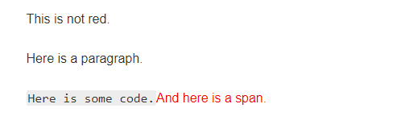

## 选择器的类别

| 选择器                                                                                         | 示例                         | 学习 CSS 的教程                                                                                                                                             |
| :--------------------------------------------------------------------------------------------- | :--------------------------- | :---------------------------------------------------------------------------------------------------------------------------------------------------------- |
| [元素选择器](https://developer.mozilla.org/zh-CN/docs/Web/CSS/Type_selectors)                  | `h1 { }`                     | [元素选择器](https://developer.mozilla.org/zh-CN/docs/user:chrisdavidmills/CSS_Learn/CSS_Selectors/Type_Class_and_ID_Selectors#Type_selectors)              |
| [通配选择器](https://developer.mozilla.org/zh-CN/docs/Web/CSS/Universal_selectors)             | `* { }`                      | [通配选择器](https://developer.mozilla.org/zh-CN/docs/user:chrisdavidmills/CSS_Learn/CSS_Selectors/Type_Class_and_ID_Selectors#The_universal_selector)      |
| [类选择器](https://developer.mozilla.org/zh-CN/docs/Web/CSS/Class_selectors)                   | `.box { }`                   | [类选择器](https://developer.mozilla.org/zh-CN/docs/user:chrisdavidmills/CSS_Learn/CSS_Selectors/Type_Class_and_ID_Selectors#Class_selectors)               |
| [ID 选择器](https://developer.mozilla.org/zh-CN/docs/Web/CSS/ID_selectors)                     | `#unique { }`                | [ID 选择器](https://developer.mozilla.org/zh-CN/docs/user:chrisdavidmills/CSS_Learn/CSS_Selectors/Type_Class_and_ID_Selectors#ID_Selectors)                 |
| [属性选择器](https://developer.mozilla.org/zh-CN/docs/Web/CSS/Attribute_selectors)             | `a[title] { }`               | [标签属性选择器](https://developer.mozilla.org/zh-CN/docs/User:chrisdavidmills/CSS_Learn/CSS_Selectors/Attribute_selectors)                                 |
| [伪类选择器](https://developer.mozilla.org/zh-CN/docs/Web/CSS/Pseudo-classes)                  | `div::-webkit-scrollbar { }` | [伪类](https://developer.mozilla.org/zh-CN/docs/User:chrisdavidmills/CSS_Learn/CSS_Selectors/Pseuso-classes_and_Pseudo-elements#What_is_a_pseudo-class)     |
| [伪元素选择器](https://developer.mozilla.org/zh-CN/docs/Web/CSS/Pseudo-elements)               | `div::after { }`             | [伪元素](https://developer.mozilla.org/zh-CN/docs/User:chrisdavidmills/CSS_Learn/CSS_Selectors/Pseuso-classes_and_Pseudo-elements#What_is_a_pseudo-element) |
| [后代选择器](https://developer.mozilla.org/zh-CN/docs/Web/CSS/Descendant_combinator)           | `article p`                  | 会递归选择所有子元素，不需要有严格的父子关系                                                                                                                |
| [子代选择器](https://developer.mozilla.org/zh-CN/docs/Web/CSS/Child_combinator)                | `article > p`                | 只选择直接子元素，即需要严格的父子关系                                                                                                                      |
| [相邻兄弟选择器](https://developer.mozilla.org/zh-CN/docs/Web/CSS/Adjacent_sibling_combinator) | `h1 + p`                     | 当第二个元素**紧跟在**第一个元素之后，并且两个元素都是属于同一个父元素的子元素时，则第二个元素将被选中                                                      |
| [通用兄弟选择器](https://developer.mozilla.org/zh-CN/docs/Web/CSS/General_sibling_combinator)  | `h1 ~ p`                     | 元素都是属于同一个父元素的子元素，位置无须紧邻                                                                                                              |

### 子代选择器和后代选择器的区别

- 后代选择器，使用一个或多个空格作为分隔符；会递归选择所有子元素，不需要有严格的父子关系

```html
div span { background-color: DodgerBlue; }

<div>
  <span
    >Span 1.
    <span>Span 2.</span>
  </span>
</div>
<span>Span 3.</span>
```

- 子代选择器，使用`>`作为分隔符；只选择直接子元素，即需要严格的父子关系

```html
div > span { background-color: DodgerBlue; }

<div>
  <span
    >Span 1. In the div.
    <span>Span 2. In the span that's in the div.</span>
  </span>
</div>
<span>Span 3. Not in a div at all</span>
```


### 兄弟选择器

- 使用`~`作为两个选择器的连接符
- 位置无须紧邻，只须同层级

```html
p ~ span { color: red; }

<span>This is not red.</span>
<p>Here is a paragraph.</p>
<code>Here is some code.</code>
<span>And here is a span.</span>
```



### 相邻兄弟选择器

- 使用`+`将两个选择器连接起来
- 当第二个元素**紧跟在**第一个元素之后，并且两个元素都是属于同一个父元素的子元素时，则第二个元素将被选中

```css
/* 图片后面紧跟着的段落将被选中 */
img + p {
  font-style: bold;
}
```

### 伪类和伪元素

- 伪类时使用**单冒号**的关键字，用于当已有元素处于的某个状态时，为其添加对应的样式；比如根据用户行为变化时改变样式（`:hover`）


- 伪元素是**双冒号**的关键字，用于创建一些不在文档树中的元素，并为其添加样式
- 一些早期的伪元素曾使用单冒号的语法，现代的浏览器为了保持后向兼容，支持早期的带有单双冒号语法的伪元素


## 选择器的优先级

### CSS 的特点

- 层叠/级联：层叠表示 CSS 属性值的计算可能来自多个源文件，有相应的层叠算法来计算最终采用什么属性值

  - 浏览器自带的==用户代理样式表==
  - 网页==开发者定义的样式表==
  - 网页的用户还可以通过浏览器插件==自定义样式表==

  | 优先级升序 | 来源                      | 重要程度     |
  | :--------- | :------------------------ | ------------ |
  | 1          | UA                        | 普通         |
  | 2          | 用户                      | 普通         |
  | 3          | 页面作者                  | 普通         |
  | 4          | CSS 动画                  | 见下节       |
  | 5          | 用户代理                  | `!important` |
  | 6          | 页面作者                  | `!important` |
  | 7          | 用户                      | `!important` |
  | 8          | css 过渡(css transitions) |              |

- 优先级：浏览器是根据选择器优先级来决定当多个规则有不同选择器对应相同的元素的时候需要使用哪个规则

- 继承：某些父元素的样式会被子元素继承，如`color`，`font`等

### 选择器的优先级

- **通配选择符**（universal selector）（[`*`](https://developer.mozilla.org/zh-CN/docs/Web/CSS/Universal_selectors)）**关系选择符**（combinators）（[`+`](https://developer.mozilla.org/zh-CN/docs/Web/CSS/Adjacent_sibling_combinator), [`>`](https://developer.mozilla.org/zh-CN/docs/Web/CSS/Child_combinator), [`~`](https://developer.mozilla.org/zh-CN/docs/Web/CSS/General_sibling_combinator), ['``'](https://developer.mozilla.org/en-US/docs/Web/CSS/Descendant_combinator), [`||`](https://developer.mozilla.org/zh-CN/docs/Web/CSS/Column_combinator)）和 **否定伪类**（negation pseudo-class）（[`:not()`](https://developer.mozilla.org/zh-CN/docs/Web/CSS/:not)）对优先级没有影响，但是，在 `:not()` 内部声明的选择器会影响优先级

- 一个选择器的优先级可以说是由四个部分相加 (分量)
  1. 千位： 如果声明在 `style` 的属性（**内联样式**）则该位得一分。这样的声明没有选择器，所以它得分总是 1000。
  2. 百位： 选择器中包含**ID**选择器则该位得一分。
  3. 十位： 选择器中包含**类选择器、属性选择器或者伪类**则该位得一分，除了否定伪类`:not()`
  4. 个位：选择器中包含**元素、伪元素**选择器则该位得一分。

```css
内联style > id > class,[attribute],伪类 > 元素标签，伪元素
```

- `!important`规则会覆盖任何其他样式选择，包括内联样式；使用`!important`的选择器之间也具有优先级
