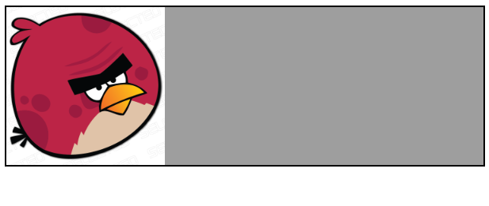

### 怪异模式

> [wiki - 怪异模式](<[https://zh.wikipedia.org/wiki/%E6%80%AA%E5%BC%82%E6%A8%A1%E5%BC%8F](https://zh.wikipedia.org/wiki/怪异模式)>)

怪异模式是现代浏览器的渲染引擎为了兼容早期一些不按规范设计的网页而使用的一种渲染模式。

#### 区分怪异模式

浏览器会根据 HTML 文档头部的文档类型定义标签`<!DOCTYPE>`来决定使用何种模式来渲染网页，这里`<!DOCTYPE>`是不严格区分大小写的。

- 无论是使用标准的 HTML4.0 还是 HTML5.0 的声明方式，都会采用标准模式来渲染网页，都如此：

```html
<!-- HTML4 -->
<!DOCTYPE html PUBLIC "-//W3C//DTD HTML 4.01//EN" "http://www.w3.org/TR/html4/strict.dtd">

<!-- 没有系统标识 -->
<!DOCTYPE html PUBLIC "-//W3C//DTD HTML 4.01//EN">
```

```html
<!-- HTML5 -->
<!DOCTYPE html>
```

- 而如果使用的是 HTML4.0 的宽松声明方式，Chrome，IE 等会使用**有限标准模式**来渲染网页

```html
<!DOCTYPE html PUBLIC "-//W3C//DTD HTML 4.01 Transitional//EN" "http://www.w3.org/TR/html4/loose.dtd">
```

- 如果**未使用任何`<!DOCTYPE>`声明**或者`<!DOCTYPE>`声明的方式不符合标准形式，缺少必要属性等，浏览器就会使用怪异模式来渲染网页：

```html
<!-- 例如 -->
<!DOCTYPE html PUBLIC>

<!DOCTYPE html PUBLIC "-//W3C//DTD HTML 4.01 Transitional//EN">
```

- IE6 版本之前的 IE 浏览器，如果在`<!DOCTYPE>`声明之前有一个 XML 声明，不管是否指定完整的 DOCTYPE，它就会以怪异模式渲染一个页面

```html
<?xml version="1.0" encoding="utf-8"?>
<!DOCTYPE html PUBLIC "-//W3C//DTD XHTML 1.0 Strict//EN" "http://www.w3.org/TR/xhtml1/DTD/xhtml1-strict.dtd">
```

- 在 IE9 版本以前，如果 DOCTYPE 之前有任何语句，包括注释语句，怪异模式仍然将会触发

```html
<!-- This comment will put IE 6, 7, 8, and 9 in quirks mode -->
<!DOCTYPE html PUBLIC "-//W3C//DTD HTML 4.01//EN" "http://www.w3.org/TR/html4/strict.dtd">
```

#### 怪异模式和标准模式的区别

##### IE 盒模型缺陷

在 HTML 4 和 CSS 之前，很少 HTML 元素既支持 border 也支持 padding，所以对一个元素的宽度和高度的定义并不是很有争议，当时也只是非常少浏览器供应商严格地实施了 W3C 盒模型。

**在 IE6 版本及以前**，IE 浏览器也没有按照标准的 W3C 规定的盒模型来呈现元素尺寸，它是把内容，内边距（padding）和边框（border）全部包括在一个指定的宽度或高度之内。在 IE6 版本及以后，则尽在怪异模式的网页中如此计算盒模型，标准模式则是使用 W3C 的规范标准盒模型。

```shell
width = content width + padding + border;

size = width + margin;
```


##### 图片的垂直对齐

标准模式和怪异模式下，浏览器对块级元素内部的图片的行高`line-height`处理不同：

- 怪异模式下，块级元素内部的图片将对齐至包含它们的盒子的下边框；



- 而在标准模式下，块级元素内部的图片将对齐至基线，也就是图片下面可能留有空白部分。


- 而在使用有限标准模式的网页中，`table-cell`内部的图片也将使用怪异模式的方式去处理，下方没有任何空白。

```html
<!DOCTYPE html PUBLIC "-//W3C//DTD HTML 4.01 Transitional//EN" "http://www.w3.org/TR/html4/loose.dtd">

<div
  id="box"
  style="display: table-cell; border: 2px solid; background: #9e9e9e;"
>
  
</div>
```


### 盒模型

> [box model](https://www.w3.org/TR/CSS22/box.html)

CSS 的盒模型描述了如何从 DOM 元素生成一个一个的矩形盒子，并通过视觉格式模型进行布局。

#### 标准盒模型

CSS 标准盒模型由四个区域组成，每个区域都可细分为`top`，`right`，`bottom`，`left`四个方向，并且对应四个不同的属性来控制：

- 内容区域`content`，对应`content box`内容区域的宽高取决于几个因素：
  - 元素的`width`和`height`属性
  - 盒子是否包含文本或者其它盒子
  - 盒子是否是`display:table`
- 围绕内容区域的`padding`区域，`padding`区域组成`padding box`，由`padding`属性定义，也叫做内边距
- 围绕`padding`的`border`区域，的`border`区域组成`border box`，由`border`属性定义，也叫做边框
- `border`外层的`margin`，`margin`区域组成`margin box`，由`margin`属性定义，也叫做外边距


`content`， `padding`，`border`这些区域的背景取决于当前元素的`background`CSS 属性，`border`区域的样式还可使用`border`CSS 属性来定义；而`margin`则始终是透明的区域。

而行内元素的占用空间尺寸由`line-height`决定，对行内元素设置`line-height`指的是其内部每行文字的高度，而对块级元素设置`line-height`也指的是其内部行内元素的行高，例如下面两种设置`line-height`的方式是等价的

```html
<div id="box" style="line-height:100px">
  <!--  -->
  <span id="word"
    >测试测试测试测试测试测试测试测试测试测试测试测试测试测试测试测试测试测试测试测试测试测试测试测试</span
  >
</div>
```

```html
<div id="box">
  <!--  -->
  <span id="word" style="line-height:100px"
    >测试测试测试测试测试测试测试测试测试测试测试测试测试测试测试测试测试测试测试测试测试测试测试测试</span
  >
</div>
```


#### 怪异盒模型

怪异盒模型来源于 IE 盒模型缺陷问题，在 IE6 版本以前的大多数浏览器，包括 IE，NetScape 等对盒模型计算尺寸时，对通过`width`设置的块级元素，将其内容宽度 content width，padding，border 三者的和作为`width`来看，也就是相比实际的标准盒模型，计算出来的盒模型的尺寸要小。

```shell
size = width + margin;
```

这种模式在一些不看重`padding`和`border`属性的场景是很方便的，但是如果你对一个元素同时设置了`width`，`padding`和`border`属性时，就要特别小心这时候的`width`并不会只看作内容区域的宽度，实际内容区域的宽度只占：

```shell
content width = width - (padding + border);
```


#### box-sizing

CSS3 引入了`box-sizing`属性，使得开发者可以使用`box-sizing`改变盒子模型的尺寸计算方式，以满足不同场景的业务需求。

#### content-box

> 默认值：`box-sizing:content-box`

`content-box`采用的是标准盒子模型，遵循标准盒模型的尺寸计算方式：

```shell
size = content width + padding + border + margin;
```

#### border-box

`box-sizing:border-box`，是将元素的`padding`，`border`的值计算在`width`内：

```shell
width = content width + padding + border;

size = width + margin;
```

对于`width:auto`和 `height:auto`这样的长度属性值，并不会受到`box-sizing`属性的影响；这时候的`width`和`height`设置的始终是`content`的宽度和高度。

### collapsed margin

> [Collapsing margins](https://www.w3.org/TR/CSS22/box.html#collapsing-margins)

在 CSS 中，相邻的两个或者多个盒子（可能不是兄弟节点关系）之间会合并形成一个边距，这种现象称为`collapsed margin`，翻译过来就是外边距折叠，外边距重叠等。

尤其注意的一点是只有垂直方向上的`margin`才会产生折叠的现象，水平方向并不会。

最常见的情况就是相邻的两个`display:block`的`<div>`放在一起就会产生边距重叠的现象：

```jsx
/**
 * desc: 打开devtool，鼠标移入即可观察margin折叠的现象
 */

import React from 'react';
import Comp from '@/demo/collapsemargin';

export default () => <Comp />;
```

还有一种情况是父子之间的块级元素也会产生外边距折叠：

```jsx
/**
 * desc: 这里不仅内部子元素之间产生了外边距重叠，子元素和父元素之间的上下 margin 也重叠在了一起
 */

import React from 'react';
import { Comp2 } from '@/demo/collapsemargin';

export default () => <Comp2 />;
```

#### 解决方式

解决`margin`重叠的方式包括以下几种：

- `float`的元素和其他元素之间不会发生外边距折叠
- `position:absolute`或者`position:fixed`的绝对定位元素其他元素之间不会发生外边距折叠
- `display:inline-block`的元素其他元素之间不会发生外边距折叠
- 内部创建了块级格式化上下文（BFC）的父元素（例如`float`或者`overflow`的值不为默认值`visible`）和子元素之间不会发生外边距折叠
- 创建了 BFC 的父元素内部的子元素不会和其它不在当前包含块内的块级元素发生外边距折叠

虽然`float`，绝对定位的元素可以解决外边距折叠的问题，但是一般不推荐使用，因为`float`，绝对定位的元素脱离了正常流布局，需要配合`top`等定位属性一起使用才行。

如果要解决相邻元素的边距重叠问题，可以将其中一个元素放在创建了块格式化上下文的父元素内部：

```jsx
import React from 'react';
import { Comp5 } from '@/demo/collapsemargin';

export default () => <Comp5 />;
```

而如果要解决父元素和子元素之间的外边距重叠，可以使用`overflow:auto/hidden`或者`display:flow-root`给父元素内部创建新的 BFC，注意这时候只能解决父元素和子元素之间的外边距重叠，而内部子元素之间的外边距折叠仍然无法解决。

```jsx
/**
 * desc: 这里子元素和父元素之间没有了外边距重叠，但是内部子元素上下 margin 还是重叠在一起
 */

import React from 'react';
import { Comp3 } from '@/demo/collapsemargin';

export default () => <Comp3 />;
```

所以还是可以继续为其中一个子元素添加`display:inline-block`

```jsx
/**
 * desc: 这里子元素和父元素之间没有了外边距重叠，但是内部子元素上下 margin 还是重叠在一起
 */

import React from 'react';
import { Comp4 } from '@/demo/collapsemargin';

export default () => <Comp4 />;
```

这里有一个知乎上的讨论链接：如何解决外边距叠加的问题？ - 知乎 https://www.zhihu.com/question/19823139

从讨论的结果上来看就是不要对一个块级元素同时使用上下方向的`margin`，相邻元素设置相同方向上的`margin`，然后配合父元素的`padding`也能解决问题

```jsx
import React from 'react';
import { Comp6 } from '@/demo/collapsemargin';

export default () => <Comp6 />;
```
