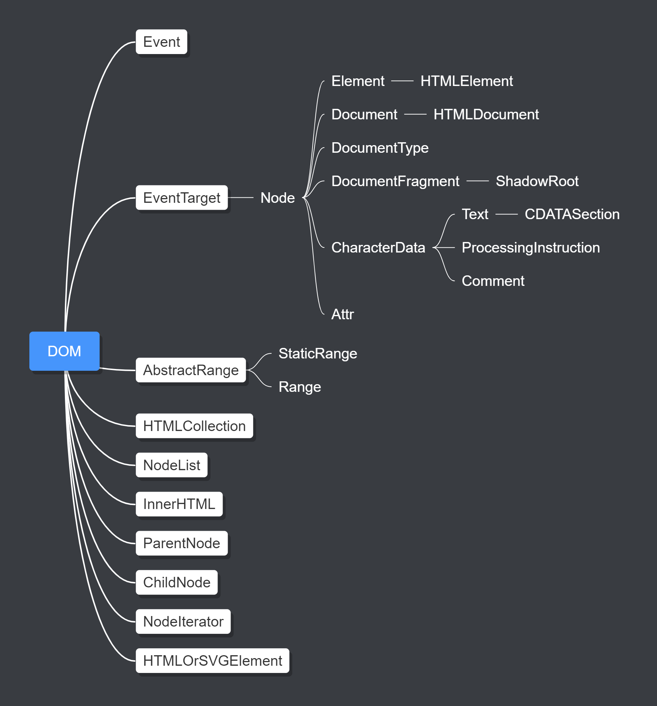
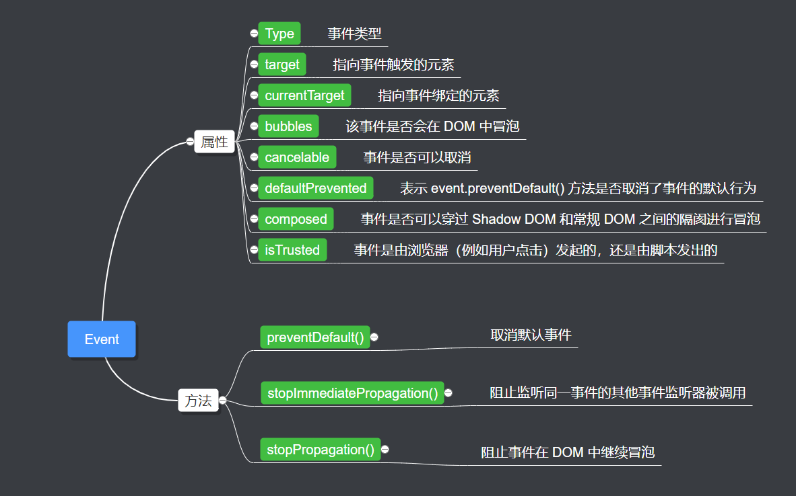

## Event

`Event`，提供事件接口，所有的 DOM 事件都会直接或者间接继承该接口，例如`InputEvent`，`MouseEvent`等；当事件触发的时候，事件会被分配到`EventTarget`上。

## EventTarget

`EventTarget`就是事件触发的对象，例如实现`Element`接口的 DOM 元素都可以作为`EventTarget`，`EventTarget`提供了两个重要的事件监听的方法。
