## 进程和线程

### 进程

进程：Process，是程序在计算机中执行的一个或多个实例。当用户点击运行应用程序时，就会产生一个进程，同一个程序可以产生多个进程。

- 首先，系统会从硬盘读取应用程序文件，将其加载到内存中去，此时进程状态是“等待”；
- 进程会等待系统调度的切换，当切换到自身时其状态就会变成"正在执行"；之前运行的进程要么也变成等待状态，要么直接关闭；
- 如果运行的进程需要系统资源，例如等待用户输入或者文件打开，那么状态会变成“已阻止”；
- 进程被关闭，则系统会回收资源，删除进程或者状态变成“已终止”。

每个 CPU 核心任何时间内仅能运行一项进程。操作系统会基于多任务处理的机制交错执行多个进程，虽然 CPU 核心同一时间只能运行一个进程，但是多任务处理机制使得 CPU 核心能自由切换正在执行的多个进程。现代 CPU 多使用在[多核](https://en.wikipedia.org/wiki/Multi-core_processor)配置中组合了两个或更多独立处理器，并且可以同时执行多个进程。另有一种称为[同时多线程的](https://en.wikipedia.org/wiki/Simultaneous_multithreading)技术（例如 Intel 的[超线程](https://en.wikipedia.org/wiki/Hyper-threading)技术）可以模拟多个进程或线程的同时执行。

大部分操作系统都会阻止进程之间直接通信，这是为了各个应用程序之间的安全性；进程之间如果要想进行通信，必须共享部分地址空间或者使用 IPC（interprocess communication）。

### 线程

线程：Thread，是操作系统能够运行和调度的最小单位，它们包含在进程中。

进程虽然是程序运行的实例，但是在进程中真正运行的是线程，进程可以认为是线程的容器，为线程提供内存等系统资源；同一进程中的所有线程之间可以共享系统分配给进程的所有资源，但是各个线程也有自己的调用栈，自己的寄存器环境，自己的线程本地存储，线程之间运行需要协作同步，它们经常会共享数据。

### 多进程和多线程

- 多进程之间一般不会相互影响，所以当一个进程崩溃时，其它进程完全不受影响，这样稳定性和安全性更好；
- 多进程需要消耗更多的计算机系统资源；
- 同一进程里的多个线程之间会相互影响，当某一个线程出错时，将会导致整个进程的崩溃；
- 在 CPU 只有一个核心的时候，线程执行效率高于进程，但是多核 CPU 多进程的执行效率更高

## 浏览器的工作进程

### Chromium

Chromium 是一个开放源代码的浏览器项目，旨在为所有用户提供一种更安全，更快，更稳定的方式来体验网络。了解 Chrome 其实就是在了解 Chromium，因为 Chrome 所提供的基础功能几乎全部来自于 Chromium。

| Compare  | Chrome                                                                                                                                                      | Chromium                                                      |
| -------- | ----------------------------------------------------------------------------------------------------------------------------------------------------------- | ------------------------------------------------------------- |
| 是否开源 | 闭源                                                                                                                                                        | 以 BSD 许可协议开源                                           |
| 隐私性   | 会自动收集信息并将其传输给 Google，例如崩溃报告，使用情况统计信息，设备操作系统等                                                                           | 不会自动收集浏览器的崩溃信息，也不会收集用户信息              |
| 稳定性   | 更胜一筹                                                                                                                                                    |                                                               |
| 更新机制 | 会自动下载并安装更新                                                                                                                                        | 需要手动下载和安装补丁                                        |
| 拓展     | 除了基本的免费编解码器：Opus，Theora，Vorbis，VP8，VP9 和 WAV，还集成了 flash，支持播放 H.264 编码的视频，支持专有媒体格式 AAC，H.264 和 MP3 的许可编解码器 | 只支持基本免费编解码器：Opus，Theora，Vorbis，VP8，VP9 和 WAV |

### Chromium 的多进程架构

> [Multi-process Architecture](https://www.chromium.org/developers/design-documents/multi-process-architecture)

Chromium 采用的是多进程架构，在启动的时候就会开启多个进程来完成页面的渲染和其它一些任务。

| 进程                     | 说明                                                                                                                                                            |
| ------------------------ | --------------------------------------------------------------------------------------------------------------------------------------------------------------- |
| 浏览器主进程             | 浏览器的主进程包括 UI 线程，例如地址栏，书签栏，前进后退按钮等；<br />负责用户交互；<br />负责管理其他子进程；<br />同时还包含提供存储功能的存储线程            |
| Network Service 网络进程 | 负责网络请求，例如页面资源文件 HTML，JS，CSS 的加载；网络进程本来是浏览器主进程的一个线程，但是后来独立成为一个进程                                             |
| 渲染进程                 | 渲染进程主要负责浏览器的每一个标签页里面内容呈现，Chrome 的 Blink 引擎和 V8 引擎都是工作在这个进程的，Blink 负责解析 HTML 和 CSS 以及页面渲染等；V8 负责执行 JS |
| GPU 进程                 | GPU 的使用初衷是为了实现 3D CSS 的效果，随后 Chrome 也使用 GPU 来绘制浏览器的 UI 框架                                                                           |
| 多个插件进程             | 每个插件都是独立运行在单独的进程中                                                                                                                              |
| V8 代理解析工具          | 解析 PAC，PAC 是一种网页浏览器技术，用于定义浏览器该如何自动选择适当的代理服务器来访问一个网址，也就是翻墙                                                      |

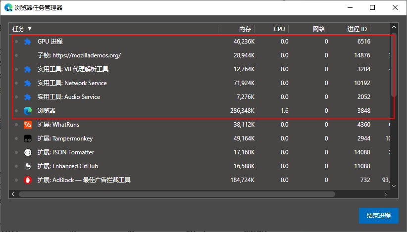

### 不同的渲染进程模式

实际上 Chromium 在渲染页面的时候支持使用不同的进程模型来开启渲染进程，默认情况下 Chromium 对用户访问的网站的每个实例使用单独的 OS 进程（也就是一个标签页就是一个进程）；但是用户仍然可以指定命令行开关选择其它模型。

> [Process Models](https://www.chromium.org/developers/design-documents/process-models)

- `site`：Chrome 定义`site`的方式是协议`scheme`和主机名称`hostname`，并且包含子域名和端口号，例如 mail.google.com 和 docs.google.com，或者 google.com 和 google.com:8080 都属于相同的`site`；这是为了不同子域名的页面或站点端口不同的页面能够通过 Javascript 相互访问；
- Process-per-site-instance：默认情况下 Chrome 会为`site`的每一个实例开启一个进程，也就是打开一个链接地址就开启一个进程，这种方式的好处是隔离不同站点也隔离了同一站点的不同页面，即使是同一个站点的内容，如果在一个页面中填写表单崩溃，也不会影响到同站点的另一个页面；但是这种方式也带来更高操作系统内存占用；
- Process-per-site：同一个`site`的所有实例都放到一个渲染进程中；
- Process-per-tab：每一个选项卡是一个单独的渲染进程；
- Single process：更简单了，就一个渲染进程搞定所有页面。

### 多进程架构的优劣

- 最重要的两点是多进程保证网页访问的稳定性和安全性，即使是同一个网站，当开启不同页面时，使用多进程的方式为每个页面单独打开一个进程，也能保证足够的页面稳定性！不仅如此，页面的 JS 文件，浏览器插件等也很容易让页面发生崩溃，如果将插件和每个页面都单独放置在一个进程内，由于进程之间相互独立，即使一个进程崩溃也不会影响其他进程运行，并且进程之间无法直接通信，这样既保证稳定性又保证安全性；
- 从开发角度看，多进程之间通信比较困难；从用户角度看，多进程模式很容易造成操作系统内存占用提高

## 从 URL 到页面的渲染流程

个人感觉这是一道涉及完整计算机网络知识，计算机操作系统，编译原理，并展开到浏览器工作原理的题目，如果放开了说，十年之内可能一个 web 工程师的主要任务就是研究这一道题。

> [Inside look at modern web browser (part 2)](https://developers.google.com/web/updates/2018/09/inside-browser-part2?hl=en) > [How Chromium Displays Web Pages](https://www.chromium.org/developers/design-documents/displaying-a-web-page-in-chrome)
>
> [浏览器的工作原理](https://www.html5rocks.com/zh/tutorials/internals/howbrowserswork/)
>
> [浏览器工作原理与实践](https://time.geekbang.org/column/intro/216)

### 渲染页面前的处理工作

#### 处理输入

当用户在地址栏键入 URL 时，UI 线程会判断这是一个网络地址还是搜索查询的内容，

- 如果是搜索内容，UI 线程会根据浏览器的默认搜索引擎合成搜索 URL；
- 如果是一个域名，UI 线程会判断是否要为域名添加协议等内容组成一个完整的 URL；

#### 开始导航

当用户输完 URL 键入回车键以后，UI 线程可能还需要向当前标签页的渲染进程确定当前页面是否定义了`beforeunload`处理程序，通常在表单输入页面会提示离开页面而没有保存数据的警告，如果此时用户取消了导航的请求，那么以后的流程就都不会发生了。这是一种特殊情况。

当页面没有`beforeunload`事件处理程序或者用户同意导航以后，UI 线程就进入等待状态，加载动画会显示在标签页的一角，同时将内容或者 URL 地址告知网络进程来处理。

网络进程会通过 DNS 解析，TCP 三次握手或者 SSL 握手等步骤来建立和服务器的连接，然后浏览器就可以和服务器之间通过 HTTP 协议交换数据。

#### 处理缓存

网络进程在收到 URL 请求以后，会查找本地缓存是否缓存了该资源，如果有缓存资源，则直接返回资源给浏览器进程；

#### 请求资源

如果网络进程没有找到本地缓存的资源，那么就会发起网络请求的流程，包括使用 DNS 解析域名获取 IP 地址，通过“三次握手”与服务器之间建立 TCP 连接，如果使用了 HTTPS，还需要进行一次 SSL 的握手过程等。在使用 TCP 建立建立以后，浏览器和服务器就能通过 HTTP 协议来互相发送数据了。

#### 读取响应

当网络进程收到服务器发来的 HTTP 报文时，会首先判断响应状态码，如果是`301`，`302`，`307`之类的重定向响应，网络进程还会根据响应头部的`Location`字段再次发起重定向请求新的 URL。

如果是`200`等请求成功的响应，网络进程会根据 HTTP 响应首部字段的`Content-Type`字段区分数据的类型，根据不同的数据类型，需要以后执行不同的操作。

- 以 HTML 文档为例，`Content-Type`会是`content-type: text/html; charset=utf-8`，则网络进程接下来会将请求到的 HTML 文件交给渲染进程去处理。
- 而如果是`application/octet-stream`之类的下载资源文件，网络进程就会提交下载请求到浏览器的下载管理器。

此过程还会检查[跨域资源的请求](https://www.chromium.org/Home/chromium-security/corb-for-developers)以及网站域名是否安全——[safebrowsing](https://safebrowsing.google.com/)。

#### 查找渲染进程

当网络进程请求完数据以后，会告诉浏览器主进程的 UI 线程所有数据准备完毕，UI 线程会判断使用已有的标签页的渲染进程去渲染网页，还是重新开启一个渲染进程。

由于网络请求会耗费时间，通常 UI 线程在获取用户输入的 URL 以后，就会尝试主动寻找或开启一个渲染进程，也就是和网络进程同步进行。

#### 提交文档

当准备好渲染进程以后，UI 线程会通知网络进程将数据交给渲染进程，在渲染进程接收数据以后，在通知 UI 线程已经获取渲染的代码数据等；然后 UI 线程会会更新浏览器界面状态，包括了安全状态、地址栏的 URL、前进后退的历史状态，标签页的 session 历史记录等。

### 渲染进程工作流程

浏览器呈现网页主要是通过浏览器的渲染进程来处理，此过程是将 HTML，JS，CSS 等文件转换为交互的网页的过程，其中**渲染进程还包括主线程（Main thread），工作线程（Worker threads），合成线程（Compositor thread）和光栅线程（Raster thread）**等。**主线程负责处理 HTML，CSS，JS 等大部分代码的解析和执行**，如果在 JS 使用了 web worker 或者 service worker，部分 JS 代码还会被工作线程处理，合成和光栅线程主要负责更高效，流畅地呈现页面。


#### 解析

##### DOM 解析

DOM，document object model，文档对象模型，是 HTML 在浏览器中的数据形式，同时也为 JS 交互提供了相应的 API。

渲染进程会先解析 HTML 生成 DOM，在 HTML 中嵌入的 CSS，JS，``等其他资源会按顺序请求，HTML 解析器会向网路进程提交下载请求获取网络资源。

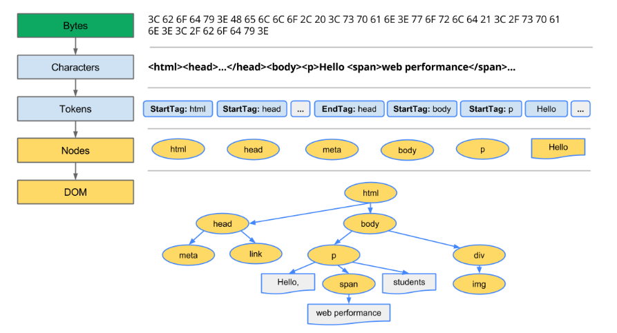

##### CSS 解析

在 HTML 的解析过程中，如果遇到 CSS 样式文件，或者`style`标签，**会开始解析 CSS，同时 HTML 解析也会继续进行**；CSS 的解析过程

就是将 CSS 样式表代码转换成 CSSOM 对象结构的过程。

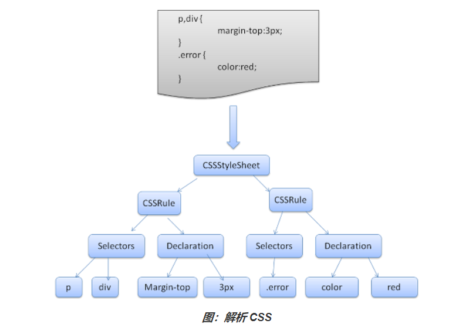

- 每个浏览器都提供一组默认样式（也称为“User Agent 样式”），网页开发者有一套样式，浏览器用户也可以通过插件自定义自己的样式，通常，UA 声明是重要程度最低的，而用户只有将该声明标记为“重要”才可以替换网页作者的声明

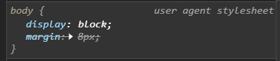

- 样式表解析完毕后，会根据标签名创建一个哈希表对象，如果选择器是`id`，规则就会添加到 ID 表中，`id`作为键；如果选择器是类，规则就会添加到类表中，`class`作为键，此外还有标签、伪类作为键的。

##### JS 解析

如果在 HTML 的解析过程中遇到`<script>`标签，分为以下三种情况：

- 没有`defer`和`async`属性，渲染进程停止 DOM 解析的过程，而去等待 JS 文件的加载，解析并执行完，因为 JS 有操作修改 DOM 的接口，渲染引擎需要根据 JS 的执行去合并 DOM 的解析过程；

- 使用了`defer`属性，不会阻塞 DOM 解析，如果是外部脚本，JS 文件会先提交网络进程去请求资源，但是不会执行；将在文档完成解析后，触发 `DOMContentLoaded` 事件前执行，也就是说`defer`的 JS 会阻塞`DOMContentLoaded`事件执行；

- 使用了`async`属性，不会阻塞 DOM 解析，如果是外部脚本，JS 文件会提交网络进程去请求资源，加载完然后就会开始执行；在执行脚本时，其他线程会解析文档的其余部分；异步脚本可能在 `DOMContentLoaded` 触发之前或之后执行，不会影响`DOMContentLoaded`的执行；但是`async`的 JS 一定在 `load` 触发之前执行。

而如果在 JS 执行过程中，还操作了 CSS，或者使用到了某个``文件，那么 JS 还会去等待 CSS 解析完成，或者图片加载完成，这是因为 CSSOM 对象必须创建完成，才能被 JS 获取到，这样才能发生样式修改等后续 JS 操作。所以 CSS 本身不会阻塞 DOM 生成，但是 CSS 可能因为 JS 执行而阻塞 DOM 生成。

##### DOMContentLoaded

- 当初始的 HTML 被完全加载和解析完成之后，`DOMContentLoaded`事件被触发，而无需等待样式表、图像和子框架的完全加载；**`DOMContentLoaded`事件必须等待其所属 script 之前的样式表加载解析完成才会触发**
- `defer`的 JS 会在`DOMContentLoaded`之前执行
- `async`的 JS 不会影响`DOMContentLoaded`执行

```javascript
document.addEventListener('DOMContentLoaded', function() {
  console.log('3 seconds passed');
});
```

#### 构建呈现树

构建呈现树（render tree）的过程就是计算每个 DOM 节点最终应用的样式，将 CSSOM 和 DOM 合并成一个渲染树。

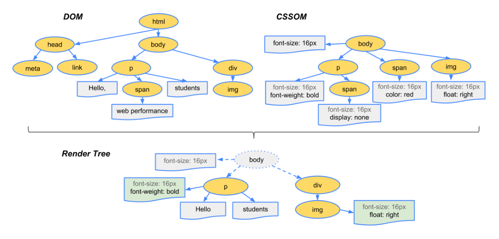

##### 计算样式

计算 DOM 节点的样式需要根据 CSS 的继承和层叠规则来进行，一个 DOM 节点的样式可以来源于以下方面：

- 元素的 `style` 属性内嵌的 CSS
- 页面`<style>`内嵌的 CSS
- 页面`<link>`引入的 CSS
- 浏览器的用户代理样式
- 继承自父节点的样式

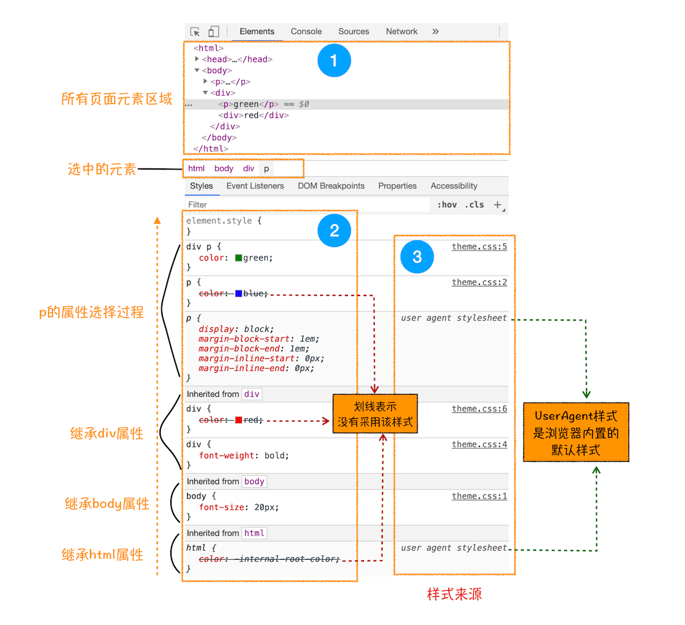

而 CSS 层叠规则是 CSS 的核心，定义了如何合并来自多个源的属性值的算法，这些属性值经过计算最终会得到一个[计算值](https://developer.mozilla.org/zh-CN/docs/Web/CSS/computed_value)，此过程会做以下处理：

- 处理特殊的值，例如`inherit`，`initial`，`unset`等；
- 将相对值转换成绝对值，例如`em`或者 百分比长度等，会转换成具体的`px`
- 处理`color`，`color:red`将转换成具体的 RGB 值；

在 JS 中可以使用`Window.getComputedStyle(element)`这个 API，这个方法返回一个元素的所有 CSS 属性值的对象。

##### 创建 render tree

从 DOM 树的根节点开始遍历每个可见节点，**非可视化的 DOM 元素不会插入呈现树中**，例如`<head>`，`<script>`元素，如果元素的属性值为`display: none`，那么也不会显示在呈现树中（但是 `visibility : hidden` 元素会显示），所以呈现树和 DOM 树并非一一对应的。匹配算法会遍历 DOM 节点的各个属性，例如`id`，`class`等，然后根据这些属性去 CSSOM 的哈希表里找到对应的样式，然后再根据层叠顺序和选择器优先级进行排序。

#### 布局

##### 布局计算

布局计算过程需要计算每个元素在视口内的确切位置和尺寸；此部分就要根据 CSS 的盒模型来处理了。

##### 分层

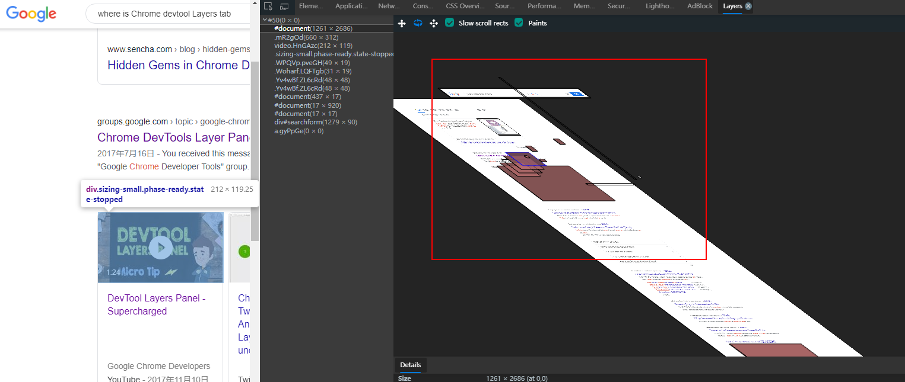

- 布局是一个递归的过程，会从渲染树的根元素开始，然后从父元素到子元素一层层进行
  1.  父呈现器确定自己的宽度
  2.  父呈现器依次处理子元素在自己的内部坐标
  3.  父呈现器根据子呈现器的累加高度以及边距和补白的高度来设置自身高度，此值也可供父呈现器的父呈现器使用

#### 绘制

- 根据布局计算的位置坐标和尺寸信息，调用操作系统的 Graphics API 进行画面绘制
- 绘制的顺序通常如下
  1.  背景颜色
  2.  背景图片
  3.  边框
  4.  子代
  5.  轮廓

#### 合成

- 当页面元素发生重叠时，需要合成绘制的画面，并且动画的绘制也是多个画面合成的结果

## 页面渲染过程中的事件

### DOMContentLoaded

- 当初始的 HTML 被完全加载和解析完成之后，`DOMContentLoaded`事件被触发，而无需等待样式表、图像和子框架的完全加载；**`DOMContentLoaded`事件必须等待其所属 script 之前的样式表加载解析完成才会触发**
- `defer`的 JS 会在`DOMContentLoaded`之前执行
- `asyncd`的 JS 不会影响`DOMContentLoaded`执行

```javascript
document.addEventListener('DOMContentLoaded', function() {
  console.log('3 seconds passed');
});
```

### load

- 当整个页面及所有依赖资源如样式表和图片都已完成加载时，触发`load`事件

```javascript
window.addEventListener('load', event => {
  console.log('page is fully loaded');
});

window.onload = event => {
  console.log('page is fully loaded');
};
```

### beforeunload

- 当浏览器窗口关闭或者刷新时，会触发`beforeunload`事件
- 该事件经常用作编辑文档时提示窗口关闭，网页能够触发一个确认对话框，询问用户是否真的要离开该页面；但是需要注意阻止默认的浏览器事件`preventDefault`

```javascript
window.addEventListener('beforeunload', event => {
  // Cancel the event as stated by the standard.
  event.preventDefault();
  // Chrome requires returnValue to be set.
  alert('确认离开当前页面吗?');
});
```

### unload

- 页面或者`iframe`窗口正在被关闭时触发

```javascript
window.addEventListener('unload', function(event) {
  console.log('I am the 3rd one.');
});
```

### readystatechange

> document.readyState，描述了文档的加载状态

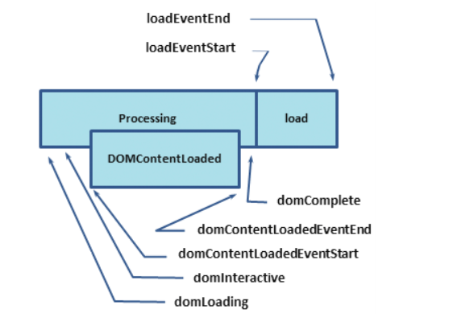

- `loading`：正在加载
- `interactive`：浏览器完成对所有 HTML 的解析，DOM 元素可以访问，但是图像，样式表等资源可能还在加载，接下来会触发`DOMContentLoaded`事件
- `complete`：文档和所有子资源已完成加载，接下来就会触发`load`事件

> 使用`readystatechange`可以实现其他 DOM 事件

```javascript
// 模拟 DOMContentLoaded/ jquery ready
document.onreadystatechange = function() {
  if (document.readyState === 'interactive') {
    initApplication();
  }
};
```

```javascript
// 模拟 load 事件
document.onreadystatechange = function() {
  if (document.readyState === 'complete') {
    initApplication();
  }
};
```

## 渲染引擎对 HTML 的容错进制

> [error handling and strange cases in the parser](https://html.spec.whatwg.org/multipage/parsing.html#an-introduction-to-error-handling-and-strange-cases-in-the-parser)

根据 HTML 的规范，HTML 解析器必须具有一些容错机制，至少可以处理以下情况的错误

1.  内部不能添加的元素，例如`p`内部不能添加`div`，这时候会直接结束`p`标签，直到内部`div`元素出现，再把`p`标签添加进去，渲染出来的结果如下图所示

```html
<p>
	<div class="child"></div>
</p>
```

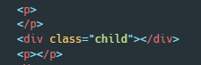

2.  遗漏某些元素，会被自动添加，例如`html`根元素，`head`，`body`，`tbody`，`tr`，`td`，`li`
3.  如果在一个表单元素中又放入了另一个表单，那么第二个表单将被忽略
4.  DOM 树有一个最大的深度`512`，超过这个最大深度就会把它子元素当作父无素的同级节点
5.  对于自定义的标签，默认不带有任何样式，且是一个行内元素
6.  如果没有`<!DOCTYPE html>`声明，文档解析会使用`Quirks Mode`怪异模式；怪异模式会模拟 IE，同时 CSS 解析会比较宽松，例如数字单位可以省略；怪异模式下`input`和`textarea`的盒模型会变成`border-box`，也就是计算盒模型的实际宽高会发生变化，将是`width`=`margin`+`padding`+`border`+`content width`

## 渲染模式

浏览器的渲染引擎会采用一些不同的渲染模式以兼容渲染过去 HTML 发展过程中和现代规范不同的网页，其中标准模式时用来针对现行的 HTML5 规范，而有限标准模式和怪异模式都是针对以前的网页。

渲染引擎会根据 HTML 的 DTD 声明形式`<!DOCTYPE>`来判断采用何种渲染模式，不同的渲染模式可能导致些许网页最终呈现上的差异，这些差异主要来源于 DOM 解析以及布局过程中。

### 标准模式

使用标准的 HTML4.0 或者 HTML5.0 的声明方式，都会采用标准模式来渲染网页，如此：

```html
<!-- HTML4 -->
<!DOCTYPE html PUBLIC "-//W3C//DTD HTML 4.01//EN" "http://www.w3.org/TR/html4/strict.dtd">

<!-- 没有系统标识 -->
<!DOCTYPE html PUBLIC "-//W3C//DTD HTML 4.01//EN">
```

```html
<!-- HTML5 -->
<!DOCTYPE html>
```

### 有限标准模式

如果使用的是 HTML4.0 的宽松声明方式，Chrome，IE 等会使用**有限标准模式**来渲染网页

```html
<!DOCTYPE html PUBLIC "-//W3C//DTD HTML 4.01 Transitional//EN" "http://www.w3.org/TR/html4/loose.dtd">
```

### 怪异模式

> [wiki - 怪异模式](<[https://zh.wikipedia.org/wiki/%E6%80%AA%E5%BC%82%E6%A8%A1%E5%BC%8F](https://zh.wikipedia.org/wiki/怪异模式)>)
>
> [wahtwg - Quirks Mode](https://quirks.spec.whatwg.org/)

如果**未使用任何`<!DOCTYPE>`声明**或者`<!DOCTYPE>`声明的方式不符合标准形式，缺少必要属性等，浏览器就会使用怪异模式来渲染网页：

```html
<!-- 例如 -->
<!DOCTYPE html PUBLIC>

<!DOCTYPE html PUBLIC "-//W3C//DTD HTML 4.01 Transitional//EN">
```

另外，IE6 版本之前的 IE 浏览器，如果在`<!DOCTYPE>`声明之前有一个 XML 声明，不管是否指定完整的 DOCTYPE，它就会以怪异模式渲染一个页面

```html
<?xml version="1.0" encoding="utf-8"?>
<!DOCTYPE html PUBLIC "-//W3C//DTD XHTML 1.0 Strict//EN" "http://www.w3.org/TR/xhtml1/DTD/xhtml1-strict.dtd">
```

在 IE9 版本以前，如果 DOCTYPE 之前有任何语句，包括注释语句，怪异模式也将会触发；IE9 版本以后基本没有这些区别了，统一和主流的浏览器使用标准模式。

```html
<!-- This comment will put IE 6, 7, 8, and 9 in quirks mode -->
<!DOCTYPE html PUBLIC "-//W3C//DTD HTML 4.01//EN" "http://www.w3.org/TR/html4/strict.dtd">
```

#### 怪异模式和标准模式的区别

##### IE 盒模型缺陷

在 HTML 4 和 CSS 之前，很少 HTML 元素既支持 border 也支持 padding，所以对一个元素的宽度和高度的定义并不是很有争议，当时也只是非常少浏览器供应商严格地实施了 W3C 盒模型。

**在 IE6 版本及以前**，IE 浏览器也没有按照标准的 W3C 规定的盒模型来呈现元素尺寸，它是把内容，内边距（padding）和边框（border）全部包括在一个指定的宽度或高度之内。在 IE6 版本及以后，则尽在怪异模式的网页中如此计算盒模型，标准模式则是使用 W3C 的规范标准盒模型。

```shell
width = content width + padding + border;

size = width + margin;
```

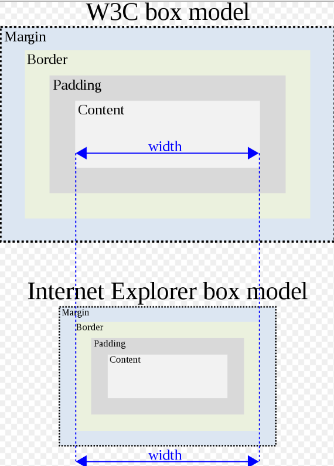

##### 图片的垂直对齐

标准模式和怪异模式下，浏览器对块级元素内部的图片的行高`line-height`处理不同：

- 怪异模式下，块级元素内部的图片将对齐至包含它们的盒子的下边框；


- 而在标准模式下，块级元素内部的图片将对齐至基线，也就是图片下面可能留有空白部分。

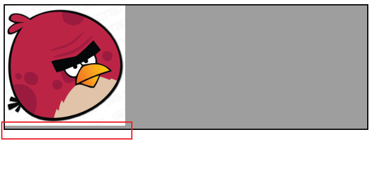

- 而在使用有限标准模式的网页中，`table-cell`内部的图片也将使用怪异模式的方式去处理，下方没有任何空白。

```html
<!DOCTYPE html PUBLIC "-//W3C//DTD HTML 4.01 Transitional//EN" "http://www.w3.org/TR/html4/loose.dtd">

<div
  id="box"
  style="display: table-cell; border: 2px solid; background: #9e9e9e;"
>
  
</div>
```


