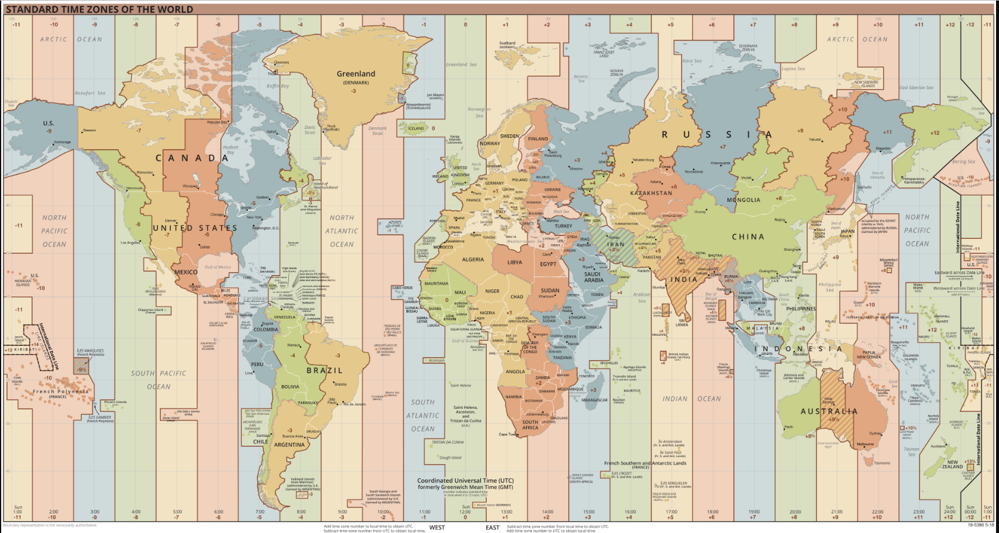

### 时间术语

#### GMT

GMT，Greenwich Mean Time，是部分欧洲国家仍然在使用的格林尼治标准时间，是英国伦敦格林尼治天文台所在地当地的时间。


#### UTC

Coordinated Universal Time，协调世界时间，是由国际标准组织（ISO，Internatinal oganization of standard）制定并且测量的世界标准参考时间，它的值**和 GMT 接近**，相差不超过 0.9 秒，但是精度比 GMT 要更高。UTC 主要是为了统一全球时间表示，为了不区分时区表示同一时间，各个地区都是基于 UTC 时间偏移量来表示本地时间，例如中国地区`UTC +08:00`，美国`UTC -04:00`。

#### [RFC 2822](https://tools.ietf.org/html/rfc2822#page-14)

> `[day-of-week , ] day month year hour ":" minute [ ":" second ] zone`

这种形式规则如下：

- `day-of-week`：取星期几的英文单词前三个字母，"Mon" / "Tue" / "Wed" / "Thu" / "Fri" / "Sat" / "Sun"
- `day`：两位数，`[0, 30]`
- `month`：取月份单词的前三个字母，"Jan" / "Feb" / "Mar" / "Apr" / "May" / "Jun" / "Jul" / "Aug" / "Sep" / "Oct" / "Nov" / "Dec"

- `year`：四位数字，`[0000, 9999]`
- `time`：时分秒，秒可选
- `zone`：`±`紧跟四位数字，表示时区

```javascript
'Fri 20 Jul 2018 00:00:00 +0800';
```

#### ISO 8601

> `YYYY-MM-DDTHH:mm:ss.sss`
>
> `YYYY-MM-DDTHH:mm:ss.sssZ`
>
> `YYYY-MM-DDTHH:mm:ss.sss+hhmm`

国际标准 ISO 8601 是国际标准化组织（ISO）制定的表示日期和时间的方法，也就是以上形式。

对于表示时间字符串的形式 ISO8601 也有明确规定：

##### 日期格式

- 年份，使用`YYYY`表示从[0000~9999]之间的年，超过`9999`或者小于`0000`的年份可以在前面用`+`或者`-`表示

```javascript
±YYYYYY
```

- 月份和日期分别用`MM`和`DD`表示，允许以下格式的日期表示，至少保证 8 位数字，不足的前面补`0`

```javascript
YYYY - MM - DD;
YYYYMMDD;

YYYY - MM; //不允许
YYMMDD; //也不允许

// 在2000年的规范时允许省略年份，但是2004以后就不允许了
--MM - DD;
--MMDD;
```

- 周，使用`W`大写字母加上[01~53]的格式`Www`，后面可以加上`D`表示是一周的第几天，周只能放在年份后面，允许以下格式
- 关于一年第一周的计算，通常是指一年第一个星期四所在的周

```javascript
YYYY - Www;
YYYYWww;
YYYY - Www - D;
YYYYWwwD;

2009 - W01 - 1; // 表示2008年12月29日，星期一
```

- 还支持一种日期表示格式，表示在一年的第几天，[001~365]

```javascript
YYYY - DDD;
YYYYDDD;

1981 - 095; // 1981-04-05
```

##### 时间格式

在表示时间上，ISO 采用的都是 24 小时，基础格式是`[hh][mm][ss][.mmm]`，拓展格式是`[hh][mm][ss]`；`[hh]`在`[00~24]`之间，`[mm]`在`[00~59]`之间，`[ss]`在`[00~60]`之间，在最新的 2019 的规范中，`0`时不再使用`24:00`表示，而是使用`00:00`，使用这张格式需要注意日期需要提前一天；注意毫秒前面的`.`不能省略

```javascript
hh: mm: ss.sss;
hhmmss.sss;
hh: mm: ss;
hhmmss;
hh: mm;
hhmm;
hh;
```

日期和时间合并表示，需要在中间加上**大写字母`T`**连接，有时候`T`也可以省略

```javascript
2007-04-05T14:30Z

200704051430
```

##### 时区表示

UTC 时间是全球一致的标准时间，ISO 使用 UTC 偏移量来表示时区，**强烈建议在表示时间的字符串中一定要带上`Z`表示这是标准的 UTC 时间，或者带上偏移量`±[hh][mm]`来表示和 UTC 时间的区别，如果什么都不到，将表示这个时间就是本地时间**。

如果时间是 UTC 时间，后面会紧跟大写字母`Z`，`Z`是零 UTC 偏移量的标志；

```javascript
1995-12-17T03:24:00Z
```

如果时间后面不带`Z`而紧跟`±[hh]:[mm]`，`±[hh][mm]`或者`±[hh]`的形式，表示时区相对于 UTC 标准时间增加或者减少的时间；

- 减号`-`表示慢于 UTC 时间，也就是说 UTC 标准时间要在当前时区的时间加上偏移量得到，一般都是西半球的国家；
- 而`+`表示快于 UTC 时间，一般都是东方国家，也就是说 UTC 标准时间要在当前时区的时间减去偏移量得到

```javascript
1995-12-17T03:24:00+0800

// 偏移量 + 08:00，表示快于UTC时间8个小时，则UTC时间需要减去8得到，大约是
1995-12-16T19:24:00Z
```

如果时间没有任何表示时区的标志，则表示以本地时区为参考，也就是省略了偏移量的形式；

```javascript
1995-12-17T03:24:00
```

> [World_Time_Zones](https://upload.wikimedia.org/wikipedia/commons/8/88/World_Time_Zones_Map.png)



#### 19700101

- 这是一个有趣的时间，被称为 Unix 时间；在 1971 年，《Unix Programmer's Manua》出版，将格林威治时间（GMT）`1971年1月1日0时0分0秒`作为系统的起始时间。后来为方便记忆和计算，起始时间修改成 1970 ；由于 Unix 是 32 位系统，最大能表示的数字为 32 个二进制 1 也就是`2^31`，这个数字存储的是秒，换算成年就是`2^31/(365*24*60*60) ≈ 68`，从 1970 年算起到 2038 年结束，所以就有了 2038 年世界末日的搞笑说法

#### unix 时间戳

时间戳时相对于 UTC 标准时间而言的，所以时间戳没有时区的分别，从 UTC`1970年01月01日00时00分00秒`到现在的 UTC 时间经过的毫秒数就是时间戳。

#### devtool

在 Chrome 的 devtool 执行`console`命令打印出来的字符串实际上是`Date`类型执行`toString()`方法得到的，所以看起来和 UTC 时间格式并不一致，注意不要和 UTC 标准时间格式搞混淆就行了。

### Date 类型

JS 的`Date`类型本质上是一个`Number`类型的整数，表示从 UTC 时间`1970年01月01日00时00分00秒`到该日期的**毫秒数**。虽然 Date 对象的核心时间值是 UTC 时间戳，但获取日期和时间或其组成部分的基本方法都是在本地（即主机系统）时区和偏移量下工作的。

根据 ES 文档的规定，日期范围是从 April 20, 271821 BCE ~ September 13, 275760 CE（BCE：公元前，CE：公元）。

#### 构造函数

要创建一个`Date`类型的对象，必须使用`new`调用构造函数；**如果单独使用构造函数，只会返回一个表示本地时区当前时间的字符串**。

> `Date()`

无论`Date()`里面传不传参数，传任何参数，都只会返回当前时区的时间字符串。

```javascript
console.log(Date()); //String : Tue Jul 28 2020 20:16:28 GMT+0800 (中国标准时间)
```

> `new Date(year, month, [day, hours, minutes, seconds, ms])`
>
> @param `year` 必传，只有 1900~1999 之间的年份可以用 两位数形式`[0, 99]`代表
>
> @param `month` 必传 [0, 11]
>
> @param `day` 可选[1, 31]，默认是 1
>
> @param `hours` 可选[0, 23]，默认是 0
>
> @param `minutes` 可选[0, 59]，默认是 0
>
> @param `seconds` 可选[0, 59]，默认是 0
>
> @param `ms` 可选[0, 999]，默认是 0
>
> @return Date 日期对象

依次传入年月日时分秒，毫秒来初始化创建一个日期对象；在这种形式下，`year`和`month`必传。

```javascript
let date = new Date(1995, 11, 17, 3, 24, 0, 233);
// Sun Dec 17 1995 03:24:00 GMT+0800 (中国标准时间)
```

> `new Date(dateString)`

传入一个时间的字符串形式，来创建一个对象；这个参数和`Date.parse()`这个方法的参数一致，按照 ES 规范文档应该使用 ISO 8601 形式的字符串。而不同浏览器解析字符串的实现不一样，大部分都兼容 RFC 2282 形式的字符串。

```javascript
// ISO 8601
let date = new Date('1995-12-17T03:24:00');

// RFC 2282
let date = new Date('Fri 20 Jul 2018 00:00:00 +0800');
```

> `new Date(timestamp)`

传入一个 Unix 时间戳整数来创建一个对象

```javascript
let date = new Date(1595938968);
// Mon Jan 19 1970 19:18:58 GMT+0800 (中国标准时间)
```

##### Date.UTC()

> `Date.UTC(year, [month, day, hours, minutes, seconds, ms])`
>
> @param `year` 必传，只有 1900~1999 之间的年份可以用 两位数形式`[0, 99]`代表
>
> @param `month` 可选 [0, 11]，默认是 0
>
> @param `day` 可选[1, 31]，默认是 1
>
> @param `hours` 可选[0, 23]，默认是 0
>
> @param `minutes` 可选[0, 59]，默认是 0
>
> @param `seconds` 可选[0, 59]，默认是 0
>
> @param `ms` 可选[0, 999]，默认是 0
>
> @return Number 毫秒数

返回指定日期距离`1, 1970, 00:00:00 UTC`之间的毫秒数，其实也就是生成一个时间戳。

在最新的 ES 规范中，`year`必传，其它可选。

```javascript
console.log(Date.UTC(96, 1, 2, 3, 4, 5)); //823230245000
```

##### Date.now()

> `Date.now()`
>
> @return Number 毫秒数

返回当前 UTC 时间到`1, 1970, 00:00:00 UTC`之间的毫秒数

```javascript
console.log(Date.now()); //1595943465351
```

##### Date.parse()

> `Date.parse(dateString)`
>
> @param `dateString` ISO8601 形式时间字符串，也兼容 RFC 2282 形式的字符串
>
> @return Number 毫秒数

```javascript
// ISO 8601
Date.parse('1995-12-17T03:24:00');

// RFC 2282
Date.parse('Fri 20 Jul 2018 00:00:00 +0800');
```

#### 方法

##### 返回日期对象的指定部分

| 方法                        | 结果                                                                                         |
| --------------------------- | -------------------------------------------------------------------------------------------- |
| `dateObj.getDay()`          | 根据本地时间返回指定日期的星期几，`[0, 6]`                                                   |
| `dateObj.getDate()`         | 根据当地时间返回指定日期在月中的第几天，`[1, 31]`                                            |
| `dateObj.getMonth()`        | 根据本地时间返回指定日期的月份，`[0, 11]`                                                    |
| `dateObj.getFullYear()`     | 根据当地时间返回指定日期的年份，`[0000, 9999]`<br />要注意两位数`[0, 99]`只能代表`1900~1999` |
| `dateObj.getHours()`        | 根据当地时间返回指定日期的小时，`[0, 23]`                                                    |
| `dateObj.getMinutes()`      | 根据当地时间返回指定日期的分钟，`[0, 59]`                                                    |
| `dateObj.getSeconds()`      | 根据当地时间返回指定日期的秒，`[0, 59]`                                                      |
| `dateObj.getMilliseconds()` | 根据当地时间返回指定日期的毫秒，`[0, 999]`                                                   |
| `dateObj.getTime()`         | 基于标准 UTC 此刻的时间，返回 unix 时间戳，没有时区的区别                                    |
| `dateObj.getUTCDate()`      | 基于指定日期加减偏移量后得到的 UTC 时间在月中的第几天，`[1, 31]`                             |

##### getDate 和 getUTCDate

以`getDate`和`getUTCDate`为例，区别 UTC 时间和时区偏移量时间，当地是中国时区，相对于 UTC 时间偏移量是`UTC+0800`，也就是比 UTC 快 8 小时。

```javascript
// getUTCDate需要以UTC时间为参考，如果日期对象不是以UTC为基准建立的，必须减去偏移量得到UTC时间才行，1995-12-17T03:24:00 减去偏移量 8小时 也就是前一天 1995-12-16T19:24:00Z 左右，则 getUTCDate返回这个日期表示的天数就是 16
let date = new Date('1995-12-17T03:24:00');

console.log(date.getDate()); // 17
console.log(date.getUTCDate()); // 16

//而如果在建立日期对象的时候指定其为UTC时间，也就是下面第三个例子，那么就不用减去偏移量，因为系统认定这个时间就是UTC时间，所以直接看其日期部分，得到 17
let date = new Date('1995-12-17T03:24:00Z');

console.log(date.getDate()); // 17
console.log(date.getUTCDate()); // 17

//而如果指定了偏移量，则直接根据这个偏移量得到UTC时间了，1995-12-17T03:24:00 减去偏移量 2小时 也就是 1995-12-17T01:24:00Z，仍然在当天
let date = new Date('1995-12-17T03:24:00+0200');

console.log(date.getDate()); // 17
console.log(date.getUTCDate()); // 17
```

##### toString

| 方法                         | 转换结果                                         |
| ---------------------------- | ------------------------------------------------ |
| `dateObj.toString`           | Fri Jul 24 2020 22:22:44 GMT+0800 (中国标准时间) |
| `dateObj.toDateString`       | Fri Jul 24 2020                                  |
| `dateObj.toTimeString`       | Fri Jul 24 2020                                  |
| `dateObj.toISOString`        | 2020-07-24T14:22:44.600Z                         |
| `dateObj.toUTCString`        | Fri, 24 Jul 2020 14:22:44 GMT                    |
| `dateObj.toJSON`             | 2020-07-24T14:22:44.600Z                         |
| `dateObj.toLocaleDateString` | 下午 10:22:44（浏览器语言设定是中文）            |
| `dateObj.toLocaleTimeString` | 下午 10:22:44（浏览器语言设定是中文）            |
| `dateObj.toLocaleString`     | 2020/7/24 下午 10:22:44（浏览器语言设定是中文）  |
