## 进制转换

### 十进制整数转二进制

- **除 2 取余，逆序排列**；先用整数除以`2`，得到商和余数，再用商除以`2`，又得到商和余数，直到商的值等于 0，然后把余数逆序排列就得到二进制的形式

```javascript
5
5/2 = 2 ... 1
2/2 = 1 ... 0
1/2 = 0 ... 1
// 101
```

### 十进制小数转二进制

- 整数部分和小数部分开转换，整数部分依照上面的规则，小数部分按照**乘 2 取整，顺序排列**的规则，用小数部分乘 2，得到的积取整数部分作为二进制的位数，积的小数部分再乘 2 又得到积，继续乘下去直到小数部分是 0；最后把两部分二进制用小数点连接起来即可

```javascript
4.5
整数部分 4      ... 100

小数部分 0.5
0.5*2 = 1.0	   ... 1

// 合并起来就是 100.1

0.1

整数部分 0		...0

0.1*2 = 0.2    ... 0
0.2*2 = 0.4	   ... 0
0.4*2 = 0.8	   ... 0
0.8*2 = 1.6	   ... 1
0.6*2 = 1.2	   ... 1
0.2*2 = 0.4	   ... 0
0.4*2 = 0.8	   ... 0
0.8*2 = 1.6	   ... 1
0.6*2 = 1.2	   ... 1

// 0.000110011...
```

### 十进制转十六进制

先转二进制，然后每 4 位二进制转十进制，超过 10 的部分用`[A,F]`代替，最后合并

```javascript
47

10 1111

//每四位转10进制
2 F(15)

//合并
2F
```

### 二进制转十进制

采用**乘 2 相加**的方法，即每位二进制数，去乘以 2 的当前位索引的次方，然后相加；小数点左侧二级制位索引从 0 开始，小数点右侧二进制位索引从-1 开始

```javascript
100.1;
(1 * 2) ^ (2 + 0 * 2) ^ (1 + 0 * 2) ^ (0 + 1 * 2) ^ -1 = 4 + 0 + 0 + 0.5 = 4.5;
```

- 所以二进制位数和表示的十进制最大值的关系如下，因为从 0 开始


- 二进制位数和能表示的十进制数的关系如下，因为从 0 开始


### 八进制转十进制

**乘 8 相加法**

```javascript
0o1244;

(4 * 8) ^ (0 + 4 * 8) ^ (1 + 2 * 8) ^ (2 + 1 * 8) ^ 3 = 676;
```

### 十六进制转十进制

**乘 16 相加**

```javascript
0xffff;

F = 15;

(15 * 16) ^ (0 + 15 * 16) ^ (1 + 15 * 16) ^ (2 + 15 * 16) ^ 3 = 2 ^
(16 - 1) = 65535;
```

### 二进制转八进制

- 从后往前每三位为一个单元转成十进制，缺位补 0，然后合并每个转换得到的十进制数字就是八进制形式

```javascript
11001101

// 从后往前，缺位补0
101		 5
001		 1
011		 3

// 315
```

### 二进制转十六进制

- 从后往前每 4 位为一个单元转成十进制，超过 10 的话，从 10 到 15 分别用`ABCDEF`表示

```javascript
1111 1101			// FD
```

## 科学计数法

科学计数法把一个数字表示成如下形式，其中`a`是尾数或者叫有效数字，`n`是整数，其可以是负的

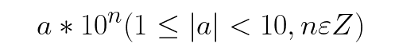

而在计算器中使用字母`E/e`(exponent，指数)来表示 10 的乘方，小于 1 的小数就用`E-`来表示

$$
1.234E+005 = 1.234*10^5 \\

1.2E-005＝1.2*10^{-5}
$$

### 二进制科学计数法

常见于计算机的浮点数表示，也就是 10 的乘法换成了 2 的乘法形式。值得注意的是这个乘法算式的左边有效数字是二进制，而右边是十进制的乘方，不能直接相乘计算出结果，必须要将有效数字部分二进制转成十进制，两者才能相乘。

```javascript
171 = 10101011 = 1.0101011 * 2^7

1.0101011 * 2^7转回来：

1*2^0 + 0*2^(-1)+1*2^(-2) ... + 1*2^(-7) = 1.3359375

1.3359375 * 2^7 = 171

// 或者可以这么看，2的指数其实表示浮点数的移位，这里也就是1.0101011的小数点向右移位7个，那么得到的数再转十进制就是原来的整数 171了
```

## 计算机中的浮点数表示

> [wikipedia - IEEE 754](https://zh.wikipedia.org/wiki/IEEE_754)

浮点就是浮动的小数点，通过小数点移位来表示精度不同的数值，所以浮点数也就是小数。

IEEE 754 二进制浮点数算数标准是目前使用最广泛的浮点数运算标准，它指定的是现实世界中的数字如何在计算机的二进制世界中进行表示的方法，大多数编程语言都使用 IEEE 754 标准来设定语言中的数字类型。

在 IEEE 754 算术标准中，一个浮点数在转成二进制科学计数法以后，可以使用三部分的二进制组合表示，一个二进制符号位，一部分二进制表示指数部分，一部分表示有效数字部分

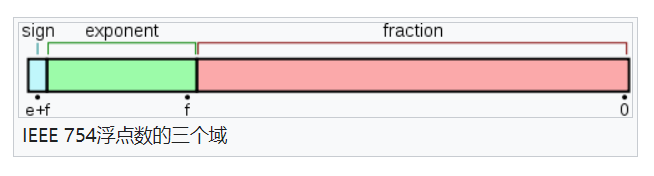

### 32 位单精度浮点数

单精度，用 8 位存储二进制科学计数法的指数部分，用 23 位存储有效数字部分

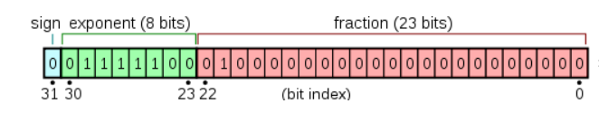

### 64 位双精度浮点数

64 位双精度使用 64 位二进制表示浮点数，用 11 位存储二进制科学计数法的指数部分，用 52 位存储有效数字部分

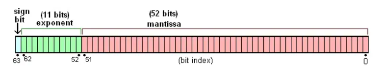

由于 JS 使用的是 64 位双精度浮点数，所以只看从 JS 数字到 64 位二进制的转换过程。根据 IEEE 规范，一个浮点数使用由符号位，指数部分，尾数部分三部分组合的**二进制科学计数法形式**来表示。例如：

```javascript
171 = 10101011 = -1 ^ (0 * 1.0101011 * 2) ^ 7;
```

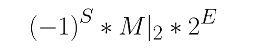

在这个表达式中，**需要注意的是 S，E 都是十进制数，而 M 是二进制数**，**S 和 E 需要换算成二进制形式来表示**，但是实际 IEEE 754 规范并不是直接将这三部分存成二进制，需要遵循下面的约束规则：

- S，sign，符号位，需要一位二进制来表示正负，`0`表示正，`1`表示负；
- E，exponent，指数部分，在 64 位双精度浮点数中用 11 位二进制来换算，但是都知道指数值有正负之分，所以指数值不能直接转成 11 位二进制来表示；所以 IEEE 规定了一个中间数来区分指数的正负，大于中间数的指数值就是正，小于中间数的指数值就是负。实际的指数值 E 加上这个中间数然后再转成 11 位二进制形式就得到了 64 位二进制中表示指数的部分。
  - 这个中间数根据 IEEE 754 标准规定使用以下公式进行计算；那么在 64 位双精度下指数部分用 11 位二进制表示，中间数就是 1023，所以实际的指数值为 11 位二进制转换成十进制得到的数值再减去 1023

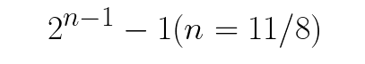

- M，mantissa，尾数部分，上文提到科学计数法的前面小数部分就是尾数，形如：`1.0101011 * 2^7`尾数是`1.0101011`，那么在二进制科学计数法的形式里面，**尾数的小数点左侧部分肯定始终保证是 1，所以在保存的时候就可以被舍弃了**，只保存尾数的小数点右侧的部分，所以在 64 位双精度浮点数中，尾数有 52 位，但是实际表示的是 53 位有效数字`1.xxxxx`，1 后面跟 52 位部分

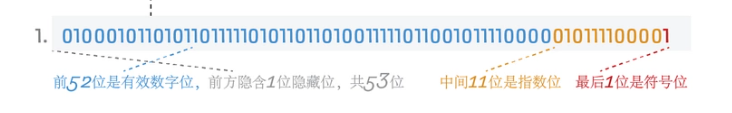

如上表示十进制数字转 64 位的形式，如果要逆向转换得到上面的二进制科学计数法形式，**还需要对尾数部分继续转十进制**才能和符号部分`(-1)^S`，指数部分`2^E`相乘，因为乘法肯定是建立在都是十进制的基础上。

```javascript
// 举个例子
4.5

// 转成二进制科学计数法
1.001 * 2^2

// 上面的指数部分2，还需要加上1023，得到E是1025，然后再将1025转成11位二进制，缺位补0，就得到了指数部分的二进制形式

1025	=>		10000000001

// 再看有效数字部分，1.001舍去小数点前面1，得到001，不足52位，后面全补0
0010000000000000000000000000000000000000000000000000

// 最后和11位指数部分，1位符号位，拼接在一起得到完整的64二进制形式M
0010000000000000000000000000000000000000000000000000 10000000001 0

// 这个64位二进制反过来转回十进制，先找到前面52位，并在前面补上舍去的 1.组成尾数部分
1. 0010000000000000000000000000000000000000000000000000

// 然后找到指数部分11位转成十进制，然后减去1023，得到指数实际值 E = 2
10000000001 = 1025
1025 - 1023 = 2

// 最后一位符号位是 S = 0，表示正，得到二进制科学计数法形式
(-1)^0 * 2^2 * 1. 0010000000000000000000000000000000000000000000000000|(二进制)

// 继续讲尾数部分1. 001转十进制
1.001 = 1*2^0 + 0*2^(-1) + 0*2^(-2) + 1*2^(-3) = 1 + 1/8

// 最后三部分相乘
(-1)^0 * 2^2 * (1 + 1/8)  = 4.5
```

- 三个特殊值

1. 如果指数部分二进制全为`0`并且尾数的小数部分也全是`0`的时候，就表示正负 0`±0`
2. 如果指数部分全是`1`并且尾数的小数部分全是`0`，就表示正负无穷`±Infinity`；
3. 如果指数部分全是`1`而尾数的小数部分不全是`0`，这里的`2^52-1`种情况都表示`NaN`

#### 精度丢失

- JS 中的所有数字都是浮点数，都要被成 64 位二进制的形式来表示

- 将十进制小数 0.1 转成 64 位浮点数形式

1. `0.1`转二进制，得到`0.000110011...`
2. `0.000110011...`转二进制表示形式，得到`1.100110011001100... * 2^-4`，其中符号位是`0`，指数部分，实际值需要加上 1023，也就是 1019，转成 11 位二进制，不足补 0，得到`01111111011`，然后是尾数部分，只取小数部分从第一位开始向后最多只能取 52 个，53 往后的遵循进 1 舍 0，第 53 个是`1`，进 1 得到 52 位尾数部分，最终得到的 64 位二进制就是`0.1`在计算机中的实际值，把这个值反向转换成 10 进制就是`1.00000000000000005551115123126E-1`，要略微大于`0.1`

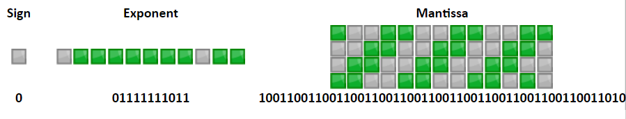

## Number 类型

> [The Number Type](https://tc39.es/ecma262/#sec-ecmascript-language-types-number-type)

JS 里的`Number`类型值，没有 Int 整数，全都是浮点数，并且以 IEEE 二进制浮点算术标准中所指定的双精度 64 位格式来进行表示，也就是上文介绍的 64 位双精度浮点数。

### Number 直接量形式

> [Numeric Literals](https://tc39.es/ecma262/#sec-literals-numeric-literals)

JS 里能表示数字的形式总体来说就是 4 种：

- 小数形式
  - 十进制整数组合`[0,9]` + 小数点`.` + 可选的小数位数 + 科学计数法表示：2.2e8
  - 小数点`.` 开头 + `[0, 9]`组合 + 科学计数法表示：0.2e8
  - 十进制整数组合`[0,9]` + 科学计数法形式：2e8
    - 科学计数法表示：`e`或`E` + 正负号`±` + `[0, 9]`组合
- 十进制 BigInt 形式
  - `0n`
  - 数字[1, 9]开头 + 数字[0, 9]组合 + `n`
- 非十进制整数形式
  - 二进制整数`0b`或`0B` + `[0, 1]`组合
  - 八进制整数`0o`或`0O` + `[0, 7]`组合
  - 十六进制整数`0x`或`0X` + `[0, 9]` 或 `[a, f]` 或 `[A, F]`组合
- 非十进制整数 + BigInt 后缀`n`的形式

此外还有两个特殊的变量值，`Infinity`和`NaN`，它们既可以被看作全局对象`window`或者`globalThis`的属性，也可以看作一个特殊的`Number`类型的值，或者作为`Number`构造函数的静态属性。

`Infinity`表示无穷，JS 里的最大数接近于`2^1024 ≈ 1.79E+308`，当超过这个数值范围后，就用`Infinity`表示，`Infinity`可以带有正负号`±`。

`NaN`，也就是 not a number 的意思，被用来表示一些非法的计算操作的结果，例如`0/0`这种明确规定除数不能为 0 的情况，为了不报错，就指定`NaN`作为它们的返回结果。`NaN`有两个特点：

- 任何涉及`NaN`的操作结果都是`NaN`；
- `NaN`不等于任何数，包括它自己

```javascript
window.Infinity;
globalThis.Infinity;

Number.POSITIVE_INFINITY;
Number.NEGATIVE_INFINITY;

Number.NaN;
```

#### +0 和-0

- 关于`+0`和`-0`，它们在数值上是一样的，用 64 位二进制表示只有符号位不一样的区别
- `0/0`结果会是`NaN`；其他任何数除以`0`都会得到`+Infinity`；其他任何数除以`-0`都会得到`-Infinity`。
- 忘记检测除以 `-0`，而得到负无穷大的情况经常会导致错误，而区分 `+0` 和 `-0` 的方式，正是检测 `1/x` 是 `Infinity` 还是 `-Infinity`

```javascript
console.log(0 / 0); //NaN

console.log(1 / 0); //+Infitnity

console.log(1 / -0); //-Infitnity
```

### Number 构造函数

> [The Number Constructor](https://tc39.es/ecma262/#sec-number-constructor-number-value)

`Number`构造函数依旧拥有两种用途

- 当使用`new Number(value)`时，会创建一个`Number`类型的对象，其`[[prototype]]`指向`Number.prototype`；
- 而单独使用`Number(value)`时，相当于类型转换

执行步骤如下：

- 如果没有提供参数参数`value`，那么数字值就是`+0`；如果提供参数`value`，判断其类型，如果是`Object`会先转换成原始值类型；获取原始值类型后，根据原始值类型转`Number`类型的规则，获取数字值；
- 判断是否是通过`new`调用的，如果是则根据`Number.prototype`创建新的对象，将其私有属性`[[NumberData]]`指向上一步获取的数字值；
- 如果是直接调用的构造函数，那么就直接返回第一步获取的数字值

### Number 静态属性

#### `Number.NaN`

也就是变量`NaN`

#### `Number.MAX_VALUE`

JS 中最大正数，约等于`1.79E+308`，超过这个数用`Infinity`表示。

按照 64 位二进制的形式确定 JS 最大正数：

- 首先符号位肯定是正的，也就是二进制`0`；
- 其次指数部分，去掉指数部分 11 位全是`1`（也就是表示`±Infinity`和`NaN`）的情况，那只能是`11111111110`的情况下指数最大，得到指数实际最大值为`2^11-2-1023=1023`；
- 有效数字部分 52 位加最前面的`1.`部分，得到 53 位二进制全是 1 的情况`1.1111xxx`；转换成十进制也就是`(2^53-1)*2^(-52)`

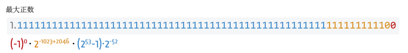

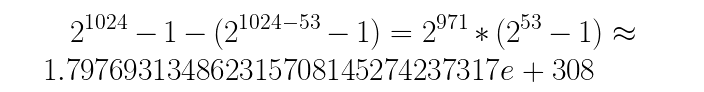

#### `Number.MIN_VALUE`

JS 最小正数，约等于`5e-324`。

同理，最小正数：

- 符号位指定二进制`0`；
- 指数部分 11 位全是`0`，得到指数实际值是`1-1023 = -1022`；
- 然后有效数字部分最后一位是`1`，然后再在有效数字的基础上小数点向左移位 1022 个位数，也就是`1`前面有 1073 个`0`，把这个二进制数转换成十进制就是 JS 最小正数`Number.MIN_VALUE`

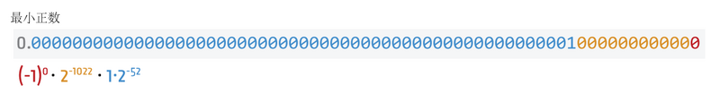

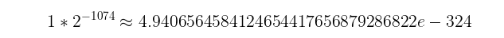

#### `Number.POSITIVE_INFINITY`

正无穷`+Infinity`

#### `Number.NEGATIVE_INFINITY`

负无穷`-Infinity``

#### `Number.MAX_SAFE_INTEGER`

最大安全整数`Number.MAX_SAFE_INTEGER`，也就是`2^53-1`，最小安全整数`Number.MIN_SAFE_INTEGER`是 53 位最后一位置`1`，也就是`-(2^53-1)`；在这个范围内的整数都能保证在转换成二进制后再转回来和原来一样，超过了就会出现不连续的情况。

从 64 位二进制角度看，`2^53-1`就是二进制科学计数法的尾数部分全是`1`，向右移位 52 位，也就是指数是`52+1023=1075`。如果这个数再加 1，就还需要再往右移一位然后其他位置`0`才可以，这时候二进制科学计数法的尾数其实是`1.00000`（后面 53 个 0），于是指数就变成了`53+1023=1076`；你刚说位数需要 54 位？对不起，最多只给你 53 位，于是从 53 位开始丢掉，所以`2^53`损失了一位精度，它不能算作安全的整数

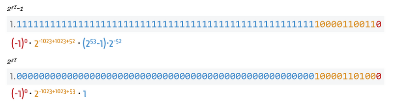

- `2^53+1`是多少呢，`2^53+1`也就是`2^53-1+2`，同样需要 54 位有效数字，不过尾数最后面一位是`1`，但是只给 53 位，于是丢掉丢掉，得到的是和`2^53`一样的二进制数，也就是`Number.MAX_SAFE_INTEGER + 1 === Number.MAX_SAFE_INTEGER + 2`
- 从 53 位开始，第一个进制被舍弃，每 2 个值都会有一个值出现这种不精确的情形，他们 64 位二进制形式都一样；再过 1 个值，会出现每 4 个值里面都有 3 个值不精确

```javascript
Math.pow(2, 53) - 1; //9007199254740991

Math.pow(2, 53); //9007199254740992

Math.pow(2, 53) + 1; //9007199254740992

Math.pow(2, 53) + 2; //9007199254740994

Math.pow(2, 53) + 3; //9007199254740996

Math.pow(2, 53) + 4; //9007199254740996

Math.pow(2, 53) + 5; //9007199254740996
```

#### `Number.MIN_SAFE_INTEGER`

JS 最小安全整数`-(2^53 - 1)`。

#### `Number.EPSILON`

`Number.EPSILON`表示的是`1`和最小的正数`Number.MIN_VALUE`的差值，这个值接近于`2^-52`；

`Number.EPSILON`经常被用来表示 JS 里能接受的最小误差，当浮点数的运算结果和实力期望值之间的差值小于这个值时，就认为结果是正确的，例如

```javascript
console.log(Math.abs(0.1 + 0.2 - 0.3) <= Number.EPSILON);
```

### 精度丢失的问题

64 位双精度浮点数表示法的最高精度是 17 位小数，这个结论是因为，对于 64 位浮点数来说，大于 1 的最小浮点数相当于二进制的`1.00..001`，小数点后面有连续 51 个零，这个值减去 1 之后，就等于`2^(-52)`，也就是 JS 最小的大于 1 的浮点数是`2^(-52)`，这个值接近于 `2.2E-16`，而科学计数法的精度以尾数的最后一个数在原数中的位数为标准，所以就是 2 在`0.00000000000000022`中的数位，也就是小数点后 17 位。

计算机中的数只有 0 和 1 二进制形式，任何形式的运算，例如加减乘除等都是将数字转换成二进制表示然后在二进制的基础上计算的，而 JS 中表示数值的二进制位数只有 52 位，不管加减乘除肯定会涉及到舍入进位的问题，当舍入进位后的位数超过 52 位时，就会丢失精度。

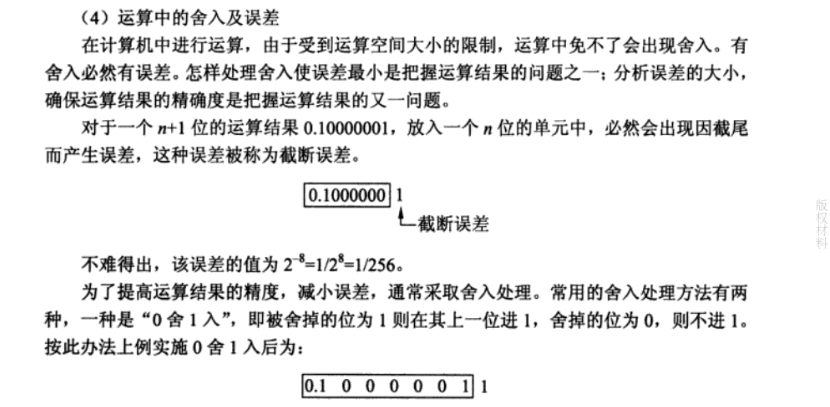

#### 0.1+0.2≠0.3

有一个网站叫`https://0.30000000000000004.com/`，可以查看各种语言在`0.1+0.2`这个表达式的结果。

关于`0.1+0.2`，把他们转成 64 位二进制浮点数的形式进行二进制的加法运算以后会存在精度丢失的问题，关于二进制的浮点计算，可以参考这篇文章[关于 js 中的浮点计算](<[http://eux.baidu.com/blog/fe/%E5%85%B3%E4%BA%8Ejs%E4%B8%AD%E7%9A%84%E6%B5%AE%E7%82%B9%E8%BF%90%E7%AE%97](http://eux.baidu.com/blog/fe/关于js中的浮点运算)>)

```javascript
0.1D = 2^-4 * 1.1001100110011001100110011001100110011001100110011010B
0.2D = 2^-3 * 1.1001100110011001100110011001100110011001100110011010B

0.3D = 2^-2 * 1.0011001100110011001100110011001100110011001100110011B

//0.1 + 0.2 时，先将两者指数统一为 -3，也就是让小数点在64位二进制里的位置相同，故 0.1 小数点向左移一位

   0.1100110011001100110011001100110011001100110011001101B
+  1.1001100110011001100110011001100110011001100110011010B
------------------------------------------------------------
= 10.0110011001100110011001100110011001100110011001100111B

//小数点往左移一位使得整数部分为 1，此时尾数部分为 53 位，进一舍零，于是得到最后的值是

2^-2 * 1.0011001100110011001100110011001100110011001100110100
也就是 0.010011001100110011001100110011001100110011001100110100

转成十进制就是 0.30000000000000004			15个0

//所以
console.log(0.1 + 0.2 === 0.3); //false
```

#### 正确比较浮点数的方法

JS 正确的比较 JS 浮点数运算结果的方式是，利用绝对值和最小精度来做比较

```javascript
console.log(Math.abs(0.1 + 0.2 - 0.3) <= Number.EPSILON);
```

### 精度取舍的问题

> `num.toFixed(n)`，0≤n≤20，默认为 0

- 准确的说，使用`toFixed(n)`是一种定点计数法，定点数就是小数点后位数固定的实数，与之相对的是浮点数，`toFixed(n)`是将数字的 64 位二进制形式转换成定点数，然后再转换成字符串，所以不会单纯的进行四舍五入的运算
- 如果 `precision` 参数不在 1 和 20（包括）之间，将会抛出一个 `RangeError`；
- `toFixed(n)`会在转换的时候进行四舍五入的运算，遇到不同小数位数的`5`舍入的结果也会不同，这个原因的具体细节可以参考这篇文章——[为什么(2.55).toFixed(1)等于 2.5？](https://zhuanlan.zhihu.com/p/31202697)

```javascript
(1.005).toFixed(2); //1.00

(1.55).toFixed(1); //1.6

(2.55).toFixed(1); //2.5

(3.55).toFixed(1); //3.5
```

> `numObj.toPrecision(precision)`，0≤precision≤100

- 以指定的精度返回该数值对象的字符串表示，也就是说参数`precision`是有效数字的个数
- `toPrecision`也会进行四舍五入，如果忽略 `precision` 参数，这个方法就相当于`toString()`；如果`precision`不是整数，会对`precision`进行向下取舍，也就是取最接近`precision`但是不大于`precision`的整数；如果 `precision` 参数不在 1 和 100 （包括）之间，将会抛出一个 `RangeError`
- `toPrecision`可能会返回科学计数法的形式

> `Math.round(x)`

- 返回一个数字四舍五入后**最接近**的整数
- 要深刻理解最接近是什么意思，画个数轴就明白了，有这么几种情况

1. 正数且小数部分大于`0.5`，向上取整，也就是**最接近**的整数
2. 正数且小数部分等于`0.5`，还是向上取整
3. 负数且小数部分大于`0.5`，那肯定往左**最接近**
4. 负数且小数部分小于`0.5`，那肯定往右取整去接近

```javascript
Math.round(20.49); //20
Math.round(20.5); //21
Math.round(20.51); //21
Math.round(-20.49); //-20
Math.round(-20.5); //-20
Math.round(-20.51); //-21
```

> 建议借助第三方库——[mathjs](https://mathjs.org/docs/getting_started.html)
