### 正则表达式符号

#### 概念

正则表达式（Regular Expression，常简写为 regex、regexp 或 RE）是用于匹配字符串中字符组合的表达式，**一个正则表达式常被称为一个模式（pattern）**

#### [匹配位置](https://developer.mozilla.org/en-US/docs/Web/JavaScript/Guide/Regular_Expressions/Assertions)

> `^`，caret（开若特），脱字符

这个字符可以有两种含义

- 从字符串的开头位置开始匹配，紧跟着它的字符必须是字符串中的第一个字符
- 放在分组方括号`[^xyz]`内表示否定含义啊，匹配任何没有包含在括号中的字符

> `$`，dollar 符

和脱字符正好相反，放在正则表达式的末尾，表示字符串的结束，它前面一个字符必须在字符串的最后

> `\b`：backspace，退格符，Unicode 字符是 U+0008

这个字符也有两种用法

- 从被匹配的字符串角度看，`\b`所在的位置是单词的开头或者结束位置，也就是说`\b`它的前一个字符和后一个字符不全是(一个是,一个不是或不存在)`\w`(大小写字母，数字和下划线)
- `[\b]`：匹配退格键`\u`

```javascript
console.log(/\boo/.test('moon')); //false

console.log(/\bmoo/.test('moon')); //true

var aliceExcerpt =
  'I’m sure I’m not Ada,’ she said, ‘for her hair goes in such long ringlets, and mine doesn’t go in ringlets at all.';
var regexpWordStartingWithA = /\b[aA]\w+/g;
console.log(aliceExcerpt.match(regexpWordStartingWithA)); //['Ada', 'and', 'at', 'all']
```

> `\B`

与`\b`相反，`\B`所在的位置不能是单词开头或者结束的位置，`\B`所在的位置只能是单词中间

```javascript
console.log(/\Bon/.test('at noon')); //true

console.log(/\Bat/.test('at noon')); //false
```

> `x(?=y)`

向前断言，当`x`后面紧跟着`y`才会匹配`x`，且匹配项字符串中不会包含`y`

```javascript
var str = 'cat,bat';

var newStr = /t(?=,)/.exec(str);
console.log(newStr); // ["t", index: 2, input: "cat,bat", groups: undefined]
```

> `x(?!y)`

与`x(?=y)`相反，只匹配`x`后面没有紧跟`y`的`x`

```javascript
var str = '3.141';

var newStr = str.match(/\d+(?!\.)/); // 匹配后面小数点的数字，并且贪婪
console.log(newStr); // [141]
```

> `(?<=y)x`

只会匹配紧跟在`y`后面的`x`

```javascript
var str = 'cat,bat';

var newStr = /(?<=b)at/.exec(str);
console.log(newStr); // ["at", index: 5, input: "cat,bat", groups: undefined]
```

> `(?<!y)x`

只会匹配前面没有`y`的`x`

```javascript
var str = 'cat,bat';

var newStr = /(?<!c)at/.exec(str);
console.log(newStr); // ["at", index: 5, input: "cat,bat", groups: undefined]
```

#### 字符类

这些字符通常是由反斜杠`\`和单个字母组成的转义字符，且大多是正反含义都有的

> `.`，小数点

两种用法

- 单独使用，表示匹配除了换行符`\n`，`\r`，行分隔符`U+2028`，段落分隔符`U+2029`之外的任意字符
- `[.]`放在方括号里只表示小数点，即使加了反斜杠也无法转义

```javascript
console.log(/b./.exec('abcd')); //[bc,......]

console.log(/b[.]/.exec('abcd')); //null

console.log(/b[\.]/.exec('abcd')); //null

console.log(/b\./.exec('abcd')); //null
```

> `\d`，digit，数字

匹配数字`[0-9]`

> `\D`

匹配非数字，`[^0-9]`

> `\w`

匹配在大小写字母，0 到 9，下划线`_`之间的单个字符，`[a-zA-Z0-9_]`

> `\W`

匹配不在`\w`中的字符，`[^a-zA-Z0-9_]`

> `\s`

匹配任何 Unicode 空白字符，大概有这些`[\f\n\r\t\v\u00a0\u1680\u2000-\u200a\u2028\u2029\u202f\u205f\u3000\ufeff]`

> `\S`

匹配任何非 Unicode 空白字符的字符

> `\`：反斜杠

反斜杠的使用具体要看语境

- 对特殊字符集中的字符使用`\`，表示将按照其字面意思进行匹配，例如`\.`，就解释为匹配小数点而不具有其特殊含义了
- 对一般的字符使用，可能会让其具有特殊含义，例如`\b`表示单词边界

#### 分组策略

表示在一个范围内的字符或者字符串都是符合条件的

> `|`，或

使用`|`连接的字符或者字符串，表示匹配其中一个

> `[]`

匹配在方括号中的任意一个字符，可以使用连字符`-`指定一个范围，例如`[abcd]`和`[a-d]`是一样的；如果连字符在方括号位置最前面或者最后面，那么连字符也包含在可匹配的字符里面

> `[^xyz]`

正好与上面相反，表示匹配任何不在方括号里的字符

> `()`：匹配组/捕获组

`()`有多个作用

- 把单独的项组合成子表达式，以便可以使用`|`，`*`，`+`，`?`来对括号内的单元进行处理，例如`/java(script)?/`表示`java`后面的`script`部分可以有也可以没有

```javascript
console.log(/java(script)/.test('javasc')); //false

console.log(/java(script)?/.test('javasc')); //true
```

- 在完整的模式中定义子模式，当一个正则表达式整体在字符串中具有匹配项时，可以从匹配项中抽出和圆括号中子模式相匹配的部分，可以使用`match`或`exec`方法从数组中获取这些子模式的匹配字符串

```javascript
var urlRegExp = /(?<group1>\w+):\/\/(?<group2>[\w.]+)\/(?<group3>\S*)/;
var url = 'http://www.example.com/str1?arg1=xxx#rwr';
console.log(urlRegExp.exec(url));
```

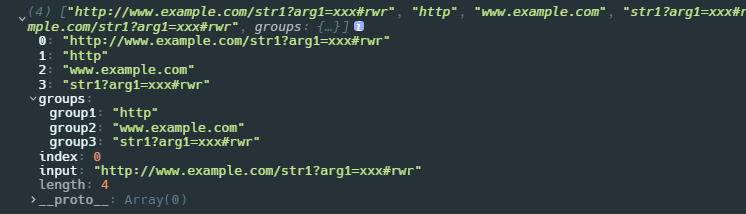

- 使用`\n`的形式在同一正则表达式的后面引用前面出现的`()`里的子表达式匹配的字符串，`n`就是从左开始数第几个左括号`(`

> `(?<Name>x)`：具名捕获组

和捕获组结合使用，为每组匹配项命名；匹配到的字符串将使用指定的属性名保存在返回的数字的`groups`对象中，如果未指定名称，则`groups`始终为`null`

> `(?:x)`：非捕获组

匹配括号中的子模式，但是不会保存匹配子模式的字符串

> `\n`

和捕获组一起使用，表示对正则表达式中与第 n 括号内子模式匹配的字符串的引用

```javascript
console.log(/apple(w\d),\sorange\1/.exec('applew5, orangew5'));
```

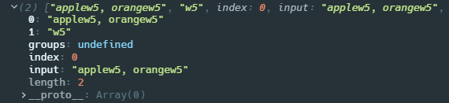

#### 数量

##### 贪婪

这些模式都是尽可能多的匹配，所以称之为**贪婪**

> `*`：大于等于 0

在`*`前的一个字符，匹配 0 次或者更多次，可以有也可以没有

```javascript
console.log(/bo*/.exec('A ghost booooed'));
```

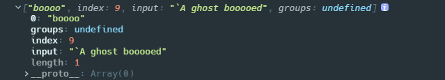

> `+`：大于等于 1

在`+`前面的一个字符或者一种类型的字符`\d`（数字），在字符串中有多少匹配多少，多多益善，但是至少得出现一次，相当于`{1,}`

```javascript
console.log(/bo+/.exec('A ghost booooed'));
```

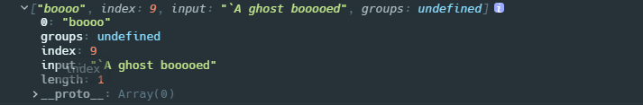

> `?`：小于等于 1

在`?`前面的一个字符，在字符串中至多匹配一次

```javascript
console.log(/bo?/.exec('A ghost booooed'));
```

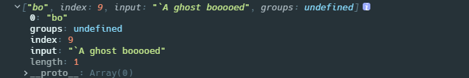

> `{n}`：n 是正整数

指定`{n}`前面的一个字符必须连续出现`n`次，从且只匹配`n`次，后面的就不管了

```javascript
console.log(/o{3}/.exec('A ghost booooed')); //不会匹配ghost中的o,因为没有连续出现4次
```

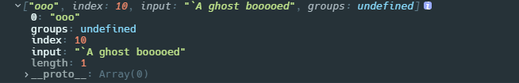

> `{n,}`：n 是正整数

指定`{n}`前面的一个字符至少连续出现`n`次，这个相比上一个就宽松了。`n`等于 1 的时候就是`+`

```javascript
console.log(/bo{3,}/.exec('A ghost booooed')); //boooo

console.log(/bo{5}/.exec('A ghost booooed')); //null
```

> `{n,m}`：n，m 是正整数，m>n

表示至少匹配`n`次，至多匹配`m`次

```javascript
console.log(/bo{1,3}/.exec('A ghost booooed')); //booo

console.log(/bo{1,2}/.exec('A ghost booooed')); //boo
```

##### 非贪婪

即在贪婪模式的后面加上一个问号`?`，**非贪婪模式会取贪婪模式的最小结果**，也就是说保持贪婪模式本身的含义，在此基础上一旦找到匹配就会停止。例如`+`本来的意思是至少匹配一次，那么`+?`就是只匹配一次，取最小结果

> `*?`

```javascript
var str = 'some <foo> <bar> new </bar> </foo> thing';

//贪婪的*会从<开始往后搜索，直到找不到>为止
var greedyPtn = /<.*>/; //<foo> <bar> new </bar> </foo>

//非贪婪从<开始，找到第一个>就停止匹配
var ptn = /<.*?>/; //<foo>
```

> `+?`

在`+?`前面的字符只匹配一次，但是不能没有

> `??`

在`??`前面的字符不会被匹配，也就是完全忽略了，匹配到的结果也不会包含该字符

```javascript
console.log(/bo??x/.exec('A ghost bx'));
```

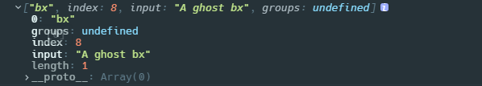

> `{n}?`

这个和`{n}`是一样的，必须匹配`n`次

> `{n,}`

在`{n,}`前面的字符只匹配`n`次

> `{n,m}`

在`{n,m}`前面的字符只匹配`n`次

#### Unicode 属性匹配

只能用在指定了`u`的正则表达式

> `\p{}`

对使用了`u`修饰符的正则表达式，支持使用符号`\p{}`基于字符的 Unicode 属性匹配，unicode 属性转义符可用于匹配表情符号 emoji，标点符号，字母（甚至包括来自特定语言或脚本的字母），可以在 ECMA 规范官网查询——[UnicodeMatchProperty](https://tc39.es/ecma262/#sec-runtime-semantics-unicodematchproperty-p)

```javascript
const sentence = 'A ticket to xxx costs ¥2000 👌.';

//匹配emoji
const regexpEmojiPresentation = /\p{Emoji_Presentation}/gu;
console.log(sentence.match(regexpEmojiPresentation)); // ["👌"]
```

> `\P{}`

和`\p{}`是相反的，匹配属性不是括号里指定的 Unicode 字符

### RegExp 类型

`RegExp`是 JS 中支持正则表达式的类型，每一个正则表达式都是`RegExp`的一个实例，其内部`[[prototype]]`属性指向`RegExp.prototype`

```javascript
var reg = /a+b/;
console.log(reg.__proto__);
console.log(reg.__proto__ === RegExp.prototype); //true
console.log(Object.prototype.toString.call(reg)); //[object, RegExp]
```

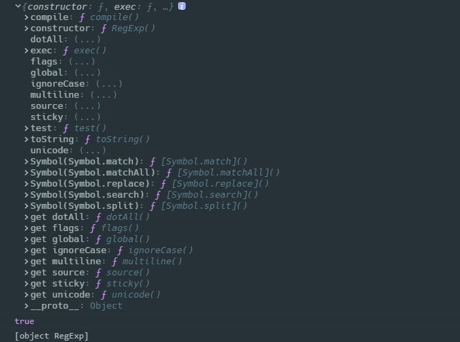

#### 创建正则表达式

正则表达式支持三种方式创建

> `/pattern/flags`

- 使用正则表达式字面量，在两条斜杠之间书写，注意**第一个字符不能是`*`**，结尾串接修饰符

```javascript
var re = /\w+/;
```

> `new RegExp(pattern,flags)`

- 使用`RegExp`构造函数和字面量

```javascript
var re = new RegExp(/\w+/, 'i');
```

> `new RegExp(str,flags)`

- 使用`RegExp`构造函数和正则表达式的字符串内容，对于内部包含的特殊字符必须要转义

```javascript
var re = new RegExp('\\w+', 'g');
```

使用字面量和构造函数的区别是：

- 在 ES3 的时候使用正则表达式字面量使用的都是同一个实例，而使用构造函数创建的是不同的实例，因为正则表达式在 JS 中式引用类型，所以使用同一个实例在正则表达式变化时会有很大麻烦；ES5 之后明确正则表达式字面量也要每次创建一个实例；
- 如果正则表达式不变，使用字面量形式性能更好；因为字面量形式就是正则表达式的编译状态，例如当你在循环中使用字面量构造一个正则表达式时，正则表达式不会在每一次迭代中都被重新编译

#### 构造函数

##### `RegExp(pattern,flags)`

> param1：`pattern`

支持传入正则表达式的字符串内容形式（就是两斜杠之间部分），也支持正则表达式字面量传入

> param2：`flags`

可以是单个修饰符，也可以是多个修饰符组成的字符串，也可以是单个元素组成的数组，这点我是看了 lodash 深拷贝部分才知道

```javascript
//下面三种方式都可以
var re = new RegExp(/\w+/, ['ig']);
var re = new RegExp(/\w+/, 'ig');
var re = new RegExp('w+', 'ig');

//不能拆开放在数组里，会抛出SyntaxError:Invalid flags supplied to RegExp constructor 'i,g'
var re = new RegExp(/\w+/, ['i', 'g']);
```

支持以下修饰符

- `g`：global，表示匹配字符串的全部内容，并非在发现第一个匹配项就结束匹配
- `i`：insensitive，不敏感，也就是不区分大小写
- `m`：multiline，支持多行字符串的匹配
- `u`：unicode，表示提供对 unicode 的支持，JS 中的字符串使用 UTF16 编码，大多数字符使用 2 个字节编码，但这种编码方式只能编码最多`2^16`个字符，所以就需要一些字符用 4 个字节来编码，当 JS 遇到这些字符的时候，会把它们当作两个字符来处理，所以这就会引发错误，支持 Unicode 后，JS 就不会把它们"分开"，而是当作整体；例外使用`u`还可以支持查找属性字符`\p{…}`的模式
- `y`：sticky，粘滞模式，只匹配`lastIndex`指示的索引位置的字符
- `s`：singleline，连换行符也会被匹配，这个模式要和`.`一起使用

**设置了`g`或者`y`的正则表达式是有状态的，每次匹配成功会更新`lastIndex`属性，使得下一次匹配只会从`lastIndex`索引位置开始搜索，直到找不到匹配项的时候，会将`lastIndex`重新置`0`**

##### 构造函数调用

根据原型相关知识，构造函数都支持两种方式调用

> `new RegExp()`

如果第一个参数为正则表达式字面量，而未指定任何`flags`，那么将使用该正则表达式的`flags`创建一个新的对象，**新对象的实例属性都会被重置**；如果传入了`flags`，那么将使用该`flags`创建一个新的正则表达式对象

```javascript
var str = 'cat,bat,sat,fat';
var reg = /at/g;
reg.exec(str);
console.log('reg.lastIndex:', reg.lastIndex);

var newReg = new RegExp(reg);
console.log('newReg:', newReg);
console.log('newReg.lastIndex:', newReg.lastIndex);
```

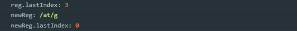

> `new regexp.constructor()`

使用正则表达式对象的`constructor`属性调用，因为`constructor`指向构造函数本身，就相当于掉用构造函数本身了

#### 构造函数属性

通过观察构造函数原型上的`constructor`属性，我们可以看到构造函数本身具有以下静态属性；这些属性适用于作用域种的所有正则表达式，并且基于所执行的最后一次正则表达式操作而变化；不过这些属性都是非标准的，不要在生产环境使用，例如`multiline`这个属性 JS 权威指南提了，但是现在已经从静态属性里面移除了

| 长属性名       | 短属性名                                      | 说明                                                       |
| -------------- | --------------------------------------------- | ---------------------------------------------------------- |
| `input`        | \$\_                                          | 最近一次要匹配的字符串                                     |
| `lastMatch`    | \$&                                           | 最近一次的匹配项                                           |
| `lastParen`    | \$+                                           | 最近一次匹配的捕获组                                       |
| `leftContext`  | \$` | input 字符串中 lastMatch 之前的所有文本 |
| `multiline`    | \$\*                                          | 布尔值，是否所有表达式都是用多行模式                       |
| `rightContext` | \$'                                           | input 字符串中 lastMatch 之后的所有文本                    |
|                | `$1~$9`                                       | 存储捕获组的字符，调用`exec`和`test`方法时，就会被自动填充 |

```javascript
var text = 'this has been a short summer';
var pattern = /(.)hort/g; //表示匹配后面带有hort的字符，并且把第一个字符放在捕获组中

if (pattern.test(text)) {
  console.log(RegExp.input); //this has been a short summer
  console.log(RegExp.lastMatch); //short
  console.log(RegExp.lastParen); //s
  console.log(RegExp.leftContext); //this has been a
  console.log(RegExp.multiline); //false
  console.log(RegExp.rightContext); // summer
}
```

#### 实例属性

实际上这里的属性都是定义在原型上的，应该是原型属性，可以通过`Object.getPrototypeOf(obj)`或者`obj.__proto__`来查看到这些属性

| 属性         | 说明                                                                                  | 是否支持修改 |
| ------------ | ------------------------------------------------------------------------------------- | ------------ |
| `global`     | 是否设置了`g`                                                                         | no           |
| `ignoreCase` | 是否设置了`i`                                                                         | no           |
| `lastIndex`  | 表示开始搜索下一匹配项的字符位置，从`0`开始，是上一次匹配字符串结尾的下一个字符的索引 | 支持         |
| `multiline`  | 是否设置了`m`                                                                         | no           |
| `source`     | 正则表达式字面量两边斜杠里面的字符串，这个值和`toString()`的结果不一样                |              |
| `flags`      | ES6+，正则表达式的修饰符                                                              | no           |
| `unicode`    | ES6+，是否设置了`u`修饰符                                                             | no           |
| `sticky`     | ES6+，是否设置了`y`修饰符                                                             | no           |
| `dotAll`     | ES6+，是否设置了`s`修饰符                                                             | no           |

#### 实例方法

##### [`RegExp.prototype.exec()`](https://developer.mozilla.org/zh-CN/docs/Web/JavaScript/Reference/Global_Objects/RegExp/exec)

查找正则表达式在字符串中的第一个匹配项，或者分组子模式的匹配项

> param：String

默认是传入要匹配的字符串，传入其他类型会被隐式转换成 String 类型；即使传入`null`和`undefined`也不会报错

> return：Array / `null`

如果字符串中没有找到匹配项，那么会返回`null`；如果找到匹配项，`exec()`会始终返回由第一个匹配项组成的数组，该数组还包含三个额外属性如下；如果正则表达式进行了分组，那么返回的结果数组中还会包含每个分组子模式的匹配项

- `index`：表示匹配项在字符串中的索引
- `input`：表示应用正则表达式的字符串
- `groups`：这是一个新的属性，当在匹配组使用`(?<Name>x)`指定了匹配组的名称时，就会把每组结果存在`groups`的属性名下；如果没有指定任何匹配组名称，这个值就是`undefined`，具体见分组中的`()`

对于不同的正则表达式模式，`exec()`方法还会执行一些额外操作

- 如果正则表达式指定全局模式`g`，`exec()`在找到匹配项后会更新正则表达式的`lastIndex`属性，此后如果再次调用`exec()`方法，只会从`lastIndex`位置搜索剩余的字符串部分，找下一个匹配项，直到找不到匹配项，此时`exec()`会将`lastIndex`重置为`0`；如果之前人为指定了`lastIndex`属性，那么`exec()`只会从`lastIndex`属性开始匹配

```javascript
var str = 'cat,bat,sat,fat';
var reg = /at/g;

console.log(reg.exec(str)); // ["cat", .....]

console.log(reg.exec(str)); // ["bat", .....]
console.log(reg.lastIndex); // 7

console.log(reg.exec(str)); // ["sat", .....]
console.log(reg.lastIndex); // 11

console.log(reg.exec(str)); // ["fat", .....]
console.log(reg.lastIndex); // 15

console.log(reg.exec(str)); // null
console.log(reg.lastIndex); // 0
```

- 如果正则表达式未指定全局模式`g`，那么每次调用`exec()`都只会返回第一个匹配项，即使为正则表达式指定了`lastIndex`属性，`exec()`也不会受影响，也不会更新`lastIndex`属性

```javascript
var str = 'cat,bat,sat,fat';
var reg = /\wat/;

reg.lastIndex = 7; //指定lastIndex

console.log(reg.exec(str)); // ["cat", .....]

console.log(reg.exec(str)); // ["cat", .....]
console.log(reg.lastIndex); // 7

console.log(reg.exec(str)); // ["cat", .....]
console.log(reg.lastIndex); // 7
```

##### [`RegExp.prototype.test()`](https://developer.mozilla.org/zh-CN/docs/Web/JavaScript/Reference/Global_Objects/RegExp/test)

测试字符串中是否包含正则表达式匹配项

> param：String

默认是传入要匹配的字符串，传入其他类型会被隐式转换成 String 类型；传入`null`和`undefined`都只会返回`false`

> return：Boolean

`test`相比`exec`要简单很多，`test`执行搜索，当字符串中存在匹配项时就返回`true`，不存在就返回`false`；`test`同样会受到全局模式`g`和属性`lastIndex`的影响，多次调用只会从`lastIndex`位置开始搜索，直到找不到匹配项时将`lastIndex`又重新置`0`

```javascript
var str = 'cat,bat,sat,fat';
var reg = /.at/g; //匹配非空格字符后面紧跟at两个字母的字符串

var isMatch = reg.test(str);
console.log(isMatch); //true
console.log(reg.global); //true
console.log(reg.ignoreCase); //false
console.log(reg.lastIndex); //3
console.log(reg.multiline); //false
console.log(reg.source); //.at

isMatch = reg.test(str);
console.log(isMatch);
console.log(reg.global);
console.log(reg.ignoreCase);
console.log(reg.lastIndex); //7
console.log(reg.multiline);
console.log(reg.source);
```

##### `Object.prototype.valueOf()`

返回正则表达式的字面量形式，它仍然是一个正则表达式对象

```javascript
var reg = /.at/g;

console.log(reg.valueOf()); //    /.at/g
```

##### `Object.prototype.toString()`

`toString`方法会返回正则表达式的字面量形式的字符串，这个值和`source`不一样

```javascript
var reg = /.at/g;

console.log(reg.toString()); // 	   "/.at/g"
```

### 正则表达式匹配的几种方法

#### `RegExp.prototype.exec()`

#### `RegExp.prototype.test()`

#### [`String.prototype.match()`](https://developer.mozilla.org/en-US/docs/Web/JavaScript/Reference/Global_Objects/String/match)

查找正则表达式在源字符串中的匹配项，如果正则表达式使用全局匹配模式，那么会返回所有匹配项

> param：RegExp

如果括号内传入的对象非正则表达式，会调用`new RegExp()`去转换成一个正则表达式

> return：Array / `null`

`match()`返回的结果和`exec()`有些许相似

- 如果正则表达式指定了全局模式`g`，`match()`会找到所有匹配项，然后组成数组返回；但是不会更新正则表达式的`lastIndex`属性，返回的数组也没有三个额外属性，即多次调用返回的结果也是一样的

```javascript
var str = 'cat,bat,sat,fat';
var reg = /\wat/g;

console.log(str.match(reg)); // ["cat", "bat", "sat", "fat"]
console.log(reg.lastIndex); // 0

console.log(str.match(reg)); // ["cat", "bat", "sat", "fat"]
console.log(reg.lastIndex); // 0
```

- 如果正则表达式未指定`g`，那么会始终返回由第一个匹配项组成的数组，如果正则表达式有分组，也会包含分组匹配项，同时该数组也具有三个属性，这时候就和调用`exec()`结果得到的一样
  - `index`：第一个匹配项在字符串中的索引
  - `input`：表示前面要匹配的字符串
  - `groups`：命名捕获组对象，如果没有使用过`(?<name>)`命名捕获组，这个值是`undefined`

```javascript
var str = 'cat,bat,sat,fat';
var reg = /at/;

var execArray = reg.exec(str);
var matchArray = str.match(reg);
console.log('exec:\r\n %o', execArray);
console.log('match:\r\n %o', matchArray);
```

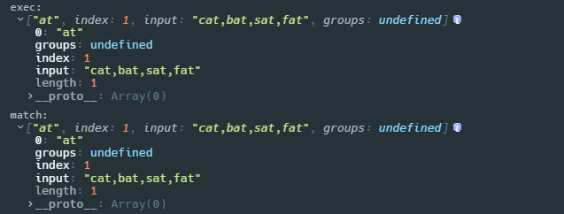

#### [`String.prototype.matchAll()`](https://developer.mozilla.org/en-US/docs/Web/JavaScript/Reference/Global_Objects/String/matchAll)

查找正则表达式在源字符串中的所有匹配项

> param：RegExp

`matchAll`只能用在设置了全局模式`g`的正则表达式，如果没设置`g`，会抛出`TypeError`(String.prototype.matchAll called with a non-global RegExp argument)的错误；如果所传参数不是一个正则表达式对象，则会隐式地使用 `new RegExp(obj)` 将其转换为一个正则表达式

> return：iterator

`matchAll`会返回一个包含匹配正则表达式整体的匹配项和各个分组子模式的匹配项；`matchAll`就相当于在内部多次调用`exec()`并返回其值；`matchAll`内部对传入的正则表达式做了一个复制，因此不会更新`lastIndex`属性

```javascript
var str = 'cat,bat,sat,fat';
var reg = /(?<group>\wat)/g;

console.log('matchAll:\r\n %o', [...str.matchAll(reg)]);
```

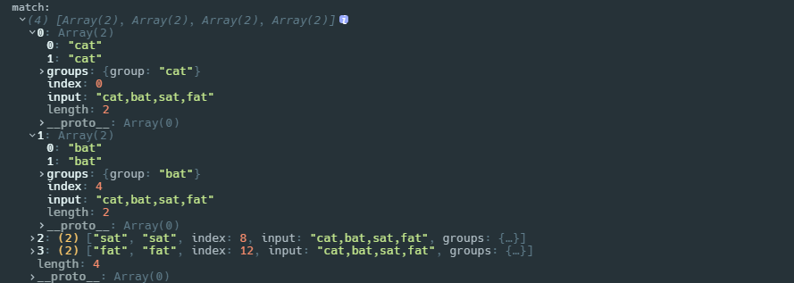

```javascript
var str = 'cat,bat,sat,fat';
var reg = /(cat),(bat),(sat)/g;

console.log('matchAll:\r\n %o', [...str.matchAll(reg)]);
```

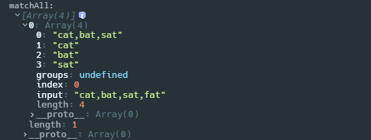

我们可以使用`Array.from`获取迭代每次返回的结果，然后存入数组，就得到了正则表达式在字符串中的所有匹配项

```javascript
var str = 'cat,bat,sat,fat';
var reg = /(?<group>\wat)/g;

var matchArr = Array.from(str.matchAll(reg), m => m[0]);
console.log(matchArr);
```

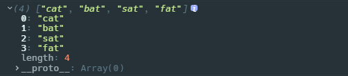

#### [`String.prototype.search()`](https://developer.mozilla.org/en-US/docs/Web/JavaScript/Reference/Global_Objects/String/search)

查找正则表达式在源字符串中第一个匹配项的索引

> param：RegExp

如果所传参数不是一个正则表达式对象，则会隐式地使用 `new RegExp(obj)` 将其转换为一个正则表达式

> return：Number / `-1`

`search()`方法会搜索在字符串在正则表达式中的匹配项，如果找不到就返回`-1`；如果找得到就返回第一个匹配项的索引位置；所以可以使用`> -1`来判断字符串是否匹配该正则表达式

```javascript
var str = 'cat,bat,sat,fat';
var reg1 = /at/;
var reg2 = /\d/;

console.log(str.search(reg1)); // 1
console.log(str.search(reg2)); // -1
```

#### [`String.prototype.replace()`](https://developer.mozilla.org/en-US/docs/Web/JavaScript/Reference/Global_Objects/String/replace)

使用替换字符串去替换源字符串中匹配的内容，并返回新的字符串

> param1：RegExp / String

如果第一个参数是一个字符串，那么源字符串中仅第一个匹配项会被替换；

如果第一个参数是正则表达式，根据模式的不同，源字符串中被替换的部分也不同

- 如果正则表达式指定了全局模式`g`，那么会将源字符串中所有匹配项都替换掉
- 没有指定就只替换第一个匹配项

> param2：String / Function

如果该参数是一个字符串，并且第一个参数是正则表达式，则可以在该字符串中使用`$`加数字，表示与正则表达式中的捕获组相匹配的字符串的引用。如下，正则表达式匹配到字符串的`cat,bat`部分，内部两个捕获组分别匹配到`cat`和`bat`，`replace`的第二个参数使用`$2`引用了第二个捕获组匹配到的`bat`，组合成替换项`abcbat`

```javascript
var str = 'cat,bat,sat,fat';
var reg = /(\wat),(\wat)/;

var newStr = str.replace(reg, 'abc$2');
console.log(newStr); // abcbat,sat,fat
```

如果该参数是一个函数，函数的返回值将作为替换字符串；并且如果第一个参数是指定了全局匹配模式`g`的正则表达式，那么这个函数会被多次调用，即正则表达式每找到一个匹配项，就会调用该函数一次；该函数会接收以下参数

- `match`：当前匹配项字符串
- `p1,p2, ...`，如果正则表达式指定了捕获组，则也会包含这些捕获组的匹配项
- `index`：当前匹配项在源字符串中的索引
- `source`：源字符串

```javascript
var str = 'cat,bat,sat,fat';
var reg = /(\wat)/g;

var newStr = str.replace(reg, function() {
  console.log(arguments);
});
```

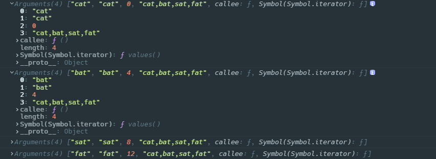

利用全局匹配模式的正则表达式和传入函数，我们可以实现分步处理一个字符串，例如

```javascript
var str = 'get-element-by-id';
var newStr = str.replace(/-\w/g, function(matchStr) {
  console.log(matchStr); // -e   -b   -i
  return matchStr.substring(1).toUpperCase();
});

console.log(newStr); // "getElementById"
```

> return： String

`replace()`最终会返回替换过后的字符串，`replace()`不会改变源字符串，毕竟字符串在 JS 中一旦声明也没有任何方法可以改变

#### [`String.prototype.split()`](https://developer.mozilla.org/zh-CN/docs/Web/JavaScript/Reference/Global_Objects/String/split)

将字符串按照指定的分隔字符串所在的位置，拆分成一个数组

> param1：String / RegExp，分隔字符串

如果不传这个参数，或者在源字符串中没找到，会返回只包含一个源字符串的数组；如果源字符串是空字符串`""`，分隔字符串也是空字符串`""`，会返回空数组

```javascript
console.log(''.split()); // [""]

console.log(''.split('')); // []
```

如果是单个字符组成的字符串，就找到字符位置，前后拆开就行了；

```javascript
var str = 'cat,bat,sat,fat';
var reg = 't';

var newStr = str.split();
console.log(newStr); // ["ca", ",ba", ",sa", ",fa", ""]
```

如果是多个字符组成的字符串，那么就需要整个字符串匹配；

```javascript
var str = 'cat,bat,sat,fat';
var reg = 'at';

var newStr = str.split(reg);
console.log(newStr); // ["c", ",b", ",s", ",f", ""]
```

如果这个参数字符串中的最后一个字符在源字符串的结尾，或者参数字符串中的第一个字符在源字符串的开头，拆开的数组中都会包含一个空字符串`""`，如上文例子

```javascript
var str = 'cat,bat,sat,fat';
var reg = 'c';

var newStr = str.split(reg);
console.log(newStr); // ["", "at,bat,sat,fat"]
```

如果传的是空字符串`""`，会把源字符串拆成 UTF16 形式的字符组成的数组

```javascript
var str = 'cat,bat';

var newStr = str.split('');
console.log(newStr); // ["c", "a", "t", ",", "b", "a", "t"]
```

如果传入的是一个正则表达式，始终按照全局模式匹配找到所有分隔的部分，带不带`g`都一样

```javascript
var str = 'cat,bat,sat,fat';

var newStr = str.split(/at/);
console.log(newStr); //["c", ",b", ",s", ",f", ""]
```

> param2：Number，非负整数

限制返回数组中的项

```javascript
var str = 'cat,bat,sat,fat';

var newStr = str.split('t', 2);
console.log(newStr); // ["ca", ", ba"]
```

> return：Array

`split`始终会返回一个数组，空对空也会返回一个空数组

### 正则表达式的复制

由于正则表达式的实例属性，要想复制一个正则表达式，不仅要注意修饰符，更要保持`lastIndex`属性的一致；所以思路是

- 使用`RegExp`构造函数

```javascript
function cloneRegExp(source) {
  var newRegExp = new RegExp(source, source.flags);
  newRegExp.lastIndex = source.lastIndex;
  return newRegExp;
}
```

### 常用正则表达式

#### 匹配所有字符

```javascript
/[\s\S]/;
```
