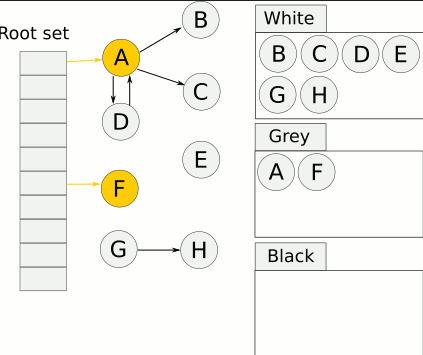
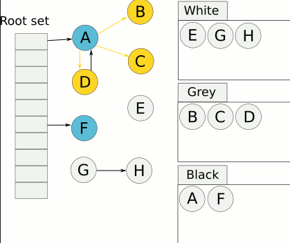
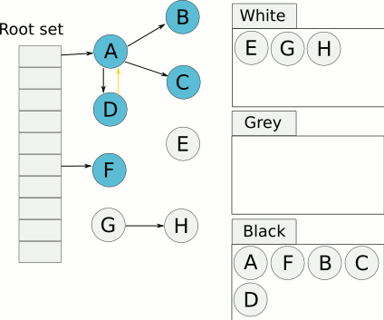
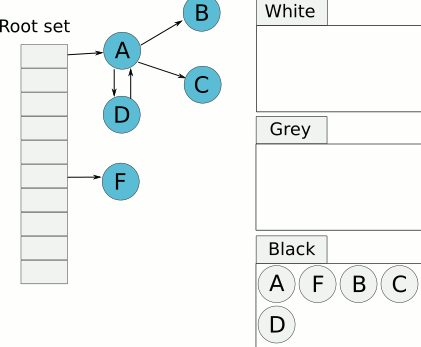
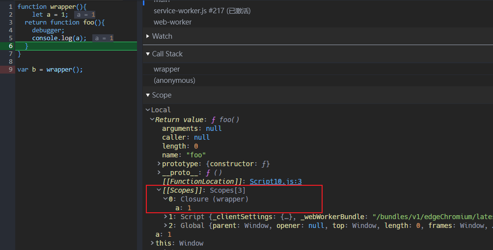

## JS 的内存管理

语言运行时声明的变量，函数，以及它们的数据都需要为其分配内存，执行时需要从内存中取出数据，使用完了再释放内存，释放内存的过程称为垃圾回收（GC，garbage collection）。

JS 分配内存的方式总的来说就是两种：栈空间和堆空间。

对于原始类型（Boolean，String，Number，BigInt，Symbol，Null，Undefined）的数据，随着执行上下文的创建，它们的值被保存在变量对象中，随着执行上下文压入执行上下文栈内，所以可以认为它们的值是保存在栈上的；

而对于引用类型 Object 及其衍生的其它引用类型的值，将会在堆中分配内存并保存它们的实际值，然后将内存地址的引用地址值传递给变量来保存，所以需要为它们分配两种类型的内存空间。

这种分配内存的方式，有以下好处：

- 栈空间的执行效率更高，执行上下文通过执行上下文栈来管理，一个函数执行完出栈就能立即回收函数内部使用的局部变量的内存；
- 堆空间负责保存占用内存较大的数据，使用引用同一内存内相同值的方式来节省内存空间，同时也为垃圾回收减轻压力；
- 从底层的 C++角度来看，栈是操作系统提供的数据结构，计算机底层对栈提供了一系列支持：分配专门的寄存器存储栈的地址，压栈和入栈有专门的指令执行；而堆是由 C/C++函数库提供的，机制复杂，需要一些列分配内存、合并内存和释放内存的算法，因此效率较低。

### GC

JS 的引擎会自动进行垃圾回收的过程，使用垃圾回收器来处理。过去的 JS 引擎经常采用的是标记 - 清除的算法来进行垃圾回收：

- 标记阶段，假定设置一个叫做根（root）的对象（在 Javascript 里，根是全局对象），从 root 开始查找对象引用关系，对根引用的对象进行标记，标识这个对象是有用的，接下来，该对象引用的对象也会被打上标记；
- 清除阶段，从头到尾扫描内存，检查所有可用的块，没有被标记的变量或者对象都被清除，释放内存，被标记的对象则清除标记，准备下一次执行使用。

传统的标记 - 清除方法具有几个缺点：

- 最明显的是进行标记 - 清除算法的时候，JS 的执行需要暂停，等待垃圾回收程序工作完再继续执行。这种情况在过去计算机硬件不够强大的时候，尤为严重，也就是当需要回收的内存很多或者垃圾回收器执行慢时，将直接造成程序卡顿；
- 此外，必须检查整个工作内存，其中大部分都要检查两次，从而可能导致分页内存系统出现问题

现在的 JS 引擎实现的是一种三色标记的方法 —— [Tri-color marking](https://en.wikipedia.org/wiki/Tracing_garbage_collection#Tri-color_marking)：

- white set，表示可以回收其内存的候选变量；
- black set，从 root 开始可以访问到，并且没有引用 white set 里的变量，black set 都不需要进行垃圾回收；
- gray set，表示 root 引用的变量，但是尚未扫描其是否还引用着 white set 里的变量，由于它们是 root 引用的，所以还有用，因此无法对其进行垃圾收集，在扫描后将放到 black set 中。

根据三色标记改进后的标记清除算法如下：

- 从 gray set 中选择一个对象，然后将其移至 black set；



- 然后将该对象引用的每个 white set 中的变量移入 gray set，确保其引用的变量不会被回收掉；



- 重复上述两个步骤，直到 gray set 扫描完，就可以回收 white set 里的变量了。



三色标记的方法相比传统的标记-清除算法，最大的突出特点是可以随时执行，并且不用停止 JS 的执行，通过在分配对象时就是确定其所在的集合，并且监视集合的大小，系统可以定期（而不是根据需要）执行垃圾收集。

## 内存泄漏

> [memory-management](https://blog.sessionstack.com/how-javascript-works-memory-management-how-to-handle-4-common-memory-leaks-3f28b94cfbec)

内存泄漏（Memory leak）指的是**因为程序错误导致未能释放已经不再使用的变量的内存**。

初次接触这个名词是在 JS 高级程序设计里指出的旧版本 IE 无法正确回收闭包占用内存的问题，这个问题在现代浏览器已经不存在了，在介绍作用域的文章里我实际测试过，闭包中用不到的变量将会被回收。

JS 由于是自动管理内存的语言，导致很多时候开发者不会关心代码是否会带来内存泄漏的问题。以下情况可能带来内存泄漏问题：

- 定义变量的格式不规范。**JS 在非严格模式下，变量可以不经过声明就直接初始化使用**，尤其是在函数体内不适用`var`等关键字声明变量的情况，如下。这种情况将导致调用完函数以后，变量仍然保存全局对象（`window`）的属性中，并且存在于当前页面的整个生命周期中，直到页面刷新或者关闭，变量才会随着全局对象一起被回收。

```javascript
// 直接初始化 a
function f() {
  b = 1;
}

f();
console.log(b);
```

- 不当的闭包使用，闭包会保存作用域链中的变量对象，这种机制是在函数定义的时候就确定的。现代浏览器一般会针对闭包进行优化，在闭包中用不到的变量会被回收而不保存在`[[scope]]`属性中，但是如果手欠调试用了一个变量放在`console.log`里就会引起内存泄漏，实际上这个外部作用域的变量根本用不到

```javascript
function wrapper() {
  let a = 1;
  return function() {
    console.log(a);
  };
}

var b = wrapper();
```



## React 内存泄漏

在 React 中下面操作会导致组件卸载：

- 通过改变组件的`state`卸载内部的子组件
- 通过路由跳转

组件卸载的时候，如果不在`componentWillUnmount`生命周期中处理一些事件或者方法，很容易造成内存泄漏：

- **事件监听**，最常见的当前组件内部监听`scroll`事件，但是卸载组件以后，`scroll`事件监听仍然存在，对于其它组件来说，这是无用的，所以需要在添加事件监听的组件内部使用`removeEventListener`移除掉；
- **定时器**，和上面是一个道理，通过`clearTimeout`或者`clearInterval`清除；
- **异步请求**，这个十分常见！向某个 API 接口发起了异步请求，希望在收到响应后，根据响应的内容，调用组件的 `this.setState()` 来更新状态；但是在请求结束之前，组件已经被卸载了。

前面两个还算简单，要在**异步请求**中判断当前组件时候被卸载了，网上还有很多讨论：

> [how-to-cancel-a-fetch-on-componentwillunmount](https://stackoverflow.com/questions/49906437/how-to-cancel-a-fetch-on-componentwillunmount)

这个做法是给一个全局的属性标记，判断当前组件是否卸载，`Promise`也可以按照这种方式来处理

```jsx | pure
class News extends Component {
  _isMounted = false;

  constructor(props) {
    super(props);

    this.state = {
      news: [],
    };
  }

  componentDidMount() {
    this._isMounted = true;					//设置标记变量

    axios
      .get('xxx')
      .then(result =>
        this.setState({
          news: result.data.hits,
        }),
      );
  }

  componentWillUnmount() {
    this._isMounted = false;				//标记
  }

  render() {
    ...
  }
}
```

社区还有人专门写了一个库 —— [abortcontroller-polyfill](https://github.com/mo/abortcontroller-polyfill)，处理 fetch 在`componentWillUnmount`里面取消。

```shell
yarn add abortcontroller-polyfill -D
```

```jsx | pure
import { AbortController } from 'abortcontroller-polyfill/dist/polyfill-patch-fetch';

class FetchComponent extends React.Component {
  state = { todos: [] };

  controller = new AbortController();

  componentDidMount() {
    fetch('xxx', {
      signal: this.controller.signal,
    })
      .then(res => res.json())
      .then(todos => this.setState({ todos }))
      .catch(e => alert(e.message));
  }

  componentWillUnmount() {
    this.controller.abort();
  }

  render() {
    return null;
  }
}
```
