## 作用域

### 标识符

标识符是用户编程时使用的名字，用于给变量、常量、函数、语句块这些实体等命名，以建立起名称与使用之间的关系。

### 什么是作用域

作用域来自于英文单词 scope，其实我觉得它翻译成标识符的绑定范围更好理解一点，它是用来限制标识符和变量，函数等绑定关系生效的范围。

标识符是使用数字，字母，下划线等符号组成的符号，在程序执行的过程中，需要不断地去解析标识符，获取它们绑定的变量，函数等实体，而代码中同一个标识符可以和不同的变量，函数发生绑定关系，如何保证他们之间相互不受影响呢？这就是作用域的限制，在当前作用域内，标识符只能和其内部的变量，函数等具有绑定关系，如果跳出作用域通过标识符获取变量，函数等可能就会出错。

```javascript
function foo1() {
  var a = 1;
}

console.log(a); // Uncaught ReferenceError: a is not defined
```

在 JS 中，上文有一个函数 foo1，里面声明了变量`var a = 1`，此时标识符`a`绑定的实体是`1`，**它们之间的绑定适用范围就是 foo1 这个函数体内**，出了这个函数体，`a`和实体`1`的绑定就不生效了，你无法通过`a`来引用`1`，所以**`a`的 scope 就是 foo1 这个函数体**。

那么作用域和变量的生命周期有什么不同吗？应该是作用域可以看作生命周期的子集，在大多数面向对象的编程语言中可以在类中定义静态成员，静态成员在整个程序的运行过程中就会存在，也就是在类的编译过程中就会生成，但是静态成员却不能在声明之前被访问，所以它的作用域只是从声明位置开始向下的代码范围内。

### 词法作用域和动态作用域

词法作用域：`lexical scope`/`static scope`，词法作用域取决于标识符定义在源代码中的位置，这里对应的也叫词法环境或者叫词法上下文，在词法作用域中，标识符的解析是沿着其定义时的包含块或者函数体来一级一级搜索的过程；动态作用域：`dynamic scope`，取决于程序执行上下文或者叫调用上下文，标识符的解析是沿着调用函数来一级一级搜索的过程。

## JS 里的作用域

JS 使用的是词法作用域来解析大部分标识符，但是 JS 也会使用动态作用域，比如说`this`

> JS 引擎没有预编译操作，在部分文章里用预编译这样的词语来生成 JS 的声明提前发生在预编译阶段，预编译是指把存储在不同文件中的源程序聚合在一起，把被称为宏的缩写语句转换为原始语句
>
> 可以看一下这个问题的解释 —— [JavaScript 有预编译吗](https://www.zhihu.com/question/29105940)

### 块作用域

在 ES6 以前，JS 没有块级作用域，指的是`for`，`if`这样的代码块声明的变量在执行完代码块以后仍然存在标识符和数据的绑定关系；包括`try/catch`的`catch`这样的语句块，在`try`或者`catch`里声明的变量都能在外部访问到。

> 在《你不知道的 JS》里提及到了`with`和`try/catch`的`catch`分句这两点可以产生块级作用域，实际上`catch`分句并不能产生块级作用域，它只是限制了 catch 捕获的错误变量的作用域，在`catch`中声明的变量，在`catch`后面仍然能访问。

```javascript
for (var i = 0; i < 3; i++) {}

console.log(i); // 3

if (1) {
  var a = 1;
}

console.log(a); // 1

try {
} catch (e) {
  var a = 1;
}

console.log(e); // ReferenceError
console.log(a); // 1

(() => {
  let x, y;
  try {
    throw new Error();
  } catch (x) {
    x = 1;
    y = 2;
    console.log(x); // 1；这个x的作用域是catch块内部，根据作用域链的查询，其覆盖了外层的x
  }

  console.log(x); // undefined
  console.log(y); // 2
})();
```

可以使用 IIFE 来模拟块级作用域，将`for`循环这样的代码块放在 IIFE 里，这样 IIFE 在自动执行完就会销毁函数作用域中的变量

```javascript
(function() {
  for (var i = 0; i < 3; i++) {
    var a = 1;
  }
})();

console.log(a); //Uncaught ReferenceError: a is not defined
```

在 ES6 以后，引入了块级作用域，使用`let`或`const`声明的变量在`{}`的语句块内具有块级作用域，并且`let`和`const`还会引起暂时性死区的问题，如果区块中存在`let`和`const`命令，这个区块对这些命令声明的变量，从一开始就形成了封闭作用域；**凡是在声明之前就使用这些变量，就会报错**，即使全局作用域中声明了，也一样报错。

```javascript
{
  let a = 1;
  ...
}

console.log(a);									//Uncaught ReferenceError: a is not defined

var tmp = 123;
if (true) {
  tmp = 'abc'; 								// ReferenceError
  let tmp;
}
```

以下代码块内部可以配合`let`和`const`产生块级作用域

```javascript
for
if
switch
try/catch/finally
```

ES6 还提出了`class`关键字，用来声明类，在类的内部实际上也是一个块级作用域。

### 函数作用域

函数作用域本身没什么特殊性，但是上文提到 JS 在执行之前会有编译阶段，函数体内会发生声明提前的操作。

### 模块作用域

ES6 同时也引入了模块文件的属性，对`script`标签使用`type=module`的属性，就会将标识符的声明限定在`script`的标签内，在之前的 HTML 文件中，多个`script`定义的变量会相互影响，如果使用`type=module`属性就可以避免这种情况

```html
<script type="text/javascript">
  let a = 1;
</script>
<script type="text/javascript">
  console.log(a); // 1
</script>

//不会影响下文的script
<script type="module">
  var a = 1;
</script>
<script type="module">
  console.log(a); // Uncaught ReferenceError: a is not defined
</script>
```

但是`type=module`的兼容性不好，IE 全家表示不支持。

### 全局作用域

再往模块文件之上就是全局作用域，多个 script 标签它们都是在一个全局作用域下，具有全局作用域的变量和函数在代码中的任何位置都有定义。

## 作用域链

每个函数体内都有一个私有属性`[[scope]]`，保存着当前函数执行上下文的活动对象和外层作用域内的变量对象，在函数体内遇到变量时，就会按照作用域链一级一级搜索变量声明的位置。

例如下段代码的`color`的查找过程，`color` ——> 函数`swapColors`的作用域 ——> 函数`changeColor`的作用域 ——> 全局作用域，最后在全局作用域找到了声明，如果在全局作用域也找不到声明，那么就会抛出`ReferenceError`的错误

```javascript
var color = 'blue'; // 全局作用域
function changeColor() {
  var anotherColor = 'red'; // hangeColor函数作用域
  function swapColors() {
    var tempColor = anotherColor; // swapColors函数作用域
    anotherColor = color;
    color = tempColor;
  }

  swapColors();
}

changeColor();
```

注意这是一个搜索到即停止的过程，由于声明提升的原因，使用`var`声明的变量或者函数声明都会被提升到作用域顶部

```javascript
var a = 1;
function foo() {
  console.log(a); // undefined
  a = 2;
  var a = 3;
  console.log(a); // 3
}

foo();

console.log(a); // 1
```

如果我们去掉函数作用域内的声明，那么在函数作用域内找不到这个变量，就会往外层全局作用域搜索`a`，这时候函数体内操作的就是全局作用域的变量`a`

```javascript
var a = 1;
function foo() {
  console.log(a); // 1
  a = 2;
  console.log(a); // 2
}

foo();

console.log(a); // 2
```

### 声明提升

声明提升（Declarations Hoisted），**是指使用`var`声明的变量或者使用`function`声明的函数在函数作用域或者全局作用域中都具有定义的现象**。函数在声明前调用不会抛出未找到引用地址的错误`ReferenceError`，而变量在声明前访问也不会报错，会得到`undefined`。

声明提升大致有以下规则：

- 变量的声明提升，使用`var`声明的变量总是会被提升到当前作用域顶部，提前访问会得到`undefined`

```javascript
function foo() {
  a = 1;
  var a;
  console.log(a); // 1
}

foo();
```

- 函数的声明提升，会将整个函数的实现提升到作用域顶部，即使声明之前调用函数也不会报错；

```javascript
f(); // 1

function f() {
  foo();
  function foo() {
    console.log(1);
  }
}
```

- 函数声明提升优先级高于同名变量的声明提升；这是个容易误区的点，声明提升并不代表执行提前，JS 的执行仍然是按照代码顺序从上往下执行的，遇到变量赋值会执行赋值，遇到函数调用会进入函数体执行函数，函数声明在执行阶段会被跳过；所以在后续的执行过程中，变量声明仍然会覆盖函数声明的结果

```javascript
console.log(f); //function f(){}

var f = 1;
function f() {}

console.log(f); // 1
```

- ES6 规范中的`let`或者`const`声明的变量没有声明提升的现象，只要见到在`let`声明的变量之前使用了变量，就是抛出异常`ReferenceError`

```javascript
var tmp = 123;

if (true) {
  tmp = 'abc'; // ReferenceError
  let tmp;
}
```

### 使用 devtool 观察 scope

变量的作用域在 Chrome 的 devtool 中是可以被观察的，devtool-source-Scope 窗格可以观察当前变量所在作用域的情况，具体见[按作用域查看属性](https://developers.google.com/web/tools/chrome-devtools/javascript/step-code?hl=zh-cn#scope)，以下面这段代码的执行为例

```javascript
var color = 'blue';
function changeColor() {
  var anotherColor = 'red'; // hangeColor函数作用域
  function swapColors() {
    var tempColor = anotherColor; // swapColors函数作用域
    anotherColor = color;
    color = tempColor;
  }

  swapColors();
}

changeColor();
```

- 代码会从给全局作用域内的函数调用开始执行，在`changeColor`的内部打上断点，Scope 窗格里显示了三个作用域，`local`就是当前作用域，然后是`script`，最后是全局作用域`Global`；当前作用域也就是函数`changeColor`的作用域，有三个声明，并且`anotherColor`的执行未结束，它的值还是`undefined`，并且`swapColor`已经有了函数声明，这能直观的看见声明提升的过程

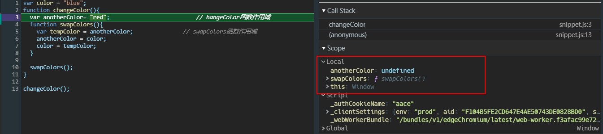

- 继续往下执行，会跳过函数声明的部分，来到`swapColor`调用位置，然后进入`swapColor`的作用域中，可以看到作用域中只有`tempColor`的声明，也是`undefined`

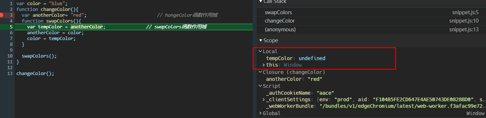

- 执行完`tempColor`赋值操作，它才有值

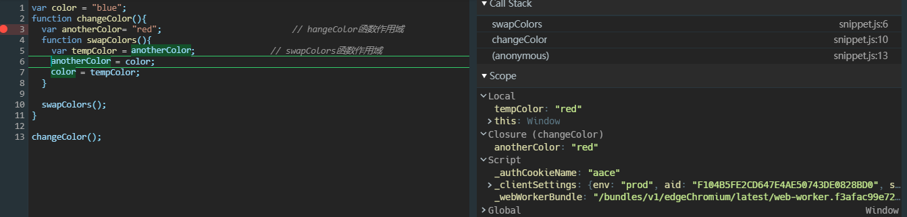

## 闭包

闭包翻译自`Closure`，这是一个从字面意思理解容易掉坑里的词语，它不是 JS 独有的概念，ES 规范里也没有提及它，具体可以参看以下 wiki 中对闭包的解释——[Closure](<https://zh.wikipedia.org/wiki/闭包_(计算机科学)>)，我觉得它算是一种编程手段，一种解决问题的方式。

从定义上来看，闭包就是携带执行环境的函数，任何函数都具有执行环境，理论上任何函数都能成为闭包。

由于作用域的限制，某个函数作用域中的变量声明，其它作用域都无法直接获取，一般来说，当函数执行完，其内部的活动对象就会被销毁，但是闭包不是，从上文作用域链的角度来看，函数在声明的时候就已经将作用域链保存在`[[scope]]`属性中，当函数被调用时，总是从`[[scope]]`属性复制对象作为执行上下文的作用域链，所以在任何时候调用都能从作用域链中搜索到外层包裹函数内部的成员。

```javascript
function f(a) {
  function foo() {
    return a;
  }

  return foo;
}

f(1)();
```

- 当执行完`f`后，返回`foo`继续执行时，可以看到`f`的参数已经被销毁了，`arguments`为 null；但是返回的`foo`已经将`f`的参数状态保存在了`[[scope]]`属性中，依然可以获取到变量`a`（这里有个小技巧，在 Scope 窗格没办法直接观察到闭包内部状态，可以通过语句`console.log()`打印函数自身，就会显示在当前作用域中了）

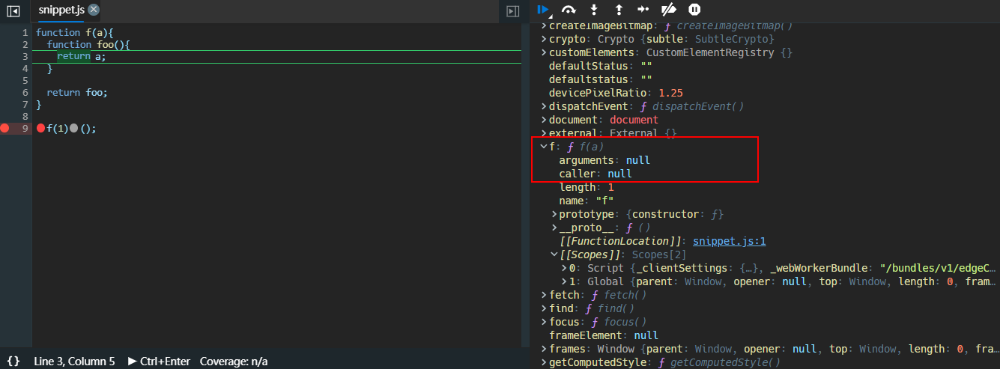

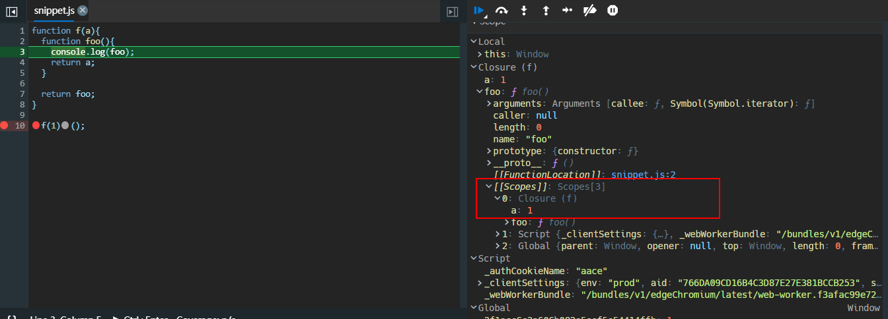

### 闭包应用场景

在日常的代码中使用闭包的场景非常多，可能在使用函数的地方用了以后都没意思到这是一个闭包，例如下文中 DOM 事件回调函数的处理，如果不了解闭包，实在无法理解为什么循环内声明的函数都会共享一个变量。

#### setTimeout 回调

包括 DOM 事件回调，计时器回调，或者将函数作为参数传递到其它函数中执行之类的，如果使用到了包裹函数中的变量，那么就构成闭包了，当然这时候就要注意是否使用循环的问题了

```javascript
function wapper() {
  var a = 1;
  setTimeout(function() {
    console.log(a);
  }, 2000);
}

// 传递参数，super就是这么实现的
function wapper(a) {
  return function() {
    console.log(a);
  };
}

function f(fn) {
  fn();
}

f(wapper(1)); // 1
```

#### 实现私有成员

```javascript
var Counter = (function() {
  var privateCounter = 0;
  function changeBy(val) {
    privateCounter += val;
  }
  return {
    increment: function() {
      changeBy(1);
    },
    decrement: function() {
      changeBy(-1);
    },
    value: function() {
      return privateCounter;
    },
  };
})();

console.log(Counter.value()); /* logs 0 */
Counter.increment();
Counter.increment();
console.log(Counter.value()); /* logs 2 */
Counter.decrement();
console.log(Counter.value());
```

#### lazy loading function

延迟加载函数，在 JS 高级程序设计中被称为**惰性载入函数**，是一种提高代码性能的编程手段。这种情况多**使用在 API 兼容性判断**上，当需要判断是否是浏览器支持的 API 时，往往需要使用`if...else`的情况来选择最终使用的 API，这时候为了避免每次调用都会去一个一个判断，那么就可以使用惰性载入函数。

实现惰性载入函数的方式是在函数体内对自己的定义进行重写，这样如果函数在被调用一次后，函数本身的定义就会发生变化，在下一次再次调用的时候就会使用重写的定义去执行，于是就避免了每次执行都去判断。比较常见的是，babel 编译器大量使用了这种惰性载入函数去判断 API 的兼容性。

```javascript
//判断浏览器是否支持ES6方法Object.setPrototypeOf，如果不支持就使用__proto__
function _setPrototypeOf(o, p) {
  _setPrototypeOf =
    Object.setPrototypeOf ||
    function _setPrototypeOf(o, p) {
      o.__proto__ = p;
      return o;
    };
  return _setPrototypeOf(o, p);
}
```

#### 实现高阶函数

比如说实现`Function.prototype.bind()`方法，`bind`接收一个`this`值和参数列表，返回一个指定了`this`值的新函数

```javascript
//简单实现bind
function bind(fn, _this) {
  return function() {
    fn.apply(_this, arguments);
  };
}
```

或者函数柯里化（function currying）的实现，函数柯里化是创建一个已经设置好了一个或者多个参数的函数

```javascript
function curry(fn) {
  var args = Array.prototype.slice.call(arguments, 1);
  return function() {
    var inenrArgs = Array.prototype.slice.call(arguments);
    var finalArgs = args.concat(inenrArgs);
    return fn.apply(null, finalArgs);
  };
}

function add(num1, num2) {
  return num1 + num2;
}

var curriedAdd = curry(add, 5, 12);
curriedAdd(); // 17
```

### 闭包注意点

#### 在循环中创建闭包

闭包只会取得包含函数中任何变量的最后一个值，我个人觉得最容易发生这种错误的场景是在 DOM 事件回调函数声明中

```html
<p>E-mail: <input type="text" id="email" name="email" /></p>
<p>Name: <input type="text" id="name" name="name" /></p>
<p>Age: <input type="text" id="age" name="age" /></p>

<script>
  (function() {
    var inputs = document.querySelectorAll('input');
    for (var i = 0; i < inputs.length; i++) {
      inputs[i].onfocus = function foo(e) {
        console.log(foo);

        inputs[i].after(e.target.id);
      };
    }
  })();
</script>
```

首先这段代码`focus`处理的时候会报错昂，正是因为报错才更清楚问题所在，从运行过程来看：

- 首先，**`var`声明的变量在`for`循环内不会产生块级作用域，不会被限制在`for`循环内而被提升到函数作用域中**，这点很重要，可以看到只有两个作用域，迭代变量`i`处于函数作用域中

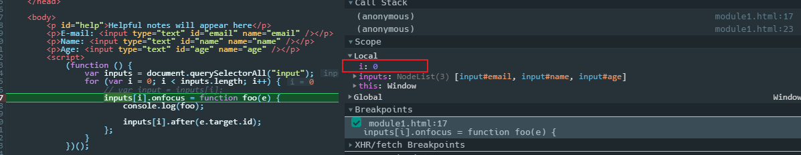

- 然后即使每次循环都为`onfocus`指定一个新的函数，但是每个函数内部的作用域链只有两层，包裹函数的作用域和全局作用域，并且作用域链会保存下来，所以最后实际每个函数使用的都是同一个迭代变量`i`，并且循环完`i`的最后一个值也被保存在了闭包的作用域链中；这点可以在 devtool 里观察到`onfocus`赋值的过程

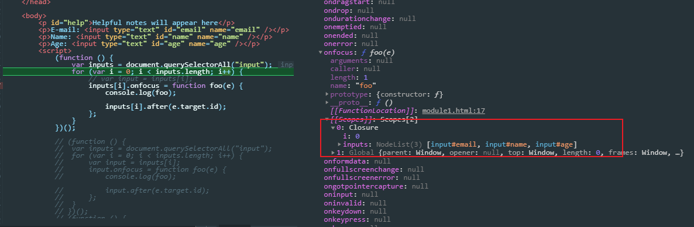

- 等到回调函数执行的时候，从作用域中获取的也始终是保存下来的作用域链中的`i`的最后一个值，也就是 3（因为 i 最后还会迭代一次然后再判断嘛），等到`focus`触发的时候，所以就报错了

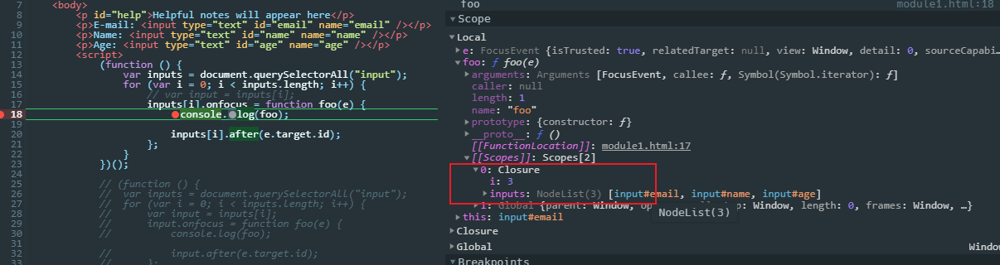

> 解决方法

经过上面的分析过程，基本清楚了产生这种现象的原因，其实就是过去使用`var`在代码块中不会产生块级作用域导致的，所以要将循环变量限制在更小的作用域中才行

- 那么首先肯定考虑使用`let`来声明循环变量，使用`let`后就可以看到每个回调函数内保存的作用域链上多了块级作用域

```javascript
(function() {
  var inputs = document.querySelectorAll('input');
  for (let i = 0; i < inputs.length; i++) {
    inputs[i].onfocus = function foo(e) {
      console.log(foo);

      inputs[i].after(e.target.id);
    };
  }
})();
```

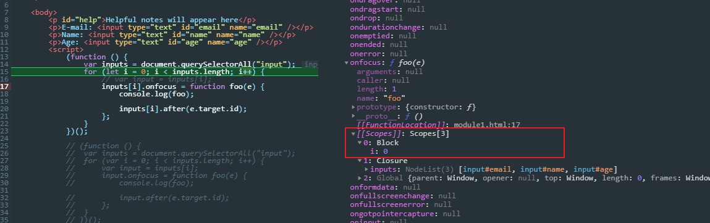

- 然后又想到 ES5 使用 IIFE 来模拟块级作用域，每次循环把迭代的值限制在 IIFE 内，执行完一次循环，IIFE 就会自动回收掉内部变量，从而每次声明的回调函数保存的不同的作用域链

```javascript
(function() {
  var inputs = document.querySelectorAll('input');

  for (var i = 0; i < inputs.length; i++) {
    (function() {
      var input = inputs[i]; // 保证每个闭包内作用域链保存的是当前循环的变量
      input.onfocus = function foo(e) {
        console.log(foo);

        input.after(e.target.id);
      };
    })();
  }
})();
```

- 最后就是使用数组的 forEach 方法

```javascript
(function() {
  var inputs = document.querySelectorAll('input');
  inputs.forEach(function(ele, index) {
    ele.onfocus = function foo(e) {
      console.log(foo);

      ele.after(e.target.id);
    };
  });
})();
```

#### 内存占用

首先强调，闭包没有内存泄漏的问题，JS 高级程序设计中指出的是过去 IE9 之前的 BUG 了，其它的浏览器没有这个问题。但是闭包确实有内存占用的问题，但是以 V8 为例，基于标记清除的垃圾回收方式，闭包也会自动回收那些在闭包中没有找到引用项的作用域中的变量，如下

```javascript
(function() {
  var inputs = document.querySelectorAll('input');
  for (var i = 0; i < inputs.length; i++) {
    var input = inputs[i];
    input.onfocus = function foo(e) {
      console.log(foo);

      input.after(e.target.id);
    };
  }
})();
```

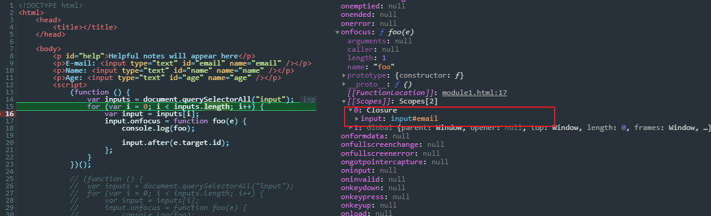

## this

> [this - MDN](https://developer.mozilla.org/en-US/docs/Web/JavaScript/Reference/Operators/this)
>
> JavaScript 的 this 原理是什么？ - Lucas HC 的回答 - 知乎 https://www.zhihu.com/question/353757734/answer/964557747

`this`是一个关键字，因此不能在 JS 中为其赋值，它用来指向一个对象，使得可以在代码中使用`this`指向的对象的属性和方法；`this`可以在脚本范围内使用，也可以在函数体内使用，但是严格模式下禁止函数体内的`this`指向全局对象，它的值有可能是`undefined`，因此函数内使用`this`要十分小心。

总体来看，`this`的指向只有以下六种情况：

- 全局环境内的`this`，始终指向全局对象，在浏览器中就是`window`对象；
- 函数体内的`this`，在函数单独被调用时，非严格模式下指向`window`；严格模式下为`undefined`；
- 函数作为对象的方法使用，那么函数体内的`this`将指向该对象；如果是 DOM 回调函数，则`this`指向触发事件的`DOM`对象
- 箭头函数没有`this`，它内部的`this`是外层环境传给它的，始终跟随外层环境`this`指向；
- 通过`call`，`apply`调用的函数，`this`指向传入的对象；通过`bind`创建的新函数，内部`this`也被绑定到传入的对象
- 通过`new`将函数作为构造函数调用，其内部`this`指向新创建的对象

### 全局环境

在全局环境中使用`this`，不论什么严格非严格，`this`始终指向全局对象；也就是使用`this`添加的属性，函数等会被附加在下面这些全局对象中处理

- 在浏览器中，`window`就是当前窗口的全局对象，`this`就等于`window`，通过`this`声明的属性和方法将被附加到`window`上
- 在 nodejs 中，全局对象是`global`
- 在 Web Workers 中，全局对象是`self`

```javascript
'use strict';

console.log(this === window); //true
```

### 函数体内

在函数内部的`this`，需要根据函数被调用的位置来解析

#### 函数被单独调用

只要看到函数被单独调用的时候，非严格模式下`this`指向`window`；而在`"use strict";`指明严格模式的情况下禁止函数体内的`this`指向，此时`this`的值是`undefined`

```javascript
'use strict';

function foo() {
  console.log(this);
}

foo(); // undefined
```

```javascript
const foo = {
  bar: 10,
  fn: function() {
    console.log(this); // window / undefined
    console.log(this.bar); // undefined或者报错
  },
};
var fn1 = foo.fn;
fn1(); // 函数前面没东西，也是单独调用的情况
```

```javascript
var o = {
  m: function() {
    var self = this; // o

    function f() {
      console.log(this); // window / undefined
      console.log(self); // o
    }

    f();
  },
};

o.m();
```

匿名函数也是仍然要看函数调用的方式，匿名函数作为`setTimeout`的回调函数时，相当于单独被调用，所以内部`this`指向全局对象

```javascript
const foo = {
  fn: function() {
    setTimeout(function() {
      console.log(this);
    });
  },
};
console.log(foo.fn()); // window
```

而匿名函数作为`addEventListener`的事件处理函数时，其内部`this`将指向触发事件的元素

```javascript
var button = document.querySelector('#btn');
button.addEventListener('click', function() {
  console.log(this); // button本身
});
```

如果不使用`call/apply`调用，IIFE 内部的`this`总是指向全局对象，严格模式`this`就是`undefined`

```javascript
var o = {
  m: function() {
    var self = this; // o

    (function f() {
      console.log(this); // window / undefined
      console.log(self);
    })();
  },
};

o.m();
```

####作为构造函数被调用

当函数被用作构造函数时，内部`this`将被绑定到使用`new`创建的对象上，这也是面向对象编程语言的特点；但是需要注意的是构造函数本身和普通函数没区别，它可能会被直接调用，而导致内部`this`指向发生变化，所以**构造函数内部一定要进行`this`的检查**。如果是使用`new`调用的构造函数，那么`this`就指向新创建的对象，所以可以使用`instanceof`检测`this`是不是构造函数的实例

```javascript
function Person(name, age) {
  if (this instanceof Person) {
    this.name = name;
    this.age = age;
  } else {
    return new Person(name, age);
  }
}
```

####作用对象的方法被调用

只要看到被调用的函数前面有一个点`.`或者`[]`这种属性的调用方法，那么`this`就指向`.`前面的东西，也就是**最后调用函数的对象**

```javascript
var obj = {
  text: 'test',
  fn: function() {
    return this.text;
  },
};

obj.fn(); // test
obj['fn'](); // test

const o1 = {
  text: 'o1',
  fn: function() {
    return this.text;
  },
};
const o2 = {
  text: 'o2',
  fn: o1.fn,
};
console.log(o2.fn()); // "o2"
```

需要注意这种调用方式根本不受函数定义的方式影响，也就是说**无论直接在属性中声明函数还是在属性中引用其他位置声明过的函数，最后都执行这个对象**

```javascript
const o1 = {
  text: 'o1',
  fn: function() {
    return this.text;
  },
};
const o2 = {
  text: 'o2',
  fn: function() {
    return o1.fn(); // o1
  },
};
const o3 = {
  text: 'o3',
  fn: o1.fn,
};

// 结合闭包来看
function fn() {
  function foo() {
    console.log(this.text);
  }

  return foo;
}

var f = fn();
var o = {
  text: 'closure',
  m: f,
};

o.m(); // "closure"

console.log(o1.fn()); // "o1"
console.log(o2.fn()); // "o1"
console.log(o3.fn()); // "o3"
```

####作用函数的返回值

> "匿名函数的执行环境具有全局性，因此`this`对象通常指向 window"——《JS 高级程序设计第三版·中文》

这个说法是完全错误的，匿名函数执行环境没有全局性这个说法，英文原文根本没有出现"global"这样的字眼；并且匿名函数内部的`this`可以指向任何对象，你可以通过`call/apply`去改变其指向，也可以将其作为对象的方法进行调用，例如以下两种情况

```javascript
// 这种情况相当于将返回的函数单独调用
function fn() {
  function foo() {
    console.log(this); // window / undefined
  }

  return foo;
}

fn()();

// 这种情况相当于返回的匿名函数被作为对象的方法再次调用，所以内部this肯定指向对象
function wapper() {
  return function() {
    console.log(this); // obj
  };
}

var obj = {
  m: wapper(),
};

obj.m();
```

#### call/apply

对于`call`，`apply`这两个方法都是直接指定经它们调用时函数内部的`this`，观察语句就能得知

#### bind

`bind`会根据指定的`this`值创建一个新函数，需要注意的是经过`bind`创建的新函数，内部`this`无法通过对象调用，`call`，`apply`这些方法修改，如果支持的话，可以通过`new`调用来修改

```javascript
const func = function() {
  console.log(this.name);
};

const obj1 = {
  name: 'obj1',
};

const newFunc = func.bind(obj1); // 绑定obj1

const obj2 = {
  name: 'obj2',
  pFunc: newFunc,
};

obj2.pFunc(); // obj1
obj2.pFunc.call(obj2); // obj1
```

###箭头函数内部的 this

箭头函数是最特殊的，它自己没有`this`，其**内部`this`跟随定义时的环境，也就是取决于静态作用域了。**

当作为对象方法时，如果对象定义的时候处于全局环境，所以箭头函数内部`this`也是指向全局上下文，严格模式下就是`undefined`，在使用 TypeScript 的环境下，下面的代码会直接报错。

```javascript
'use strict';
var obj = {
  name: 'oxygen',
  func: () => {
    console.log(this.name);
  },
};

obj.func();
```

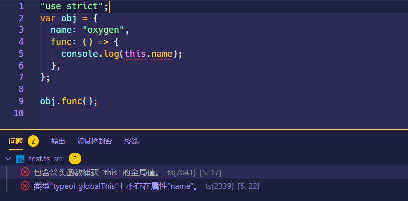

要解决上述问题就是在箭头函数外面包裹一层普通函数，或者使用普通函数定义对象的方法

```typescript
'use strict';
var obj = {
  name: 'oxygen',
  func: function() {
    console.log(this.name);
  },
};

obj.func(); // "oxygen"

'use strict';
var obj = {
  name: 'oxygen',
  func: function() {
    const func = () => {
      console.log(this.name);
    };
    func();
  },
};

obj.func(); // "oxygen"
```

如果在函数环境内，其`this`也是取决于当前包裹它的函数

```javascript
function wrapper() {
  console.log(this);
  return () => {
    //始终和外层函数wrapper内部的this一致
    console.log(this);
  };
}

var obj = {
  m: wapper,
};

// obj.m()会调用wapper，此时wrapper内部this指向obj，那么返回的闭包也是指向obj
obj.m()();

// 如果改成下面这种，对wrapper进行了单独调用然后将值传给obj的属性m，所以wapper内部this指向全局对象，那么返回的箭头函数也是指向全局对象
var obj = {
  m: wrapper(),
};

obj.m();
```

###class 内部的 this

在大部分面向对象的编程语言内部，都有类的概念，在类中使用`this`，会将`this`指向使用`new`创建的新对象上，在这一方面来说，JS 从 ES6 新增的类也是一样的。

```javascript
class SuperClass {
  constructor(name, age) {
    this.name = name;
    this.age = age;
  }

  func() {
    console.log(this);
  }
}

var person = new SuperClass('张三', 100); // {name: "张三", age: 100}
person.func(); // this指向person
```

###DOM 回调函数

####普通函数

当普通函数被用作`addEventListener`的事件处理函数时，它的`this`指向触发事件的元素（一些浏览器在使用非`addEventListener`的函数动态添加监听函数时不遵守这个约定）

```javascript
// 被调用时，将关联的元素变成蓝色
function bluify(e) {
  console.log(this === e.currentTarget); // 总是 true

  // 当 currentTarget 和 target 是同一个对象时为 true
  console.log(this === e.target);
  this.style.backgroundColor = '#A5D9F3';
}

// 获取文档中的所有元素的列表
var elements = document.getElementsByTagName('*');

// 将bluify作为元素的点击监听函数，当元素被点击时，就会变成蓝色
for (var i = 0; i < elements.length; i++) {
  elements[i].addEventListener('click', bluify, false);
}
```

####箭头函数

如果指定箭头函数作为回调事件，其`this`仍然根据当前执行上下文来判断，反正不可能指向监听元素

```javascript
const handleClick = e => {
  console.log(this); // window / undefined
};

var button = document.querySelector('#btn');
button.addEventListener('click', handleClick);
```

## this 的传递

> [ES6 子类有没有自己的 this](https://www.zhihu.com/question/378032472/answer/1089697467)

在 ES6 之前，也就是没有`class`的语法的时候，实现继承的方式有很多种，什么寄生继承，组合继承之类的，基本思想都是实现原型链接，然后传递`this`这样；**传递`this`的方法就一种，在子构造函数中去调用父构造函数**，当然了要注意子构造函数中去调用父构造函数要放在子构造函数内的顶部位置，否则可能造成父构造函数的属性覆盖掉子构造函数的同名属性

```javascript
function SuperType() {
  this.name = 'super';
}

function SubType() {
  SuperType.call(this); // 传递this
  this.name = 'sub';
  this.age = 21;
}

var person = new SubType();
console.log(person); // {name: "sub", age: 21}
```

在 ES6 之后，可以使用类`class`语法实现继承，但是有一项硬性规定是如果在子类的`constructor`中必须使用`super`，如果不适用`super`将会抛出`ReferenceError`的异常，如果用 TS，直接编码阶段就会报错；`super`的作用并不是传递`this`，它实际上是将对象经过父类重新创建一下，然后又返回给子类，再去初始化子类构造函数中声明的属性和方法。

具体可以在 babel 编译器里观察一下，关键就是这一句代码

```javascript
// 利用父类构造函数创建一个新的对象，并将这个对象原型对象的constructor属性指向子类构造函数，然后再返回给子类构造函数
var result = Reflect.construct(SuperType, arguments, SubType);
```

## this 指向变化

### 普通函数

`this`在同一个函数中的指向肯定会随着调用方式发生变化

```javascript
var obj = {
  a: 1,
  func: function() {
    console.log(this.a);
  },
};

function f(fn) {
  var a = 2;
  fn(); //回调函数，是单独调用，则this指向全局对象，undefined
}

f(obj.func);
```

在上面这个例子中，如果要让 a 的值等于 1，可以使用`call`，`apply`等方法；如果要让 a 等于 2，得把`var a = 2`挪到全局作用域中声明

```javascript
var myObj = {
  name: '测试',
  showThis: function() {
    console.log(this); // 指向myObj
    function bar() {
      console.log(this);
    } // 指向window / undefined
    bar();
  },
};
myObj.showThis();
```

这种丢失`this`指向的问题非常常见，常见的解决方法是使用一个局部变量`self`来缓存外部的`this`，如下：

```javascript
var myObj = {
  name: '测试',
  showThis: function() {
    console.log(this); // 指向myObj
    var self = this;
    function bar() {
      console.log(self);
    } // 指向myObj
    bar();
  },
};
myObj.showThis();
```

或者使用箭头函数来定义函数，因为箭头函数没有属于自己的`this`，跟随外部包裹的执行上下文的`this`

```javascript
var myObj = {
  name: '测试',
  showThis: function() {
    console.log(this); // 指向myObj
    var bar = () => {
      console.log(this);
    };
    bar();
  },
};
myObj.showThis();
```

### 回调函数

在`setTimeout`的回调函数中使用`this`是最容易发生`this`丢失的情况，下面的代码经过 1 秒延迟执行后，最后会输出 `undefined`。造成这种情况的原因是因为回调函数是函数的参数传递的形式，这是一个复制引用类型值的过程，简答来说，就是回调函数的引用地址值赋值给了参数，然后以参数的形式单独再调用。

不光是这种情况，实际上在很多形式的回调函数种都会发生这种情况，例如 DOM 事件处理函数，以及 React`class`组件内部使用`this`引用`class`内部的方法等。

```javascript
var obj = {
  a: 1,
  f: function() {
    console.log(this.a);
  },
};

setTimeout(obj.f, 1000);
```

要解决这种方式方法也有很多：

- 使用箭头函数来编写回调函数；
- 或者使用`bind`创建一个绑定`this`的新函数，这里不能用`call`，JS 禁止这样的调用

```javascript
// 箭头函数
var obj = {
  a: 1,
  f: function() {
    console.log(this.a);
  },
};

setTimeout(() => {
  obj.f();
}, 1000);

// bind
var obj = {
  a: 1,
  f: function() {
    console.log(this.a);
  },
};

setTimeout(obj.f.bind(obj), 1000);

// React的bind使用
class Foo extends Component {
  handleClick() {
    console.log('Click happened');
  }

  render() {
    return <button onClick={this.handleClick.bind(this)}>beng</button>;
  }
}
```
