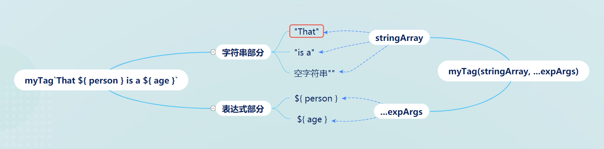
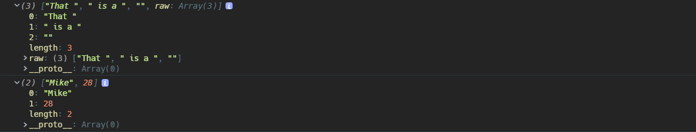
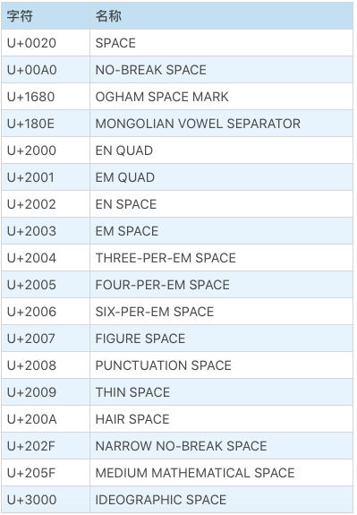
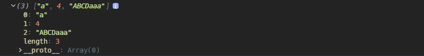
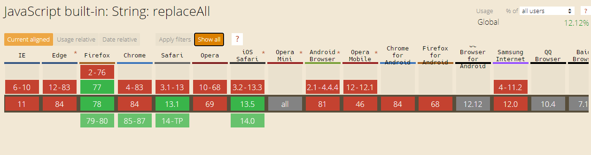
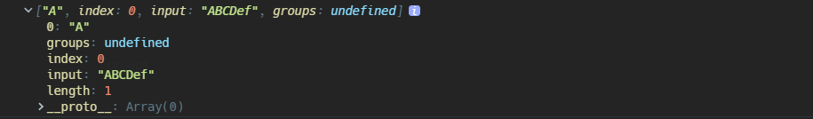
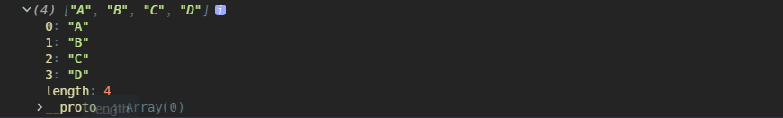
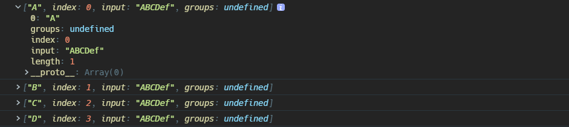

### String

严格来说，JS 编码字符的格式其实是 UCS-2，也就是 UTF-16 的前身，后来 UTF-16 经过完善才支持使用 2 个 16 位二进制表示超过 U+FFFF 的 Unicode 码点字符，但是 JS 诞生之初的 UCS-2 并不支持使用 2 个 16 位二进制编码，所以现在的 JS 在遇到某些超过 U+FFFF 的字符时，会显示其长度是 2，例如数学指数常数`𝑒`

```java
//𝑒，数学常数，自然对数lnX的底数，码点U+1D452
console.log("𝑒".length);					// 2
```

#### String 类型的特点

- 大小写字母敏感

- 使用定长的 16 位二进制编码字符，也就是 2 字节
- 它是基本类型，一旦声明初始化以后，没有任何方式改变它的值，字符串本身继承的”修改“字符串的方法都是在**创建一个新的字符串，然后销毁原来字符串，最后将新字符串赋值给变量**
- 支持使用`for...of`进行遍历

#### 字符串形式

可以使用字符串字面量`""`，`String()`，`new String()`，模板字符串``来创建一个字符串，最常用的还是字符串字面量。

本质上，`String`是一种包装类型的对象，使用字符串字面量和`String()`形式创建的字符串都是原始值，当使用原始值调用`String.prototype`上的方法时，JS 会自动进行装箱操作，将原始值包装成`String`对象。

##### String()

如果直接用`new String()`创建一个字符串的话，**它就是一个对象**。

```javascript
let s_prim = 'test';
let s_obj = new String('test');

console.log(typeof s_prim); // "string"
console.log(typeof s_obj); // "object"
```

当`String`构造函数单独使用时，它的作用是强制类型转换，这种情况相当于对括号内的值调用`toString()`方法；但是`undefined`和`null`没有继承自`Object.prototype`，它们分别得到字符串形式的表示

```javascript
console.log(String([1, 2, 3])); // "1,2,3"

console.log(String(null)); // "null"

console.log(String(undefined)); // "undefined"
```

##### 模板字符串

模板字符串是 ES6 的语法，支持使用`${}`在字符串中插入表达式

```javascript
`string text ${expression} string text`;
```

模板字符串和普通的字符串字面量`""`的区别有：

- 能够直接换行表示，双引号形式的`""`换行需要使用`+`连接
- 标签内使用`需要转义
- 支持函数解析模板字符串内的字符

> `function myTag(stringArray, exp1, exp2)`
>
> @param stringArray 字符串数组
>
> @param ...expression 按顺序解析的插入的表达式的值

对于作为第一个参数的字符串数组，

- 如果原模板字符串开头不是字符串而是`${}`插入的表达式，那么该数组第一个元素会是一个空字符串`""`；同理，如果原模板字符串不是以字符串结尾，那么数组最后一个元素也将会是空字符串
- 该数组还包含一个属性`raw`，它也是一个数组，它的值也是由模板字符串中原始字符串组成的



```javascript
let person = 'Mike';
let age = 28;

function myTag(stringArray, ...expArgs) {
  console.log(stringArray);
  console.log(expArgs);
}

myTag`That ${person} is a ${age}`;
```



##### Unicode 码点

ES6 以后支持使用`"\u0000"`到`\uFFFF`的形式表示`U+0000`到`U+FFFF`之间的 Unicode 码点，对于超出了`U+FFFF`的码点，需要使用花括号包裹起来，使用两个`"\u{xxxxx}"`的形式来表示；如果不用花括号，会把它看作两个字符，在使用某些方法时会发生一些意外的事情

```javascript
// 下面两种形式是等价的

'\u0061';

'a';

// 数学常数𝑒
'\u{1D452}';
```

#### 属性

##### length

字符串主要的属性就是`length`，正如 JS 使用 16 位二进制 UTF-16 编码每个字符串，所以`length`的值也是字符串中每个字符在 UTF-16 编码形式下的码点个数；当字符串中含有超出 U+FFFF 码点的字符时，需要使用 2 个 16 位码元表示，那么该字符的长度将被记为 2。

ES2016 规定，字符串的最大长度是`2^53-1`。

有一个容易混淆的点是`String.length`和`length`的关系，`String.length`其实是`function String(){}`这个构造函数定义时指定的必传的参数个数，所以和`length`完全不沾边。

##### [[PrimitiveValue]]

基本类型的值都具有一个私有属性`[[PrimitiveValue]]`，这个值就是原始值的意思嘛，如果使用`new String()`构造的字符串，实际上是一个对象，则可以使用`valueOf`获取`[[PrimitiveValue]]`，也就是原始值形式

```javascript
var x = new String('Hello world');
console.log(x.valueOf()); // Displays 'Hello world'
```

### 字符串方法

#### 遍历字符串

##### for

for 循环能遍历字符串，但是太麻烦了，而且对超过`U+FFFF`的字符，它不认识。

##### for...of

ES6 为字符串添加了迭代器属性，所以字符串支持使用`for...of`进行循环遍历。

`for...of`循环最大的好处就是它不骗人，认识超过`U+FFFF`的字符串

```javascript
//能正确输出 𝑒
for (let val of 'd𝑒asdad') {
  console.log(val);
}
```

#### 截取字符串

截取字符串一般遇到负值索引的情况都是找到

##### slice

> `str.slice(beginIndex, endIndex)`
>
> @param beginIndex 起始字符串的索引
>
> @param endIndex 到该索引前一个位置结束
>
> @return String 截取的字符串

截取指定索引部分的字符串，但是不包含`endIndex`位置的字符，这点和数组的`slice`也是一样的。

和数组的`slice`一样，参数可以是负值，表示从结尾`-1`开始往前数

```javascript
let str1 = 'The morning is upon us.', // the length of str1 is 23.
  str2 = str1.slice(1, 8), // "he morn"
  str3 = str1.slice(4, -2), // "morning is upon u"
  str4 = str1.slice(12), // "is upon us"
  str5 = str1.slice(30); // ""
```

##### substring

> `str.substring(beginIndex, endIndex)`
>
> @param beginIndex 起始字符串的索引
>
> @param endIndex 到该索引前一个位置结束
>
> @return String 截取的字符串

如果参数都是正数，那么这个方法和`slice`得到的结果没有区别；区别就在于处理参数是负值的情况：

- 如果`substring`的任何一个参数小于`0`或者是`NaN`，等价于`0`

```javascript
const str = 'Mozilla';

console.log(str.substring(-1, 2)); // "Mo"
console.log(str.substring(-1, -2)); //substring(0, 0) 得到空字符串""
```

- 如果第一个参数大于第二个参数，内部会将两者进行交换处理

```javascript
let text = 'Mozilla';
console.log(text.substring(5, 2)); // "zil"
```

##### substr

> `str.substr(startIndex, length)`
>
> @param startIndex 起始字符串的索引
>
> @param length 要截取的字符串的长度
>
> @return String 截取的字符串

`substr`是一个容易和`substring`混淆的方法，它处理负值又和前面的方法不同，有以下规则：

- `startIndex`是负值的话，也是从字符串结尾往前数，如果负值的绝对值超过字符串范围，看作是`0`
- 如果不指定长度，就一直截取到字符串结尾
- 如果长度值小于等于 0，都是返回空字符串

```javascript
var aString = 'Mozilla';

console.log(aString.substr(0, 1)); // 'M'
console.log(aString.substr(1, 0)); // ''
console.log(aString.substr(-1, 1)); // 'a'
console.log(aString.substr(1, -1)); // ''
console.log(aString.substr(-3)); // 'lla'
console.log(aString.substr(1)); // 'ozilla'
console.log(aString.substr(-20, 2)); // 'Mo'
console.log(aString.substr(20, 2)); // ''
```

##### trim

> `str.trim()`
>
> @return String

去除字符串开头和结尾的 Unicode 空白字符，包括空格，tab 等等乱七八糟的空格如下



##### trimEnd/trimRight

> `str.trimEnd()`
>
> `str.trimRight()`

移除字符串右侧空白字符

##### trimStart/trimLeft

> `str.trimStart()`
>
> `str.trimLeft()`

移除字符串左侧空白字符

#### 替换字符

这里说的并不是真的修改原字符串，因为字符串一旦声明，没有任何手段能修改它，都是重新创建一个新的。

##### replace

> `str.replace(regexp|substr, newSubstr|function)`
>
> @param 匹配字符串的正则表达式或者要查找的字符串
>
> @param 用于替换的字符串，或者一个返回字符串的函数
>
> @return String

这个方法应该是在日常使用最频繁的，因为它能使用正则表达式去匹配字符串中存在的部分。

如果第一个参数是字符串或者未指定全局匹配模式的正则表达式，那么在原字符串中只有第一个匹配的部分会被替换掉。

```javascript
const p = 'ABCDaaa';

const regex = /[a-z]/;

console.log(p.replace(regex, 'A')); // ABCDAaa

console.log(p.replace('a', 'A')); // "ABCDAaa"
```

如果指定正则表达式为全局匹配模式`g`，所有匹配项都会被替换

```javascript
const p = 'ABCDaaa';

const regex = /[a-z]/g;

console.log(p.replace(regex, 'A')); // ABCDAAA
```

`replace`方法的第二个参数可以是一个函数，这个函数一般接收三个参数：

- `matchString`：当前匹配的字符串部分
- `index`：匹配的字符串在原字符串中的索引
- `source`：原字符串

如果函数没有返回值就是返回`undefined`，那么就是使用`undefined`这个字符串去替换匹配项。

```javascript
const p = 'ABCDaaa';

const regex = /[a-z]/;

function replaceFunc(...args) {
  console.log(args);
}

console.log(p.replace(regex, replaceFunc));
```



##### :mute:replaceAll

这个方法不要使用，因为到 Chrome85 以后才会正式支持，其他浏览器则根本不支持。



> `str.replace(regexp|substr, newSubstr|function)`

如果支持的话，`replaceAll`总是全部替换原字符串中的匹配项，如果第一个参数是正则表达式，必须指定全局匹配模式`g`

```javascript
const p = 'ABCDaaa';

const regex = /[a-z]/g;

console.log(p.replaceAll(regex, 'A')); // ABCDAAA

console.log(p.replaceAll('a', 'A')); // ABCDAAA
```

##### toLowerCase

> `str.toLowerCase()`
>
> @return String

全部转小写

##### toUpperCase

> `str.toUpperCase()`
>
> @return String

全部转大写

#### 查找字符

##### charAt

> `str.charAt(index)`
>
> @param index 索引值，或者标准来说是偏移量
>
> @return String 索引位置的字符，如果索引超出范围，会返回空字符串

JS 使用的是 UTF16 编码字符，如果字符串中出现了超过`U+FFFF`码点值的字符，这个字符会被拆开成两部分，此时`charAt`返回的索引位置的值可能就不是看到的那样，如下：

```javascript
console.log('d𝑒asdad'.charAt(2));

//索引2位置的字符是𝑒，Unicode码点U+1D452，会被拆开成两个字符
console.log('d𝑒asdad'.indexOf('a')); // 3
```

##### charCodeAt

> `str.charCodeAt(index)`
>
> @param index 索引值
>
> @return Number 返回指定索引位置字符的 Unicode 码点整数值

如果给定索引值超出字符串，这个方法会返回`NaN`

```javascript
const sentence = 'The quick brown fox jumps over the lazy dog.';

// 索引4位置的字符是p，对应Unicode码点U+0050，转换成整数值就是113
console.log(sentence.charCodeAt(4)); // 113
```

##### codePointAt

> `str.codePointAt(index)`
>
> @prama index 索引值
>
> @return hex 指定索引位置字符的码点整数值

这个方法和`charCodeAt`有两点区别：

- 如果指定位置的字符在`U+OOOO`到`U+FFFF`之间，那么`charCodeAt`和`codePointAt`结果是一样的；但是如果是超出`U+FFFF`的字符，使用`codePointAt`可以准确返回其码点整数值，而`charCodeAt`只能返回部分
- 如果索引超出范围，这个方法会返回`undefined`

```javascript
const sentence = 'The quick brown fox jumps over the lazy dog.';

console.log(sentence.codePointAt(4)); // 113
```

##### includes

> `str.includes(searchString, fromIndex)`
>
> @param searchString 指定字符串
>
> @param fromIndex 从字符串的指定位置开始搜索，默认是 0
>
> @return Boolean

判断从指定索引位置开始的字符串是否包含指定的字符串，默认从`0`开始

##### indexOf

> `str.indexOf(searchString, fromIndex)`
>
> @return Number

返回指定字符串在提供字符串中的索引，如果找不到就返回`-1`；所以可以使用这个方法的结果不等于`-1`来判断字符串中是否包含某部分

```javascript
if('Blue Whale'.indexOf('Blue') !== -1)
```

##### startsWith

> `str.startsWith(searchString, fromIndex)`
>
> @param searchString 开头字符串
>
> @param fromIndex 从字符串的指定位置开始搜索，默认是 0
>
> @return Boolean

判断从指定索引位置开始的字符串是否以该字符串作为开头，默认从`0`开始

```javascript
const str1 = 'Saturday night plans';

console.log(str1.startsWith('Sat')); //true
```

##### endsWith

> `str.endsWith(searchString, length)`
>
> @param searchString 要搜索的字符串
>
> @param length 从字符串的开头位置截取字符串的长度，默认是字符串的长度
>
> @return Boolean

`endsWith`判断字符串结尾是否是指定的字符串；如果指定`length`这个参数，有两种情况：

- 当`length`小于字符串长度，则表示只判断截取长度的字符串
- 如果 length 大于字符串长度，那么一定返回`false`

```javascript
const str1 = 'Cats are the best!';

console.log(str1.length); // 18
console.log(str1.endsWith('!', 5)); // false
console.log(str1.endsWith('!', 18)); // true
```

#### 串接字符串

##### 加号+

使用`+`串接字符串是最常见的，`+`本身还会进行一些类型转换，如果`+`两边有一个是字符串，就会都转成字符串进行连接操作；但是要注意`Symbol`类型的对象不能使用`+`进行连接，会报错。

```javascript
console.log(2 + '2'); // "22"

console.log('2' + 2); // "22"

Symbol('foo') + 'bar'; // TypeError: Can't convert symbol to string
```

##### concat

> `str.concat(str2 [, ...strN])`
>
> @param String 字符串
>
> @return String

返回多个字符串连接的新字符串

```javascript
const str1 = 'Hello';
const str2 = 'World';

console.log(str1.concat(' ', str2)); // "Hello World"
```

##### padStart

> `str.padStart(targetLength, padString)`
>
> @param targetLength 最终返回的字符串的长度
>
> @param padString 要追加的字符串
>
> @return String

这个方法有点繁琐，它是将指定的字符串追加到原字符串的开头

- 如果指定`targetLength`小于原字符串长度，那么直接返回原字符串
- 如果追加的字符串长度加上原字符串长度的和超过了`targetLength`，那么将对追加的字符串进行截取，直到最终组合的字符串长度和`targetLength`相等为止
- 如果追加的字符串和原字符串长度总和小于`targetLength`，那么会重复追加字符串的部分直到等于`targetLength`

```javascript
console.log('abc'.padStart(1, 'foo')); // "abc"
console.log('abc'.padStart(5, 'foo')); // "foabc"
console.log('abc'.padStart(10, 'foo')); // "foofoofabc"
```

##### padEnd

> `str.padEnd(targetLength, padString)`
>
> @param targetLength 最终返回的字符串的长度
>
> @param padString 要追加的字符串
>
> @return String

这个方法其实就和`padStart`相反，追加字符串到原字符串结尾

```javascript
'abc'.padEnd(10); // "abc       "
'abc'.padEnd(10, 'foo'); // "abcfoofoof"
'abc'.padEnd(6, '123456'); // "abc123"
'abc'.padEnd(1); // "abc"
```

##### repeat

> `str.repeat(n)`
>
> @param n`Infinity < n <= 0`
>
> @return String

重复原字符串`n`次的新字符串，n 不能是负数，也不能超过`Infinity`，否则会抛出`RangeError`的错误

#### 正则匹配

##### match

> `str.match(regexp)`
>
> @param regexp 正则表达式
>
> @return Array

搜索在字符串中的正则表达式匹配项，`match`的返回结果要么是数组要么是`null`

- 仅当在字符串中找不到任何匹配项时，其返回`null`
- 如果`match`未指定任何参数，会返回一个包含空字符串的数组，并且带有额外的四个属性
- 如果`match`中不是正则表达式字面量，回调用`new RegExp()`进行转换
- 如果`match`中的正则表达式不是`g`全局匹配模式，那么返回的数组只会**包含字符串中第一个匹配的部分，并且数组还将带有额外三个属性**
  - `groups`：一个包含捕获组匹配项的对象，如果没有使用过`(?<name>)`命名捕获组，这个值是`undefined`
  - `index`：匹配项在字符串中的索引
  - `input`：原字符串

```javascript
const str = 'ABCDef';
const regex = /[A-Z]/;
const found = str.match(regex);

console.log(found);
```



- 如果`match`的正则表达式指定了`g`匹配模式，那么数组只会包含在字符串中的所有匹配项

```javascript
const str = 'ABCDef';
const regex = /[A-Z]/g;
const found = str.match(regex);

console.log(found);
```



##### matchAll

> `str.matchAll(regexp)`
>
> @return _RegExpStringIterator_

`matchAll`只能用在指定全局匹配模式`g`的正则表达式上，否则会抛出`TypeError`。

这个方法是返回一个迭代器对象，包含每次匹配的结果，可以使用`for...of`去遍历结果，用法如下：

```javascript
const str = 'ABCDef';
const regex = /[A-Z]/g;
const matchesIterator = str.matchAll(regex);

for (let val of matchesIterator) {
  console.log(val);
}
```



##### search

> `str.search(regexp)`
>
> @param regexp 正则表达式
>
> @return Number 正则表达式匹配的第一个匹配项的索引

`search`根据传进去的正则表达式搜索字符串中的匹配项，如果找到第一个匹配项就返回其索引；如果找不到就返回`-1`，所以一般都是判断结果不等于`-1`来使用

```javascript
if(str.search(reg) !== "-1")
```

### 字符串转数组

#### split

> `str.split(separator|regexp, limit)`
>
> @parama separator 分隔字符或者一个正则表达式
>
> @parama limit 限制数组的长度
>
> @return Array

根据指定字符或者正则表达式匹配规则，将字符串转换成数组。先来说说第一个参数：

- 如果未指定参数或者分隔字符串在原字符串中找不到，则将整个字符串放进数组然后返回
- 如果分隔符出现在开头或者结尾，则数组还会带有空字符串项
- 如果分隔符是空字符串，那么字符串会被一个一个拆开成单独字符放进数组

```javascript
const str = 'abcdefg';

str.split(); // ["abcdefg"]
str.split(''); // ["a", "b", "c", "d", "e", "f", "g"]
str.split('a'); // ["", "bcdefg"]
str.split('h'); // ["abcdefg"]
```

再来说说第二个参数：

- 如果指定负数，会忽略
- 如果是`0`，返回空数组
- 其他情况，就只返回限制长度的数组

```javascript
const str = 'abcdefg';

str.split('', 0); // []
str.split('', 5); // ["a", "b", "c", "d", "e"]
```

### ToString

#### 四种通用方法

##### value.toString()

如果使用`call`传入某个对象来调用`Object.prototype.toString`并不会发生转换成字符串的操作，这是`Object.prototype.toString`机制导致的，所以几乎所有其他类型都在自己的原型链上重写了`toString`这个方法，除了`Object`，所以对象使用`toString`这个方法并非来自`Object.prototype.toString`而是他们自己的原型对象上的。

`toString`的局限是：

- `null`和`undefined`无法使用`toSring`；
- 对普通对象使用`toString`只会返回`[object, Object]`

```javascript
var obj = {
  name: 'test',
};

console.log(obj.toString()); // [object, Object]
```

##### ""+value

> [ESMA - Addition Operator](https://tc39.es/ecma262/#sec-addition-operator-plus)

根据 ES 规范文档的描述，`+`连接两个值时，要么是进行字符串`String`连接，要么是数字`Number`相加，转换规则如下：

- 首先使用`ToPrimitive`将`+`两边值都转换成原始值
- 然后只要一边有字符串类型，就都转成字符串，进行字符串连接操作。

- 否则都转成 Number，然后相加

使用`+`的局限是：

- 语法上看起来不太好懂，如果是 JS 基础不好的人可能不明白这是什么意思
- `Symbol`类型的值不能直接使用`+`连接，必须先`toString`才行

##### String()

> [ToString](https://tc39.es/ecma262/#sec-tostring)

根据 ES 规范文档的描述，`String()`单独调用时执行的就是文档里描述的`ToString`这个抽象操作，可以认为是强制类型转换。

##### JSON.stringify

`JSON`支持的类型有`Object`，`Array`，`Number`，`String`，`Boolean`和`Null`，对这些类型的对象进行序列化，可以将其转换成字符串形式，这个方法在转换字符串的时候如果不注意某些特殊值，就是有损转换；尤其 ES6 以后的`Map`，`Set`，`Symbol`完全不能用。

可以自己在类型的原型对象上定义`toJSON`方法，这样`JSON.stringify`会在转换的时候调用该方法，从而弥补部分类型不支持的缺陷。

```javascript
BigInt.prototype.toJSON = function() {
  return this.toString();
};

JSON.stringify(BigInt(1));
// '"1"'
```

#### 各种类型执行 toString 的结果

| 类型        | 结果                                                                        |
| ----------- | --------------------------------------------------------------------------- |
| Undefined   | TypeError                                                                   |
| Null        | TypeError                                                                   |
| Boolean     | "true" / "false"                                                            |
| Symbol      | "Symbol([[Description]])" / "Symbol()"                                      |
| Array       | toString 会调用 Array.prototype.join，将每个元素转成 String，然后用逗号连接 |
| Date        | "Fri Jul 24 2020 01:00:27 GMT+0800 (Hong Kong Standard Time)"               |
| Function    | 返回函数定义的整个源码字符串                                                |
| 普通对象 {} | "[object Object]"                                                           |
| Number      | 见下文                                                                      |
| BigInt      | 和 Number 表现基本一致                                                      |

#### Number

> [`Number.prototype.toString(radix)`](https://tc39.es/ecma262/#sec-number.prototype.tostring)
>
> @param radix 允许`[2, 36]`之间的整数，默认是`10`；不在这个区间内的话，会抛出`RangeError`

首先要注意不能直接对一个数字使用`toString()`方法，这种形式会在 JS 的词法分析阶段就报错（某些 IDE 也会提示），因为 JS 允许小数形式的字面量，如果在数字后面加上一点`.`，那么会和前面的数字放在一起进行词法解析，最好用括号括起来表示数字直接量。

```javascript
12.toString();										// SyntaxError

(12).toString();
```

根据 ES 规范文档的描述，总体来说，当一个`Number`类型的数字调用`toString`时，会根据传入基数`radix`将数值先转成该基数，然后再做`ToString`操作转换成字符串，规范写的很复杂，现在没看懂，不过有几个情况如下：

- 如果没传 radix，默认是以十进制为基数
- 如果是`NaN`，返回**"NaN"**，
- 如果是正负 0，都返回**"0"**
- 如果是正无穷，返回**"Infinity"**
- 如果带有负号，对数字部分转换后再在前面加上负号

- 对于一些有明显标志的十六进制`0x`，二进制`0b`，八进制`0o`这些要特别注意`toString`的基数是什么；如果是十六进制的基数，结果可能还会出现`[a, f]`之间的小写字母，代表`[10, 15]`。

```javascript
let x = 6;

console.log(x.toString(2)); // '110'
console.log((254).toString(16)); // 'fe'

console.log((-10).toString(2)); // '-1010'
console.log((-0xff).toString(2)); // '-11111111'
```

#### Symbol

> `Symbol.prototype.toString`

`Symbol`类型的对象也拥有自己原型对象上的`toString()`方法，`Symbol`类型的对象在创建的时候会关联一个私有属性`[[Description]]`，也就是调用`Symbol(description)`构造函数时传进去的字符串值，如果不传则`[[Description]]`就是`undefined`。

根据 ES 规范文档的描述，`Symbol`类型对象在执行 toString 时，会返回字符串组合`Symbol([[Description]])`，如果`[[Description]]`是`undefined`，那么只会返回`Symbol()`

```javascript
console.log(Symbol('desc').toString()); // "Symbol(desc)"

console.log(Symbol().toString()); // "Symbol()"
```

#### Array

##### Array.prototype.toString

根据 ES 规范内容，`toString`内部实际上会调用`Array.prototype.join()`这个方法，如果这个方法不可被调用，才会使用继承的`Object.prototype.toString`。一般来说都是执行`join`，默认分隔符是逗号`,`。

```javascript
const elements = ['Fire', 'Air', 'Water', undefined];

console.log(elements.join()); // "Fire,Air,Water,"
console.log(elements.toString()); // "Fire,Air,Water,"
```

##### Array.prototype.join

> [`array.join(separator)`](https://tc39.es/ecma262/#sec-array.prototype.join)

根据 ES 规范文档的描述，`join`这个方法具有通用性，类数组对象也可以使用，其执行规则如下：、

- 执行 ToObject，原始值类型会进行包装对象；
- 获取数组或者类数字对象的`length`属性值；
- 如果未指定分隔字符串，默认分割字符串*seq*是逗号`","`；否则*seq*就是*ToString(separator)*
- 创建一个新的空字符串*R*；
- 循环获取数组元素，如果元素是`undefined`，`null`或者空值，看作空字符串；如果不是这三种情况，则进行\**ToString*转换
- 使用分隔符将每个字符串元素连接起来作为最后结果返回

```javascript
const elements = ['Fire', 'Air', 'Water', undefined, null, ,];

console.log(elements.join()); // "Fire,Air,Water,,,"
console.log(elements.toString()); // "Fire,Air,Water,,,"
```

##### Array.prototype.reduce

实际上还可以使用`reduce`将数组转换成字符串，而且这个方法是完全可控的。

```javascript
[0, 1, 2, 3, 4].reduce(function(
  accumulator,
  currentValue,
  currentIndex,
  array,
) {
  return accumulator + currentValue;
},
''); // "01234"
```

#### Date

| 方法                         | 转换结果                                                         |
| ---------------------------- | ---------------------------------------------------------------- |
| `Date(str)`                  | 当前时间字符串，Fri Jul 24 2020 22:22:44 GMT+0800 (中国标准时间) |
| `dateObj.toString`           | Fri Jul 24 2020 22:22:44 GMT+0800 (中国标准时间)                 |
| `dateObj.toDateString`       | Fri Jul 24 2020                                                  |
| `dateObj.toTimeString`       | Fri Jul 24 2020                                                  |
| `dateObj.toISOString`        | 2020-07-24T14:22:44.600Z                                         |
| `dateObj.toUTCString`        | Fri, 24 Jul 2020 14:22:44 GMT                                    |
| `dateObj.toJSON`             | 2020-07-24T14:22:44.600Z                                         |
| `dateObj.toLocaleDateString` | 下午 10:22:44（浏览器语言设定是中文）                            |
| `dateObj.toLocaleTimeString` | 下午 10:22:44（浏览器语言设定是中文）                            |
| `dateObj.toLocaleString`     | 2020/7/24 下午 10:22:44（浏览器语言设定是中文）                  |

##### toString

> `Date.prototype.toString`

也就是转换成时间形式的字符串，这个结果就是日常 Chrome 控制台显示的结果，它的规定形式如下：

- `week` —— 表示 week 的单词取前三个字母
- `month` —— 表示 month 的单词取前三个字母
- `day` —— 2 位表示一个月中第几天的数字，单日前面要补 0
- `year` —— 4 位年份数字，不够在前面补 0
- `hh`小时
- `mm`分钟 mm
- `ss`秒
- `GMT±[hh][mm]` —— 时区偏移量，只有这两个之间没有空格
- 时区名称

```javascript
var x = new Date();
var myVar = x.toString(); // Fri Jul 24 2020 01:00:27 GMT+0800 (Hong Kong Standard Time)
```

##### toDateString

> `dateObj.toDateString()`

返回`Date`类型对象的日期部分，由**周，日，月，年**依次排列组合，形如`"Thu Jan 01 1970"`，相当于取`toString`结果的日期部分。

返回的字符串固定长度是`15`，表示形式有如下规定：

- 表示 week 的单词取前三个字母
- 表示月份的单词取前三个字母
- 表示日期的两个数字，必要时会补 0
- 表示年份的四个数字，必要时会补 0

```javascript
const event = new Date(1993, 6, 5, 14, 39, 7);

console.log(event.toDateString()); // Mon Jul 05 1993
```

##### toTimeString

> `dateObj.toTimeString()`

返回`Date`类型对象的时间部分，由**时，分，秒，GMT 偏移量，时区名称**组成，相当于取`toString`结果的时间部分。

```javascript
var d = new Date();

console.log(d.toString()); // Fri Jul 24 2020 21:56:07 GMT+0800 (Hong Kong Standard Time)
console.log(d.toTimeString()); // 21:56:07 GMT+0800 (Hong Kong Standard Time)
```

##### toISOString

> `dateObj.toISOString()`

这个方法返回相对于`dateObj`时刻的 UTC 标准时间的字符串格式，形如`YYYY-MM-DDTHH:mm:ss.sssZ`

```javascript
var d = new Date();

console.log(d.toString()); //Fri Jul 24 2020 22:11:43 GMT+0800 (Hong Kong Standard Time)

console.log(d.toISOString()); // 2020-07-24T14:11:43.204Z
```

##### toUTCString

> `dateObj.toUTCString()`

这个方法返回相对于`dateObj`时刻的 GMT 标准时间形式的字符串，也就是`toString()`时间部分`±`偏移量得到的时间；这个结果没有表示毫秒的部分，不看这部分的话，和上面的`toISOString`得到的时间差不多。

```javascript
var d = new Date();

console.log(d.toString()); // Fri Jul 24 2020 22:11:43 GMT+0800 (Hong Kong Standard Time)

console.log(d.toUTCString()); // Fri, 24 Jul 2020 14:11:43 GMT
```

##### toJSON

> `dateObj.toJSON()`

根据 ES 规范文档描述，`toJSON`方法最后会调用`toISOString`进行转换，所以这个方法结果和`toISOString`基本一样，当超出时间范围允许的最大值的时候返回`null`

```javascript
console.log(new Date().toISOString()); // 2020-07-24T13:05:26.793Z
```

##### toLocaleDateString

> `dateObj.toLocaleDateString(locales, options)`
>
> @param locales 语言标记字符串（language code）
>
> @param options 一个对象，包含年月日转换格式的属性

`Locale`（ /ləˈkɑːl/ ）是本地的意思，这个方法是以指定语言编码的格式返回`Date`类型对象的日期部分。如果不指定第一个参数语言标记，**默认是使用浏览器的默认语言环境**，如果修改浏览器的语言选项，那么默认结果也会发生变化。

这个方法的参数和`Intl.DateTimeFormat`参数一样，第二个参数`options`是一个对象，有很多复杂的属性，见——[Intl.DateTimeFormat() constructor](https://developer.mozilla.org/en-US/docs/Web/JavaScript/Reference/Global_Objects/Intl/DateTimeFormat/DateTimeFormat)

```javascript
// 在英文版的firefox中以en-US作为默认语言标记，返回美国的时间表示形式
console.log(new Date().toLocaleDateString()); // 7/24/2020

console.log(new Date().toLocaleDateString('en-US')); // 7/24/2020

// 而在中文版的浏览器中，则以zh-CN作为语言标记，返回中文的表示

console.log(new Date().toLocaleDateString()); // 2020/7/24

console.log(new Date().toLocaleDateString('zh-CN')); // 2020/7/24
```

##### toLocaleTimeString

> `dateObj.toLocaleTimeString(locales, options)`

按语言转换`Date`类型对象的时间部分，默认仍然是看浏览器的语言版本。

```javascript
console.log(new Date().toLocaleTimeString('zh-CN')); // 下午9:35:12

console.log(new Date().toLocaleTimeString('en-US')); // 9:35:12 PM
```

##### toLocaleString

> `dateObj.toLocaleString(locales, options)`

```javascript
// 在设置English语言选项时候得到的转换结果
console.log(new Date().toLocaleString()); // 7/24/2020, 9:49:54 PM

console.log(new Date().toLocaleString('en-US')); // 7/24/2020, 9:49:54 PM

console.log(new Date().toLocaleString('zh-CN')); // 2020/7/24 下午9:49:54
```

##### Symbol.toPrimitive

> `dateObj.[Symbol.toPrimitive](hint)`
>
> @param hint 必传且只能是三者其中之一："string" / "number" / "default"

根据传入的类型参数，将`Date`类型的对象转换成`String`或者`Number`。根据 ES 规范文档的描述，引用类型的值转成基本类型值的时候执行的是`ToPrimitive`操作，这个方法是抽象的，属于 JS 引擎层面的执行动作，但是`Date`类型重写了这个方法，具有以下实现规则：

如果`hint`的值是`default`或者`string`，这个方法会先尝试调用`toString`并返回结果；如果`toString`不存在，会尝试调用`valueOf`并返回结果；如果还不存在，则`TypeError`。

如果`hint`的值是`number`，先尝试调用`valueOf`并返回结果；如果`valueOf`不存在，会尝试调用`toString`并返回结果；如果还不存在，则`TypeError`。

如果不传`hint`会抛出`TypeError`。

```javascript
console.log(new Date()[Symbol.toPrimitive]('default'));
// Sat Jul 25 2020 01:18:18 GMT+0800 (Hong Kong Standard Time)

console.log(new Date()[Symbol.toPrimitive]('string'));
// Sat Jul 25 2020 01:18:18 GMT+0800 (Hong Kong Standard Time)

console.log(new Date()[Symbol.toPrimitive]('number'));
// 1595610860808
```
