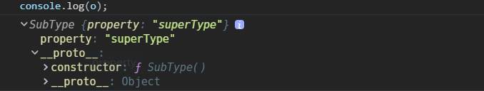
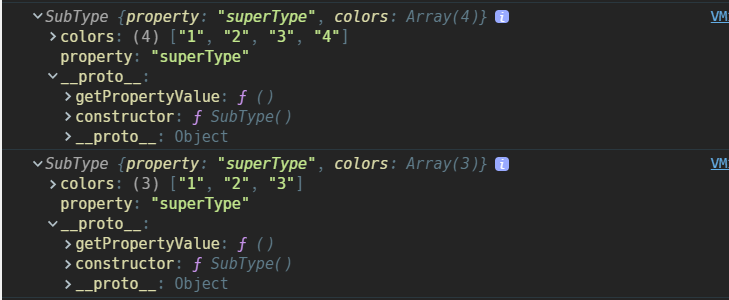

### 面向对象

#### 构造函数

- 任何函数都可以作为构造函数，区别是构造函数调用使用`new`关键字
- 构造函数的调用会创建一个新的空对象，这个对象从构造函数的原型对象继承属性和方法，并把这个对象作为其调用上下文，为其绑定`this`

#### new

只有普通函数和类能被`new`调用，其它形式的函数都将报错

- 创建新对象
- 将新对象的`[[prototype]]`指向构造函数的原型`prototype`
- 指定构造函数内部的调用上下文对象为新对象，也就是绑定`this`
- 执行构造函数，初始化对象属性
- 返回新对象

```javascript
//模拟实现new
function create() {
  // 创建一个空的对象
  var obj = new Object();

  // 获取构造函数
  // shift 从数组中删除第一个元素，并返回该元素的值，而使用此函数传入的第一个参数是构造函数本身
  var Con = [].shift.call(arguments);

  // 设置新对象的 __proto__ 为构造函数的原型对象，从而继承原型对象的属性
  Object.setPrototypeOf(obj, Con.prototype);

  // 调用构造函数本身，初始化对象，apply 调用指定this值和参数的函数，并返回其结果
  var ret = Con.apply(obj, arguments);

  // 优先返回构造函数返回的对象
  return ret instanceof Object ? ret : obj;
}

// 测试
function test() {
  this.value = 'test function';
}

var o = create(test);
```


#### prototype 和原型对象

- 只有函数才有`prototype`属性，指向该函数的原型对象，而原型对象是为其他对象提供共享属性的对象
- 并非所有函数都有原型，`Function.prototype`是一个函数，但是`Function.prototype.prototype === undefined`

#### [[prototype]]和\_\_proto\_\_

- 每个对象内部都有一个私有属性`[[prototype]]`，指向构造函数的原型对象；某些浏览器支持`__proto__`直接观察`[[prototype]]`的值，ES5 后已经被废弃了
- 通过对象字面量`{}`创建的对象本质上是调用`Object`这个构造函数创建的，所以它们也都具有`[[prototype]]`指向`Object.prototype`
- 通过`new`关键字和构造器`Object()`，`Array()`等创建的对象，它们内部都有一个私有属性`[[prototype]]`（在某些浏览器中可以用`__proto__`（发音 dunder proto）观察），它是一个属性，指向构造函数的原型对象；`[[prototype]]`是构建原型链实现继承的基础

```javascript
function Parent(age) {
  this.age = age;
}
var p = new Parent(50);

p; // Parent {age: 50}
p.__proto__ === Parent.prototype; // true
p.__proto__.__proto__ === Object.prototype; // true
p.__proto__.__proto__.__proto__ === null; // true
```


- 通过`Object.create()`创建的对象，是指定其`[[prototype]]`为传入的对象，也就是设置其`__proto__`属性

#### constructor

- `constructor`属性是原型对象内部的属性，这个属性是一个指针，指向构造函数；可以通过原型来访问`prototype.constructor`
- `prototype`，原型对象，`constructor`和`[[prototype]]`的关系


> 关于其它

- `constructor`的`enumerable`属性是`false`，是不支持遍历的
- 对于引用类型来说 `constructor` 属性值是可以修改的，但是对于基本类型来说是只读的
- `constructor`其实没有什么用处，只是 JavaScript 语言设计的历史遗留物。由于`constructor`属性是可以变更的，所以未必真的指向对象的构造函数，只是一个提示；不过，从编程习惯上，我们应该尽量让对象的`constructor`指向其构造函数 —— 来自知乎贺老的回答

#### Object.prototype

> `Object.prototype.__proto__ === null`

- 再次表明了原型链的顶端是`null`；
- `Object.prototype`不需要继续继承自其他类型，它是 JS 内置的一个对象，并且内部设计了所有对象共享的属性和方法

> 由`Object`的原型对象提供的共享的属性

- `constructor`：指向创建对象的构造函数，也就是`Object()`
- `obj.hasOwnProperty(propertyName)`：检查给定属性是否在自有属性而不是原型对象的属性中
- `prototypeObj.isPrototypeOf(obj)`：检查前面的对象是否在后面对象的原型链上
- `obj.toLocaleString()`：返回对象的字符串表示
- `obj.toString()`：返回对象的字符串表示；经常会被覆盖重写
- `obj.valueOf()`：返回对象的字符串，数值或者布尔值表示，通常和`toString`返回值相同
- `obj.propertyIsEnumerable(propertyName)`：检查给定属性是否支持`for...in`遍历

#### 操作原型的方法

- `obj.__proto__`：ES5 之前的方式，可以直接设置一个对象的原型对象，现在已经废弃了
- `Object.getPrototypeOf(obj)`/ `Reflect.getPrototypeOf()`：获取一个对象的`[[prototype]]`
- `Object.setPrototypeOf(obj, prototype)`：设置一个对象的`[[prototype]]`为指定的对象，返回新的对象；如果该对象的原型属性不可扩展，会抛出`TypeError`异常

```javascript
function _setPrototypeOf(o, p) {
  _setPrototypeOf =
    Object.setPrototypeOf ||
    function _setPrototypeOf(o, p) {
      o.__proto__ = p;
      return o;
    };
  return _setPrototypeOf(o, p);
}
```

- `Reflect.setPrototypeOf(obj, prototype)`：设置一个对象的原型为指定的对象，如果操作成功返回 `true`，否则返回 `false`
- `prototypeObj.isPrototypeOf(obj)`：判断一个对象在不在后面对象的原型链上
- 多数情况下不推荐直接修改对象的原型，这样会造成其它同类型的对象收到影响，同时访问原型也会带来性能问题，推荐使用`Object.create(prototypeObj, propertiesObj)`来创建一个新的对象

#### 原型链

- 每个对象通过`[[prototype]]`属性和构造器的原型对象建立连接关系，从中继承原型对象的属性和方法；而原型对象也通过`[[prototype]]`与其它类型的原型对象建立连接，继承它的属性和方法，这样一层一层指向`Object.prototype`，并最终指向`null`，这种关系叫原型链
- 原型链基本思想是让构造函数的原型对象等于另一个类型的实例；因为每个实例都具有`[[prototype]]`这个私有属性，指向构造函数的原型对象，让自身的原型对象等于其它类型的实例，这样原型对象内部也具有了`[[prototype]]`这个私有属性，就能访问到其它类型的属性和方法，这样一层一层由`[[prototype]]`构建起了原型链，最终指向`null`，而`null`没有原型，也就无法通过让其原型对象等于其它实例来实现继承，所以`null`是原型链的最后环节

- 值得注意的是原型链的构建并不依赖原型，构建原型链的基础属性是`[[prototype]]`，在浏览器中可以通过`__proto__`观察，在 ES6 以后被规范化，通过两个方法`Object.getPrototypeOf()`和`Object.setPrototypeOf()`来读写


- 下面是一个简单的使用原型继承的例子

```javascript
function SuperType() {
  this.property = 'superType';
}

SuperType.prototype.getSuperValue = function() {
  return this.property;
};

function SubType() {}

SubType.prototype = new SuperType();

var instance = new SubType();
console.log(instance.getSuperValue()); //superType
```


> `instance`是什么类型？

- 使用`instanceof`运算符检测，`instance`既是`SuperType`，也是`SubType`，还是`Object`类型；因为`instanceof`是通过查找原型链来确定类型的，只要原型链里有，那么`instanceof`就会返回`true`

> `property`为什么在`instance.__proto__`上？

- 首先看一下`property`这个属性一开始是定义在`SuperType`的自有属性上，当使用`new SuperType()`的时候，就将`this`绑定到了`SubType.prototype`上，`property`现在变成了`SubType.prototype`的一个属性，而`instance.__proto__`也就是`SubType.prototype`，所以就在这了

> 第二个和第三个`__proto__`分别指向谁？

```javascript
instance.__proto__ === SubType.prototype;

instance.__proto__.__proto__ === SuperType.prototype;

instance.__proto__.__proto__.__proto__ === Object.prototype;

instance.__proto__.__proto__.__proto__.__proto__ === null;
```

> `instance.__proto__`为什么没有`constructor`？

- 因为`SubType.prototype`通过`=`被完全重写了，完全替换成了`SuperType`的实例属性，所以不再具有`constructor`属性，这也是后面要说的原型继承的缺陷之一，可想而知，如果是在`SubType`的原型对象上定义了的属性，就完全访问不到了；所以必须在重写后定义原型对象上的属性。当然，如果是自有属性就不用担心了，反正都能通过`this`绑定找到这个属性

```javascript
function SuperType() {
  this.property = 'superType';
}

SuperType.prototype.getSuperValue = function() {
  return this.property;
};

function SubType() {}

SubType.prototype = new SuperType();
SubType.prototype.property = 'subType';

var instance = new SubType();
console.log(instance.getSuperValue()); //subType
```

> `instance.getSuperValue()`的查找过程

1.  搜索`instance`本身的自有属性
2.  往上搜索`instance.__proto__`，也就是类型的原型对象`SubType.prototype`，还是没找到
3.  然后继续找`SubType.prototype.__proto__`，找到`SuperType.prototype`，发现`getSuperValue`
4.  这个查找过程存在着**属性屏蔽**，对象上的属性会屏蔽类型的原型对象中的属性

#### 函数保有的特殊性

- 每个函数还都具有原型`prototype`属性，指向函数自身的原型对象，用来在以构造函数调用时实现对象之间共享属性和方法

```javascript
function foo() {}
console.log(foo.prototype);
```


- 除此之外，每个函数都是`Function`类型的实例，所以函数内部都有`[[prototype]]`属性，指向`Function.prototype`；
- 然而奇怪的是`Function.prototype`并不是一个对象，它是一个函数，**是 JS 里唯一一个原型对象是函数的玩意**；虽然它是函数，但是它又没有原型`prototype`，wtf！！！

```javascript
console.log(foo.__proto__ === Function.prototype); //true

console.log(Function.prototype.constructor);

console.log(Function.prototype.prototype);
```


- 由于函数具有`Object`的一些方法，推断`Function`类型的继承自`Object`类型，也就是`Function.prototype`也具有`__proto__`属性，指向了`Object.prototype`，继承了上面`Object.prototype`提供的一些方法，这也就是为什么函数也是对象的原因

```javascript
console.log(Function.prototype.__proto__);
```


#### 函数和对象的关系

- 上面讨论了函数的原型对象会链接到`Object.prototype`；那么问题来了，当`Object`作为构造函数的时候，不也是一个函数吗，那么它也算是`Function`的一个实例啊，也会具有`[[prototype]]`属性，指向`Function.prototype`，不仅如此，连`Function`自己的`[[prototype]]`也是指向自己的原型对象，我现在大概能了解为什么有人说 JS 的继承模式很乱的原因了！

```javascript
console.log(Object.__proto__ === Function.prototype);

console.log(Function.__proto__ === Function.prototype);
```


- 所以基本上可以这么认为，和`Object.prototype`一样，`Function.prototype`这个函数是 JS 内置的一个设计对象，用于所有其他函数的生成，包括`Function()`和`Object()`以及其他引用类型的构造函数`Array()`等，而由于`Function.__proto__`指向了`Function.prototype`，`Function.prototype.__proto__`又指向了`Object.prototype`，这使得每个对象都具有了`Object.prototype`，这样就构成了完成的原型链系统，一切皆为对象


```javascript
console.log(Boolean.__proto__ === Function.prototype); //true

console.log(Number.__proto__ === Function.prototype); //true

console.log(String.__proto__ === Function.prototype); //true

console.log(Symbol.__proto__ === Function.prototype); //true

console.log(Array.__proto__ === Function.prototype); //true

console.log(Date.__proto__ === Function.prototype); //true

console.log(RegExp.__proto__ === Function.prototype); //true
```

### 类

#### [[class]]

> ES3

ES3 的类只是内置类型包括基础类型和引用类型，如`Number`，`String`，`Date`等的一个私有属性`[[class]]`，语言使用者唯一可以访问`[[class]]`的方式就是`Object.prototype.toString`，并且 ES3 的时候，只有下面几种类型有这个内置属性，可以看出这时候还不支持`Null`和`Undefined`

```javascript
“Number”
“String”
“Boolean”

“Array”
“Object”
“Date”
“Function”
“RegExp”
“Error”
“Math”
```

调用`Object.prototype.toString.call(thisArg)`会执行以下步骤

1. 获取 this 对象的`[[Class]]`属性的值
2. 计算出三个字符串`[object` , 第一步的操作结果, 以及`]`连接后的新字符串.
3. 返回第二步的操作结果

> ES5

到了 ES5，对`[[class]]`做了进一步完善，支持了`Null`，`Undefined`和`JSON`

> ES6

到了 ES6 版本，`[[class]]`私有属性被 `Symbol.toStringTag` 代替，这个`Symbol`的属性指向一个方法。通过`call`调用`Object.prototype.toString`方法时，如果传入对象的这个属性存在，它的返回值会出现在`toString`方法返回的字符串之中，表示对象的类型。由于 ES6 新添加了众多的类型，所以 ES6 也增加了很多内置对象的`Symbol.toStringTag`属性值

```javascript
Symbol.prototype[Symbol.toStringTag]; //Symbol
Map.prototype[Symbol.toStringTag]; //Map
Promise.prototype[Symbol.toStringTag]; //Promise
```

#### class

ES6 同时正式引入了 JS 里的`class`关键字，并支持`new`创建对象，并且支持继承；不过实际上**class 还是参照了构造函数的原型来实现，定义在 class 中的普通方法都被放在了构造函数的原型对象上，而静态方法都被放在了构造函数的自有属性上**，`constructor`依旧被用作初始化对象，内部可通过`this`定义对象自有属性。

对`class`使用`typeof`，返回的就是`class`

```javascript
//ES6class的写法
class Person {
  constructor(name, age) {
    this.name = name;
    this.age = age;
  }

  sayName() {}
}

console.log(typeof Person); // function
```

```javascript
'use strict';

function _instanceof(left, right) {
  if (
    right != null &&
    typeof Symbol !== 'undefined' &&
    right[Symbol.hasInstance]
  ) {
    // 检测class是否通过new调用的，即判断this的指向是否是当前构造器的一个实例
    return !!right[Symbol.hasInstance](left);
  } else {
    return left instanceof right;
  }
}

function _classCallCheck(instance, Constructor) {
  if (!_instanceof(instance, Constructor)) {
    throw new TypeError('Cannot call a class as a function');
  }
}

// 定义属性的特殊性
// 默认class内部的属性都是不可枚举的，不支持 for...in 操作
function _defineProperties(target, props) {
  for (var i = 0; i < props.length; i++) {
    var descriptor = props[i];
    descriptor.enumerable = descriptor.enumerable || false;
    descriptor.configurable = true;
    if ('value' in descriptor) descriptor.writable = true;
    Object.defineProperty(target, descriptor.key, descriptor);
  }
}

// 非静态类型的属性都是定义在原型上
// 静态类型的属性直接定义在构造函数上
function _createClass(Constructor, protoProps, staticProps) {
  if (protoProps) _defineProperties(Constructor.prototype, protoProps);
  if (staticProps) _defineProperties(Constructor, staticProps);
  return Constructor;
}

//使用了一个立即执行的函数表达式，并且内部实现了闭包
var Person = (function() {
  function Person(name, age) {
    _classCallCheck(this, Person);

    this.name = name;
    this.age = age;
  }

  //塑造构造函数的原型
  _createClass(Person, [
    {
      key: 'sayName',
      value: function sayName() {},
    },
  ]);

  return Person;
})();
```

### 继承的方式

- 继承是面向对象三大特性之一，ES6 之前 JS 的继承都是基于原型实现的，基本思想无非是链接构造函数的原型，然后传递`this`，通过原型链继承原型对象上的属性，通过`this`继承实例属性

#### 原型链继承

- 也就是上面介绍的原型链的实现方式，核心思想是让一种类型的原型等于其它类型的一个实例，利用`[[prototype]]`实现链式继承

```javascript
function SuperType() {
  this.property = 'superType';
}

SuperType.prototype.getSuperValue = function() {
  return this.property;
};

function SubType() {}

SubType.prototype = new SuperType();

var o = new SubType();
console.log(o);
```


缺点如下

- 对于引用类型的属性，当其中一个对象操作修改后，其它对象都会受到影响

- 在子类型原型上定义的属性和方法必须要放在重写原型后面，否则不起作用

#### 借用构造函数继承

- 实现方式是借用父类的构造函数，即在子类构造函数内部将`this`绑定到父类构造函数，在调用构造函数创建一个新对象的时候，将新对象通过`call`传递到父类构造函数中，继承实例属性
- 这种方式的优点是，每次创造的对象绑定的`this`是分开的，引用类型的属性修改也不会相互影响，弥补了原型链继承的不足

```javascript
function SuperType() {
  this.property = 'superType';
}

SuperType.prototype.getPropertyValue = function() {
  return this.property;
};

function SubType() {
  SuperType.call(this);
}

var o = new SubType();
console.log(o);
```



缺点

- 无法继承原型对象上的属性，只能继承实例属性

#### 组合继承

- 把原型链和构造函数调用组合起来，是最常用的继承模式

```javascript
function SuperType() {
  this.property = 'superType';
}

SuperType.prototype.getPropertyValue = function() {
  return this.property;
};

function SubType() {
  SuperType.call(this); //第二次调用父类构造函数
}

SubType.prototype = new SuperType(); //第一次调用父类构造函数
SubType.prototype.constructor = SubType;

var o = new SubType();
console.log(o);
```


- 这个结果不仔细看和原型链还真没什么区别，但是仔细一看，`property`这个属性在`SubType.prototype`上重复了一个？原因是`SuperType`的构造函数被调用了两次，注意代码执行的顺序，第一次是发生在赋值操作修改`SubType`的原型，第二次才是调用父类构造函数，这样在每次创建一个新对象的同时，都能将新的对象绑定到父类构造函数的`this`，在新对象的自有属性上创建一个新的同名属性，而又由于属性屏蔽的原因，自有属性会屏蔽原型上的属性，所以对象之间即使操作引用类型的属性，也不会相互影响
- 注意`constructor`属性也要补上

```javascript
function SuperType() {
  this.property = 'superType';
  this.colors = ['1', '2', '3'];
}

SuperType.prototype.getPropertyValue = function() {
  return this.property;
};

function SubType() {
  SuperType.call(this); //第二次调用父类构造函数
}

SubType.prototype = new SuperType(); //第一次调用父类构造函数
SubType.prototype.constructor = SubType;

var o = new SubType();
var t = new SubType();
o.colors.push('4');

console.log(o);
console.log(t);
```


缺点

- 两次调用了父类构造函数，性能上有所损失
- 存在无用的属性，浪费内存空间

#### 原型式继承

- JSON 格式的发明人道格拉斯·克罗克福德提出了一个`object()`函数，其实和原型链的基本思想是一致的，就是让构造函数的原型指向另一个类型的实例

```javascript
function object(prototypeObj) {
  function F() {}

  F.prototype = prototypeObj; //只是复制了被继承类型的原型对象的内存地址

  return new F();
}
```

缺点

- 对象保有相同的原型对象的引用，引用类型的属性有被篡改的可能

#### 寄生式继承

- 然后道格拉斯·克罗克福德又在原型继承的基础上提出了寄生式继承，在内部增强了返回的对象，为它添加了一些自有属性

```javascript
function object(prototypeObj) {
  function F() {}

  F.prototype = prototypeObj;

  return new F();
}

function createOther(prototypeObj) {
  //原型式继承
  var clone = object(prototypeObj);

  clone.colors = [1, 2];

  return clone;
}
```

缺点

- 对象保有相同的原型对象的引用，引用类型的属性有被篡改的可能
- 如果为对象在内部添加函数类型的属性值，每次创建一个对象都是创建一个新的方法，无法达到函数复用的目的

> `Object.create(proto[, propertiesObject])`

- ES5 添加了`Object.create()`这个方法，设置对象的`[[prototype]]`属性；JS 高级程序设计说这个方法是为了规范原型继承，但我个人认为它更像是寄生继承，因为它支持传入自定义的自有属性

```javascript
var o = Object.create(Object.prototype, {
  // foo会成为所创建对象的数据属性
  foo: {
    writable: true,
    configurable: true,
    value: 'hello',
  },
  // bar会成为所创建对象的访问器属性
  bar: {
    configurable: false,
    get: function() {
      return 10;
    },
    set: function(value) {
      console.log('Setting `o.bar` to', value);
    },
  },
});
```

#### 寄生组合式继承

- 简化了组合继承的实现方式，利用复制副本的方式代替调用父类构造函数；利用父类的原型对象初始化一个新的对象出来

```javascript
function SuperType() {
  this.property = 'superType';
  this.colors = ['1', '2', '3'];
}

SuperType.prototype.getPropertyValue = function() {
  return this.property;
};

function SubType() {
  SuperType.call(this); //只调用一次父类构造函数
}

var prototype = Object.create(SuperType.prototype); //核心部分，复制一个新的对象出来
prototype.constructor = SubType;
SubType.prototype = prototype;

var o = new SubType();
var t = new SubType();
o.colors.push('4');

console.log(o);
console.log(t);
```



#### 类的继承

`class`的继承使用`extends`关键字，`extends`实现的原理是复制父类构造函数原型对象的副本，这种方式其实也有弊端，无法继承实例属性

```javascript
function _inherits(subClass, superClass) {
  if (typeof superClass !== 'function' && superClass !== null) {
    throw new TypeError('superClass must be a function or null');
  }

  // 复制原型并添加constructor属性，继承原型对象的属性
  subClass.prototype = Object.create(superClass && superClass.prototype, {
    constructor: {
      value: subClass,
      writable: true,
      configurable: true,
      enumerable: false,
    },
  });

  // 设置子类的 __proto__ = 父类，让子类可以调用父类静态方法
  if (superClass) {
    if (Object.setPrototypeOf) {
      Object.setPrototypeOf(subClass, superClass);
    } else {
      subClass.__proto__ = superClass;
    }
  }
}
```
