### 什么是对象

- 无序属性的集合，其属性值可以是基本类型的值，或者对象，或者函数
- 对象具有唯一标识性，即使声明的完全相同的两个对象也不会相等，因为它们在内存上的引用地址是不一样的
- JS 的对象具有高度的动态性，即允许在运行的时候去添加，删除和修改内部属性

### 对象的分类

#### 宿主对象

- 由 JS 解析器嵌入的宿主环境定义的，比如浏览器，或者 node 环境，浏览器中常见的都是基于`window`对象的，例如`window.document`，`window.location`，`window.history`等

#### [内置对象](https://developer.mozilla.org/zh-CN/docs/Web/JavaScript/Reference/Global_Objects)

- 由 JS 语言提供的对象，基本是原生对象，能够通过语言本身的构造器；可以在 MDN 查阅这些内置对象

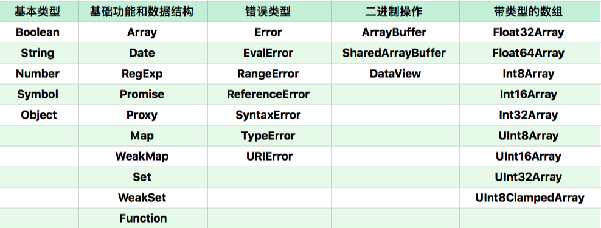

#### 自定义对象

- 由`{}`语法、`new Object`或者 `class` 关键字定义类创建的对象

### 创建对象

#### 使用`Object`构造函数

如果使用`new`和`Object`构造函数创建对象，由于构造函数的参数是可选的，考虑以下情况

- 传递`null`和`undefined`生成的会是一个空对象
- 基本类型的值（`Number`，`Boolean`，`String`以及`Symbol`）会构造其包装类型的对象，如果你使用`typeof`判断返回结果的类型，那么会是`object`
- 传递引用类型的值，包括函数，仍然会返回这个值，也就是并不会构造一个新的对象
- 最后就是直接使用`Object`和使用`new`的行为是一样的

```javascript
var o = Object(['1', '2']);
console.log(o); //Array类型的包装对象

var o = Object('1');
console.log(o); //String类型的包装对象

var o = Object(1);
console.log(o); //Number类型的包装对象

var obj = { p: '1' };
var newObj = Object(obj); // {p:"1"}
console.log(obj === newObj); // true

var o = Object(null);
console.log(o); //{}

var o = Object(undefined);
console.log(o); //{}
```

#### 使用对象字面量

`{}`对象字面量；每次使用对象字面量的形式都是创建一个新的对象，值得注意的是从 ES6 开始，对象字面形式的属性允许使用方括号`[]`传入表达式来定义属性名

```javascript
let i = 0;
let a = {
  ['foo' + ++i]: i,
  ['foo' + ++i]: i,
  ['foo' + ++i]: i,
}; //{foo1: 1,foo2: 2,foo3: 3,}
```

#### 使用 Object.create

`Object.create()`是根据给定原型创建一个新的对象，它的第一个参数新创建的对象的`[[prototype]]/__proto__`，第二个参数是要添加到新对象的自有属性组成的对象，这些自有属性的写法需要按照其描述属性来定义（`configurable`，`enumerable`，`writable`，`value`，`get`，`set`）

```javascript
//下面三种方式是等价的
var obj = Object.create(Object.prototype, {
  year: {
    get: function() {
      return this._year;
    },

    set: function(value) {
      if (value > 2005) {
        this._year = value;
      }
    },
  },

  name: {
    value: 'JS权威指南',
    writable: true,
  },
});
```

如果使用`Object.create(null)`可以创建一个完全纯净的空对象，也就是不指定其原型对象，它不会继承那些`Object.prototype`的方法和属性，这种方式对于类库编写者十分常用，这样创造的对象不容易被污染。

```javascript
Object.create(null);
```

### 对象属性

- 属性名称==必须是字符串或 Symbol 类型的对象==，如果不是字符串，会进行`ToString`（toString，valueOf）强制转换成字符串
- 访问对象属性可以通过`.`或者`[]`，需要注意的是`[]`内可以是变量或者表达式，但是**如果是具体的属性名必须使用字符串**
- 属性的值默认是`undefined`

#### 数据属性和访问器属性

- ES 规定对象属性有两种，数据属性和访问器属性

1.  数据属性，即直接表示数据值，有四个特性

```javascript
configurable：是否支持删除和修改

enumerable：是否支持for-in遍历

writable：是否支持修改

value：属性的值，读取属性值的时候就是这个，修改属性值也是写入这个，默认是undefined
```

2.  访问器属性，不包含数据值 value，但是用于读取数据值

```javascript
configurable

enumerable

get：获取属性值调用

set：写入属性值调用
```

#### 自有属性和原型属性

- 自有属性是定义在每个对象自身的属性，可以使用`obj.hasOwnProperty()`来判断

```javascript
const object1 = {};
object1.property1 = 42;

console.log(object1.hasOwnProperty('property1')); //true
```

- 原型属性定义在构造函数的原型对象上，是对象继承来的属性，并且是每个对象共享的；可以通过`in`来判断，`in`能检测自有属性和原型链上的属性

```javascript
console.log('toString' in {}); //true
```

#### 创建和修改属性

- 可以使用对象字面量直接定义属性，以这种形式定义的属性其数据属性默认都是`true`

```javascript
var o = {
  name: 'property',
  func: function() {},
};

console.log(Object.getOwnPropertyDescriptors(o));

// 属性配置
{
  configurable: true;
  enumerable: true;
  value: 'property';
  writable: true;
}
```

- 使用成员访问运算符`.`或`[]`定义属性，其中`[]`支持变量或者表达式形式，如果`[]`传入的值不是`String`类型，会对其进行`ToString`转换；以这种方式定义的属性，其**描述属性配置也全部默认是`true`**；

```javascript
var o = {};
o.name = 'property';

let foo = { unique_prop: 1 },
  bar = { unique_prop: 2 },
  object = {};
object[foo] = 'value';
console.log(object[bar]); // 2，bar被强制转换成"[object, Object]"

console.log(Object.getOwnPropertyDescriptor(o, 'name'));

// 属性配置
{
  configurable: true;
  enumerable: true;
  value: 'property';
  writable: true;
}
```

- 使用`Object.defineProperty()`，这个方法接收三个参数：属性所在的对象，属性的名称字符串，以及由属性的具体描述属性（`configurable`，`enumerable`，`writable`，`value`，`get`，`set`）组成的对象；如果是**创建的新属性，`configurable`，`enumerable`，`writable`值默认是`false`**

```javascript
var person = {};
Object.defineProperty(person, 'name', {
  value: 'test',
  writable: true,
  configurable: true,
  enumerable: true,
  get: function() {
    return 'test';
  },
  set: function(value) {},
});

console.log(person); //{name : "test"}
```

- `Object.defineProperties()`，这个方法用于一次定义多个属性，接收两个参数：要添加或者修改其属性的对象，要添加或修改的属性的描述属性组成的对象

```javascript
//定义多个属性
var book = {};
Object.defineProperties(book, {
  _year: {
    value: 2005,
  },

  year: {
    get: function() {
      return this._year;
    },

    set: function(value) {
      if (value > 2005) {
        this._year = value;
      }
    },
  },

  name: {
    value: 'JS权威指南',
    writable: true,
  },

  author: {
    value: '尼古拉斯',
    writable: false,
  },
});
```

#### 删除属性

- `delete`用于删除自有属性，不能删除继承自原型的属性，并且不能删除`configurable`为`false`的属性

```javascript
var o = { a: 1 };
delete o.a; //返回true
```

#### 遍历属性的方法

1.  `for-in`：遍历对象中可枚举属性名称字符串，**包括自有属性和继承自原型的属性**，不包括`Symbol`；遍历数组和字符串的时候会返回索引值

```javascript
var obj = { a: 1, b: 2, c: 3 };

for (var prop in obj) {
  console.log(prop); //a,b,c
}

// 区分自有属性和原型属性
for (var prop in obj) {
  if (Object.hasOwnProperty(prop)) {
    // 自有
  } else {
    // 原型
  }
}

var obj = ['a', 'b', 'c'];

for (var prop in obj) {
  console.log(prop);
}

//0,1,2
```

2.  `Object.keys(obj)`：返回对象中**自有属性**名称字符串组成数组，不包括`Symbol`，不包括不可枚举的属性，不包括继承自原型的属性；在 ES5 里，如果此方法的参数不是对象（而是一个原始值），那么它会抛出 `TypeError`，而从 ES2015 以后，非对象的参数将被强制转换为一个对象

```javascript
var obj = { 0: 'a', 1: 'b', 2: 'c' };
console.log(Object.keys(obj)); //['0', '1', '2']

var arr = ['a', 'b', 'c'];
console.log(Object.keys(arr)); //['0', '1', '2']

Object.keys('foo'); //["0", "1", "2"]
```

3.  `Object.getOwnPropertyNames()`：返回对象中**自有属性名称字符串组成数组，包括不可枚举的属性**，不包括`Symbol`和继承自原型的属性；这个方法在遍历数组和字符串时会带出`length`属性

```javascript
var arr = ['a', 'b', 'c'];
console.log(Object.getOwnPropertyNames(arr)); //["0", "1", "2", "length"]

Object.getOwnPropertyNames('abc'); //["0", "1", "2", "length"]
```

4.  `Object.getOwnPropertySymbols()`：返回对象的自有属性中`Symbol`属性的数组

```javascript
var obj = {};
var a = Symbol('a');
var b = Symbol.for('b');

obj[a] = 'localSymbol';
obj[b] = 'globalSymbol';

var objectSymbols = Object.getOwnPropertySymbols(obj);
console.log(objectSymbols); // [Symbol(a), Symbol(b)]
```

- `Reflect.ownKeys(target)`：返回对象**所有自有属性**组成的数组，**包括`Symbol`作为键的属性**，**也包括不可枚举的属性**，这个方法相当于`Object.getOwnPropertyNames()`和`Object.getOwnPropertySymbols()`的集合

```javascript
var sym = Symbol.for('comet');
var sym2 = Symbol.for('meteor');
var obj = {
  [sym]: 0,
  str: 0,
  '773': 0,
  '0': 0,
  [sym2]: 0,
  '-1': 0,
  '8': 0,
  'second str': 0,
};
console.log(Reflect.ownKeys(obj));

//可以获取不可枚举的属性
var myObj = Object.create(
  {},
  {
    getFoo: {
      value: function() {
        return this.foo;
      },
    },
  },
);
myObj.foo = 1;

console.log(Reflect.ownKeys(myObj)); // ["getFoo", "foo"]
```

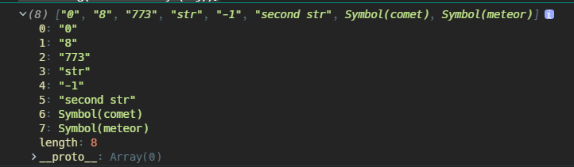

#### 遍历属性值的方法

- `Object.values()`：返回由对象的可枚举属性的值组成的数组，这个方法只在 ES2017 规范以后才能用

```javascript
var obj = { foo: 'bar', baz: 42 };
console.log(Object.values(obj)); //['bar', 42]
```

- `for...of`：这是 ES6 新增的方法，针对内置的可迭代对象（[`String`](https://developer.mozilla.org/zh-CN/docs/Web/JavaScript/Reference/String)、[`Array`](https://developer.mozilla.org/zh-CN/docs/Web/JavaScript/Reference/Array)、[`TypedArray`](https://developer.mozilla.org/zh-CN/docs/Web/JavaScript/Reference/Global_Objects/TypedArray)、[`Map`](https://developer.mozilla.org/zh-CN/docs/Web/JavaScript/Reference/Map) 、 [`Set`](https://developer.mozilla.org/zh-CN/docs/Web/JavaScript/Reference/Global_Objects/Set)、`arguments`和`NodeList`）或者实现了`[Symbol.iterator]`接口的对象，每次遍历的时候，会返回值而不是索引或者键

```javascript
const array1 = ['a', 'b', 'c'];

for (const value of array1) {
  console.log(value); //a,b,c
}
```

### 对象的复制

#### 赋值

- 针对赋值运算符`=`的操作，基本类型的值是复制值给新的变量，引用类型的值是复制内存地址给新的变量
- 赋值和拷贝是容易搞混的两个概念，拷贝是创建一个新的对象或者数组，修改新对象内部的基本类型属性也不会影响源对象；而赋值完全就是操作一样的对象，只是操作的变量名不一样而已，最明显的修改基本类型的属性值也会影响源对象；也可以这么理解，赋值针对的是`=`两边的整体，而拷贝就要讨论到整体内部的结构是否受影响了

```javascript
// 赋值
var obj1 = { name: 'prop' };
var obj2 = obj1;

obj2.name = 'test';
console.log(obj1);
console.log(obj2);
console.log(obj1 === obj2); //true
```

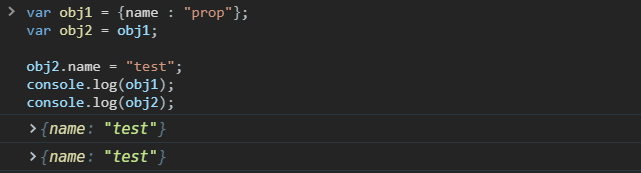

```javascript
// 拷贝
var obj1 = { name: 'prop' };
var obj2 = { ...obj2 };

obj2.name = 'test';
console.log(obj1);
console.log(obj2);
console.log(obj1 === obj2); //false
```

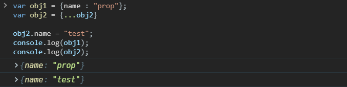

#### 浅拷贝

对于嵌套类型的数据结构，例如数组，对象等，**只会拷贝一层**，基本类型当然是复制值，引用类型只是将内存地址复制了一份

> ES6 - `Object.assign(target, ...source)`

- 目标对象相同属性名的值会被源对象的值覆盖，传入多个对象也是后面的覆盖前面的

```javascript
var sourceObj = {
  prop: [1, 2],
};

var obj = Object.assign({}, sourceObj);
obj.prop.push(3);

console.log(sourceObj);
console.log(obj);

var obj1 = {
  a: 'hello',
  b: {
    a: 'hello',
    b: 21,
  },
};

var cloneObj1 = Object.assign({}, obj1);
cloneObj1.a = 'changed';
cloneObj1.b.a = 'changed';
console.log(obj1.a); //hello
console.log(obj1.b.a); //changed
```

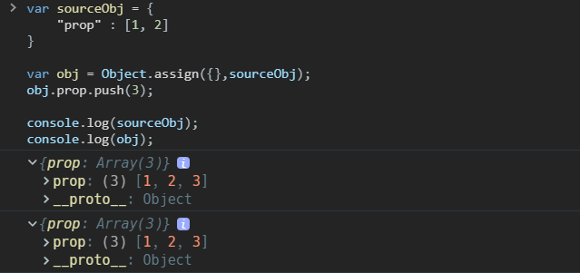

- `Object.assign()`不光支持对象的浅拷贝，还可以浅拷贝数组，还可以将数组和字符串按`索引-元素`的形式复制给对象，将字符串拆解成单个字符组成的数组；总之会保证目标参数`target`传进去的是什么类型，最后拷贝得到的就是什么类型

```javascript
var obj = Object.assign([], ['a', 'b']); //["a","b"]

var obj = Object.assign({}, ['a', 'b']); //{0: "a", 1: "b"}

var obj = Object.assign({}, 'ab'); //{0: "a", 1: "b"}

var obj = Object.assign([], 'ab'); //["a","b"]

var obj = Object.assign('', 'ab'); //String {"", 0: "a", 1: "b"}

var obj = Object.assign('', ['a', 'b']); //String {"", 0: "a", 1: "b"}
```

- `Object.assign()`这个方法是在 ES6 里面，面试经常会让表述其实现，注意以下几点
  - `Object.assign()`拷贝的是自有属性中可枚举的属性，要考虑几种遍历属性的方法的区别性
  - `String`，`Symbol`，`Date`，`RegExp`都能拷贝
  - 对于传入`null`和`undefined`类型参数不会报错

```javascript
// 定义assign函数
function assign(target) {
  // 为什么不判断null和undefined，是因为Object会把它们转成一个空对象
  var _target = Object(target);

  if (arguments.length > 1) {
    for (var i = 1; i < arguments.length; i++) {
      var source = arguments[i];

      // 保证传入undefined和null不会报错
      if (source !== undefined && source !== null) {
        if (Object.keys) {
          // ES5 - 获取对象自有属性中可枚举的属性
          Object.keys(source).forEach(function(propertyName) {
            _target[propertyName] = source[propertyName];
          });
        } else {
          // ES3
          for (var propertyName in source) {
            if (Object.prototype.hasOwnProperty.call(source, propertyName)) {
              _target[propertyName] = source[propertyName];
            }
          }
        }

        // 支持Symbol - ES6才有
        if (Object.getOwnPropertySymbols) {
          Object.getOwnPropertySymbols(source).forEach(function(propertyName) {
            _target[propertyName] = source[propertyName];
          });
        }
      }
    }
  }

  return _target;
}

Object.defineProperty(Object, 'assign', {
  value: assign,
  configurable: true,
  writable: true,
  enumerable: false,
});
```

> `Array.prototype.concat()`

- 数组都会继承这个方法，对`concat()`不传参数就是浅拷贝

```javascript
var arr1 = [1, 2, { prop: 'arr1' }];
var arr2 = [].concat(arr1);
```

> `Array.prototype.slice()`

- 对`slice()`不传参数就是浅拷贝

```javascript
var arr1 = [1, 2, { prop: 'arr1' }];
var arr2 = arr1.slice();
```

> ES6 展开运算符`...`

- ES6 的展开运算符可以针对对象，数组，字符串做语法层面的展开，字符串会转换成数组，对象和数组会采用浅拷贝；可以把它当作`Object.assign()`和`Array.prototype.slice()`

> ES6 - `Array.from`

```javascript
var arr1 = [1, 2, { prop: 'arr1' }];
var arr2 = Array.from(arr1);

arr2[2].prop = 'arr2';
console.log(arr1);
console.log(arr2);
```

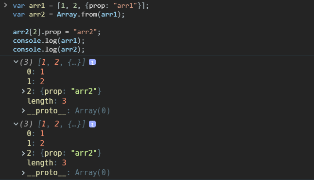

> `Object.create()`

- `Object.create()`不能算做拷贝对象的一个方法，但是值得说的是它做的也是浅拷贝的动作，并且连原型对象上的属性也会复制过去

```javascript
var sourceObj = {
  prop: [1, 2],
};

var targetObj = Object.create(sourceObj);
targetObj.prop.push(3);

console.log(sourceObj);
console.log(targetObj);
```

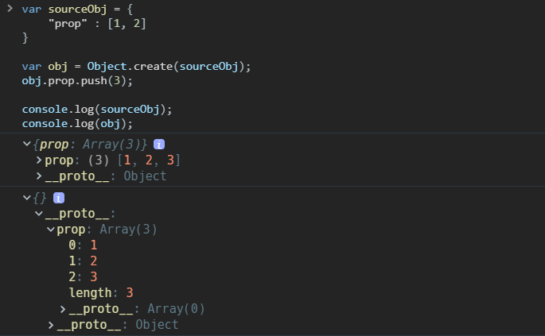

#### 深拷贝

深拷贝对于嵌套类型的数据结构，例如数组，对象等，**会层层递归拷贝内部属性**，遇到引用类型的属性值会重新创建新的内存地址来保存对象的值，然后把新的内存地址复制给属性

- 深拷贝在 react 中的影响是很多的，处理嵌套的对象或者数组，往往只用`...`进行浅拷贝，修改了一处其它地方的`state`也受到了影响；但是这时候并不是推荐使用深拷贝，而是使用`immutablejs`，因为深拷贝性能太弱了
- 深拷贝需要考虑的问题很多，内部嵌套的的类型如何支持，尤其在 ES6 添加了很多额外的类型`Symbol`，`Map`，`Set`等；循环引用怎么高性能的解决，DOM 对象如何处理，正则表达式如何处理等

> `JSON.parse(JSON.stringify(object))`

- 这算是一个古老的方法，如果一个复杂的嵌套数据结构只包含基本类型的节点，那么这是一个最简单的选择

```javascript
var sourceObj = {
  name: 'arr1',
  value: [1, 2],
  birth: undefined,
};
var targetObj = JSON.parse(JSON.stringify(sourceObj));

targetObj.value.push(3);

console.log(sourceObj);
console.log(targetObj);
```

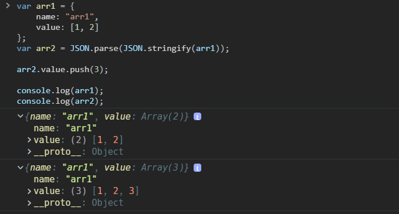

- 函数，`Symbol`，`Map`，`Set`，`ArrayBuffer`等类型和原型成员会忽略掉
- 对象内部值为`undefined`的属性和数组内部`undefined`也会被干掉
- 不能正确处理`Date`，Date 类型两次转换后会变成 UTC 格式的字符串

```javascript
// Date类型的数据会被转成字符串
var date = new Date();
var obj = { dte: date };

console.log(obj);
console.log(JSON.parse(JSON.stringify(obj)));
```

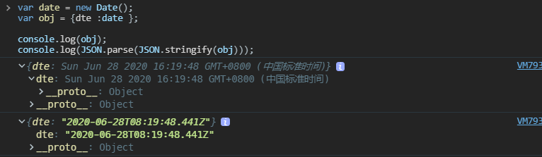

- 不能正确处理`RegExp`正则表达式，会被转换成一个空对象

```javascript
var reg = /at/g;
var obj = { reg: reg };

console.log(obj);
console.log(JSON.parse(JSON.stringify(obj)));
```

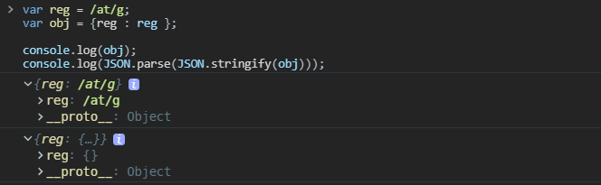

- 无法解决循环引用的问题，会抛出无法转换循环结构的错误

```javascript
var obj = { a: 'a' };
obj.b = obj;

console.log(obj);
console.log(JSON.parse(JSON.stringify(obj)));
```

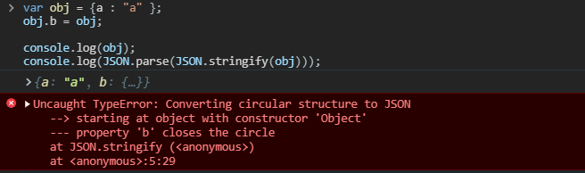

> `lodash.cloneDeep`

```javascript
var _ = require('lodash');
var arr = [{ a: 1 }, { b: 2 }];

var deep = _.cloneDeep(objects);
console.log(deep[0] === arr[0]); //false
```

> `jQuery.extend`

- `$.extend(deepCopy, target, object1, [objectN])`，该方法指定第一个参数为`true`就是深拷贝

```javascript
var $ = require('jquery');
var obj1 = {
  a: 1,
  b: { f: { g: 1 } },
  c: [1, 2, 3],
};
var obj2 = $.extend(true, {}, obj1);
console.log(obj1.b.f === obj2.b.f); // false
```

> 递归实现深拷贝对象

- 这个如果放在面试题里，写好了会是一个很好的加分项，因为可考察的点很多；具体可以参考`lodash.cloneDeep`的实现方式，这里放在 JS 笔试题那部分去解释

#### 结构化克隆算法

- [结构化克隆算法](https://html.spec.whatwg.org/multipage/structured-data.html#structuredserializeinternal)是 HTML5 规范定义的用于复制复杂 JS 对象的算法，这个算法支持的类型很多，对于 ES6 来说，除了`Symbol`不支持，其他的`Map`，`Set`，`File`之类的也支持
- 这个算法没有单独的 API 提供使用，一般都是附加在其他接口的内部使用，具体有以下几个

> [`MessageChannel`](https://developer.mozilla.org/zh-CN/docs/Web/API/MessagePort/postMessage)

- `MessageChannel`可以在两个浏览器窗口建立两个端口`MessagePort`来发送信息，`MessagePort`支持的`postMessage()`方法内部就使用了结构化克隆算法来处理传递的对象，包括循环引用的处理；我们可以利用这个方法实现一个深克隆的异步方法

```javascript
function structuralClone(obj) {
  return new Promise(resolve => {
    const {port1, port2} = new MessageChannel();
    port2.onmessage = ev => resolve(ev.data);
    port1.postMessage(obj);
  });
}

const obj = /* ... */;
const clone = await structuralClone(obj);
```

> History API

- HTML5 引入了 [`history.pushState()`](https://wiki.developer.mozilla.org/en-US/docs/Web/API/History/pushState) 和 [`history.replaceState()`](<https://wiki.developer.mozilla.org/en-US/docs/Web/API/History_API#The_replaceState()_method>) 方法，直接推动了单页面框架的诞生，这两个 API 都支持传入一个状态对象参数在不同 URL 之间传递参数，这个对象在传递的时候会使用结构化克隆算法进行处理，为了不修改浏览器历史记录，我们可以使用`history.replaceState()`来定义一个深拷贝的方法

```javascript
function structuralClone(obj) {
  // 需要保存历史状态，等会还要还原回去
  const oldState = history.state;
  history.replaceState(obj, document.title);
  const copy = history.state;
  history.replaceState(oldState, document.title);
  return copy;
}

const obj = /* ... */;
const clone = structuralClone(obj);
```

> [`Notifications`](https://developer.mozilla.org/en-US/docs/Web/API/Notification/Notification)

- `Web Notifications`，在用户允许的情况下显示跨浏览器窗口通知的 API，也就是即使切换浏览器窗口也能看的到通知；`Notification()`构造函数可以接受第二个可选的参数，这个参数可以是对象，内部有个`data`可传递任意类型的数据（`silent`是否将提醒设置成静音无震动的）

```javascript
function structuralClone(obj) {
  return new Notification('', {data: obj, silent: true}).data;
}

const obj = /* ... */;
const clone = structuralClone(obj);
```

#### 性能

> [Deep-copying in JavaScript](https://dassur.ma/things/deep-copy/)

- 如果没有循环引用，并且对象内部基本都是基本数据类型的值，则可以使用跨浏览器的`JSON.parse(JSON.stringify())`获得最快的克隆性能
- 如果要兼容大多数类型，并且解决循环引用的问题，使用`MessageChannel`是唯一可靠的跨浏览器的选择，下图源自 Surma 的博客。

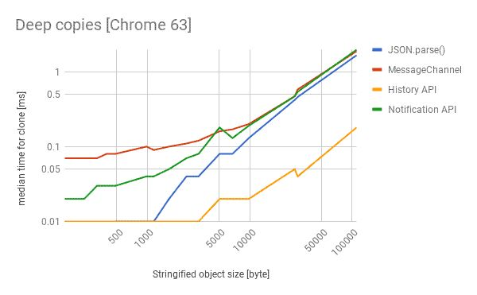
