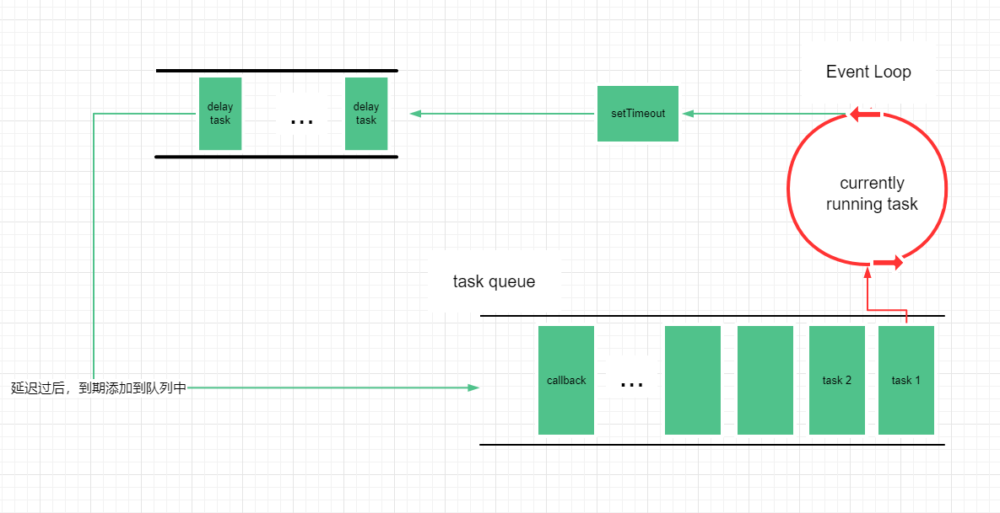
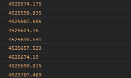

## Timers

> [Timers](https://html.spec.whatwg.org/multipage/timers-and-user-prompts.html#timers)

诸如`setTimeout`，`setInterval`属于定时器类型的任务类型，在页面事件循环的机制中，定时器类型的任务最终也会被放到任务队列中去处理。

从 whatwg 规范定义的内容来看，无论是`setTimeout`还是`setInterval`都会经过一个初始化定时器的步骤，并且它们俩用的都是同一套算法，同一个定时器任务列表，见 —— [timer-initialisation-steps](https://html.spec.whatwg.org/multipage/timers-and-user-prompts.html#timer-initialisation-steps)，大致的步骤如下：

- 如果提供了`previous handle`，则让当前定时任务的`handle`（`handle`就是当前定时任务的 Id）等于`previous handle`；如果没有，取一个大于 0 的整数来作为`handle`，并在定时器任务列表（**list of active timers**）中添加一条记录；

- 准备将回调函数执行封装成一个任务：
  - 如果当前定时器任务列表中此`handle`的任务已经被清除，那么就终止算法过程；
  - 在任务中调用回调函数
  - 判断当前重复执行的标记位（repeat flag），如果为 true 则回头调用这个算法；
- 设置`timeout`
- 判断任务队列中`currently running task`是否是之前设定过的定时任务，如果是的话设置嵌套级别`nesting level`等于`currently running task`的`timer nesting level`，如果不是则设置嵌套级别`nesting level`等于 0；
- 如果`timeout`小于 0，设置`timeout`等于 0；如果嵌套级别`nesting level`大于 5，设置`timeout`等于 4
- 让`nesting level += 1`；
- 让当前定时任务的`timer nesting level` 等于`nesting level`；
- 返回`handle`，然后继续**并行运行此算法**；
- 等待延迟时间结束，将定时任务排列到任务队列中去执行。

从浏览器引擎的角度来看，实际上还会存在一种延迟执行的任务队列[DelayedIncomingQueue](https://source.chromium.org/chromium/chromium/src/+/master:base/task/sequence_manager/task_queue_impl.h;bpv=1;bpt=1;l=308?gsn=DelayedIncomingQueue&gs=kythe%3A%2F%2Fchromium.googlesource.com%2Fchromium%2Fsrc%3Flang%3Dc%2B%2B%3Fpath%3Dsrc%2Fbase%2Ftask%2Fsequence_manager%2Ftask_queue_impl.h%23RkefcvcqCdse2BLt2fciB2l5hG6ZWMxHY9xBzquPyXE)，用于保存定时器任务。主线程在执行 JS 的过程中如果遇到`setTimeout`之类的定时器，会根据其回调函数和当前发起`setTimeout`的时间，以及延迟执行的时间去创建一个回调任务，保存到延迟执行的任务队列中，然后继续执行当前任务。在等待`setTimeout`中设置的延迟以后，就会将延迟队列中的任务取出并添加到任务队列中去等待执行。

如果在延迟队列中的任务尚未执行，可以使用`clearTimeout`从延迟队列中删除任务。



### in parallel

> [whatwg - in-parallel](https://html.spec.whatwg.org/multipage/infrastructure.html#in-parallel)

并行运行指的是，某一个算法与规范中定义的其它算法会同时运行，而不是算法中的步骤会并行运行，算法中的步骤仍然会一个接一个地按顺序执行。相比之下，要立即运行的操作必须中断任务队列中的 currently running task，先执行它，然后再恢复之前的 currently running task。

为了避免不同的并行运行的算法在操作相同数据时发生竞争关系（ race conditions ），会使用一个并行队列。并行队列具有一个算法队列，算法队列中的步骤必须连续一个接一个的按顺序执行。

将执行步骤放入并行队列中，就是将步骤排列到算法队列中去执行。

### setTimeout

> [MDN - setTimeout](https://developer.mozilla.org/en-US/docs/Web/API/WindowOrWorkerGlobalScope/setTimeout)

`setTimeout`的语法有两种：

> `setTimeout(handler, timeout, [arguments... ])`
>
> handler：回调函数
>
> timeout：毫秒数
>
> arguments：传递给 handler function 的参数
>
> 返回一个正整数，表示当前计时器的 Id，可以使用`clearTimeout()`方法来根据 Id 清除某个计时器

> `setTimeout(code, timeout)`
>
> code： 一串代码字符串
>
> timeout：毫秒数
>
> 不推荐这种形式的回调，一方面，字符串形式的代码需要二次解析成可执行代码，另一方面，这种形式容易带来和`eval()`一样的安全风险

关于`setTimeout`需要注意以下几点：

- timeout 是毫秒数，也就是秒乘以 1000，并且当 timeout 设置小于 0 时，会被按照 0 处理；
- timeout 设置的延迟时间不是经过该时间就精确执行的时间，要算上 CPU 延迟和任务队列等待执行任务的时间；也就是设置 timeout = 0，也还是会导致其一定程度的延迟执行；
- 根据 whatwg 规范的定义，`setTimeout`可以嵌套调用，但是当嵌套五次以后，执行回调的间隔时间将会被节流到至少 4ms，见 —— [whatwg - timers](https://html.spec.whatwg.org/multipage/timers-and-user-prompts.html#timers)部分的 Note；

```javascript
function cb() {
  setTimeout(cb, 0);
}
setTimeout(cb, 0);
```


- 而对于未激活的浏览器标签页面内的定时器，也将会被节流，最小执行回调的间隔时间为 1000ms；
- 延迟执行时间的保存使用 32 个 bit 来存储，其中还有一个符号位，也就是延迟执行的最大设置时间只能到 2^31 - 1 = `2147483647`ms，如果超过这个时间，就相当于是 0 来看待；
- 最后值得注意的就是在`setTimeout`中传入的回调函数会发生`this`指向变化的问题，这个在作用域的介绍里已经解释过了，一般解决方式是使用箭头函数或者使用`bind`。

### 用 setTimeout 实现 setInterval

上文说过，`setTimeout`和`setInterval`用的是同一个**list of active timers**，并且算法步骤也基本一样。所以完全可以用`setTimeout`实现一个`setInterval`，一般来说，很容易想到递归的方式，即在`setTimeout`回调中再次调用函数：

```javascript
function _setInterval(fn, timeout) {
  setTimeout(() => {
    fn();
    _setInterval(fn, timeout);
  }, timeout);
}

// test
function test() {
  console.log(1);
}

_setInterval(test, 1000);
```

但是这种方式设置的`setInterval`没法清除啊，这往下走肯定奔着内存泄漏去了，可以利用 Chromium 那个延迟队列的方式来做：

- 创建一个数组用来保存 interval 的任务；
- 每次使用`setTimeout`来创建延迟任务的时候，先检查数组中是否存在当前 interval 的 Id，如果存在就设置定时任务，并且在回调中再次调用`setTimeout`创建下一个定时任务；
- 根据 Id 清除`setInterval`任务的时候，删除数组中相应的元素即可；
- 最后设置`setInterval`的时候，需要最后更新一下全局 interval 的 Id，这样保证下一次设置的`setInterval`不会重复

```javascript
let delayStack = [];
let id = 1;
function _setInterval(fn, timeout) {
  let intervalId = id;
  let interval = {
    id: intervalId,
    func: fn,
  };

  delayStack.push(interval);

  const _fn = () => {
    if (delayStack.find(item => item.id === intervalId)) {
      setTimeout(() => {
        fn();
        _fn();
      }, timeout);
    }
  };

  _fn();

  id++;
}

function _clearInterval(clearId) {
  const index = delayStack.findIndex(item => item.id === clearId);
  delayStack.splice(index, 1);
}
```

<code src="@/demo/setInterval" />

### 防抖

> [lodash.debounce](https://www.lodashjs.com/docs/lodash.debounce)
>
> [underscore - debounce](https://github.com/jashkenas/underscore/blob/master/modules/debounce.js)

最初接触实现一个防抖函数的需求，是在前端封装 React 组件的过程中，当时是要实现一个搜索下拉框，根据输入提示搜索内容。根据`<input>`的`input`事件来监听用户输入，并调用后端接口传递输入信息来获取提示信息（实际上要实现更好的搜索输入提示确实需要考虑很多情况，这里只考虑利用防抖来控制接口调用的实现）。

<code title="原生input事件触发" desc="每往输入框中填入一个字符，就会触发input事件" src="@/demo/debounce" />

抖动（bounce）其实来源于电路中的名词 —— [接点弹跳](<https://zh.wikipedia.org/wiki/開關#接點彈跳(bounce)>)，大概就是开关接触的时候发出的连续的电流信号会对电路造成影响，通过"去弹跳"（debounce）来合并电流信号的发出，避免对电路产生影响。

衍生到前端领域，可以理解页面在连续请求后端接口的过程中，前端对于请求数据的展示会连续不断更新，这期间会导致页面中渲染出来的提示内容不稳定；同时连续不断的请求接口也会增加服务器接口处理的压力。

JS 防抖的基本思想是，对于连续调用函数的情况，最后限制只会真正执行一次函数。所以要对一个函数进行防抖限制，可以采用以下步骤：

- 首先在原函数内部创建一个定时器`setTimeout`，设置经过一定延迟后执行函数
- **在每次执行函数的时候，清除上一次设置的定时器，并设置一个新的定时器**；如果是短时间内连续调用的情况，通过清除上一次设置的定时器来保证始终只会执行最后一次设置的定时器中的回调函数

<code desc="设置防抖以后触发函数的频率明显降低" src="@/demo/debounce/debounce" />

为了复用防抖的逻辑，可以封装一个高级函数，根据指定延迟执行时间和指定函数来生成一个防抖函数。

```javascript
const debounced = (fn, timeout) => {
  let timerId;
  return function() {
    clearTimeout(timerId);
    timerId = setTimeout(() => {
      fn.call(this, ...arguments);
    }, timeout);
  };
};
```

### 精准防抖

对于防抖函数有一个常见的冲突就是第一次调用是否要立即执行函数，例如上面的`input`事件，在我们输入第一个字符的时候是否要去立即执行回调函数，接下来的输入才去使用防抖控制其只执行最后一次。为此我们需要在高阶函数的参数中加上一个参数`immediate`

```javascript
const debounced = (fn, timeout, immediate) => {
  let timerId;
  return function() {
    // 判断是否第一次执行，这一步必须要下面的timerId = null来配合
    if (immediate && !timerId) {
      fn.call(this, ...arguments);
    }

    // 清除上一次的定时任务
    if (timerId) {
      clearTimeout(timerId);
    }

    timerId = setTimeout(() => {
      fn.call(this, ...arguments);
      // 清除最后的定时器Id
      timerId = null;
    }, timeout);
  };
};
```

<code title="精准防抖" src="@/demo/debounce/debounce2" />

### 节流

> [lodash.throttle](https://www.lodashjs.com/docs/lodash.throttle)
>
> [underscore- throttle](https://github.com/jashkenas/underscore/blob/master/modules/throttle.js)

throttle，节流，从生活的角度看，就是让男性同胞省着点花钱，否则会被女朋友锤。而放在前端领域内，经常遇到的情况是，某些 DOM 事件会在没有间隔的情况下反复触发，例如页面的`scroll`事件，短期内滚动鼠标滚轮可能立即造成上百次的`onScroll`事件触发，而上文说过，这些 DOM 事件都会被放到任务队列中等到执行，如果不加以限制，会造成任务队列占用内存空间增加，同时也影响其它任务队列中代码的执行效率。

节流的思想其实是在防抖的基础上放松一点限制，防抖限制一段时间内连续调用的话最后只会执行一次函数，节流是在一段时间内连续调用的话，控制函数在这期间每隔一定的延迟才去执行，而不是反复无间隔执行。

要实现函数节流执行，一种思路是需要记录上一次函数执行的时间戳，每一次执行函数和上次执行时间进行对比，如果小于限制的延迟时间，就不予执行，如果大于延迟时间，就执行并且更新执行时间。

<code src="@/demo/throttle" />

另一种思路是第一次执行利用`setTimeout`设置一个定时器，**等待延迟时间后自动执行回调函数，并在回调函数内部清除设置的定时器 Id**，以后每次执行根据定时器 Id 检查定时器是否存在，如果存在就不做任何操作，如果不存在则设置一个新的定时器

<code src="@/demo/throttle/throttle" />

仍然可以利用一个高阶函数根据指定延迟时间和指定函数生成一个节流函数：

```javascript
// 利用时间戳
const throttled = (fn, delay) => {
  // 第一次执行
  let lastInvokeTime = 0;

  return function() {
    let timeConsumed = Date.now() - lastInvokeTime;
    if (timeConsumed >= delay) {
      // 更新当前执行时间
      lastInvokeTime = Date.now();
      fn.call(this, ...arguments);
    }
  };
};

// 利用setTimeout
const throttled = (fn, timeout) => {
  let timerId;
  return function() {
    if (!timerId) {
      timerId = setTimeout(() => {
        timerId = null;
        fn.call(this, ...arguments);
      }, timeout);
    }
  };
};
```

### 精准节流

如果总结一下上述两种实现节流函数的不同点，会发现：

- 利用时间戳方式控制更加精确，`setTimeout`实际执行的时间需要算上 CPU 延迟，任务队列中其它任务执行的时间等，并且时间戳方式的控制可以保证首次调用就立即执行；
- 利用`setTimeout`的方式更为简洁，`setTimeout`不能保证首次调用立即执行，但是`setTimeout`总是能保证节流之后会执行一次，类似于防抖的效果。

```javascript
const throttled = (fn, delay) => {
  let lastInvokeTime = 0,
    timerId;
  return function() {
    // 保证立即执行一次
    let timeout = Date.now() - lastInvokeTime;
    if (timeout >= delay) {
      lastInvokeTime = Date.now();
      fn.call(this, ...arguments);
    } else {
      // 这部分是保证最后执行一次
      if (timerId) {
        clearTimeout(timerId);
      }

      timerId = setTimeout(() => {
        lastInvokeTime = Date.now();
        timerId = null;
        fn.call(this, ...arguments);
      }, delay);
    }
  };
};
```

<code src="@/demo/throttle/throttle2" />

为此，节流函数中引入`leading`和`trailing`两个概念：

- `leading`：标识首次调用立即执行函数
- `trailing`：标识节流之后再额外触发一次函数执行，类似于防抖的效果

要实现`leading`和`trailing`的效果，除了需要添加额外的参数控制，还需要将上述两种实现相结合：

- 利用时间戳来控制执行规律，并根据`leading`判断首次调用是否立即执行函数；
- 利用`setTimeout`根据`trailing`保证最后执行一次

```javascript
const throttled = (fn, delay, leading = true, trailing = true) => {
  let lastInvokeTime = 0,
    timerId;
  return function() {
    if (!lastInvokeTime && leading === false) {
      lastInvokeTime = Date.now();
    }
    let timeout = Date.now() - lastInvokeTime;
    if (timeout >= delay) {
      lastInvokeTime = Date.now();
      fn.call(this, ...arguments);
    } else if (trailing) {
      // 如果设置trailing，每次必须要清除上一次设置的定时器，类似于防抖的原理
      if (timerId) {
        clearTimeout(timerId);
      }

      timerId = setTimeout(() => {
        // 这里需要根据是否立即执行来设置最后执行时间戳
        lastInvokeTime = leading ? Date.now() : 0;
        timerId = null;
        fn.call(this, ...arguments);
      }, delay);
    }
  };
};
```

## requestAnimationFrame

> `const animationId = window.requestAnimationFrame(callback)`
>
> `window.cancelAnimationFrame(animationId)`

在过去 CSS 还不是太发达的时候，利用 JS 的`setTimeout`或者`setInterval`来做动画多一点。大多数普通显示器的屏幕刷新率都在 60Hz，也就是每秒呈现 60 帧画面，可以计算出每帧画面的间隔时间为：

$$
1000ms / 60 = 16.66666ms
$$

也就是显示器在绘制出上一帧画面之后，最快需要经过上面的时间间隔才能绘制呈现下面的一帧画面。而基于`setTimeout`等定时器任务进制绘制的画面，如果想指定更高刷新率的动画，不能低于`16.66666ms`这个时间了，即使低于这个时间显示器也没办法呈现中间的画面。并且`setTimeout`等定时器任务本身还要受到事件循环机制的限制，需要在任务队列等待执行，所以用定时器做出来的动画没有稳定和平滑的效果。

`requestAnimationFrame`方法只有一个参数，是传入一个回调函数，回调函数会接受一个时间戳作为参数，并且该时间戳的精度值可以精确到 5μs（微秒）。



该回调函数会在浏览器的事件事件循环的更新渲染的一步中被调用，具体见 —— [update-the-rendering 第 12 步](https://html.spec.whatwg.org/multipage/webappapis.html#update-the-rendering)，通俗来讲就是下次一重绘之前会调用回调函数，所以`requestAnimationFrame`总能保证每次执行回调函数的时间间隔和浏览器的刷新频率保持一致，从此不用担心应该为动画间隔指定多少延迟时间而感到焦虑了。

从 whatwg 的规范来看，每一个页面实际上有一个`map`结构用来保存每次通过`requestAnimationFrame`设置的回调函数，见 —— [**run requestAnimationFrame**](https://html.spec.whatwg.org/multipage/imagebitmap-and-animations.html#dom-animationframeprovider-requestanimationframe)，而到事件循环机制中去需要去执行`requestAnimationFrame`设置的回调函数的时候，会遍历`map`，取出回调函数执行，见 —— [**run the animation frame callback**](https://html.spec.whatwg.org/multipage/imagebitmap-and-animations.html#run-the-animation-frame-callbacks)。

<code src="@/demo/animation" desc="利用`requestAnimationFrame`做动画并不难，只需要在每次执行回调函数的内部再次调用`requestAnimationFrame`即可，`requestAnimationFrame`方法会返回一个动画制作的Id，可以使用`cancelAnimationFrame`来取消动画" />
