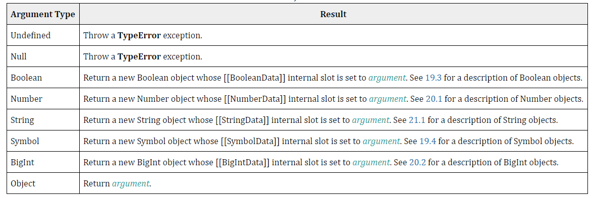
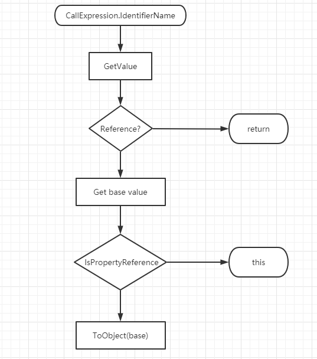
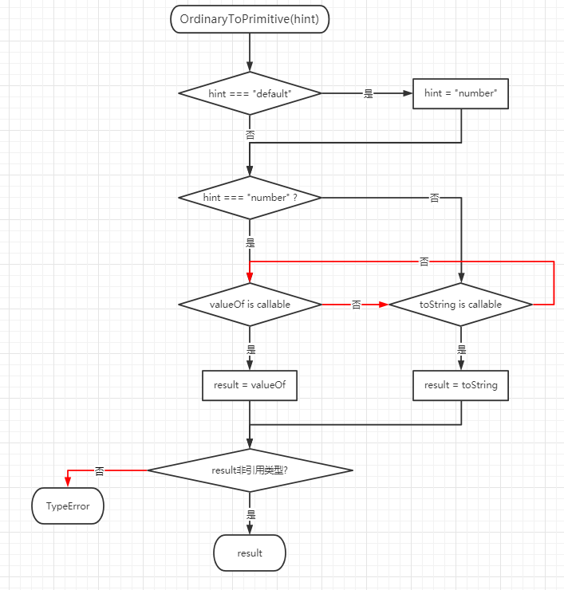
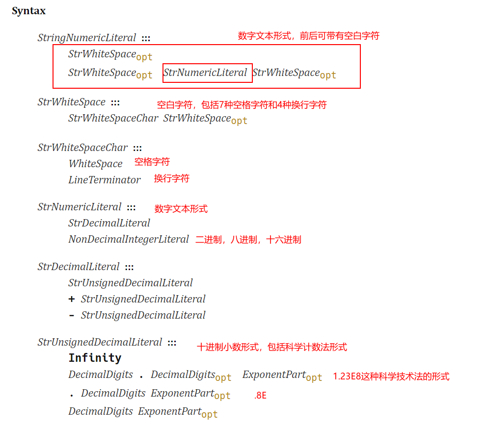

## ES 语言类型

按照 ES 规范文档的描述，将数据类型分成两大类：ES 语言类型，包含原始值类型和对象类型，是在 JS 语言中直接操作的类型；ES 规范类型，是抽象的描述语言执行层面的元数据类型。

ES 语言类型包含八种：`Undefined, Null, Boolean, String, Symbol, Number, BigInt, and Object`，其中`Object`下又包含内置对象类型，例如`Array`，`Date`等

### 原始值类型

对于七种类型`Undefined`，`Null`，`Boolean`，`Number`，`BigInt`，`Symbol`，`String`，它们的值在 ES 规范中被称为原始值（primitive value）

#### Null

> `null`和`undefined`什么区别

- 从含义上解释的话，`null`是空对象指针，而`undefined`是声明了但是没有初始化的变量值，`undefined`会被 JS 自动处理，但是`null`只会由人为赋值产生

#### Undefined

- Undefined 类型的值只有一个，一般可以用全局变量`undefined`来表示；
- 需要注意的是`undefined`是一个全局变量而不是关键字，在函数作用域内是可以修改的；因此某些代码规范推荐使用`void 0`来表示`undefined`值（`void x`的`void`后面加任何表达式或值都是`undefined`）

```javascript
function foo() {
  var undefined = 5;
  console.log(undefined); //5
}
foo();
console.log(undefined); //undefined
```

#### Boolean

- 这里有一份类型转换表

| 数据类型  | true             | false     |
| --------- | ---------------- | --------- |
| String    | 非空字符串       | 空字符串  |
| Number    | 非 0 和 NaN 数值 | 0 和 NaN  |
| Undefined |                  | undefined |
| Null      |                  | null      |
| Object    | 所有对象         |           |

#### String

- JS 字符串是一组由 UTF-16 编码字符组成的字符集，而字符串的长度表示字符串内含有的 16 位值的个数
- String 类型的字符串有最大长度`2^53 - 1`，大约`9PB`，但是这个长度并不是表面上显示的字符的个数；JS 采用的是 UTF-16 编码的 Unicode 字符集，最常用的 Unicode 字符都是 16 位编码的单个字符，对于不能用 16 位表示的，用两个 16 位表示，也就是有时候你看到的一个字符的长度其实是 2 个 16 位值组成的，长度也就是 2

```javascript
var p = 'Π';
var e = Math.E;

console.log(p.length); //1
console.log(e.length); //2
```

- String 类型的字符串是永远不可变的，一旦字符串构造出来，无法用任何方式改变字符串的内容，平时方法的修改都是复制一份副本进行修改，然后再销毁原本的字符串

> 字符串类型的转换

- 利用`Number`，`Boolean`，`String`，`Object`，`Symbol`继承的`toString()`方法，这里要特别说一下`Number`类型转换成`String`类型，`toString`方法可以带基数，默认是将数字转换成 10 进制的字符串表示形式，但是也可以传入`2`，`8`等进制的基数

```javascript
console.log((0x10).toString()); //16
```

- 使用任何类型值都能使用的`String()`构造函数，`String`构造函数会以下面的规则进行转换
  - 如果该类型有`toString`方法就调用`toString()`
  - 如果是`null`，则返回`null`
  - 如果是`undefined`，则返回`undefined`

> 字符串转 Number 类型

- `parseInt(STR, radix)`：将字符串以 radix 进制转换成 10 进制的数，不过首先会判断这个数字是不是该进制转换来的；在不传入第二个参数的情况下，在 ES5 以后`parseInt`只支持 16 进制前缀`0x`，遇到非数字字符就会停止转换，也不支持科学计数法；因此建议任何时候都要传第二个进制参数

```javascript
Number('-Infinity')['1', '2', '3'].map(parseInt) => {

    parseInt(1, 0);		    //按照parseInt处理radix是0的情况，将按照10进制转换成10进制，所以仍然输出1

    parseInt(2, 1);			//输出NaN

    parseInt(3, 2);			//因为3根本不是二进制的数字，除了0和1，其他都不属于二进制数字，所以直接输出NaN
}

//console
[1, NaN, NaN]

parseInt('');					//NaN
parseInt(undefined);			//NaN
parseInt(null);					//NaN
parseInt('123e-1');				//123
parseInt('0x11');				//17
parseInt('0b11');				//0
parseInt('0o11');				//0
parseInt('-Infinity');			//NaN
```

- `parseFloat(STR)`：直接把原字符串作为十进制来解析；值得说的是`parseFloat`本身是个全局函数，不属于任何对象，但是仍然有`Number.parseInt()`方法，这个和直接使用`parseFloat`是一样的

```javascript
parseFloat(''); //NaN
parseFloat(undefined); //NaN
parseFloat(null); //NaN
parseFloat('123e-1'); //12.3
parseFloat('0x11'); //0
parseFloat('0b11'); //0
parseFloat('0o11'); //0
parseFloat('-Infinity'); //-Infinity
```

- `parseInt`和`parseFloat`都具有一样的解析规则
  - 能识别正负号
  - 参数首位和末位的空白符会被忽略
  - 如果参数字符串的第一个字符不能被解析成为数字会直接返回 `NaN`；但是`parseInt`不能识别`Infinity`，`parseFloat`可以解析`Infinity`
- `Number(value)`：使用`Number`类型的构造函数转换字符串往往是更好的选择，但是转换规则那是相当的复杂
  - `Boolean`类型的`true`转为`1`，`false`转为`0`
  - `null`会返回`0`
  - `undefined`会返回`NaN`
  - 空字符串会返回`0`
  - 如果字符串是一个基本的数值形式，会统一按 10 进制转换，包括科学计数法，其他进制的数
  - 如果字符串含有数字以外的字符，直接返回`NaN`

```javascript
Number('123'); // 123
Number('12.3'); // 12.3
Number('12.00'); // 12
Number('123e-1'); // 12.3				科学计数法
Number(''); // 0				空字符串
Number(null); // 0
Number('0x11'); // 17				16进制
Number('0b11'); // 3				2进制
Number('0o11'); // 9				8进制
Number('foo'); // NaN
Number('100a'); // NaN
Number('-Infinity'); //-Infinity
```

#### Number

> `NaN`，not a number，这个数值设计是为了 Number 类型的计算不会报错来的

- 任何不符合数学运算规则（例如负数开方）的结果都返回`NaN`，任何与`NaN`的操作都会返回`NaN`
- 任何值都不于`NaN`相等，包括他自己
- `isNaN`对任何不能被转换成数值的值使用都会返回`true`

> `Infinity`，无穷

- 可以加正负号，表示`+∞`和`-∞`，默认是正的
- `isFinite`可以用来确定一个数值是不是在最大数和最小数之间

> `Number.MAX_VALUE`，JS 里能表示的最大的数

- 是一个具体的数，只不过用了变量形式代替，这个值接近于 `2^1024 = 1.79E+308`，超过了它就是`Infinity`

> `Number.MIN_VALUE`，JS 里最小的正值

- 是 JS 里最接近 `0` 的正值，而不是最小的负值，约为 `5e-324`，小于`Number.MIN_VALUE`的值会被转换成`0`

#### BigInt

- ES2020 新增了`BigInt`类型，表示大于`Number.MAX_SAFE_INTEGER`的整数，也就是大于`2^53-1`的整数值，从而可以为更大的数值提供精度
- 在过去的 JS 里，超过了`Number.MAX_SAFE_INTEGER`的整数会无法保证数值的精度，有些数值在从十进制转到 64 位二进制的过程中会丢失精度，有了`BigInt`类型就能操作更大数字的计算，在科学和金融业务方面应用应该更多

#### Symbol

ES6 引入的一个基本类型，目前**仅用作对象属性的标识符**，从而防止对象属性名的冲突。

尽管`Symbol`是类型，但是不支持`new Symbol()`语法，只能通过`Symbol(xxx)`来创建；括号内通常传入字符串或者其他类型，其他类型会被转成字符串然后调用。

关于`Symbol`为什么不能用`new`，其实这涉及到 JS 原始值类型包装对象的概念，`new`本身用于函数前面就会以构造函数的形式去调用一个函数，对于其它原始值类型`String`，`Number`，`Boolean`这些，都可以使用`new`调用其构造函数创建一个包装对象出来，就算不显示这么做，在 JS 解析标识符的时候也会去进行包装对象的操作，即原始值类型都会创建一个临时的包装对象，这样才能使用其原型上的方法。从 ES 规范的定义来看，`Symbol`的构造函数直接定义的是不能使用`new`操作符：

> The Symbol constructor is not intended to be used with the new operator. —— [The Symbol Constructor](https://tc39.es/ecma262/#sec-symbol-constructor)

关于这个问题，知乎上也有个相关讨论 —— [symbol 为什么没有包装类型?](https://www.zhihu.com/question/316717095/answer/628772556)，从紫云飞的解释来看，这是 ES6 的尝试，因为本质上使用`new`去构造原始值类型的包装对象这种操作是多余的行为，确实多余，平时基本不会有人这么干去声明一个原始值类型的包装对象出来。所以从 ES6 开始，这种使用`new`调用原始值类型构造函数的行为被隐式废弃，就从`Symbol`开始，并且可见的是的`BigInt`也是这样的，只是`BigInt`目前还是 Stage 4 的状态，ES2021 规范定义也表明了`BigInt`的构造函数无法用`new` —— [The BigInt Constructor](https://tc39.es/ecma262/#sec-bigint-constructor)

作为属性名时必须用`[]`标识，并且只能用`[]`访问；如果想在定义后访问到这个属性，必须将`Symbol(xxx)`先传递给一个变量，然后通过`[]`标识和访问

```javascript
var sym = Symbol('foo');
var obj = { [sym]: 1 };
obj[sym]; // 1
```

每次调用`Symbol()`都会返回一个独一无二的值，即使括号内参数相同

```javascript
Symbol('foo') === Symbol('foo'); // false
```

### 对象值类型

对于`Object`及其衍生的内置标准对象类型，都属于对象值类型，它们可以添加键值对属性

> [内置标准对象类型](https://tc39.es/ecma262/#sec-well-known-intrinsic-objects)

### ES 规范类型

ES 规范类型是描述 JS 语言实现层面的元数据类型，也可以说是实现 JS 引擎需要关注的内容，例如闭包（Closure），作用域（Environment Record）等，无法在 JS 代码里使用这里描述的任何属性和方法。

## 类型转换

> [Type Conversion](https://tc39.es/ecma262/#sec-type-conversion)

### 装箱转换

在 ES 时期，如果按照 JS 高级程序设计过去的描述，`String`，`Number`，`Boolean`，`Symbol`这些属于基本包装类型，也就是当使用它们的值调用方法时，会创建一个该类型的对象，从而能使用原型上的方法。

```javascript
var str = 'test';
var strSub = str.substring(2);

// 这个装箱的过程是这样的
var str = new String('test'); //利用String类型构造函数创建对象
var strSub = str.substring(2); //使用对象从原型上继承的方法
str = null; //销毁
```

需要注意的一点是，将基本类型转换成为包装类型的操作只存在当前语句的执行期间，JS 引擎会在使用完毕后立即销毁对象，所以无法为基本类型的值添加属性。

```javascript
var str = 'test';
str.prop = 'string';
console.log(str.prop); // undefined
```

如果在代码中使用`new`调用基本类型的构造函数，实际创造出来的就是一个对象，它不是基本类型的值。使用`typeof`会得到`"object"`的结果；并且能为其添加属性。

```javascript
var str = new String('');
console.log(typeof str); // object

str.prop = 'string';
console.log(str.prop); // "string"
```

#### ToObject

> [ToObject ( argument )](https://tc39.es/ecma262/#sec-toobject)
>
> [Runtime Semantics: Evaluation](https://tc39.es/ecma262/#sec-property-accessors-runtime-semantics-evaluation)

ES 规范文档里并没有拆箱装箱这种说法，但是描述了`ToObject` 这个抽象方法，这个方法在面对原始值类型的时候，会将其包装成一个对象，如下表所示：



根据 ES 规范文档的描述，大部分`Object`以及 `Object.prototype`上的方法，都需要显式调用`ToObject`来转换；另外比较隐含的一处是[Runtime Semantics: Evaluation]这部分，这部分属于规范中抽象方法部分，是描述成员属性和方法解析标识符的规则。

从[Reference Specification Type](https://tc39.es/ecma262/#sec-reference-specification-type)一章可以了解到一个标识符其实包含三部分绑定内容：

- base value component：这个值本身的数据，它可以是 undefined, an Object, a Boolean, a String, a Symbol, a Number, a BigInt, 或者 Environment Record，也就是 this；
- the referenced name component：被 base value component 调用的属性和方法；
- Boolean strict reference flag：当前语法环境是否使用的是严格模式，true/false

当发生[CallExpression.IdentifierName]这种形式的调用属性或者方法时，会调用 GetValue 这个抽象操作去解析标识符，步骤如下：

- 判断是否是 IsPropertyReference 绑定标识符，IsPropertyReference 的规则是如果 base value component 是 Object 或者 HasPrimitiveBase 为 true 就返回 false；而 HasPrimitiveBase 表示 base value component 是 Boolean, String, Symbol, BigInt, or Number 之一类型就返回 true，所以 IsPropertyReference 的判定规则就是 Object，Boolean, String, Symbol, BigInt, or Number 其中类型之一就返回 true，所以原始值类型自然符合这个条件
- 再判断原始值类型符合后，就会执行 ToObject 操作了，所以本质上，现在的 JS 还是会进行隐式的包装类型的操作

从 ES 规范来看，隐式的装箱发生在很多情况下，涉及到 GetValue 的地方很多，常见的`for`循环也会涉及，使用`Function.prototype.call/apply`等也会涉及 ToObject



### ToPrimitive

> [`ToPrimitive(input, preferredType)`](https://tc39.es/ecma262/#sec-toprimitive)
>
> @param input 对象
>
> @param preferredType 要转换的基本类型，默认是 number

ES 规范文档中描述了抽象的`ToPrimitive`这个方法，是将对象类型转换成原始值类型的操作，也就是拆箱。

根据 ES 规范文档一大串的描述，归纳下来`ToPrimitive`转换一般只会得到`String`或者`Number`两种类型的原始值，其规则如下：

- 如果`input`是七种原始值类型之一，直接返回，它根本不会走这个方法；

- 如果`input`是`Date`类型，由于其原型上重写了`@@toPrimitive`方法，按照`Date.prototype.[@@toPrimitive]`这个方法执行，并且默认是转换成字符串

```javascript
console.log(new Date()[Symbol.toPrimitive]('default'));
console.log(new Date()[Symbol.toPrimitive]('string'));
// "Sat Jul 25 2020 16:29:09 GMT+0800 (Hong Kong Standard Time)"

console.log(new Date()[Symbol.toPrimitive]('number'));
// 1595665749397
```

- 对于其他对象，如果有`@@toPrimitive`这个方法，就获取其值并判断是否为原始值类型，是的话就返回结果；不是就`TypeError`
- 其实大部分内置对象都没有`@@toPrimitive`这个方法，那么他们只能走下一步去执行`OrdinaryToPrimitive`这步

#### OrdinaryToPrimitive

将普通对象转成`String`或者`Number`。

这个方法是配合`ToPrimitive`使用的，`ToPrimitive`会为该方法指定要转换的类型是 string 还是 number：

- 如果是 string，那么先尝试调用 toString，返回的结果如果是原始值类型就作为结果，否则继续尝试 valueOf，如果最够都得不到原始值，则`TypeError`；
- 如果是 number，则和 string 相反，先尝试 valueOf，后尝试 toString，直到其中之一返回原始值



#### @@toPrimitive

> `@@toPrimitive(hint)`
>
> @param hint "string" / "number" / "default"

`@@toPrimitive`是一个抽象的方法，是在对象类型转换为原始值时最先被调用的方法，只会接收三个参数 —— `"string" / "number" / "default"`。

一般情况下，只有两种对象转原始值会调用这个方法：

- `Date`类型转原始值，`Date`类型的原型对象上定义了该方法，`Date.prototype[@@toPrimitive]`，可将`Date`类型转换成`String`或者`Number`

```javascript
console.log(new Date()[Symbol.toPrimitive]('default'));
console.log(new Date()[Symbol.toPrimitive]('string'));
// "Sat Jul 25 2020 16:29:09 GMT+0800 (Hong Kong Standard Time)"

console.log(new Date()[Symbol.toPrimitive]('number'));
// 1595665749397
```

- 自定义的`Object`类型对象，并通过`Symbol.toPrimitive`属性实现了自己的`@@toPrimitive`方法，例如：

```javascript
obj[Symbol.toPrimitive] = function(hint) {
  // 返回一个原始值
  // hint = "string"、"number" 和 "default" 中的一个
};

let obj = {
  [Symbol.toPrimitive](hint) {
    switch (hint) {
      case 'number':
        return 123;
      case 'string':
        return 'str';
      case 'default':
        return 'default';
      default:
        throw new Error();
    }
  },
};

2 * obj; // 246
3 + obj; // '3default'
obj == 'default'; // true
String(obj); // 'str'
```

### ToString

> [ECMA - ToString](https://tc39.es/ecma262/#sec-tostring)

| 类型      | 结果                                                                                     |
| --------- | ---------------------------------------------------------------------------------------- |
| Undefined | "undefined"                                                                              |
| Null      | "null"                                                                                   |
| Boolean   | "true" / "false"                                                                         |
| Symbol    | TypeError                                                                                |
| BigInt    | 和 Number 表现一致                                                                       |
| Object    | 将对象转原始值`ToPrimitive(object, hint String)`；然后再根据原始值的类型按照本表进行转换 |

对于`Number`类型转字符串，ES 文档描述的很复杂，总结如下：

- `NaN`返回`"NaN"`；
- 正负 0，都返回`0`；
- 正无穷，返回`Infinity`；
- 如果是负值，数字部分`ToString`再和负号`-`做字符串连接

### ToNumber

> [ECMA - ToNumber](https://tc39.es/ecma262/#sec-tonumber)

对于原始值类型`ToNumber`根据不同类型会直接返回下表中指定的值；

对于`Object`及其它内置对象，`ToNumber`会首先进行`ToPrimitive(object,number)`操作转化成原始值，这里指定了`ToPrimitive`转换原始值的类型为 number

| 操作数类型 | 转换结果                                                                                                                                                                                                  |
| ---------- | --------------------------------------------------------------------------------------------------------------------------------------------------------------------------------------------------------- |
| Undefined  | `NaN`                                                                                                                                                                                                     |
| Null       | `+0`                                                                                                                                                                                                      |
| Boolean    | true = 1 ; false = 0                                                                                                                                                                                      |
| Number     | 直接返回 Number                                                                                                                                                                                           |
| Symbol     | TypeError                                                                                                                                                                                                 |
| BigInt     | TypeError                                                                                                                                                                                                 |
| String     | 不包含数字的字符串（十六进制除外），直接`NaN`<br />如果字符串中含有`[U+D800, U+DFFF]`之间的码点字符，则直接转换成`NaN`；<br />如果字符串中数字和字母串接在一起，也是直接`NaN`<br />其他情况如下文具体分析 |
| Object     | 执行`ToPrimitive(object,number)`转换成原始值；然后再根据原始值的类型进行上述转换                                                                                                                          |

对于`String`类型转数字，需要满足数字字符串形式的`Number`类型词法组合才能转成一个数字，也就是以下形式组合在一起，或者单独一条都能转成数字，规则如下：

- 只包含*空字符串*；_空白字符_，*换行符*等都会被转成`+0`\*
- 包含七种空白字符
- 包含四种换行符
- 十进制数字形式，这里可以出现小数点，也只能在这里用，如果其他地方使用了`.`构不成一下形式，就直接`NaN`
  - 无符号十进制数字形式
    - `Infinity`
    - `[0, 9]`组成的整数
    - `[0, 9]`数字组成的小数形式`[0, 9].[0, 9]`，例如 2.5，3.6
    - 没有整数部分的小数形式`.[0, 9]`，例如`.8`
    - 严格遵守规则的科学计数法形式，即`e`后面必须是整数，什么都没有或者小数都会`NaN`
- 
  - `+`无符号十进制数字形式
  - `-`无符号十进制数字形式
- `0b`/ `0B`开头 + `0`和`1`两个数字组成的二进制形式，会将其转换成十进制
- `0o` / `0O`开头 + `[0, 7]`之间数字组成的八进制形式，会将其转换成十进制
- `0x` / `0X`开头 + `[0, F]`组成的十六进制形式，会将其转换成十进制



### ToBoolean

> [ToBoolean](https://tc39.es/ecma262/#sec-toboolean)

| 类型      | 结果                                 |
| --------- | ------------------------------------ |
| Undefined | false                                |
| Null      | false                                |
| Number    | ±0，NaN => false<br />其它都是 true  |
| String    | 空字符串 => false<br />其它都是 true |
| Symbol    | true                                 |
| BigInt    | 0n => false<br />其它都是 true       |
| Object    | true                                 |

#### 假值

JS 的假值只有以下 7 个：

```javascript
null
undefined
空字符串""
±0
NaN
0n
```

## 类型判断

### typeof

`typeof`返回操作数的类型名称字符串，它没什么原理不原理的，返回值是直接在规范中给出来的，如下表：

| 类型         | 结果             |
| ------------ | ---------------- |
| Undefined    | `"undefined"`    |
| Null         | **`"object"`**   |
| Boolean      | `"boolean"`      |
| Number       | `"number"`       |
| String       | `"string"`       |
| Symbol       | `"symbol"`       |
| BigInt       | `"bigint"`       |
| Function     | **`"function"`** |
| 其它引用类型 | **`"object"`**   |
| class        | `"function"`     |

### instanceof

> `obj instanceof Constructor`
>
> @return Boolean

过去`instanceof`主要用于判断对象的类型，其原理是通过原型链查找`obj.__proto__`是否等于类型构造函数的原型`Constructor.prototype`

```javascript
function _instanceof(obj, constructor) {
  if (obj === null) {
    return false;
  }

  // 判断原型是否存在
  if (constructor && constructor.prototype) {
    var _prototype = Object.getPrototypeOf
      ? Object.getPrototypeOf(obj)
      : obj.__proto__;

    if (_prototype === constructor.prototype) {
      return true;
    } else {
      _instanceof(_prototype, constructor.prototype);
    }
  }

  return false;
}
```

ES6 以后，通过`Symbol.hasInstance`可以定义`instanceof`的判断结果，`instanceof`在执行的时候会优先获取`Symbol.hasInstance`的值，并将其转换称`Boolean`类型返回。

```javascript
class Person {
  static [Symbol.hasInstance]() {
    return true;
  }
}

//这个被改造的类使用instanceof，无论什么都会返回true
console.log(undefined instanceof Person); //true

//判断class是不是使用new调用的
function _instanceof(this, myClass) {
  if (typeof Symbol !== 'undefined' && myClass[Symbol.hasInstance]) {
    return !!myClass[Symbol.hasInstance](this);
  }
}
```

### Object.prototype.toString

> [ECMA - Object.prototype.toString ( )](https://tc39.es/ecma262/#sec-object.prototype.tostring)

根据 ES 规范文档的描述，早期的 ES 规范设计的有一个`[[Class]]`属性，用作各种内置对象的标称类型标签，只能通过`Object.prototype.toString`这个方法获取`[[Class]]`的字符串值。

从 ES6 开始，规范定义了`Symbol.toStringTag`属性，程序中可以直接使用`Symbol.toStringTag`为类型定义名称，执行`Object.prototype.toString`的过程也发生了变化，会优先根据`Symbol.toStringTag`属性进行返回值的判断，如果没有再根据对象的私有属性判断其类型。

所以这个方法判断类型也不安全了。

```javascript
Array.prototype[Symbol.toStringTag] = 'test';

console.log(Object.prototype.toString.call(new Array())); // [object test]
```

根据 ES 规范文档的描述，`toString.call(this)`被调用会做以下处理：

- 判断 this 是不是`undefined`，是返回`"[object Undefined]"`；
- 判断 this 是不是`null`，是返回`"[object Null]"`；
- 对 this 进行`ToObject`转换，得到包装的对象；
- 获取包装对象的`Symbol.toStringTag`属性，如果存在并且值是`String`类型，则返回其值和字符串`"[object"`连接的结果；
- 如果不存在`Symbol.toStringTag`属性，且为内置对象，返回类型名称和字符串`"[object"`连接的结果；
- 如果都不满足，最后返回`[object Object]`

```javascript
var type = Object.prototype.toString.call(window);
console.log(type); //[object Window]

var type = Object.prototype.toString.call(new Date());
console.log(type); //[object Date]

var type = Object.prototype.toString.call(null);
console.log(type); //[object Null]

var type = Object.prototype.toString.call(undefined);
console.log(type); //[object Undefined]

function Foo() {}

var foo = new Foo();
var type = Object.prototype.toString.call(foo);
console.log(type); //[object Object]
```

使用`Symbol.toStringTag`这个属性为创建的类定义类型名称，弥补`toString`的不足

```javascript
class Person {
  get [Symbol.toStringTag]() {
    return 'Person';
  }
}

var o = new Person();
console.log(Object.prototype.toString.call(o)); //[object Person]
```

可以用正则表达式处理一下结果，只显示类型字符串

```javascript
function _typeof(obj) {
  return Object.prototype.toString
    .call(obj)
    .replace(/^\[object\s(\w+)\]$/, '$1')
    .toLowerCase();
}
```

### Object()

> [ToObject ( argument )](https://tc39.es/ecma262/#sec-toobject)

当`Object`作为函数单独调用时，实际上发生的就是装箱的`ToObject`操作，将除了`Null`和`Undefined`类型外的原始值包装成对象，但是对于引用类型的`Object`，它都是直接返回这个值，所以可以利用`Object`和`===`判断一个值是不是引用类型。

```javascript
Object(obj) === obj; //true
```

### 其它类型内置的判断方法

> `Array.isArray()`判断数组

- `Array.isArray()`其实也是利用了`toString`的实现方式

```javascript
if (!Array.isArray) {
  Array.isArray = function(arg) {
    return Object.prototype.toString.call(arg) === '[object Array]';
  };
}
```

> 判断对象是否为引用类型

```javascript
function isObject(obj) {
  if (obj !== null && (typeof obj === 'object' || typeof obj === 'function')) {
    return true;
  }

  return false;
}
```
