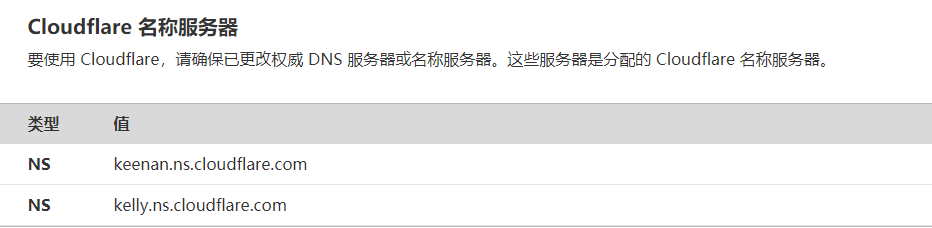
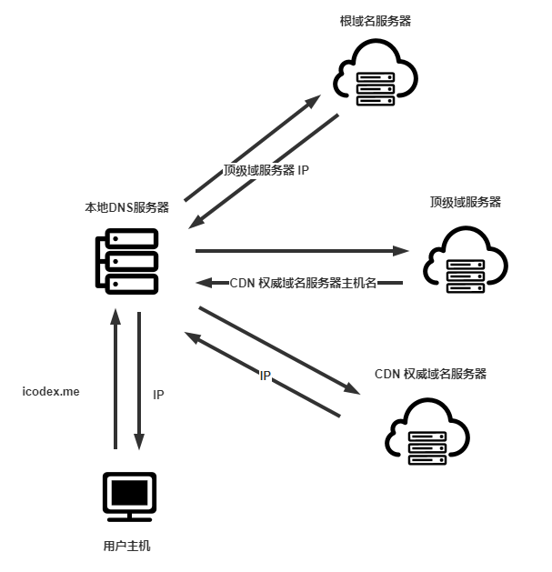

## 什么是 CDN

`CDN`，Content Distribution Network，内容分发网络，是由一组分布在不同地理位置的服务器组成，每台服务器负责存储在因特网上传输的资源（包括 HTML 页面，JS，CSS，视频，音频等）**副本**，并且试图将每个用户请求定向到一个提供最好的用户体验的 CDN 位置。

## CDN 工作原理

当用户浏览器发送请求的时候，CDN 必须截获该请求，以便能够：

- 确定此时适合用于该用户的 CDN 服务器集群
- 将客户的请求重定向到该集群的某台服务器

### 拦截请求

首先来看 CDN 利用 DNS 截获用户请求的过程，以我的 blog 为例：

- 浏览器输入`icodex.me`的网址
- 浏览器调用系统的`DNS`客户端向本地`DNS`服务器发送`DNS`查询报文
- 本地`DNS`收到请求以后先向根域名服务器请求，获取顶级域名服务器的`.me`的`IP`地址
- 本地`DNS`服务器向`.me`的顶级域名服务器发送请求，不同的是，这一步获取的并不是`icodex.me`的`IP`地址或者`CNAME`类型的规范主机名，而是指向 Cloudflare 提供的 CDN 服务器的主机名。这里也就是在域名商处配置的`NS`类型的主机名；从上篇`DNS`的资源记录了解到，`NS`类型的资源记录实际上是知道如何获取该域名（`icodex.me`）的权威`DNS`服务器的主机名

- 本地`DNS`服务器在获取了 CDN 服务器的权威`DNS`服务器的主机名以后，将向其发出一个请求，获取 CDN 服务器的 `IP`地址
- 最终本地`DNS`服务器向用户转发该 CDN 服务器的 `IP`地址
- 用户在收到 CDN 服务器的`IP`地址以后，就可以与其建立 TCP 连接发送请求

### 集群选择策略

CDN 部署的核心是`集群选择策略`，即动态地将客户定向到 CDN 的某个服务器集群或数据中心的机制。

一种简单的策略是将客户请求定向到**地理位置最近**的集群。使用商用地理位置数据库，每一个代理用户请求的本地`DNS`服务器都对应一个地理位置坐标，这样 CDN 服务器可以选择地理位置上距离最为接近的集群。

这种集群选择策略只适用于一部分用户群体，还有一部分用户，他们的本地 DNS 服务器可能是远离用户主机的位置，所以，CDN 还需要对集群和客户之间的时延和丢包性能执行周期性的实时测量。例如，CDN 能够让它的每个集群周期性地向位于全世界的所有本地`DNS`服务器发送探测分组（`ping`报文或者`DNS`请求），这样通过分析时延，可以进一步更加精确地分配集群。
