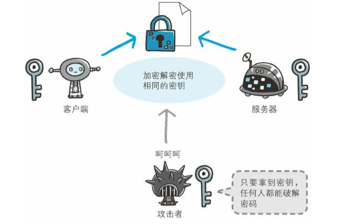
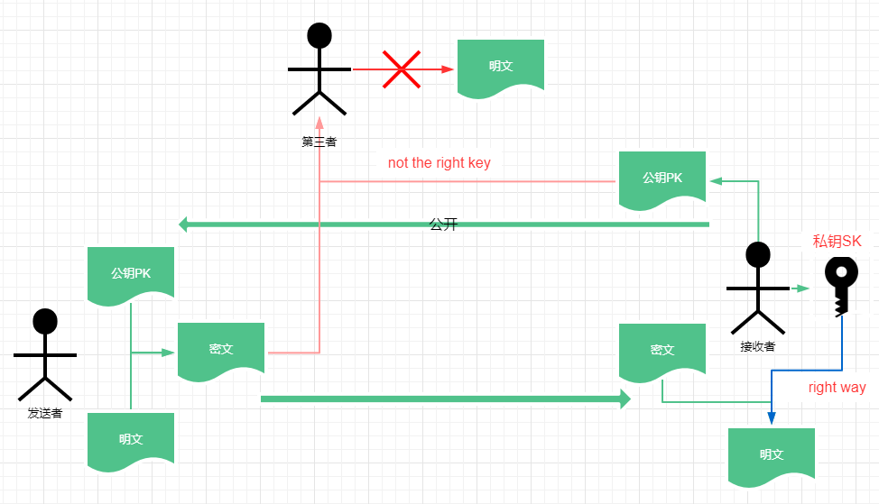
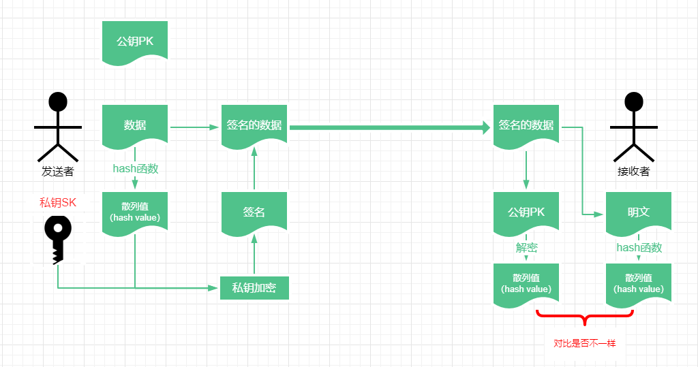
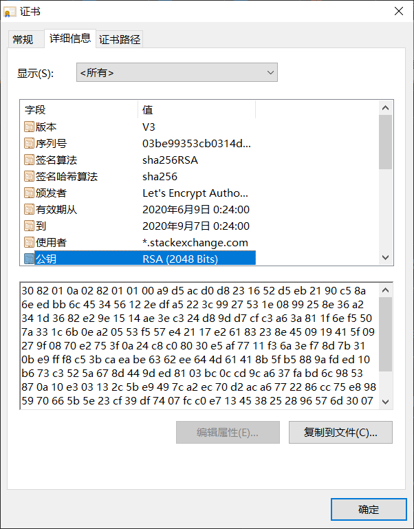
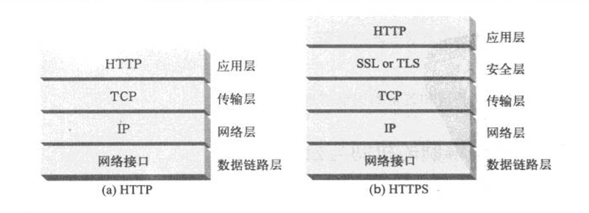
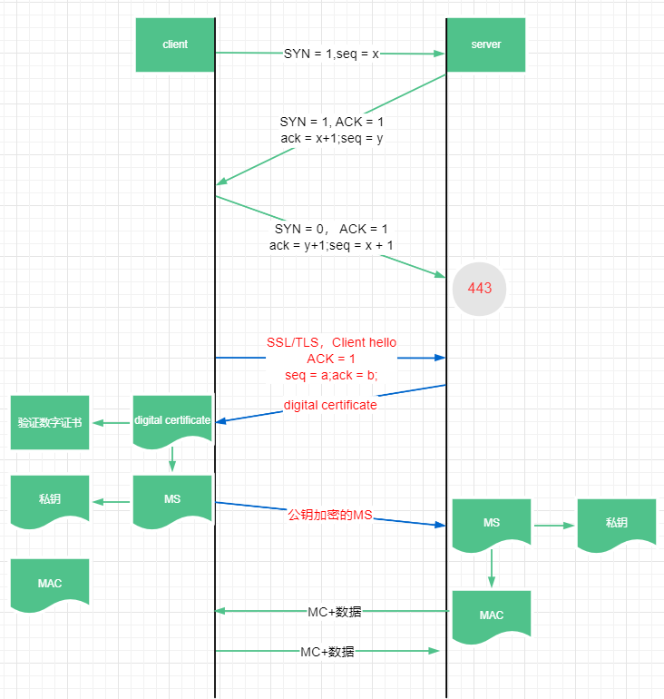

## HTTP 的缺点

HTTP 协议从安全性方面考虑具有以下缺点：

- HTTP 协议不会加密传输内容，使用 TCP 传输容易被监听和抓取信息；
- 不验证通信方的身份，因此有可能遭遇伪装；
- 无法证明报文的完整性，所以有可能已遭篡改

### HTTPS 的针对性对策

面对 HTTP 协议的以上缺点，HTTPS 针对性的弥补：

#### 加密传输

HTTP 协议本身对传输的内容不会进行加密，在网络上基于 TCP 传输的时候，如果被监听抓包是会直接泄露信息的；HTTP 协议中没有加密机制，但可以通过 SSL（Secure Socket Layer，安全套接层）或 TLS（Transport Layer Security，安全层传输协议）来建立加密通信的线路，保证传输的安全。

#### 身份验证

HTTP 协议本身不会验证通信双方身份，但是可以通过证书的手段来验证身份，证书只能在相互信任的通信双方之间持有。

#### 完整性保护

HTTP 协议不会验证请求报文和响应报文的完整性，使用 HTTPS 的手段可以确保数据的完整性。

## 加密方式

保护数据安全最直接方式很容易想到是加密，加密有不同类型；除了加密方式及也还有其他方法。

#### 对称密钥加密方式

对称密钥加密就是加密密钥和解密密钥使用的是同一个密码，常见的加密方式有 DES，AES 等。

在了解 HTTP 认证方式时候，有一种基于密钥加密的方式是 DIGEST 认证，服务端先向客户端发送需要身份凭据的响应，响应首部携带着加密算法和用于加密的随机字符串`nonce`等信息；客户端在收到后，会生成自己的随机字符串`cnonce`，并和服务端提供的随机字符串`nonce`混合在一起使用算法加密，最后通过响应首部将`cnonce`，`nonce`以及加密的信息一起发送到服务端验证。

DIGEST 认证实际上就是一种共享密钥的加密认证方式，服务端要把自己的密钥发送给客户端，而客户端也要生成自己的密钥发送到服务端，这样才能完成认证。而在互联网上转发密钥时，如果通信被监听那么密钥就可会落入攻击者之手，同时也就失去了加密的意义。

#### 公开密钥加密方式

公开密钥加密，Public-key cryptography，也称为非对称加密，公开密钥加密方式使用不同的加密密钥和解密密钥，在公开密钥加密方式中，公钥和所有的加密算法都是公开的，只有私钥部分由双方各自保留。

在互联网通信中，任何一方既可以是发送者，也可以是数据的接收者，以 A 为发送者和 B 为接收者为例，公开密钥加密的实现方式如下：

- 接收者 B 利用密钥对产生器产生公开密钥和私钥，公开密钥会发送给 A；
- 发送者 A 使用 B 产生的公钥，使用 hash 算法对数据进行加密，然后发送给接收者 B；
- 接收者 B 收到密文后，使用自己的私钥进行解密。

公钥算法的主要局限在于，这种加密形式的速度相对较低。实际上，通常仅在关键时刻才使用公钥算法，如在实体之间交换对称密钥时。所以主流的一些业务多使用公钥加密和私钥加密结合的方式。

##### 公钥加密算法

常用公钥加密算法有：

- RSA，RSA 算法是由三个 MIT 的老外开发出来，而他们的姓氏手写字母拼在一起就是 RSA 三个大写字母，所以就被称为 RSA 算法。RSA 是使用最广泛的公钥加密算法，特别适用于互联网传输的数据，RSA 算法可以生成一个公钥和私钥，到目前为止使用公钥加密的明文没有任何方法破解，只能使用私钥解密。
- Diffie-Hellman，DH 算法，也是用发明者两个老外的名字中的单词命名的。DH 算法只适用于密钥交换。
- DSA，Digital Signature Algorithm，数字签名算法，DSA 是美国国家安全署发明的算法，仅适用于数字签名。

#### 密码散列函数

密码散列函数，也就是 hash 函数，是一种将源数据压缩成固定长度的新数据的函数。密码散列函数不是一种加密算法，它是有损压缩数据的方法，因此它只在数据验证的方面使用。hash 函数具有以下特点：

- 输入函数的数据可以很长也可以很短，但是输出的散列值都是固定长度的，并且很短；
- **不同的散列值一定对应不同的输入**，具有这种性质的散列函数称为单向散列函数；但是不同的输入很有可能得出相同的散列值，这种情况叫做散列碰撞。

在数据传输的过程中先使用散列函数生成散列值然后附在数据后面发送，接收者在收到数据后，也用 hash 函数生成一份散列值，与原数据附着的散列值进行比较来验证数据是否被修改。使用密码散列函数理论上并不能保证数据一定不被修改，因为存在碰撞的可能性，但是要找到碰撞的两个数据得到相同散列值的情况几乎不可能，所以可以基本认为只要散列值相同则验证的数据就相同。

##### 散列函数

- MD5，message digest，报文摘要，MD5 就是 MD 的第五个版本，MD5 函数对输入的 message 会得到固定长度的 128 位的 message digest。在过去的研究过程中发现，要找到一个与原 message 得到相同 message digest 的不同 message 几乎不可能。不过后来中国的王小云教授团队研究发现，能在 15 分钟内找到 MD5 的碰撞值，后来也有其他团队找到 MD5 碰撞值，于是后来 MD5 逐渐被 SHA 算法取代
- SHA，Secure Hash Algorithm，安全的 hash 函数，SHA 已经有 SHA-2 和 SHA-3 等版本，SHA 和 MD5 不同点是生成的散列值是 160 位长度的，所以 SHA 算法比 MD5 要更慢
- MAC，Message Authentication Code，报文鉴别码，是对 hash 函数生成的散列值进行加密后得到的密文。

#### 数字签名

数字签名则是结合散列函数和公钥加密方式来保护数据完整性的方法。

生成数字签名和签名验证的的过程如下：

- 需要先将明文输入 hash 函数，得到一串固定长度的散列值；
- 然后用户根据 RSA 算法生成公钥和私钥，再用私钥对散列值进行加密得到最终的签名；
- 用户将签名放在明文中（相当于按手印），然后和公钥一起发送给接收者；
- 接收者收到公钥和签名后的数据后，分离明文和签名，然后使用公钥解密数据里的签名部分，得到原始散列值；
- 接收者再根据 hash 函数和收到的明文生成对比散列值，用于和签名得到的散列值进行对比，如果散列值不一样则表示传递的明文一定也一样，也就表示明文已经是篡改过的。（这个结果理论上无法保证数据没有被篡改，因为不同的输入也可以得出同样的散列值；但是散列值碰撞的情况极为少见，需要大量耗时计算，所以基本上可以认为明文不会被篡改）

数字签名的算法是使用公钥去解密私钥加密的内容，也属于公开密钥加密方式；当面对互联网第三方攻击时，数字签名可以做到以下三点：

- 第一：第三方从报文提取明文并修改，加上原来的签名然后再发送给接收者，但是散列值保证了不同的散列值一定来自不同的数据源，所以修改后的数据一定无法通过验证，这也就保证了**签名的数据无法被修改**；
- 第二：第三方想修改明文并伪造一份签名发送给接收者，但是**私钥只有发送者才有，所以第三方无法产生相同的签名**，那么也就保证了签名无法被伪造；
- 第三：如果 A 不承认发送过签名，B 可以把收到的签名出示给第三方公证机构，第三方可以根据公钥解密出明文，则证明 A 确实发送过签名。

#### 数字证书

digital certificate，数字证书，或者叫公开密钥认证证书，是将公钥和持有者身份进行绑定的文件，也就是负责验证通信双方身份的。从数据加密还有数字签名，保证的都是数据在传输的过程中不会被盗取和修改，然而在接收加密信息或者签名的信息的一方，并不知道数据的来源，所以这就给大量钓鱼的第三方提供了机会，必须使用数字证书验证身份后才能进行数据的加密传输。

数字证书不光用于 HTTPS，在互联网很多传输数据的业务方面都有使用，例如电子邮件 SMTPS 等，并且一些电子合同也能使用，很多国家和地区都立法通过使用数字签名的数字证书和亲笔签名具有一样的法律效力。

数字证书的种类也有很多，业界现行的标准是国际电信联盟电信标准化部门制定的 X.509，并由[IETF](https://zh.wikipedia.org/wiki/互联网工程任务组)发行的[RFC](https://zh.wikipedia.org/wiki/RFC) [5280](https://tools.ietf.org/html/rfc5280)文档详细说明。

##### X.509

X.509 是数字证书的标准格式，该数字文档将加密密钥对与网站，个人或组织之类的关联起来，遵从 X.509 标准格式的数字证书一般包含以下内容：

- 版本：现行通用版本是 V3；
- 序号：用于识别每一张证书，特别在撤消证书的时候有用；
- **主体**：拥有此证书的法人，或者自然人身份或机器，如果是网站使用 TLS 证书，则就是网站的域名；
- 发行者：以数字签名形式签署此证书的数字证书认证机构；
- 有效期开始时间
- 有效期结束时间
- 公开密钥用途：指定证书上公钥的用途，例如数字签名、服务器验证、客户端验证等
- **公开密钥**：注意这个公钥是持有证书的主体的公钥，例如在服务器中，就是服务器公开的密钥
- **数字签名**：负责验证数字证书的，保证数字证书不会被篡改

##### CA

CA，Certificate Authority，也就是证书认证中心，是一个负责发放和管理数字证书的第三方权威机构，例如上图中的 Let’s Encrypt 这个机构，它也是一个公司。

CA 的主要职责如下：

- 证书的颁发：接收、验证用户(包括下级认证中心和最终用户)的数字证书的申请；
- 证书的更新：认证中心可以定期更新所有用户的证书，或者根据用户的请求来更新用户的证书；
- 证书的作废：由于用户私钥泄密等原因，需要向认证中心提出证书作废的请求；证书已经过了有效期，认证中心自动将该证书作废；

##### 数字证书的申请和使用

当互联网上的个人，网站或组织希望获得数字证书时，首先要向第三方机构，例如 CA 等提交申请，将自己的一些信息，例如年龄性别等提供给 CA，CA 在验证身份准确后，会根据这些信息加上自己的信息生成一份文件，并对这份文件进行数字签名，保证其不会被篡改，然后就得到了数字证书。

当需要出示数字证书证明身份的时候，对方会首先使用 CA 提供的公钥对证书的数字签名进行验证，当验证通过后才会使用证书里面提供的信息。

##### 域名证书安全级别

- DV，Domain Validation，域名验证型证书，认证机构只会根据申请方提供的信息审核域名所有权
- OV，Organization Validation，组织认证型证书，申请者必须通过两项审核：管理相关域名的权利，而且相关组织是实际存在的法人
- EV，Extended Validation，扩展验证，这是最严格的审核级别，审核过程可能牵涉专业法律人员的调查及独立审计人员的确认，成本也自然更高，成功获得扩展验证证书的网站，现代浏览器通常会在地址列以绿色表示相关机构的法人名称及专属国家代码。过去 Chrome 会显示绿标，但是从 Chrome 77 版本以后就不给显示了。

## HTTPS 的具体内容

> HTTPS = HTTP + 加密传输 + 身份验证 + 数据完整性保护

HTTPS，是 HTTP Secure，或者 HTTP over SSL，HTTP over TLS 的缩写，HTTPS 被称为安全的 HTTP 协议。

HTTP 协议对应的 URL 为`http://`，而 HTTPS 对应的 URL 协议名称为`https://`，使用不同的协议名称，使得浏览器能够区分处理：

- 如果 URL 是`http://`开头的，那么 TCP 会建立从浏览器端口到服务器的`80`端口的通道，包括三次握手然后发送和获取 HTTP 报文等过程；
- 如果 URL 是`https://`开头的，TCP 会建立从浏览器端口到服务器的`443`端口的通道，此时情况就是在 TCP 正式传输数据之前新进行 SSL 握手，此过程包括双方身份验证，获取数据传输的加密密钥等，SSL 握手之后就是跟正常的 HTTP 一样了，只不过传输的是加密后的报文。

### SSL 和 TSL

- SSL：Secure Socket Layer，安全套接字层
- TLS：Transport Layer Security，运输层安全协议

SSL 协议是网景公司在 1994 年开发的安全协议，广泛应用于基于万维网的各种网络应用。SSL 作用在 HTTP 和运输层之间，相当于为 TCP 传输建立一个安全的通道，以提供安全可靠的传输服务。1995 年，网景公司及那个 SSL 转交给了 IETF（Internet Engineering Task Force，Internet 工程任务组，就是专门指定一些互联网协议标准的组织），希望把 SSL 标准化，IETF 在 SSL/3.0 的基础上设计出了 TLS（Transport Layer Security）协议，为所有基于 TCP 的网络应用提供安全数据传输服务，也就是说 IETF 实际上是将 SSL/TLS 划分到了运输层，作为**运输层的安全协议**。

运输层之上的应用层协议 HTTP，通过结合 SSL/TLS 协议，实现了 HTTPS 的功能。因此 HTTPS 并非一项标准协议，而 SSL/TLS 也并非只能用于 HTTP，只要是基于 TCP 协议传输的应用都能基于 SSL/TLS 实现安全传输数据，例如 IMAP 也是使用 SSL/TLS 作为数据加密传输。

### SSL 握手

> 参考
>
> https://www.cisco.com/c/en/us/support/docs/security-vpn/secure-socket-layer-ssl/116181-technote-product-00.html
>
> https://tools.ietf.org/html/rfc6101

在使用 TCP 传输 HTTP 之前需要进行一次 SSL 握手，并且 SSL 握手阶段使用的也是 TCP 协议进行传输，SSL 握手是一件十分复杂的事情，尤其是根据证书里的公钥生成用于双方传输数据的公钥的过程，这里使用简化版本来看，以浏览器请求服务器为例：

- 浏览器请求服务器，先通过”三次握手“建立一个 TCP 连接；
- 浏览器向服务器发送一个`client hello`的报文，包含客户端希望此次会话使用的 SSL/TLS 的版本号，一个或者多个客户端支持的加密算法，并且按照客户端的偏好进行排列，此外还包含一个生成的随机数`random`等；
- 服务器在收到`client hello`之后，会回应一个`server hello`的报文，包含服务端希望使用的 SSL/TLS 的版本，从加密算法中选择的一个，也包含一个随机数`random`等；
- 随后服务端还会紧接着发送自己的证书`Server Certificate`（大部分情况下如此）；
- 然后服务端发送一个`Server Hello Done`的报文，表示自己事都干完了，发完以后等待客户端的响应；
- 收到`Server Hello Done`之后，客户端才开始忙活，验证服务器是否根据需要提供了有效的证书，并且检查服务器`server hello`的参数是否可以接受；也就是双方要保证 SSL/TLS 的版本，以及加密算法一致；
- 如果证书验证通过，客户端会生成一个主密钥（Master Secret），使用证书中的公钥加密发送给服务端，然后客户端还会使用密钥生成函数将这个 MS 一分为二得到一个加密密钥和一个 MAC 密钥（MAC，Message Authentication Code，报文鉴别码）；
- 服务端收到公钥加密的报文以后，用自己的私钥解密得到 MS，然后也将这个 MS 一分为二得到一个加密密钥和一个 MAC 密钥；
- 之后双方在发送数据时使用加密密钥加密数据，使用 MAC 密钥做数字签名；对方在收到后对 MAC 进行校验，然后使用加密密钥进行解密，这里的加密密钥也用于解密，属于对称加密的方式，所以 HTTPS 使用的是混合加密方式，既结合了公开密钥加密方式获取 MAC，然而实际上使用对称加密去加密报文。

