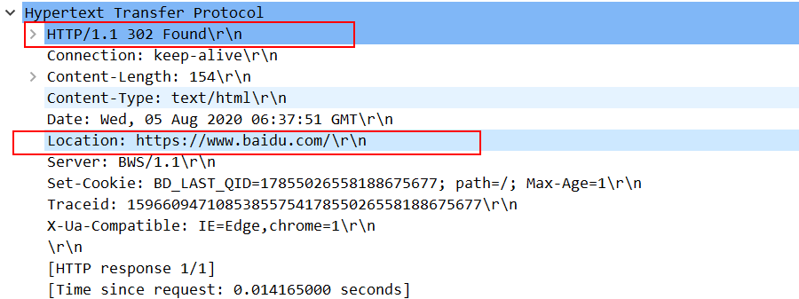
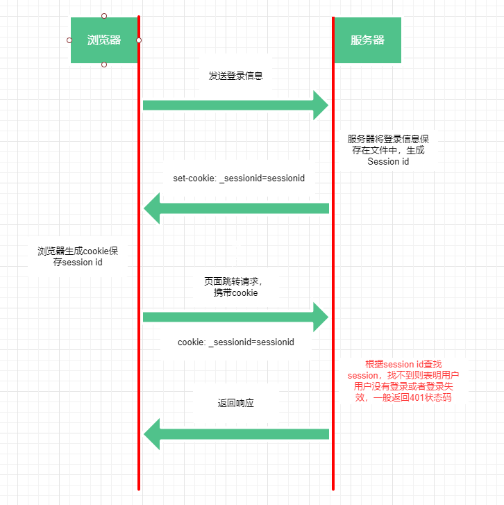
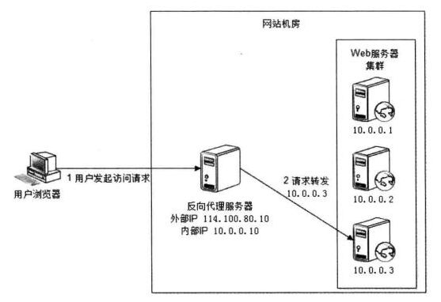

## 概念

HTTP：HyperText Transfer Protocol，超文本传输协议，客户端和服务器需要交换 HTTP 报文，HTTP 协议则定义了 HTTP 报文的结构以及客户端和服务器进行报文交换的方式。它具有以下突出特点：

- 非持续连接：发送 HTTP 报文的每个请求都是一个单独的 TCP 连接

- 无状态，但是有会话：在同一个连接中，两个执行成功的请求之间是没有关系。从服务器方面考虑，无状态的设计简化了服务器设计，试想如果每次请求服务器都要分析用户并把这些信息都筛选保存下来，等到无用了再去清除，这得多少工作量啊！另一方面服务器不用保存用户状态，就能分配更多资源去支持并发的 HTTP 请求。

  但是无状态给客户端操作带来了很多问题，用户无法在同一个网站中进行连续的交互，一旦发生页面刷新之前的操作就会丢失，比如页面登录信息无法保存下来，又比如在一个电商网站中，用户把一个商品添加到购物车，如果这个操作没有被客户端缓存，那么刷新页面这个添加的商品的操作就会丢失。所以浏览器就准备了很多方式来弥补这种缺陷。

- 建立在 TCP 可靠性的传输之上

- 不安全

## HTTP 请求方法

> [Request Methods](https://tools.ietf.org/html/rfc7231#section-4.2.1)

### 方法的特性

HTTP 请求方法是包含在 HTTP 请求报文的信息，用来表示如何传递请求数据，以及如何获取服务器资源的方式。

**安全性**：HTTP 方法安全性的定义是不会修改服务器的数据，也就是请求方法只会请求读取服务器数据；所有安全的方法都是幂等的。

**幂等性**：idempotent，同样的请求被执行一次与连续执行多次的效果是一样的，服务器的状态也是一样的。例如 GET 方法多次请求资源肯定是幂等的，但是 POST 就不一定，POST 可能在请求装载数据发送到服务器，来修改数据库的数据。

**可缓存**：部分 HTTP 请求方法在请求资源后会自动缓存资源，以节省新的请求耗费的网络资源，并且加快网页响应。这种缓存可以通过`Cache-Control`等请求头参数来控制。

| 方法    | 请求有请求体 | 是否有响应体 | 是否安全 | 是否幂等 | 是否可缓存 |
| ------- | ------------ | ------------ | -------- | :------- | ---------- |
| GET     | 否           | 是           | 是       | 是       | 是         |
| HEAD    | 否           | 否           | 是       | 是       | 是         |
| POST    | 是           | 是           | 否       | 否       | 否         |
| PUT     | 是           | 否           | 否       | 是       | 否         |
| DELETE  | 可能有       | 可能有       | 否       | 是       | 否         |
| CONNECT | 否           | 是           | 否       | 否       | 否         |
| OPTIONS | 否           | 是           | 是       | 是       | 否         |
| TRACE   | 否           | 否           | 否       | 是       | 否         |
| PATCH   | 是           | 是           | 否       | 否       | 否         |

### GET

- `GET`表示从服务器读取一个资源文件或者数据；

- 在浏览器中，`GET`是加载所有资源的请求方法，也就是 HTML，CSS，JS，还有图片，视频等媒体文件，都是通过`GET`请求获取。
- `GET`没有请求体，参数只能通过 URL 的 queryString 部分串接起来，由于 URL 只能使用 ASCII 字符集，其他字符都会被进行百分比编码，这使得`GET`也只支持 UTF-8 编码；`GET`不支持文件上传；
- HTML 的表单默认是通过`GET`请求方式进行提交；
- `GET`请求结果默认会被浏览器缓存下来

### POST

根据 rfc 的规范来看，`POST`请求方法主要用于向服务端提交新数据并根据提交的数据创建新的资源，如果资源被创建成功，服务端应该返回`201 Created`响应状态码，并在`Location`头部字段中包含新资源的链接，从而浏览器在收到响应后会请求新资源，并跳转页面。

- `POST`请求结果一般不能被缓存，因为涉及到服务器数据修改；
- 如果是 HTML 的原生表单提交数据，当指定`POST`作为提交方法时，浏览器会根据表单的`name`属性和客户填入的信息使用百分比编码`application/x-www-form-urlencoded`的键值对形式放在请求体中，形如`key1=value1&key2=value2`
- 当然`POST`也支持其他编码格式来提交数据，例如文件上传等；
- 如果通过`POST`新建数据，服务端应该返回`201`状态码表示创建数据成功，同时在响应头部添加`Location`字段表示新数据的 URL，浏览器在收到响应后可以选择使用`GET`请求新资源也可以做其他动作；
- 如果客户端希望缓存`POST`请求响应后的结果，而在下次`GET`请求中重用，则服务端应该返回`200`状态码和`Content-Location`头部字段，`Content-Location`的值应和发起请求时的 URL 相同；
- 如果`POST`请求创建的新数据已经存在，服务端应该返回`303`状态码，以及`Location`头部字段提供已存在数据的 URL，浏览器可以通过`GET`来重定向请求已存在的数据

### HEAD

`HEAD`只请求服务端返回的响应头信息，因此服务端返回的 HTTP 报文中不应该带有响应体，如果有的话也会被忽略掉。

`HEAD`和`GET`区别就是`GET`发起的请求可以有响应体，`HEAD`经常被用作在发送`GET`请求前决定是否使用大量带宽来下载资源，例如响应头中携带的`Content-Length`信息表示要下载的资源文件的大小。

### PUT

`PUT`表示新建或者覆盖数据。

- `PUT`通过请求体发送数据，如果服务器上没有该数据则新建数据，并返回`201`响应状态码；
- 如果服务器上有该数据，服务端会根据`PUT`发送的请求体来覆盖该数据，并返回`204`或者`200`来表示更新资源

### DELETE

`DELETE`一看就是为了删除数据的请求，如果服务器成功删除数据，可能会返回以下状态码：

- `200`：OK，表示服务器已经执行删除操作，并且返回的报文包含响应体，描述执行操作的结果信息。
- `202`：Accepted，表示服务器接收请求并准备删除数据，但是还没执行；不包含响应体。
- `204`：No Content，表示服务器已经执行删除操作，不包含响应体。

如果`DELETE`一个资源不存在，从`DELETE`幂等的角度看，每次执行`DELETE`结果应该一致，那么应该返回上述状态码之一的`204`；但是从服务端角度考虑，`DELETE`的资源不存在，应该返回`404`，具体如何实现看团队评估了。

### OPTIONS

`OPTIONS`主要是为了获取服务端支持的请求方法，或者在 CORS 中执行预检请求。

- 使用`OPTIONS`获取 URL 地址服务器所支持的 HTTP 请求方法，服务端在收到后会在响应头部添加`Allow`参数；
- 在 CORS 发起正式请求前，浏览器会先通过`OPTIONS`执行预检请求来获取服务端是否允许该请求。

### PATCH

`PATCH`就是补丁的意思，表示更新数据，`PATCH`和`PUT`什么区别：

- `PUT`是对数据进行完全覆盖；
- `PATCH`只是对数据的一部分进行更新，类似于 SQL 的`update`操作

### TRACE

`TRACE`执行环回测试，最后收到请求的服务端需要反馈`Content-Type: message/http`以及`200`的响应状态码。

### CONNECT

`CONNECT`请求方法会建立客户端和服务端通信的隧道，如果建立成功，可以支持双向通信。

- `CONNECT`仅用于请求代理服务器；
- `CONNECT`请求必须指定目标服务器的主机和端口号，而服务端必须限制允许请求的端口，否则将会带来安全问题；
- 任何`2xx`系列的响应都表示`CONNECT`建立成功；
- 服务端响应不能包含`Transfer-Encoding`以及`Content-Length`头部参数

## HTTP 响应

### 状态码

HTTP 响应状态码通常是`100`到`600`之间的整数，用来表示当前请求服务器的结果。

| code | 含义                                                                                                                                                                                       |
| ---- | ------------------------------------------------------------------------------------------------------------------------------------------------------------------------------------------ |
| 200  | 请求成功                                                                                                                                                                                   |
| 201  | 表示请求已经被成功处理，并且成功新增了数据，在返回的响应中还应该包含新创建的数据                                                                                                           |
| 204  | 表示请求已经被成功处理，经常用作更新数据的返回响应，也就是`PUT`请求                                                                                                                        |
| 301  | 永久重定向，表示服务器上的文件被移动到了新的位置，服务器会通过`location`响应头返回新的 URL 地址；浏览器在接收到重定向响应的时候，会采用该响应提供的新的 URL ，并立即进行加载               |
| 302  | 请求的资源存在，但是不在当前请求地址的服务器上，服务器需要同时使用`Location`来发送该资源在的服务器地址，浏览器收到后将重定向到该 URL 上                                                    |
| 303  | 如果使用`POST`方法用于创建新数据时，新提交的数据已经存在，则服务端会使用`303`将请求重定向到存在的资源 URL 上去；重定向到新地址时，客户端必须使用 GET 方法请求新地址                        |
| 307  | 请求的资源存在，但是不在当前请求地址的服务器上，服务器需要同时使用`Location`来发送该资源在的服务器地址，浏览器收到后将重定向到该 URL 上                                                    |
| 400  | 客户端错误                                                                                                                                                                                 |
| 401  | 服务器需要客户端提供认证信息来验证用户身份，服务器会同时发送[`WWW-Authenticate`](https://developer.mozilla.org/zh-CN/docs/Web/HTTP/Headers/WWW-Authenticate)首部，来提供如何进行验证的信息 |
| 403  | 服务器收到请求但是拒绝授权访问                                                                                                                                                             |
| 404  | 请求资源不存在，例如图片在服务器上被删除                                                                                                                                                   |
| 407  | 服务器需要客户端向代理服务器提供身份凭证信息，这个状态码会和`Proxy-Authenticate`响应首部一起发送到客户端，而客户端需要使用`Proxy-Authorization`请求首部发送身份凭据到代理服务器            |
| 500  | 服务器错误，一般是服务端代码执行报错                                                                                                                                                       |
| 505  | 服务器不支持请求报文中使用的 HTTP 协议版本                                                                                                                                                 |

### 重定向状态码的区别

> `302` - Found

`302`原始描述短语是**Moved Temporarily**，也就是临时性移动，使用`302`状态码表示当前请求的资源存在，但是不在当前请求的 URL 的位置，服务端会同时使用`Location`头部来传递一个临时跳转的 URL 给浏览器。有以下几点需要注意：

- 浏览器不会缓存`302`响应，除非服务端特别指定了缓存头部指示；
- 浏览重定向请求`Location`指向的`URL`，搜索引擎并不会对该资源的链接进行更新，也就是不会触发 SEO

- 一些旧客户端会错误地将重定向时的请求方法转换为`GET`；而新的浏览器应该不会有这种问题，也就是定向后的请求方法是不可预测的；
- 推荐仅在原始请求为`GET`或`HEAD`时使用该响应状态码



> `307` - Temporary Redirect

`307`突然一看好像和`302`原始含义差不多，临时重定向，而`307`和`302`最大的区别就是`307`能保证请求方法在重定向请求时不会发生变化，原始请求中的请求方法和消息主体都会在重定向请求中被重用。如果原始请求使用`GET`或`HEAD`，那么他们就没有区别。

> `303` - See Other

`303`应该是使用相对更多的状态码，`303`的一大特点是重定向的请求必须使用`GET`。所以`303`的特点如下：

- 如果`POST`请求创建的新数据已经存在，服务端应该返回`303`状态码，以及`Location`头部字段提供已存在数据的 URL，浏览器可以通过`GET`来重定向请求已存在的数据
- 重定向的页面使用`GET`请求可以被缓存

> `301` - Move Permanently

`301`含义就是永久重定向，服务端必须返回`Location`字段来指明资源新的 URL；`301`状态码多使用在`HTTP`向`HTTPS`迁移网站地址的过程中。

## HTTP 无状态的解决方法

由于 HTTP 是无状态的协议，在相互传递的过程中，服务端不会保存任何客户端的状态，同样的请求前后两次发起之间不会有任何关联。那么诸如客户登录，添加购物车等操作，在刷新页面之后就没了，所以必须要使用一定的手段将这些操作的状态保存下来。

### cookie

`cookie`是**服务端发送到浏览器的一小段数据，浏览器会选择将其保存在本地并在以后的请求中发送到服务端**。

`cookie`的作用：

- 管理`session`，包括登录信息，购物车，游戏得分等其他需要服务端保存的数据；
- 用于保存网页的个人设置信息，例如主题，用户首选项等；
- 记录和分析用户行为

#### cookie 的工作原理

当收到客户端请求时，服务端会使用代码在 HTTP 响应头中添加`Set-Cookie`参数告知浏览器要设置的 cookie，在以后通过浏览器请求同一个服务端时，浏览器就会在请求头中添加`Cookie`头部来携带 cookie。

#### cookie 响应头

`Set-Cookie`响应头参数主要用来告诉浏览器设置哪些 cookie，可以携带多个`Set-Cookie`头部来设置多个 cookie，其格式如下：

> [`Set-Cookie: <cookie-name>=<cookie-value>`](https://developer.mozilla.org/zh-CN/docs/Web/HTTP/Headers/Set-Cookie)
>
> `Set-Cookie: <cookie-name>=<cookie-value>;[optional parameter]`

cookie 名称只能使用 ASCII 字符集中的字符，且不能出现任何形式的空格，也不能包含以下字符：`( ) < > @ , ; : \ " / [ ] ? = { }`；

cookie 值也只能使用 ASCII 字符集中的字符，且不能包含空格，双引号，逗号，分号，反斜杠。一般会使用 URL encode 即百分号编码 cookie 值。

```shell
// HTTP响应头

HTTP/2.0 200 OK
Content-Type: text/html
Set-Cookie: yummy_cookie=choco
Set-Cookie: tasty_cookie=strawberry
```

可以在每个 cookie 后面带上可选的以下参数：

- `Expires=<date>`：指定 cookie 清除的日期，如果不设置的话，默认是关闭标签页就清除 cookie；
- `Max-Age=<non-zero-digit>`：指定 cookie 保留的时间，单位是秒；当设置为`0`或者负数时，表示清除该 cookie，这也是清除 cookie 唯一的方式；这个参数优先级要高于`Expires`；
- `Domain=<domain-value>`：指定 cookie 应该在请求哪个域名的时候被发送，默认是当前请求的 URL；
- `Path=<path-value>`：指定发送 cookie 的 URL 中必须包含该路径，否则不会发送 cookie；
- `Secure`：只有使用 HTTPS 的站点能使用这个参数，也就是 cookie 将通过 HTTPS 传输；
- `HttpOnly`：禁止脚本通过`document.cookie`等 API 访问 cookie，防止跨站脚本攻击 XSS；
- `SameSite=<samesite-value>`：
  - `Lax`：浏览器会在同源站点之间发送 cookie，或者当前网页通过`<a>`链接跳转打开其他源的页面时也会发送 cookie；值得注意的是 Chrome 在 80 版本以后，默认会对所有未设置`SameSite`的 cookie 将其`SameSite`设置为`Lax`，防止 CSRF 攻击。
  - `Strict`：浏览器只会针对同源站点发送 cookie；
  - `None`：发送 cookie 没有限制，跨站请求也能发送

```shell
// HTTP响应头

Set-Cookie: __Host-id=1; Secure; Path=/; Domain=example.com
```

#### cookie 请求头

浏览器会根据 cookie 指定的 URL 发送 cookie，cookie 会通过 HTTP 请求头部字段`cookie`来携带 cookie，如果用户通过浏览器设置禁用了 cookie，那么 cookie 也就不会在请求的时候发送。

浏览器只会发送一个`cookie`头部字段，多个 cookie 采用分号`;`分隔的方式串接

```javascript
cookie: PHPSESSID=298zf09hf012fh2; csrftoken=u32t4o3tb3gg43; _gat=1
```

#### cookie 长度限制

浏览器的 cookie 一般是根据源进行划分的，但是 cookie 也能自行设置根据具体的 URL 才发送 cookie。

根据 IETF 的 RFC 标准文档介绍，浏览器必须对每个域名下至少支持以下长度和个数：

- 至少保证每个 cookie 能存储 4096 字节的数据，由于 cookie 使用 ASCII 字符集，所以也就是大概也就是 4096 个字符；
- 每个域名至少能设置 50 个 cookie；
- 浏览器至少要能保存 3000 个 cookie

主流的浏览器几乎都支持以上规定，可以从[Browser Cookie Limits](http://browsercookielimits.squawky.net/)这个网站获知具体的浏览器支持情况。

### Session

Session 属于一种机制，翻译过来就是会话，表示两个或者多个通信设备之间临时交换信息。

很多人容易把 Session 和 Session 在基于 HTTP 无状态协议种保存状态的实现方式混淆在一块。实际上 Session 不光可以在网页中实现，任何涉及设备通信的地方都可以使用 Session，你可以在 MDN 中找到 HTTP cookie 这样的字眼，说明 cookie 专门针对 HTTP 协议的，但是你找不到描述 Session 的地方。

广义的 Session 可以用在许多领域，例如计算机系统中，会通过 Session 管理程序追踪用户活动；在浏览器中，如果因为突发事故导致浏览器关闭，那么重启浏览器使用 Session 管理机制可以帮助回复过去打开的页面；同样的，在浏览器中利用 cookie 和 session 组合保存状态也只是其中一个实现。

狭义的 Session 就是日常 HTTP 服务器中服务端保存用户状态的实现方式，这时候 Session 要想发挥作用，还必须客户端 cookie 的配合，在服务端将用户状态通过 Session 文件保存下来后，将 Session id 通过 cookie 机制保存在浏览器中，以后每次请求页面再通过 cookie 发送到服务端去验证，根据 Session id 查找 Session 是否存在，选择更新 Session 或者其它操作。



Session+cookie 的状态保存方案相比 cookie 单独使用要安全那么一点，因为单独使用 cookie 肯定是直接把用户名和密码加密保存在本地，浏览器能直接看到的，并且每次请求都发送用户名和密码，在 HTTP 明文传输的过程中遭受劫持被盗取信息的可能性也提高。但是 Session 会耗费服务器资源，并且有些服务器还存在 Session 丢失的情况，例如 IIS，IIS 服务器在繁忙的时候会杀进程导致 Session 丢失，但是后来通过额外的 Windows 服务进程 ASP .NET state service 解决了这个问题。

其他方面的话，cookie 只能使用 ASCII 字符集存储字符串，但是 Session 可以直接存储对象等数据，Session 能保存的数据长度也比 cookie 要多，总而言之，实现 Session 还是要取决于服务端的实现。

### Session 共享

由于 Session 是保存在服务端的数据，在面对多服务器集群情况下，一般会有一个统一的反向代理负载均衡服务器用来转发请求，考虑这样一种情况，当你第一次登录请求是服务器 A，服务器 A 生成 Session 并保存，但是下一次请求可能就被转发到了服务器 B，那么服务器 A 刚才生成的 Session id 发送到服务器 B 找不到 Session 怎么办？总不能重新登录吧，所以就需要将服务器保存的 Session 共享出去。



实现 Session 共享的方式也还有很多的：

- 不用 Session 了，直接用 cookie，也可行不过基本没人会这么干；
- 使用数据库保存 Session，这种实现相对主流一点，用的最多的也是 Redis 数据库来做；
- 用 JWT

### JWT

> [JWT](https://tools.ietf.org/html/rfc7519)
>
> https://jwt.io/introduction/

JWT，JSON Web Token，是一种将 JSON 进行加密传输的数据格式，对应的互联网开放标准是 RFC 7519 了。

JWT 其实是基于 HTTP 认证机制的，学习之前最好了解一下 HTTP 提供的用于传输认证的信息的一些首部字段等知识。
