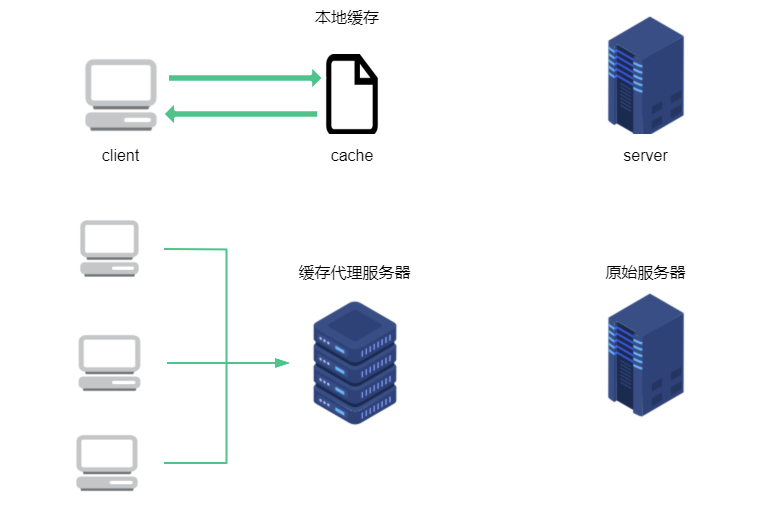
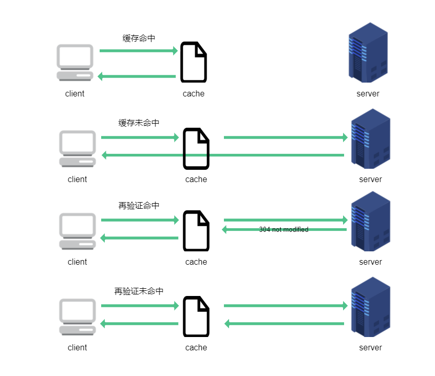
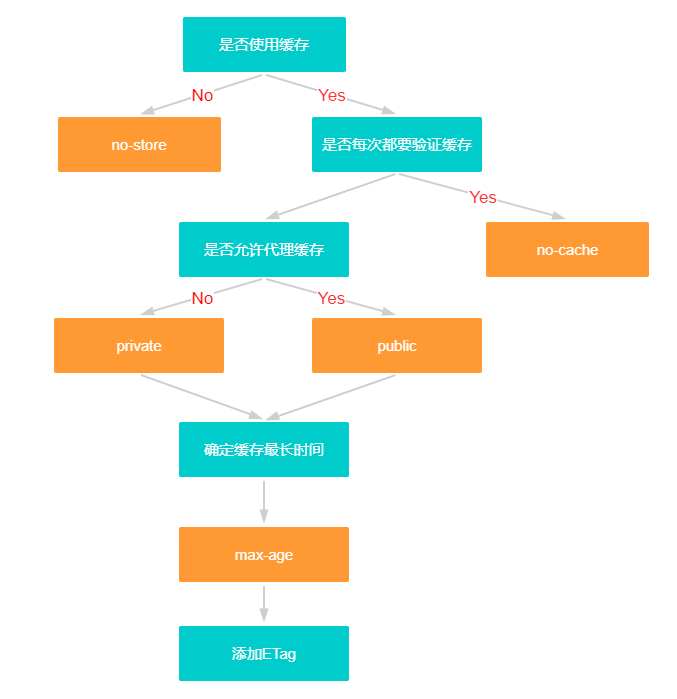
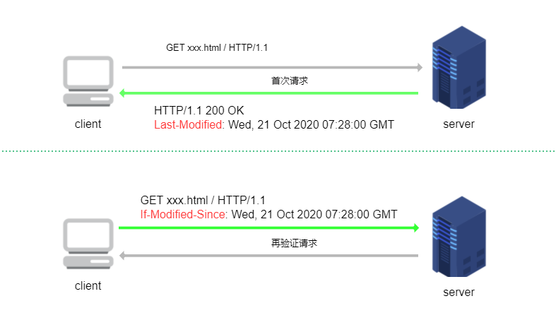
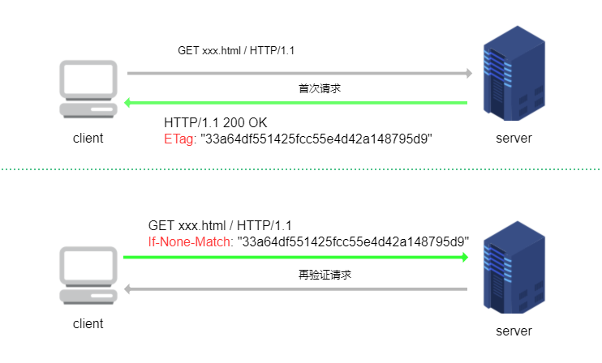

## 什么是缓存

缓存就是把原始资源保存一份副本下来，避免对原始资源的直接请求。HTTP 缓存的实现方式有很多，一般来说可以分为私有缓存和公有代理缓存。

### 私有缓存

私有缓存也就是针对用户单独设置的缓存。最为常见的就是 web 浏览器内建的私有缓存，大多数浏览器都会将常用文档缓存到个人电脑的硬盘或者内存中。

### 公有代理缓存

公有缓存，或者叫共享代理缓存，一般是通过特殊的缓存代理服务器去实现，也就是缓存内容也是保存在 web 上的，这些缓存内容可以用于响应不同的客户端请求。这种情况最为常见的是 CDN 的架设。



## 缓存的好处

### 节省网络流量

这里不光说的是节省服务器的流量，还能节省移动端用户的流量。

### 缓解服务器带宽压力

服务器都有带宽限制，每秒从服务器流出多少比特都是有最高限制的，例如`10Mbps`带宽的服务器，换算成数据量就是`1.25Mbyte`，也就是每秒最大也只能从该服务器请求`1.25Mbyte`大小的数据。如果存在缓存代理服务器，就可以不受原始服务器带宽的限制，直接从缓存服务器以更快速度获取资源。

无论是带宽还是流量都需要经济成本，所以用好缓存是可以有效节约网站成本的手段。

### 缓解瞬间拥塞

以网络突发事件为例，例如微博热门事件，可能导致全国几百万人同时请求微博服务器，造成瞬间拥塞。

### 缩短距离时延

服务器和客户端之间的地理距离也可能成为增加网络请求时延的因素，例如从北京请求美国纽约的服务器资源，这种距离还不能以直线距离来计算，物理层的媒介限制也是因素之一，例如有的网络段使用 CAT5 传输，有的网络段用 CAT6 传输；所以尽量缩短客户端和原始服务器的距离时延也是降低网络延迟的有效手段。

## 缓存命中

### 缓存命中

如果存在已有缓存可以为到达缓存的请求提供服务，就被称为**缓存命中**；如果没有缓存副本可用，或者缓存过期等，到达缓存的请求会被转发到原始服务器，这被称为**缓存未命中**。

### 再验证命中

原始服务器的内容可能发生变化，因此要经常检查缓存，看看保存的副本是否是最新的版本。这些新鲜度检测被称为**HTTP 再验证**（revalidation）。

向原始服务器发送再验证请求后，如果原始资源没有任何变化，原始资源服务器会返回`304 Not Modified`响应。确认缓存依然有效的时候，就会使用缓存，这种被称为**再验证命中或者缓慢命中**。如果原始资源已经被修改了，那么原始服务器会返回新的资源和`200`响应。而如果原始资源已经被删除了，服务器就会返回`404 not found`响应。



### 命中率

由缓存提供服务的请求所占的比例被称为缓存命中率，有时也称为文档命中率。缓存命中率在`0%`到`100%`之间浮动。命中率很难预测，对于中等规模的 web 缓存来说，`40%`的命中率是很合理的。

还有一种方式是计算缓存提供的字节在传输所有字节中所占的比例，这种被称为字节命中率。

提高文档命中率可以降低整体时延；提高字节命中率可以有效节省带宽。

## 缓存控制

在 HTTP/1.0 协议中提供控制缓存的 HTTP 头部字段主要就是`Expires:<HTTP-date>`和`Pragma: no-cache`。

- `Expires:<HTTP-date>`指定一个 [HTTP-date](https://tools.ietf.org/html/rfc7231#section-7.1.1) 形式的日期，表示在此日期之前的缓存都是新鲜有效的，客户端不需要发送再验证请求就可以直接使用缓存
- `Pragma: no-cache`：表示在客户端每次请求到达缓存以后，必须进行再验证请求确认缓存有效以后才能使用缓存，否则不能直接使用缓存

在 HTTP/1.1 协议中指定的`Cache-Control`首部字段完全替代了`Expires`和`Pragma`，可以做到更多控制缓存的行为。

### cache-control

服务器支持以下类型的参数作为`Cache-Control`的响应参数，注意以下部分只是应用于服务器返回响应的参数，还有部分客户端可以使用的`Cache-Control`的参数未列出，见 —— [MDN - Cache-Control](https://developer.mozilla.org/zh-CN/docs/Web/HTTP/Headers/Cache-Control)

> ```shell
> Cache-control: must-revalidate
> Cache-control: no-cache
> Cache-control: no-store
> Cache-control: no-transform
> Cache-control: public
> Cache-control: private
> Cache-control: proxy-revalidate
> Cache-Control: max-age=<seconds>
> Cache-control: s-maxage=<seconds>
> ```

#### 可缓存性

- `public`：表明响应资源可以被任何对象缓存，例如缓存代理服务器，客户端浏览器等；并且即使资源有关联的 HTTP 身份验证，也可以进行缓存，例如`POST`请求获取的资源
- `private`：表明响应资源只能作为私有缓存，也就是只能被浏览器或者客户端单独缓存，不能被缓存代理服务器缓存
- `no-cache`：指定`no-cache`响应首部的资源，在客户端每次请求到达缓存以后，必须进行再验证请求确认缓存有效以后才能使用缓存，否则不能直接使用缓存
- `no-store`：不能缓存
- `no-transform`：中间代理服务器不能对资源进行任何修改。

#### 到期时间

- `max-age=<seconds>`：一个以秒为单位的非负整数，指定缓存的有效时间，也就是缓存的保质期；由于`Expires`指定的日期会受到计算机系统时间准确性的影响，所以推荐使用`Cache-Control: max-age=<seconds>`来控制缓存有效时间，并且如果指定了`Cache-Control: max-age=<seconds>`，那么`Expires` 头会被忽略
- `s-maxage=<seconds>`：一个以秒为单位的非负整数，优先级高于`max-age`或`Expires`指定的时间，但是仅能用在共享代理缓存中，私有缓存会忽略这个响应头

#### 要求再验证

- `must-revalidate`：如果响应资源的`cache-control`中带有`must-revalidate`属性，表示如果缓存过期，在客户端向原始服务器再验证请求之前，缓存都不能提供给后续请求。这个与`no-cache`的区别是，`no-cache`每次都要进行再验证请求，不管缓存有没有过期，而`must-revalidate`只在过期的缓存上才强制其进行再验证请求
- `proxy-revalidate`：与`must-revalidate`类似的用法，但是仅用在共享代理缓存上
- `immutable`：`immutable`还未写入正式的 HTTP 协议中，指定`cache-control`为`immutable`的响应资源表示基本不会发生改变，即使用户刷新手动刷新页面，客户端也不应该进行再验证请求。

这些响应头参数可以通过**逗号`,`以及一个空格**作为分隔来组合在一起使用，返回给客户端，例如：

```shell
cache-control: public, max-age=31536000
cache-control: max-age=315360000, public, immutable
```

来自谷歌开发者文档里的一张图很好的解释了如何选择配置服务器的`cache-control`响应参数，翻译过来大致是这样：



## 缓存验证

当缓存到期了就会向原始服务器发出再验证请求，再验证请求一般是条件`GET`请求，即通过`GET`方法和特殊的 HTTP 条件请求首部字段在一起来实现。HTTP 协议一共定义了五种条件请求首部字段，它们都是以`If-`作为开头来命名的，对于缓存验证来说，其中最有用的是`If-Modified-Since`和`If-None-Match`字段。

再验证方法分为两种，一种是使用日期比较进行比较；另一种是通过实体标签 ETag 进行验证。

### 时间比较

时间比较的方法通过`If-Modified-Since`和`Last-Modified`首部配合实现。`Last-Modified`表示服务器认定的最后修改资源的时间，通常会在原始服务器发送资源的时候携带上；当客户端需要对缓存的资源进行再验证的时候，将上一次收到资源的`Last-Modified`指定的时间通过`If-Modified-Since`再发送回服务器，服务器根据这个时间和自己认定的最后修改资源的日期进行比较，如果两者不一致就认为资源发生了修改，就返回新资源和`200`状态码响应；而如果对比发现资源未修改，则只返回`304`响应，不携带资源。

通过时间比较的方案无法做到精确性，有一种情况是开发者对网站资源的覆盖性发布也会导致服务器认为资源发生了修改，实际上覆盖性发布的时候，文件内容可能并未发生变化；这种验证方案比`ETag`精确度要低，通常作为备用的验证方案。



### 实体标签对比

`ETag`，entity tag，实体标签通常是根据内容生成的 hash 值，或者是最后修改时间戳的 hash 值。实体标签对比的方式通过`If-None-Match`和`ETag`首部字段来实现。

服务器通常会根据发送的资源生成一个唯一标识当前资源的`ETag` hash 值，当客户端进行再验证请求时，将资源的`ETag` 通过`If-None-Match`请求头字段再发送回服务器，服务器根据资源重新生成 hash 值，和客户端的发送的`If-None-Match`里的`ETag`值进行比较，如果相同就表明资源未曾修改，则返回`304`响应；如果修改了就发送新资源，以及`200`响应和新的`ETag`值。



### 如何选择

如果服务器返回响应首部包含`ETag`，HTTP/1.1 的客户端就必须使用`ETag`验证的方法，如果服务器只返回`Last-Modified`响应头部，那么客户端就可以发送`If-Modified-Since`首部，让服务器通过时间对比的验证方法判断缓存是否有效。从优先级的角度上看，如果客户端同时发送`If-Modified-Since`和`If-None-Match`首部，`If-Modified-Since`会被忽略掉，除非服务器不支持`If-None-Match`，不过这是不可能的，主流服务器基本都支持`If-None-Match`。

### 响应首部

### date

> `date: HTTP-date`

`date`响应首部表示 HTTP 报文创建的时间，后面接 [HTTP-date](https://tools.ietf.org/html/rfc7231#section-7.1.1) 形式的一个日期。服务器应当在首次响应时返回`date`首部，后续客户端可以通过检测`date`首部的日期，和当前本地计算机时间进行对比，来判断该资源是否来自于缓存。这也是检测请求是否命中缓存的一种方式。

#### Cache-Control

- `max-stale`：如果不设置任何参数，`max-stale`表示客户端愿意接受已经过期的缓存；如果指定一个非负整数的秒数，表示如果缓存过期的时间没有超过该指定秒数都是可以接受的
- `min-fresh`：表示客户端希望获取一个能在指定的秒数内保持其最新状态的响应
