## TCP 报文

TCP 报文由首部和数据两部分组成，数据部分如果是 HTTP 协议就是 HTTP 报文，所以主要看 TCP 首部，TCP 首部中的各个字段指示决定 TCP 的工作原理。

### 源端口和目的端口

源端口就是客户端发起请求的端口号，目的端口就是接收请求和发送响应的端口，例如 HTTP 协议的服务器响应端口就是`80`或者`443`等。

### 序号 Seq

TCP 连接是面向字节流的，也就是组成 TCP 报文的最小单位是字节，但是在一个 TCP 连接中，发送者和接收者都可以发送报文，并且还能连续依次发送多个报文；比如说，客户端发给服务器 3 个报文，然后服务器又响应发回 3 个报文这样子。为了在传输过程中排队进行不会混乱，那么就需要序号来保证。

在一个 TCP 连接中每一个字节都要按顺序编号，那么在 TCP 首部中的序号`seq`就表示**本 TCP 报文所发送的数据的第一个字节的序号**，例如，当前 TCP 报文序号是 200，当前报文的数据部分长度是 100，那么如果这个报文后面还有报文要传输，则下一个报文的首部的序号是 300，就这么按顺序排列！

在首部中，序号固定占 4 个字节，也就是 32 位二进制数字，所以序号范围值是`[0, 2^32-1]`，从`[0, 4294967696]`，一个 TCP 连接的序号值不一定从 0 开始，可以在这个范围内随便选一个值，当报文段的序号值到达 2^32-1 时，下一个序号就回到 0 开始。

这个字段是 TCP 连接中最重要的字段！

### 确认号 Ack

确认号`ack`是**指示对方下一次发送的第一个 TCP 报文的首部序号值**，当 TCP 建立连接后它的值是*收到的最后一个 TCP 报文的首部序号值加上数据长度值*，例如服务器收到的最后一个报文的首部序号值是 200，数据长度是 200，那么服务端下一次发送给客户端的报文段的第一个报文的首部确认号应该是 200+200=400，当客户端收到后，下一次发送 TCP 报文段的第一个报文首部序号就是 400。

所以，当确认号为 N 时，表明 N-1 之前的报文段的数据都收到了。

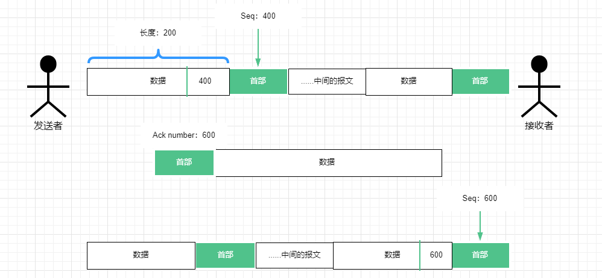

### 数据偏移

TCP 报文的首部长度，这个数字用 4 位二进制表示，`1111`最大位 15，这个值的单位是 32 位字（以 4 字节长的字为计算单位），所以首部长度最大为 15\*4 = 60 个字节。

### 保留

保留部分占 6 位，暂不知道用处；

### 控制位

保留后面接有控制位部分，**每个控制位都使用二进制数字`0`和`1`来表示是否激活**

#### 紧急 URG

当 URG 的值为 1 时，表示该报文有紧急数据，应该尽快传送，这时 TCP 就会调整整个 TCP 报文段的传送顺序，将 URG 的值为 1 的紧急报文放在整个报文段的最前面，由于此时报文段的序列号已经被打乱了，所以还需要一个紧急指针（Urgent Pointer）来指示紧急数据末尾在报文段中的位置。

#### 确认 ACK(ACKnowledgment)

确认标记位是建立 TCP 连接时使用的关键字段，不要和确认号`ack`混淆在一块了，`ACK`只有两个值；当 TCP 报文首部的`ACK = 1`时，表明当前报文的发送者已经做好了连接建立的准备，并且只有当`ACK = 1`时，确认号字段才有效；当`ACK = 0`时，确认号无效。

TCP 规定，在连接建立后所有传送的报文段都必须将 ACK 置`1`，也就是准备正式传输数据了。

为了区分确认标记和确认号，通常将确认标记写作全大写字母`ACK`，而确认号用全小写字母表示`ack`。

#### 推送 PSH(Push)

当两个应用程序在通信时，有时一端的应用程序希望在键入一个命令后里立即能收到对方的响应。在这种情况下，TCP 就可以使用推送操作。这时，发送方 TCP 把首部的 TCP 置 1，并立即创建一个报文段发送出去，接收方收到后，就尽快交付给应用程序。

#### 复位 RST(Reset)

当`RST = 1`时，表示 TCP 连接中出现严重差错，必须释放连接，然后重新建立连接。`RST = 1`还用来拒绝一个非法的报文段或拒绝打开一个连接。

#### 同步 SYN(SYNchronization)

`SYN`是 TCP 建立连接的三次握手过程中的重要字段，用于 TCP 建立连接时同步序号。

- 当客户端发起向服务器的第一个连接请求时，TCP 报文首部的`SYN = 1`，且会在`[2,2^32-1]`之间选择一个序号`seq = x`，发送完以后客户端进入`SYN-SENT`状态（同步已发送）；
- 服务端收到客户端请求 TCP 报文后，如果同意建立连接，则会向客户端发送确认连接的 TCP 报文，这时的 TCP 报文段首部`SYN = 1`，同时将自己的确认标记位置为`ACK = 1`表示已经准备好建立连接了，而服务端也会选择自己的数据序号`seq = y`放在 TCP 报文的首部，同时因为上个 TCP 报文没有携带任何数据，这时的确认号就是请求报文的序号加 1 即`ack = x+1`；发送完以后服务端变成`SYN-RCVD`状态；
- 客户端在收到服务端的确认连接 TCP 报文后，要再次向服务端发送确认连接的回应，于是发送确认连接 TCP 报文，将自己的确认连接标记`ACK = 1`；同时根据服务端发回的确认号设置首部序号值`seq = x+1`；根据服务端的序号设置首部的确认号`ack= y+1`，发送完以后客户端进入`ESTABLISHED`状态
- 当 B 收到 A 的回应后，B 也进入`ESTABLISHED`状态

#### 终止 FIN(Finish)

这也是 TCP 连接必须掌握的字段，用来终止 TCP 连接的字段，当`FIN = 1`时，就表示要求终止连接。

### 窗口(window)

窗口指的是发送本报文段的一方的接收窗口，窗口值用来限制接收方允许对方发送的数据量（以字节为单位，不包含首部的长度），因为接收方的数据缓存空间是有限的。

### 检验和

### 紧急指针(Urgent Pointer)

配合紧急 URG 首部使用的

### 选项

长度可变，最长可达 40 字节，如果没有`选项`这个部分，TCP 报文首部长度就是 20 字节。

##### MSS

MSS，Maximum segment size，MSS 是每个 TCP 报文的**数据部分的最大长度**。

## TCP 传输的分析

Wireshark 是一个免费开源的网络数据包分析软件，他能清楚地显示分层协议的状态，从物理层到应用层的数据传递以及相关协议的使用都能展示出来，十分强大！

用 Wireshark 分析 TCP 传输有很重要的两点使用方面的需要注意：

- 左侧的状态条和小对勾能将 TCP 请求和响应的两条报文对应起来，当鼠标点击某一条后，作为该条的响应 TCP 前面就会有一个小对勾；而状态条这个虚线框就表示一条 TCP 连接；如果点了下一条发现虚线框没把它包含在刚才的虚线框内，就表示这一条和上一条选的不属于同一个 TCP 连接。

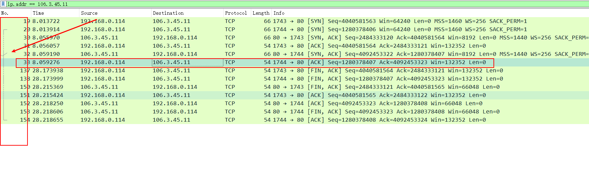

- 下面的 TCP 首部分析也会包含该条 TCP 是响应谁

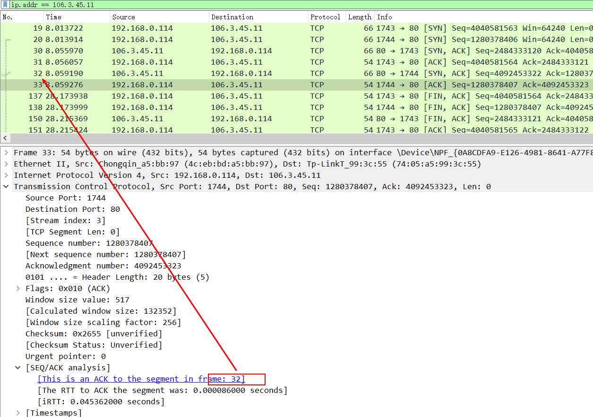

### 握手

TCP 连接建立的过程叫做握手（handshake），握手需要客户端和服务器之间交换三个 TCP 报文，其实准确来讲这是一次握手三报文交换的过程，但是流行上用语是`三次握手`。

这个过程通过 wireshake 可以清楚的观察到，以浏览器请求 HTTP 协议的某个网站地址 106.3.45.11 为例，使用 wireshark 过滤请求`ip.addr == 106.3.45.11`经过下图的流程，在这个流程中有以下规定：

- 同步位`SYN`置`1`的报文不能携带数据，但是要消耗一个序号；
- 服务端返回的`SYN`和`ACK`报文需要消耗掉一个序号；
- 只有`ACK`置`1`的报文才能携带数据，此时的确认号才有效；`ACK`报文不携带数据则不消耗序号

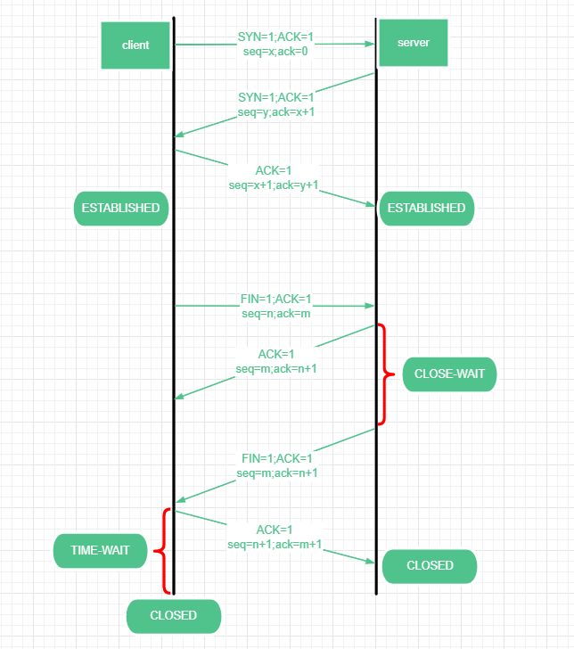

#### 客户端发起连接请求

首先，客户端想服务器发起连接请求，通过 wireshark 抓包工具，可以清楚的解析出 TCP 报文首部的所有字段值：

- Source Port：来源端口，也就是浏览器发出请求连接的端口`11374`
- Destination Port：80，也就是默认 HTTP 协议的响应端口`80`
- Sequence number：0，这个序号是 wireshark 做的相对当前 TCP 建立连接的序号，不是真实的序号
- Sequence number (raw)： 3835654651，这个序号才是真实的 TCP 报文首部的序号，也就是`seq = 3835654651`，接下来的请求只看这个的变化
- Acknowledgment number：0，确认号
- Flags：也就是控制位部分，可以看到此时的标志位是`SYN`是`1`；而确认连接控制位`ACK`是`0`

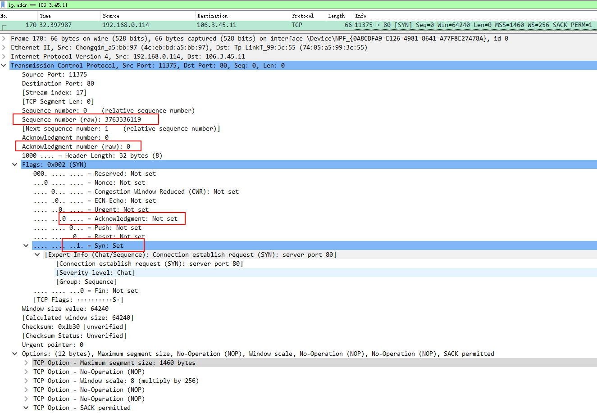

#### 服务端同意建立连接

接下来服务端收到客户端的请求，同意建立连接，发送自己的确认连接 TCDP 报文，可以看到此时的 TCP 首部字段变成了以下这些：

- Source Port：来源端口，从服务器往客户端发，所以端口就是服务器的端口`80`啦
- Destination Port: 11374，也就是客户端的接收端口
- Sequence number (raw): 1610539220，此时的服务端的`seq = 1610539220`
- Acknowledgment number (raw): 3835654652，服务端的确认号`ack = 3835654652`，是上次客户端请求的序号 + 1
- Flags：也就是控制位部分，可以看到此时的标志位是`SYN`是`1`；而确认连接控制位`ACK`也置`1`了

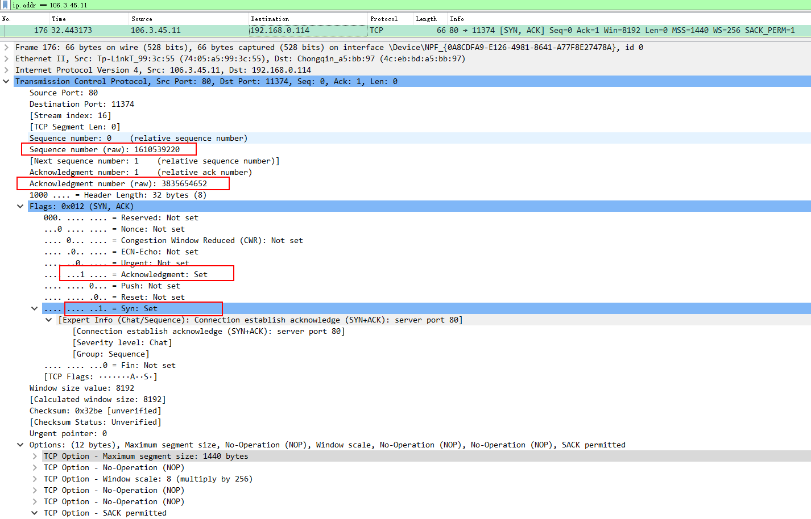

#### 客户端回应准备建立连接

客户端收到服务端建立连接的响应，还需要再次发送确认自己也能建立连接的回应，此时的 TCP 首部信息如下：

- Sequence number (raw): 3835654652，`seq = 3835654652`，是上次服务端响应 TCP 报文首部的确认号 + 1
- Acknowledgment number (raw): 1610539221，`ack = 1610539221`，指示服务端下次发送报文的序号，也就是上次服务端 TCP 报文首部的序号 + 1
- Flags：此时客户端的确认连接控制位`ACK`也置为`1`了，而`SYN`又置为`0`了

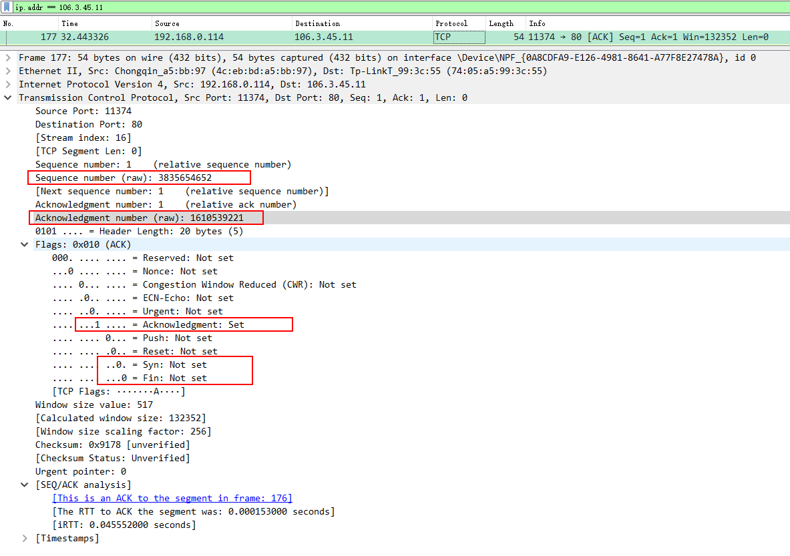

#### 注意事项

从 TCP 建立连接的过程中不难得出：

- 在 TCP 从建立连接到最后释放连接的过程中，只有第一次传递 TCP 报文时`ACK = 0`，也就是只要看到单独的`SYN`而没有其他控制位，那么就表示这个 TCP 传输是建立连接的第一个请求；
- 在传输数据的过程中，始终有以下等式成立：

> `ack` = 接收的最后一个 TCP 报文的`seq` + 数据长度
>
> `seq` = 接收的最后一个 TCP 报文的`ack`

### 数据传输

在 wireshark 中观察到，客户端发起 HTTP GET 请求，这时底下的分析框就会多出来一个 HTTP 协议的请求头分析，不看这个还是看运输层的 TCP 协议，此时的 TCP 报文首部如下：

- Sequence number (raw): 1354298230，`seq = 1354298230`
- Acknowledgment number (raw): 3832919684，`ack = 3832919684`
- Flags：控制位`ACK = 1`
- TCP payload (458 bytes)：最后还有一个 TCP payload，这也就是 TCP 报文携带的数据部分的字节长度，也就是 HTTP 协议的报文长度

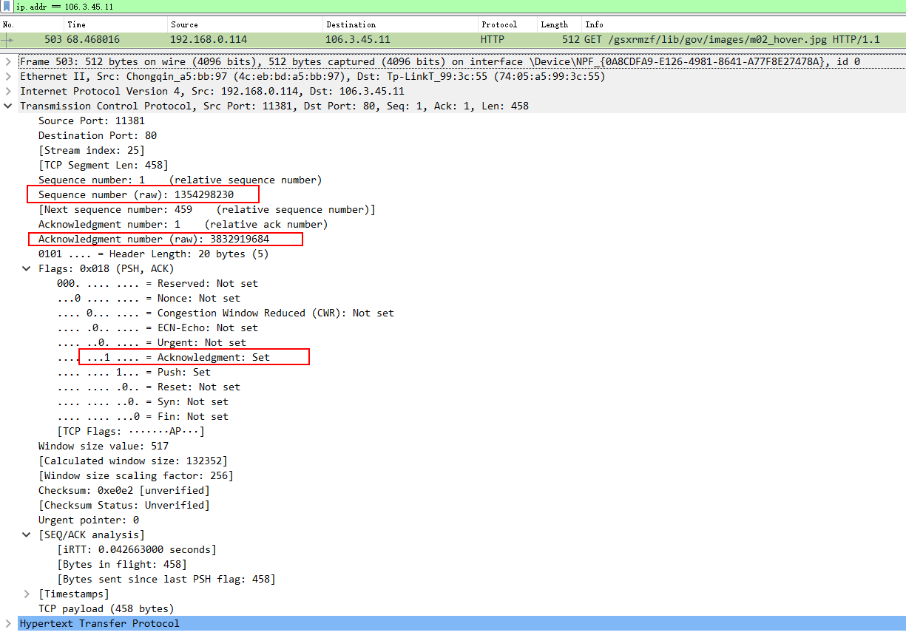

接下来开始找 wireshark 中 HTTP OK 的响应，可以看到 TCP 报文的首部如下：

- Sequence number: 3832919684，`seq = 3832919684`
- Acknowledgment number: 1354298688，`ack = 1354298688`，对应 HTTP 请求时 TCP 首部的序号加上数据长度，即`1354298230+458 = 1354298688`
- Flags：`ACK = 1`

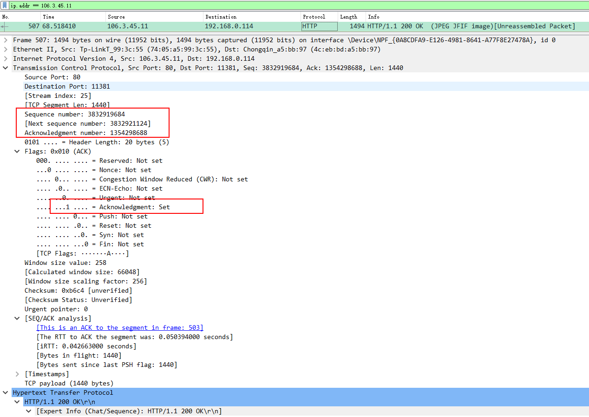

### 断开连接

TCP 连接释放的过程相比握手要复杂一点，释放连接的过程双方都可以发起，释放连接的信号就是`FIN`控制位的切换，当遇到 TCP 报文首部`FIN = 1`时就表示发送方要进行释放连接的操作了。

现在使用 wireshark 观察释放连接的过程，连接释放的过程一定要看 Wireshark 左侧虚线框包裹的完整的 TCP 连接过程，不在虚线框内的请求都不属于该条 TCP 连接的，所以一般都是找最后一条`ACK`。

#### 客户端发起释放连接请求

以客户端发起释放连接请求为例，一般也就是主动关闭浏览器页面就会由客户端发起断开连接请求，观察到 TCP 首部如下：

- Sequence number: 1280378407，`seq = 1280378407`
- Acknowledgment number: 4092453323，`ack = 4092453323`
- Flags：`ACK = 1`，`FIN = 1`

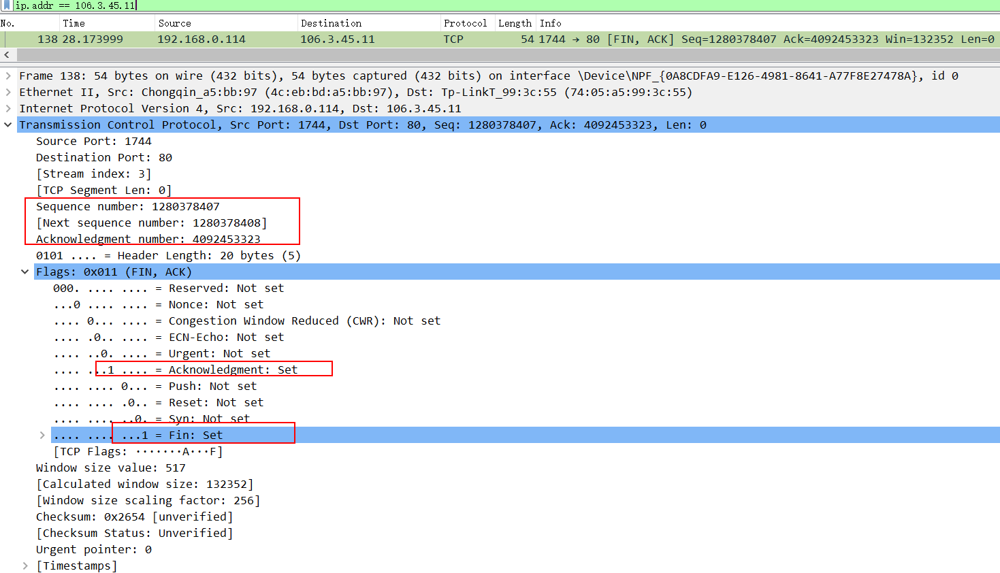

####服务端同意释放

在 Wireshark 中找到 138 的响应报文时 152，此时服务端的 TCP 首部是：

- Sequence number: 4092453323，`seq = 4092453323`
- Acknowledgment number: 1280378408，`ack = 1280378408`
- Flags：`ACK = 1`

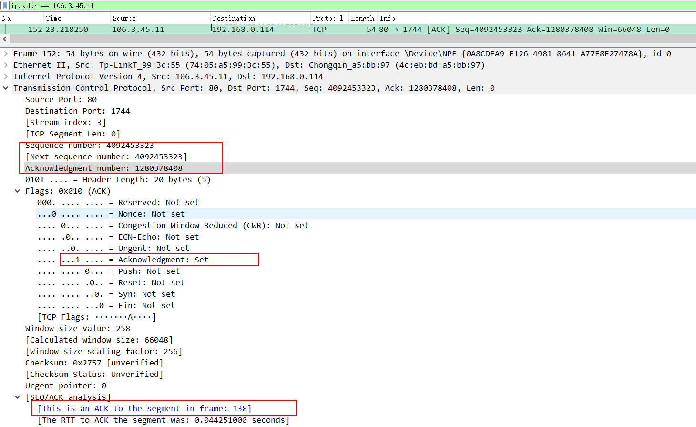

#### 服务端确认释放连接

紧接着 ACK，服务端会再次发送一条确认自己也要释放连接的请求，让客户端同意，**可以看到此时的序号还有确认号都和上一条完全一样**。

- Sequence number: 4092453323，`seq = 4092453323`
- Acknowledgment number: 1280378408，`ack = 1280378408`
- Flags：`ACK = 1`，`FIN = 1`

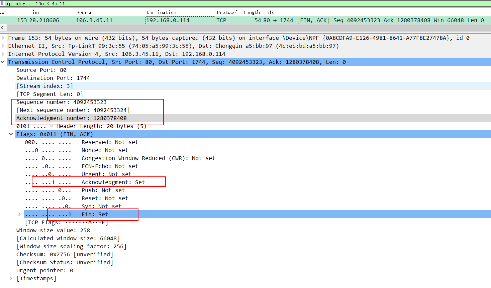

#### 客户端确认释放连接

客户端要对服务端确认释放连接的请求做出响应，这样双方都确认释放连接，就进入`TIME-WAIT`(时间等待)状态

- Sequence number: 1280378408，`seq = 1280378408`
- Acknowledgment number: 4092453323，`ack = 4092453323`，和上一条服务端返回的序号一致
- Flags：`ACK = 1`

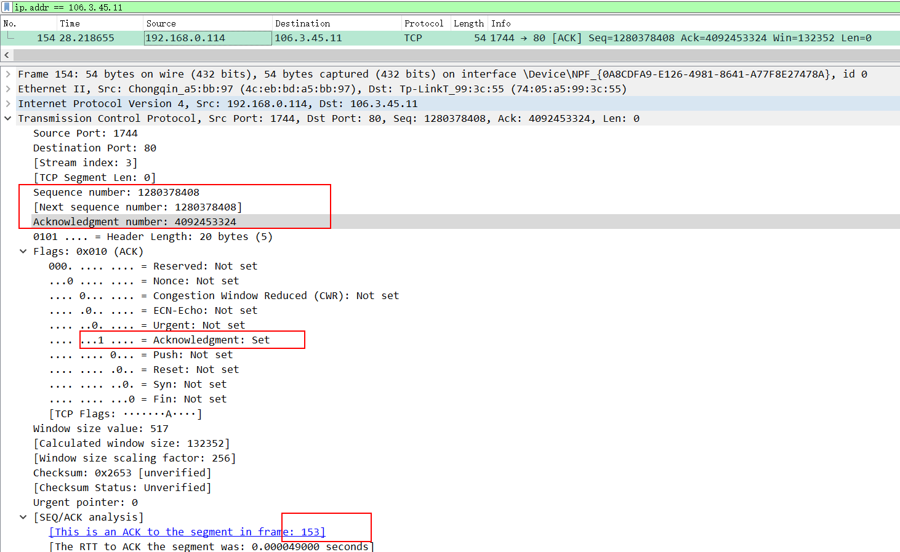

#### TIME-WAIT

梳理一下上述关闭连接的请求流程，双方一共收发了 4 个报文：

- 客户端请求关闭连接，发送`FIN = 1`的 TCP 报文；
- 服务端收到关闭连接请求表示同意，让主动方不会因为没有收到应答而继续发送断开连接的请求；于是服务端发送同意关闭连接的响应`ACK = 1`；客户端在收到这个响应报文以后，因为是客户端主动发起的关闭请求也就表示客户端没有数据要传输了，但是它不知道服务端还有没有数据要传，所以客户端要进入一个等待的状态`FIN-WAIT-1`；
- 当服务端没有数据要传输的时候，就会向客户端也发送一个请求关闭连接的报文`FIN = 1`，让客户端知道服务端没有数据要传了，放心关闭连接吧，同时也表示自己也要关闭连接了；
- 客户端在收到服务端关闭连接的请求后也会表示同意`ACK = 1`，然后客户端会进入一个定时等待`TIME-WAIT`的状态，等待啥呢？设想如果客户端同意服务端关闭 TCP 连接的请求没送到呢？那服务端会一直处于等待状态，它不知道客户端同不同意它关啊，所以在这个等待时间内，如果服务端没有收到客户端的确认，那么会重传上一条关闭连接的请求报文；
- 最后当服务端收到客户端的确认关闭连接`ACK`后，就真的关闭连接了；而客户端则在等待`TIME-WAIT`的时间后也关闭连接，双方都进入`CLOSED`状态。
