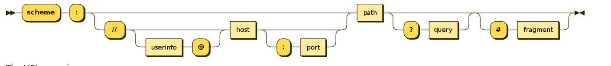
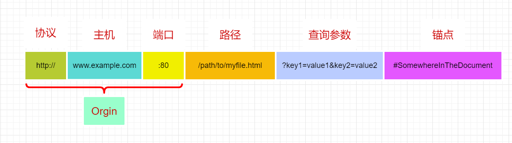
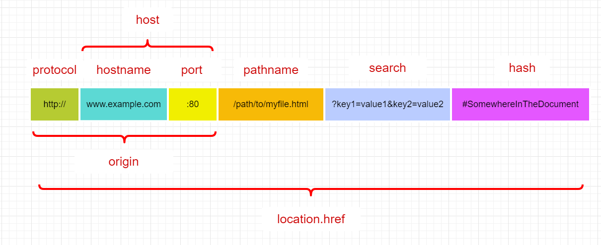
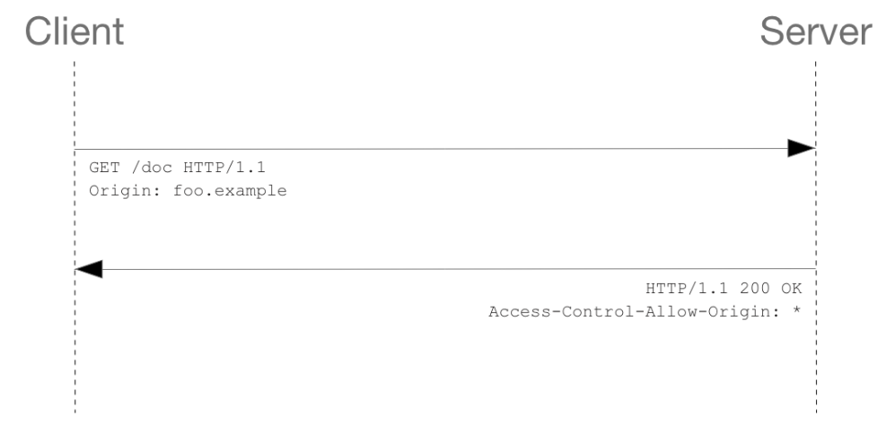
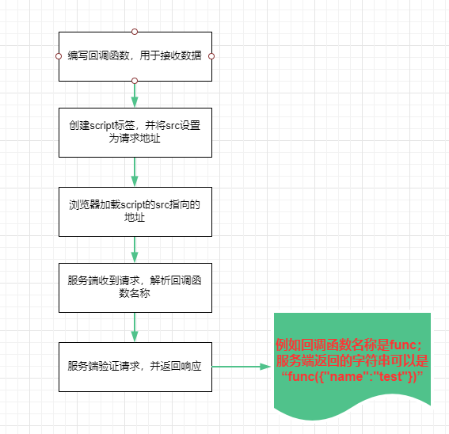
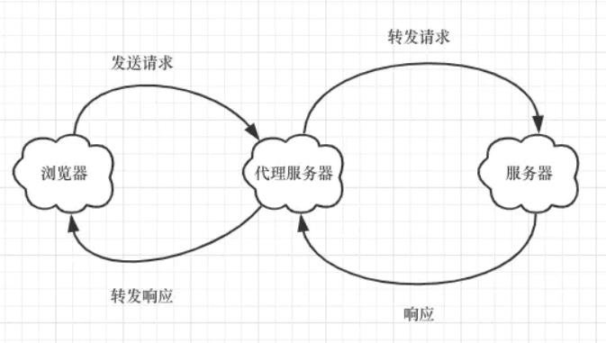

### WWW

WWW，word wide web，简称万维网，也就是日常所说的 Web。最早是由欧洲粒子物理实验室的 Tim Berners-Lee 在 1989 年提出的，他是一个分布式的超媒体系统，是超文本系统的扩充，超文本就是内部包含指向其他文档的链接的文本。万维网是 Client-Server 的工作方式，使用 URL 标志网络服务器上的各种文件资源，并且每个文件在 Web 范围内都具有唯一的标识符。使用超文本传输协议 HTTP 和 TCP 传输协议来负责传输 Web 服务器上的各种资源文件。

### URI 和 URL

#### URI

URI，Uniform Recource Identifier，统一资源标识符，用一串字符明确标识一个特定的资源，URI 使用分层命名的方案来标识资源，这样的标识使得能够使用特定的协议通过网络与资源进行交互。URI 最常见的形式是 URL。

##### URI 的格式

URI 的表示形式是以协议名称作为开头，这样每种协议都能根据自己的规范内容来拓展 URI 的形式，URI 通用形式相当于这些协议规范的超集。

URI 通用的形式只包含主要的两部分：协议和路径

> `scheme://[authority]path[?query][#fragment]`

权限信息部分`authority`由以下部分组成：

> `authority = [userinfo@]host[:port]`



##### 协议

协议名称由一系列字符组成，这些字符**以字母开头**，后跟字母，数字，加号（+），句点（。）或连字符（-）的任意组合。

| 方案          | 描述                                                                                           |
| :------------ | :--------------------------------------------------------------------------------------------- |
| `data`        | [Data URIs](https://developer.mozilla.org/zh-CN/docs/Web/HTTP/data_URIs)                       |
| `file`        | 指定主机上文件的名称                                                                           |
| `ftp`         | [文件传输协议](https://developer.mozilla.org/en-US/docs/Glossary/FTP)                          |
| `http/https`  | [超文本传输协议／安全的超文本传输协议](https://developer.mozilla.org/en-US/docs/Glossary/HTTP) |
| `mailto`      | 电子邮件地址                                                                                   |
| `ssh`         | 安全 shell                                                                                     |
| `tel`         | 电话                                                                                           |
| `urn`         | 统一资源名称                                                                                   |
| `view-source` | 资源的源代码                                                                                   |
| `ws/wss`      | （加密的） [WebSocket](https://developer.mozilla.org/zh-CN/docs/WebSockets) 连接               |

##### 权限

权限部分由双斜线引导`//`，权限部分是完全可选的。

- `userinfo`：以用户名和密码组合的形式`username:password`，但是出于安全原因不建议任何时候在 URI 中包含密码
- `host`：主机部分可以用域名或者 IP 地址来表示，IPv4 必须用点分十进制格式，IPv6 必须放在方括号里面`[]`
- `post`：端口

##### 路径

路径部分以斜线`/`进行分隔，如果 URI 包含`userinfo`部分，则路径必须为空或者以斜线开头`/`；如果没有`userinfo`，则路径不能为空，并且不能以斜线开头

##### 查询

查询部分由`?`分隔，其形式一般是由分隔符进行分隔的键值对组成

| 查询定界符  |            例             |
| :---------: | :-----------------------: |
| ＆符（`&`） | `key1=value1&key2=value2` |
| 分号（`;`） | `key1=value1;key2=value2` |

##### 片段

片段是一个 hash 值，指向辅助资源的位置。如果资源是 HTML 文档，片段值通常是特定元素的`id`属性值，表示页面锚点位置。

#### URL-HTTP

URL，Uniform Resource Locator，统一资源定位符，是表示 URI 的一种方式

##### 形式



##### 主机

主机可以域名，也可以是 IP 地址。其中域名又分为顶级域名，二级域名和三级域名等等。

- 顶级域名：.com，.cn 这些
- 二级域名：google.com，google 属于二级域名
- 三级域名：google.com.hk，google 属于三级域名

##### 端口

如果访问的该 Web 服务器使用 HTTP 协议的标准端口（**HTTP 为`80`，HTTPS 为`443`**）授予对其资源的访问权限，则通常省略此部分。否则端口就是 URI 必须的部分。

##### 路径

一般是 Wbe 服务器上文件路径的一部分，但是在`WebAPI`中这个地址可以随意定义，遵循 RESTful 设计风格的 API 一般会使用名词表示路径。

##### 查询参数

查询参数是`?`后面接的字符串部分，每部分参数使用`&`作为分隔符。

##### 锚点

锚点一般是网页中的标题链接，使用`#`后面接某个 HTML 标签内的文本内容，对于给定锚点链接的网页，在点击锚点地址后，浏览器会直接无刷新滚动到锚点所在位置。HTML5 启用了`name`属性，所以现在创建锚点的方式就是`<a>`标签的`href`设置为`#id`的形式，`id`就是要跳转的目标元素的 id 值。

锚点的内容在请求的时候不会发送到服务器。

```html
<h3 id="简单请求">简单请求</h3>

<a href="#简单请求">测试</a>
```

#### Location 接口

> [Location](https://developer.mozilla.org/en-US/docs/Web/API/Location)

`Location`接口是 HTML5 规范定义的表示当前网页 URL 的接口，在 JS 中一般使用`Document`和`Window`接口的对象属性`document.location`和`window.location`来表示当前页面的`Location`对象。

`Location`根据 URL 的组成部分，划分了诸多属性：



#### 百分号编码

> [百分号编码](<[https://zh.wikipedia.org/wiki/%E7%99%BE%E5%88%86%E5%8F%B7%E7%BC%96%E7%A0%81](https://zh.wikipedia.org/wiki/百分号编码)>)

百分比编码（Percent-encoding）又称 URL 编码，形式就是百分号`%`后跟十六进制数字`[0,F]`组成。百分比编码主要用于 URI 编码，`application/x-www-form-urlencoded`的 HTML 表单数据提交等。

在 URI 中允许的字符是 ASCII 字符集中的字符，虽然不区分英文字母大小写，但是英文字母建议用小写。

这些 ASCII 字符又分为保留字符和非保留字符，如果在 URI 中将保留字符用于其他目的，例如斜线`/`不用做定界符，那么必须进行百分比编码：

- 保留字符：在 URI 中具有特殊用法的字符，例如斜线字符`/`用于分隔 URI 的不同部分，`?`用于串接参数，URI 中的保留字符有以下这些
  - `:/?#[]@`：这几个字符永远定界符，即分隔 URI 不同部分；
  - `!$&'()*+,;=`：这几个字符允许在`host`，`path`中作为分隔符

```javascript
!	*	'' ()	;	:  @	&	=	+	$	,	/	?	#	[ ]
```

- 非保留字符：也就是除了保留字符以外的其他 ASCII 字符，也就是大小写字母，数字等

```javascript
A	B	C	D	E	F	G	H	I	J	K	L	M	N	O	P	Q	R	S	T	U	V	W	X	Y	Z
a	b	c	d	e	f	g	h	i	j	k	l	m	n	o	p	q	r	s	t	u	v	w	x	y	z
0	1	2	3	4	5	6	7	8	9
-	_	.	~
```

##### ASCII 字符的编码方式

ASCII 字符只有单字节 8 位二进制，也就是能转成*两个 16 进制数字*，然后再前面加上百分号`%`即可表示百分比编码形式。

例如斜线`/`的 ASCII 值是 47，转二进制再每四位合并得到十六进制 2F，则斜线`/`的百分比编码就是`%2F`。

```javascript
47  =>  101111	=> 	 101111   => 2F
```

所有保留字符的百分比编码如下：

| `':'` | `'/'` | `'?'` | `'#'` | `'['` | `']'` | `'@'` | `'!'` | `'$'` | `'&'` | `"'"` | `'('` | `')'` | `'*'` | `'+'` | `','` | `';'` | `'='` | `'%'` | `' '`        |
| ----- | ----- | ----- | ----- | ----- | ----- | ----- | ----- | ----- | ----- | ----- | ----- | ----- | ----- | ----- | ----- | ----- | ----- | ----- | ------------ |
| `%3A` | `%2F` | `%3F` | `%23` | `%5B` | `%5D` | `%40` | `%21` | `%24` | `%26` | `%27` | `%28` | `%29` | `%2A` | `%2B` | `%2C` | `%3B` | `%3D` | `%25` | `%20` 或 `+` |

空白字符的编码取决于不同情况：

- 在标准的 URI 形式中，空白字符会被编码成`%20`。

- 在`enctype = application/x-www-form-urlencoded`并且`method = post`提交的表单数据中，空格会使用`+`来替换；
- 在表单使用默认的`method = get`方式提交数据时，数据会串接在 URL 的查询字符串部分，此时空格也会使用`+`来替换

```javascript
https://interactive-examples.mdn.mozilla.net/pages/tabbed/form.html?name=test+test&email=test%40gmail.com
```

##### 非 ASCII 字符的编码方式

对于非 ASCII 字符，得到其 UTF-8 编码值，然后每个字节也就是每两个十六进制数前面加上百分号得到`%xx`的形式，最后再合并，例如汉字`我`，Unicode 字符为`U+6211`，转 UTF-8 编码，再转百分比编码。

```javascript
`U+6211` 			=>			110 0010 0001 0001

//依次填入
1110xxxx 10xxxxxx 10xxxxxx
		 110   001000   010001

//得到
11100110 10001000 10010001

//转16进制
1110 0110 1000 1000 1001 0001
E 6 8 8 9 1

//UTF-8
E68891

//百分比编码
%e6%88%91
```

##### application/x-www-form-urlencoded

HTML 的`<form>`表单元素具有`enctype`属性，`enctype` 就是将表单的内容提交给服务器的 [MIME 类型](http://en.wikipedia.org/wiki/Mime_type) ，这个属性的默认值是`application/x-www-form-urlencoded`。

当指定表单提交的方式`method`为`post`时，如果`enctype` 等于`application/x-www-form-urlencoded`，那么执行以下动作：

- 请求头的`Content-Type`指定为`application/x-www-form-urlencoded`；
- 表单的数据使用`&`分隔的键值对形式`key1=val1&key2=val2`提交到服务器，**键和属性值都会进行百分比编码**，这也是这种形式不支持文件上传的原因，文件都是以二进制数据流上传，不能编码

> HTTP 请求体
>
> ```html
> POST http://www.example.com HTTP/1.1 Content-Type:
> application/x-www-form-urlencoded;charset=utf-8
> title=test&sub%5B%5D=1&sub%5B%5D=2&sub%5B%5D=3
> ```

#### JS 中的 URL 编码方法

在 ES 规范文档中提供两个标准的全局函数用于处理 URL 编码，`encodeURI`和`encodeURIComponent`，与他们分别对应的还有两个解码方法`decodeURI`和`decodeURIComponent`

#####encodeURI

> [encodeURI(str)](https://developer.mozilla.org/en-US/docs/Web/JavaScript/Reference/Global_Objects/encodeURI)

`encodeURI`不会对 ASCII 字符集中的以下字符进行编码，包括大小写英文字母，数字，URI 保留字符：

```javascript
A-Z
a-z
0-9
- _ . ! ~ * ' ( )  		; , / ? : @ & = + $ #
```

##### encodeURIComponent

> [encodeURIComponent(str)](https://developer.mozilla.org/zh-CN/docs/Web/JavaScript/Reference/Global_Objects/encodeURIComponent)

`encodeURIComponent`不会对以下 71 个字符进行编码

```javascript
A-Z
a-z
0-9
- _ . ! ~ * ' ( )
```

##### 使用场景

`encodeURI`不会对 URL 中用于分隔的字符进行编码，而`encodeURIComponent`不编码的字符只有 71 个，其中用于分隔 URI 各部分的字符`/`，`?`，`=`，`&`，`#`等都会进行编码

```javascript
console.log(
  encodeURIComponent(
    'http://www.example.com:8080/path1/path2?name=test&value=1#anchor',
  ),
);

// http%3A%2F%2Fwww.example.com%3A8080%2Fpath1%2Fpath2%3Fname%3Dtest%26value%3D1%23anchor

console.log(
  encodeURI('http://www.example.com:8080/path1/path2?name=test&value=1#anchor'),
);

// http://www.example.com:8080/path1/path2?name=test&value=1#anchor
```

所以`encodeURI`适合对整个 URI 进行编码，而`encodeURIComponent`适合编码 URI 中的一部分内容，例如`queryString`部分，编码完了再和 URL 串接起来发送到后端去处理。

#### URL 的最大长度

> # [What is the maximum length of a URL in different browsers?](https://stackoverflow.com/questions/417142/what-is-the-maximum-length-of-a-url-in-different-browsers)

URL 的长度问题其实不是太常涉及到，根据 stack 上面的第一个回答大致可以看出 HTTP 方面并没有限制 URI 长度的规定，但是不同浏览器对 URL 的限制长度不同，并且服务器方面也会有限制，当服务器无法处理超长 URL 时，应该返回`414`状态码表示**请求的 URL 过长**。同时答案也建议 URL 控制在`2000`个字符以内，这样基本能满足不同浏览器和服务器的限制。

| 浏览器  | 长度限制                                         |
| ------- | ------------------------------------------------ |
| Chrome  | 2M，超出后不会尝试打开页面                       |
| FireFox | 1M，超出后报异常也不会打开页面                   |
| Safari  | 无限制                                           |
| IE      | IE11 之前是 2083 个字符，IE11 以后是 2048 个字符 |

| 服务器                                                                                                                     | 限制                         |
| -------------------------------------------------------------------------------------------------------------------------- | ---------------------------- |
| [nginx - large_client_header_buffers](http://nginx.org/en/docs/http/ngx_http_core_module.html#large_client_header_buffers) | 默认是 8kB，可以手动配置修改 |
| [apache](https://httpd.apache.org/docs/2.4/mod/core.html#limitrequestline)                                                 | 默认是 8190，8 KB            |
| [Tomcat - maxHttpHeaderSize](https://tomcat.apache.org/tomcat-8.0-doc/config/http.html)                                    | 默认是 8192 ，8 KB           |

### 同源策略

#### Orgin

同源：**协议，主机，端口号**三者全部相同，注意一般情况下省略端口号都是默认`80`端口的情况。在页面中通过`javascript:`方式打开的页面会继承当前 URL 的源。

- 限制子域名不属于同源的，例如 mail.google.com 和 docs.google.com；
- 限制不同端口的不属于同源，例如 google.com 和 google.com:8080


#### 限制

浏览器的同源策略是限制一个源的文档或者脚本如何与另一个源的资源进行交互的安全策略。例如在使用`XMLHttpRequest`或者``标签时都会受到同源策略的限制，这些限制通常有以下这些：

- 跨域写操作：一般允许一个源向另一个源发送信息，但不允许一个来源从另一个来源接收信息
- 跨域资源嵌入：一般也是被允许的，例如很多 HTML 标签引入的外部资源，具体有以下这些：
  - `<script src="..."></script>`标签嵌入跨域脚本
  - `<link rel="stylesheet" href="...">`嵌入 CSS，CSS 的跨域需要一个设置正确的 HTTP 头部 `Content-Type`
  - ``标签
  - `<video>`标签
  - `<audio>`标签
  - `<iframe>`标签载入的任何资源
  - 一些通过 CSS`@font-face`的`src`引入的字体，这个取决于不同浏览器的实现，有的允许，有的不允许
  - `<object>`的`data`属性引入的外部资源
- 跨域读操作：一般不被允许，例如使用`XMLHttpRequest`请求不同源 URL 的数据，使用 `drawImage` 将 `Images/video` 画面绘制到 canvas；
- 同源策略同样会限制存储在浏览器中的数据，`lcoalStorage`和`IndexDB`都是**以源为单位分割**的，每个源都拥有自己单独的存储空间，一个源中的 JavaScript 脚本不能对属于其它源的数据进行读写操作；而`cookie`的定义比较宽松，页面可以为自己的域或任何父域设置 cookie，只要该父域不是顶级域名的形式即可，设置 cookie 时，可以使用 Domain，Path，Secure 和 HttpOnly 标志来限制其可用性。默认情况下**cookie 会受到同源策略的限制**，只能在同源 URL 请求发送，不受 URL 的路径部分影响，Chrome 从 80 版本以后新增了`SameSite`策略，对于不设置这个属性的 cookie，默认值为`Lax`，也就是 cookie 将在同源站点或者当前页面通过`<a>`跳转到其他页面时发送。

同源策略可以阻止网页恶意脚本，例如 JS 通过页面的 DOM 获取另一个网页中的数据。另外一种情况就是基于 cookie 的身份验证机制如果没有同源策略的限制，基本形同虚设。假设用户正在访问银行网站且未注销。然后，用户转到另一个站点，该站点的某些恶意 JavaScript 代码在后台运行，并从银行站点请求数据。由于用户仍在银行站点上登录，因此恶意代码可以执行用户在银行站点上可以执行的任何操作。这是来自一个不同源网页脚本的攻击行为，有了浏览器的同源策略就能轻易组织它。

#### 不足

- 同源策略无法阻止跨站伪造请求（CSRF）和点击劫持之类的攻击。

- 同源策略给前端本地开发带来麻烦，本地服务器打开的页面访问服务器资源时就会受到限制。

### 跨域请求

下面是能够允许使用的跨域资源访问的方式，最常见的还是一些页面嵌入标签。

#### 页面嵌入资源

- `<script src="..."></script>`标签嵌入跨域脚本
- `<link rel="stylesheet" href="...">`嵌入 CSS，CSS 的跨域需要一个设置正确的 HTTP 头部 `Content-Type`
- ``标签
- `<video>`标签
- `<audio>`标签
- `<iframe>`标签载入的任何资源
- 一些通过 CSS`@font-face`的`src`引入的字体，这个取决于不同浏览器的实现，有的允许，有的不允许
- `<object>`的`data`属性引入的外部资源

#### CORS

CORS，Cross-Origin Resource Sharing，跨域资源共享是 W3C 针对跨源资源请求制定的标准方案，也是目前跨域请求主流的解决方案。

由于浏览器的同源策略限制，在页面 JS 中使用`XMLHttpRequest`和`Fetch API`时只能请求同源的 URL，CORS 则通过特定 HTTP 请求头和响应头参数来允许`XMLHttpRequest`和`Fetch API`执行跨源请求。

##### HTTP 请求头

浏览器在发起`XMLHttpRequest`请求时会自动添加这些请求头参数，无需在代码中手动添加。

| 参数                             | 含义                                                                                                           | 备注               |
| -------------------------------- | -------------------------------------------------------------------------------------------------------------- | ------------------ |
| `Origin`                         | 当前请求发出的页面 URL 的域名字符串                                                                            | 必传               |
| `Access-Control-Request-Method`  | HTTP 请求方法字符串；在发出预检请求时使用，以告知服务器发出实际请求时将使用哪种 HTTP 方法                      | 只在预检请求中使用 |
| `Access-Control-Request-Headers` | 自定义的请求头参数，多个头部使用逗号分隔；在发出预检请求时使用，以告知服务器正式请求将携带的额外 HTTP 头部字段 | 只在预检请求中使用 |

##### HTTP 响应头

服务器需要对允许跨域请求的响应返回以下请求头参数

| 参数                               | 含义                                                                                      | 值              | 是否必传 |
| ---------------------------------- | ----------------------------------------------------------------------------------------- | --------------- | -------- |
| `Access-Control-Allow-Origin`      | 可以是一个域名，告诉浏览器仅允许该域名访问资源；<br />也可以是`*`，表示允许任何源访问资源 | 域名/`*`        | 是       |
| `Access-Control-Allow-Headers`     | 允许使用的请求头部参数                                                                    | 字符串          | 否       |
| `Access-Control-Allow-Methods`     | 允许的 HTTP 请求方法                                                                      | GET,POST 等     | 否       |
| `Access-Control-Max-Age`           | 指这个预检请求的响应可以被浏览器缓存多长时间                                              | 秒              | 否       |
| `Access-Control-Allow-Credentials` | 表示服务器是否结束了浏览器发送的凭据                                                      | true/false      | 否       |
| `Access-Control-Expose-Headers`    | 允许浏览器读取的响应头参数                                                                | Content-Type 等 | 否       |

##### 简单请求

浏览器会将使用`XMLHttpRequest`或者`fetch`发起的请求分为简单请求和非简单请求。

在简单请求中，浏览器会根据`XMLHttpRequest`的请求自动添加`Origin`请求头参数，在发出请求并获取响应之后，会根据响应头部的`Access-Control-Allow-Origin`字段判断当前域是否在服务器允许跨域请求的范围之内。因此要想允许跨域请求，只需要服务端设置响应头参数`Access-Control-Allow-Origin`即可。

> 请求头部自动添加
>
> ```shell
> Origin: http://foo.example
> ```

> 响应头需要服务器手动添加
>
> ```shell
> Access-Control-Allow-Origin: http://foo.example
> ```

简单请求只需要两步即可收到响应：

- 浏览器添加`Origin`头部信息，发送请求；
- 服务器返回响应头`Access-Control-Allow-Origin`，**浏览器收到后判断是否允许跨域请求，不允许则报错**



**简单请求**必须满足以下所有条件：

- 使用`GET`，`HEAD`或`POST`请求
- 只允许以下`Content-Type`值
  - `application/x-www-form-urlencoded`
  - `multipart/form-data`
  - `text/plain`：纯文本字符串
- 除了使用用户代理自动设置的头部字段，只允许手动设置以下头部参数

  - [`Accept`](https://developer.mozilla.org/en-US/docs/Web/HTTP/Headers/Accept)
  - [`Accept-Language`](https://developer.mozilla.org/en-US/docs/Web/HTTP/Headers/Accept-Language)
  - [`Content-Language`](https://developer.mozilla.org/en-US/docs/Web/HTTP/Headers/Content-Language)
  - [`Content-Type`](https://developer.mozilla.org/en-US/docs/Web/HTTP/Headers/Content-Type) (but note the additional requirements below)
  - `DPR`
  - `Downlink`
  - `Save-Data`
  - `Viewport-Width`
  - `Width`

- 没有在请求中使用的任何`XMLHttpRequestUpload`对象上注册事件侦听器

- 请求中未使用[`ReadableStream`](https://developer.mozilla.org/en-US/docs/Web/API/ReadableStream) 对象

##### 非简单请求

**非简单请求**就是不符合简单请求必须满足的所有条件，非简单请求一般是以下任一情况：

- `PUT`，`DELETE`等方法
- 常用的`Content-Type`：
  - `application/json`
  - `text/xml`

非简单请求发起时，浏览器会先使用`OPTIONS`方法发起一个**预检请求**到服务器，根据服务器返回的响应头部`Access-Control-Allow-Origin`以获知服务器是否允许该请求。

> 预检请求头额外参数
>
> ```shell
> Origin: http://foo.example
> Access-Control-Request-Method: POST
> Access-Control-Request-Headers: X-PINGOTHER, Content-Type
> ```

在这个预检请求头参数中，`Access-Control-Request-Method`参数告知服务器在下一次发送时将使用`POST`请求，`Access-Control-Request-Headers`表示正是请求还将携带两个自定义的请求字段：X-PINGOTHER 和 Content-Type

> 预检请求体额外参数
>
> ```shell
> Access-Control-Allow-Origin: http://foo.example
> Access-Control-Allow-Methods: POST, GET, OPTIONS
> Access-Control-Allow-Headers: X-PINGOTHER, Content-Type
> Access-Control-Max-Age: 86400
> ```

服务器在收到预检请求后，肯定会发送一个`Access-Control-Allow-Origin`头部字段来告知浏览器，只有该参数的值允许跨域请求；如果服务器允许发送请求，对应请求时发送的`Access-Control-Request-Method`字段，服务端还会回应`Access-Control-Allow-Methods`字段，表示允许使用的请求方法；`Access-Control-Allow-Headers`对应于请求时`Access-Control-Request-Headers`字段，表示允许请求时发送的额外头部字段。

此外浏览器还会根据`Access-Control-Max-Age:86400`表明该响应的有效时间为 86400 秒，也就是 24 小时之内，浏览器无须为同一请求再次发起预检请求。值得注意的是，不同浏览器对于这个时间的上限要求不同：

- FireFox 是最大 24 小时，也就是 86400 秒
- 而 Chrome 在 V76 以后，最大值允许 2 小时，7200 秒
- 如果值是`-1`，表示不允许缓存该预检请求，每次请求都必须先预检

非简单请求由于需要发送预检请求的原因，一般需要三次握手才能获取最终的响应结果：

- 浏览器判断是非简单请求，使用`OPTIONS`发送预检请求；服务端收到预检请求，返回响应；
- 浏览器判断服务端是否允许发送正式请求，允许使用允许的请求方法和头部发送正式请求；
- 服务端收到正式请求，返回响应；浏览器接收响应


##### 附带身份凭证的请求

一般而言，对于`XMLHttpRequest`和`Fetch`，浏览器不会发送`cookie`等身份凭证信息，但是`XMLHttpRequest`支持`withCredentials`属性，将该属性设置为`withCredential = true`，则表示该请求会发送`cookie`，HTTP Basic authentication，或者客户端 SSL 证明等信息。

```javascript
var ajax = new XMLHttpRequest();

if (invocation) {
  ajax.open('GET', url, true);
  ajax.withCredentials = true;
  ajax.send();
}
```

如果服务器接受请求的凭据，会在响应头中添加：

```shell
Access-Control-Allow-Credentials: true
```

而如果响应头中没有`Access-Control-Allow-Credentials: true`，浏览器将不会把响应内容返回给请求的发送者，在`XMLHttpRequest`收到响应后，`requestText`将是空字符串，`status`值为`0`，而且会调用`onerror()`事件处理程序。

另外，对于附带身份凭证的请求，服务器不得设置 `Access-Control-Allow-Origin` 的值为“`*`”。这是因为请求的首部中携带了 `Cookie` 信息，如果 `Access-Control-Allow-Origin` 的值为“`*`”，请求将会失败。而将 `Access-Control-Allow-Origin` 的值设置为指定的请求域名如 `http://foo.example.com`，则请求将成功执行。

##### 服务端如何配置 CORS 响应头

现在主流浏览器基本都支持 CORS，只要服务端配置以下响应头部就可以顺利实现跨域资源请求，有一个网站叫[Enable CORS](https://enable-cors.org/index.html)，介绍了诸多服务端实现的方法，例如 nginx 的配置项：

> [CORS on Nginx](https://enable-cors.org/server_nginx.html)

##### CORS 的一些缺陷

从 CORS 的机制了解到，在浏览器执行非简单请求时将会发送预检请求，等到服务端验证通过才去发送正式请求，这样的请求方式无端的多了一次建立连接的请求开销，对于大量并发的请求时，这种开销就会增加服务器的压力，可以从两方面进行优化：

- 尽量只发送简单请求，使用`GET`，`POST`方法的同时不要去设置额外的请求头部，同时发送的`Content-Type`不能使用`application/json`，可以使用`text/plain`让后端解析；
- 让服务端在响应头添加`Access-Control-Max-Age`参数，来缓存预检结果，避免每次请求都会先发送预检请求

#### JSONP

JSONP，JSON with Padding，填充式 JSON，也是跨域资源请求的一种方式。

JSONP 的原理就是利用`script`标签的`src`属性可以跨域载入资源的漏洞，通过服务端返回的 JS 脚本来执行预先设置好的回调函数。

JSONP 实现的方式是：

- 利用 DOM 接口`createElement`动态创建一个`script`标签；
- 将`script`的`src`属性设置成服务器的请求地址，并在后面串接一个回调函数；
- 当服务器收到请求后，会解析请求发送的回调函数的名称，服务端在允许的情况下会返回一个字符串，形式就是`functionName({...数据})`，一个由回调函数名称和 JSON 数据组成的字符串；后端可以先获取查询数据，然后再和回调函数名称拼接字符串即可；
- 由于是`<script>`元素请求的脚本，浏览器会将收到的响应作为 JS 去执行，也就达到了执行回调函数的目的

```javascript
<script>
  var script = document.createElement("script"); script.src =
  "http://www.example.com/path1?callback=handleResponse";
  document.body.insertBefore(script, document.body.firstChild); function
  handleResponse(jsonResponse)
  {
    //jsonResponse就是响应数据
  }
</script>
```



##### 一些实现 JSONP 的方式

jQuery.ajax 在 1.5 版本以后，支持 jsonp 跨域请求设置，ajax 里面可以通过`dataType`， `jsonp`，`jsonpCallback`等参数来设置 jsonp 请求，这里只能指定请求方法为`GET`，就算指定成 POST 方式，会自动转为 GET 方式。

> https://api.jquery.com/jquery.ajax/

```javascript
$.ajax({
  url: '',
  async: true,
  method: 'GET',
  dataType: 'jsonp',
  jsonpCallback: 'handleResponse',
  success: function(data) {
    var result = JSON.stringify(data);
  },
});
```

axios 需要安装第三方库`jsonp`才支持 jsonp 请求

> https://github.com/axios/axios/blob/master/COOKBOOK.md#jsonp

可以自行将 jsonp 请求基于 Promise 封装为一个异步函数进行调用，参见掘金的一个回答：

> https://juejin.im/post/6844903992057659400#heading-1

##### JSONP 的缺点

- JSONP 通过`script`标签请求服务器加载文件，因此只支持`GET`请求，如果要携带请求参数，只能将参数串接在 URL 后面，这样直接暴露数据的方式相对来说不安全，但也并不是说绝对不安全，实际上服务端仍然可以对请求去做验证；
- 同时 JSONP 的报错不是太明显，要确定 JSONP 是否请求失败，可以通过`script`的`onerror`事件来处理；或者使用定时器来定时检测是否收到响应；
- JSONP 和 CORS 都需要服务端配合，在 CORS 兼容性已经很好的今天，推荐使用 CORS。

####WebSockets

> [WebSocket API](https://developer.mozilla.org/en-US/docs/Web/API/WebSocket)

WebSockets，或者叫网络层套接字协议，它和 HTTP 一样，属于网络层的一种协议，并且建立在 TCP 连接基础上的，但是 WebSockets 最主要的功能是提供**全双工双向**通信，使得服务端可以向网页推送数据。

WebSockets 协议的原理和使用这里不做具体分析，WebSockets 协议能跨域请求的原理是使用单独的协议而不受浏览器的同源策略限制。

首先要明确一点，WebSockets 需要在 HTTP 报文的基础上建立连接，在创建一个 WebSockets 对象后，浏览器就会马上尝试创建连接，

首次会通过发送 HTTP 报文的方式建立与服务器的 TCP 连接，然后再发送最后一个 HTTP 报文请求服务器切换到 WebSockets 的协议上来，服务器在收到请求后会发送`101`响应来表示成功切换到 WebSockets 协议上了。

你可能会疑惑，为什么通过 HTTP 请求建立 TCP 连接的时候不受浏览器的同源策略限制，实际上仍然会收到限制，但是浏览器会忽略这个限制，继续发送切换到 WebSockets 协议的请求建立 WebSockets 协议的连接，而只要建立了 WebSockets 协议的连接，就不是 HTTP 协议能管的事了。

> 参考：https://blog.securityevaluators.com/websockets-not-bound-by-cors-does-this-mean-2e7819374acc

JS 建立 WebSockets 协议并接收数据只需两步：

- 初始化一个 WebSocket 对象；
- 使用`onmessage`方法接收数据。

```javascript
// Create WebSocket connection.
const socket = new WebSocket('ws://localhost:8080');

// Connection opened
socket.addEventListener('open', function(event) {
  socket.send('Hello Server!');
});

// Listen for messages
socket.addEventListener('message', function(event) {
  console.log('Message from server ', event.data);
});
```

#### nginx 反向代理

在使用 nginx 反向代理之前，尽量考虑直接使用 nginx 支持的 CORS 配置，能用 CORS 为什么不用呢？

> [ngx_http_headers_module - add_header](http://nginx.org/en/docs/http/ngx_http_headers_module.html#add_header)
>
> [https://enable-cors.org/server_nginx.html](https://enable-cors.org/server_nginx.html)

通过 nginx 反向代理也能很好的解决跨域资源请求，这种实现的方式是利用代理 nginx 服务器监听端口请求域名，然后根据匹配规则将请求转发到真正的目标处理服务器进行处理。由于代理服务器和当前网页同源，所以根本就没有跨域请求的限制了。



#### postMessage

暂未整理

#### img 的`crossorigin`属性

img 标签具有`crossorigin`属性，具有以下属性值，注意大小写

| 值                | 含义                                                                                  |
| ----------------- | ------------------------------------------------------------------------------------- |
| `anonymous`       | 对此元素的 CORS 请求将不设置凭据标志。                                                |
| `use-credentials` | 对此元素的 CORS 请求将设置凭证标志；这意味着请求将提供凭据。                          |
| `""`              | 设置一个空的值，如 `crossorigin` 或 `crossorigin=""`，和设置 `anonymous` 的效果一样。 |

当使用 canvas 操作图片时，如果从外部引入的 ``或 `<svg>`，并且图像源不符合规则，将会被阻止从 canvas 中读取数据；此时如果使用 canvas 对象的下列方法会报错

- `getImageData()`：返回指定区域的`ImageData`对象
- `toBlob`：创建 Blob 对象
- `toDataURL()`：创建一个`data://`形式的字符串表示文件，可以认为是图片资源定位符，默认为 PNG 格式
