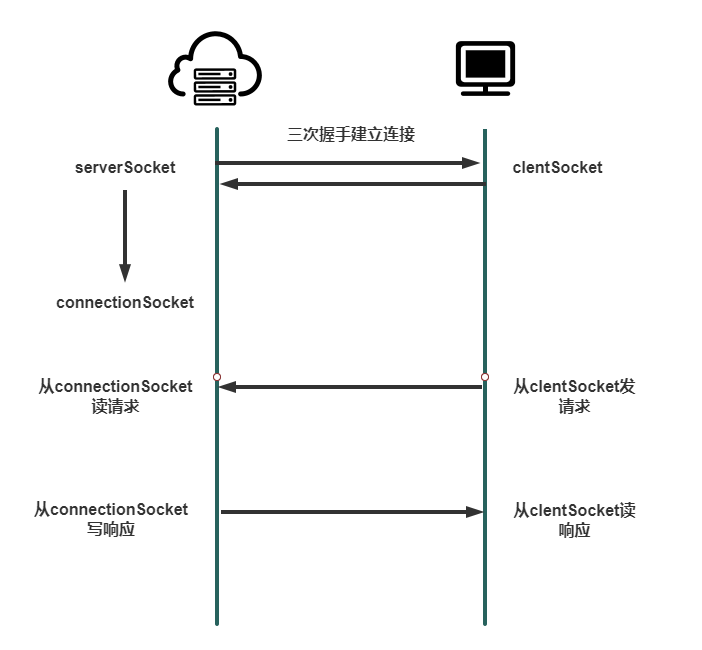

## 什么是 socket

`socket`，翻译过来是**插座**的意思，计算机网络中用作套接字，之所以叫套接字，因为它只负责在客户端或者服务端本地工作，而并不会作为报文传输的一部分，它就好像插座一样，分别安装在客户端和服务端，等需要建立连接的时候，就把连接线两端插在插座上连通客户端和服务端。

客户端在发起 TCP 连接请求之前，首先要发起连接首先要创建一个 客户端 TCP 套接字`clentSocket`，其包含客户端的 IP 地址和端口，以及将要建立连接的服务器的 IP 地址和端口；随后客户端向服务器发送建立连接请求报文段。

服务器在收到客户端发送的特定的建立连接的请求报文段以后，就为该指定客户端生成一个**新的连接套接字`connectionSocket`**，然后客户套接字和服务器的连接套接字之间会假设一根通信管道，专用于它们两者之间发送和接收数据。

