## 常用

### git config

Git 自带一个 `git config` 的工具来帮助设置控制 Git 外观和行为的配置变量，比较常见的就是配置 git 的用户名和邮箱

```shell
git config --global user.name "icodex"
git config --global user.email xxx@163.com
```

如果要获取所有 git 的配置，可以使用：

```shell
git config --list
```

### git clone

```shell
git clone <url>
eg: git clone https://github.com/libgit2/libgit2
```

复制远程仓库到本地。

### git add

```shell
git add <files>
eg: git add .
eg: git add ./src
```

对于 git 而言，文件目录中的文件一般有几种状态：

- 未修改：未修改的文件可能是没有编辑过的文件，或者编辑过已经提交的文件
- 已修改
- 已暂存：添加到暂存区的文件

编辑过某些文件之后，由于自上次提交后你对它们做了修改，git 将它们标记为已修改文件，可以选择性地将这些修改过的文件放入暂存区，然后提交所有已暂存的修改。

使用`git add`命令就是将文件添加到暂存区，`git add` 命令使用**文件或目录的路径作为参数**；如果参数是目录的路径，该命令将递归地跟踪该目录下的所有文件，例如常用的`.`表示的是当前放开 git 命令的目录，一般在项目上使用就是递归寻找所有修改过的所有文件，然后放到暂存区。

#### 取消暂存

```shell
git reset HEAD <file1>,<file2>...
```

`git reset HEAD`加上指定的文件或者文件夹，可以取消将该文件或者该文件夹放到暂存区，注意只是取消暂存区，并不是取消更改。

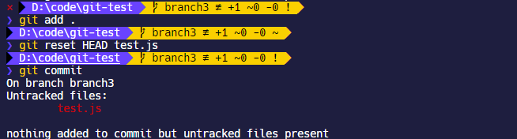

### git commit

```shell
git commit -m "xxx"
git commit -a -m "xxx"
```

如果`git commit`带上`-a`后缀就表示跳过`git add`阶段保存到暂存区的过程，直接将所有已经跟踪过的文件暂存起来一并提交。

#### 撤销提交

```shell
git commit --amend

eg:
git add .
git commit -m 'initial commit'
git add forgotten_file
git commit --amend
```

`amend`是修改的意思，`git commit --amend`这个命令更像是合并提交的，因为有时候刚提交完可能又发生了文件修改，此时如果使用`git commit`会有多个 commit 记录，而使用`git commit --amend`最终只会有一个提交——第二次提交将代替第一次提交的结果，这样仓库就不会出现“啊，忘了添加一个文件”或者 “小修补，修正笔误”这种乱七八糟的提交信息了。

### git push

```shell
git push <远程主机名> <本地分支名>:<远程分支名>

//如果本地分支名与远程分支名相同，则可以省略冒号：
git push <远程主机名> <本地分支名>

git push --set-upstream origin master

git push -f
```

`git push`是带有远程地址和分支名称的，例如`git push origin master`，比如刚刚本地新建一个分支要提交到远程仓库，就需要设置远程主机名和分支名。

如果远程仓库存在多条分支，那么需要每次提交代码都指定对应的主机名和分支名，否则 git 会拒绝操作。

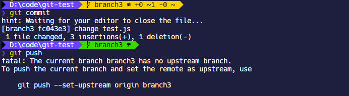

这样很麻烦，git 也给了命令提示，`--set-upstream`可以设置默认推送的远程仓库的分支。这样下次执行就可以不用指定分支直接使用`git push`了。

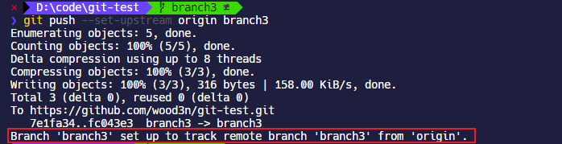

如果本地版本低于远程仓库的提交版本，使用`git push`会失败， git 会提示需要从远程仓库抓取更新才能推送。这时候使用`git push -f xx`可以强制推送本地版本到远程仓库，当然了，远程仓库已经存在的文件也会丢失。

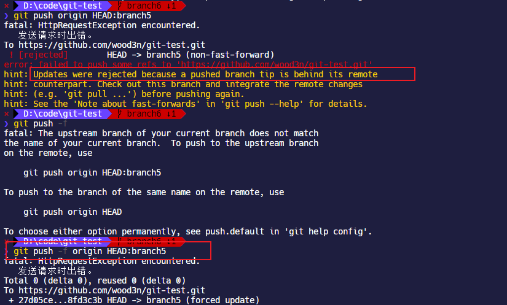

### git pull

```shell
git pull <远程主机名> <远程分支名>:<本地分支名>

//如果本地分支名与远程分支名相同，则可以省略冒号：
git push <远程主机名> <远程分支名>
```

`git pull`是从远程仓库的分支获取代码。

### git rm

```shell
git rm <file>
git rm --cached <file>	//只删除远程，不删除本地
```

`git rm`可以从远程仓库以及本地移除文件，如果后面跟的是一个目录做为参数，则会递归删除整个目录中的所有子目录和文件。先执行`git rm`可以看到本地仓库文件被删除，然后执行`git commit`和`git push`，就可以删除远程仓库的文件，

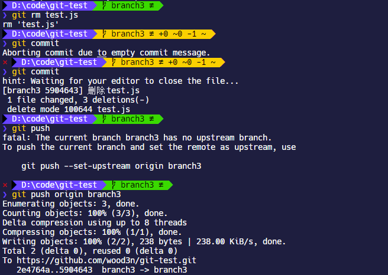

如果只想删除远程仓库的文件，而保留本地的，那么需要添加`--cached`来操作。

## 分支操作

从一个远程跟踪分支检出一个本地分支会自动创建所谓的“跟踪分支”（它跟踪的分支叫做`upstream`）。 跟踪分支是与远程分支有直接关系的本地分支。 如果在一个跟踪分支上输入 `git pull`，Git 能自动地识别去哪个服务器上抓取、合并到哪个分支。当克隆一个仓库时，它通常会自动地创建一个跟踪 `origin/master` 的 `master` 分支。

### git branch

```shell
git branch
git remote show <remote>

git branch <branchname>
git branch -d <branchname>
git push origin --delete <branchname>
git branch --set-upstream-to=<upstream> [<branchname>]

eg:
git branch testing
git branch -d issue1
```

`git branch`命令可以显示本地仓库有多少分支存在；如果要显示远程仓库的分支信息，可以使用`git remote show origin`.

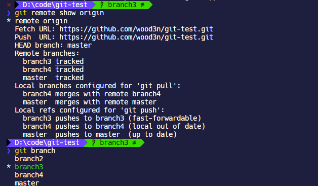

默认分支名称是`master`，`git branch`命令用于在本地创建一个新的分支；`git branch`只是创建分支，并不会自动切换到新的分支。

如果使用`git branch -d`后缀，则是**删除本地分支**。

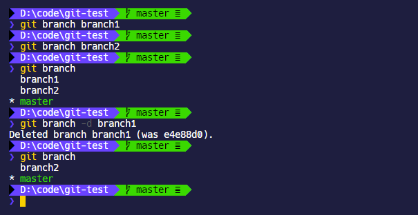

如果要删除远程仓库的分支，需要使用`git push origin --delete <branchname>`

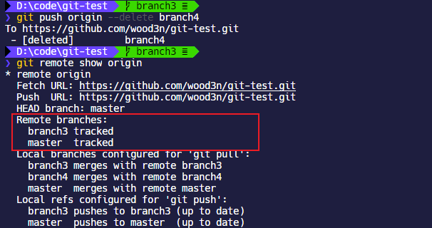

需要注意的是本地分支和远程分支不一定相同，比如说本地新建了一个分支为`branch1`，但是远程分支名是`branch2`，现在我想把本地的`branch1`设置追踪远程的`branch2`，需要使用 `git branch --set-upstream-to=origin/<branchname>` ，这个命令用于**设置已有的本地分支跟踪一个刚刚拉取下来的远程分支**，或者想要修改正在跟踪的上游分支。

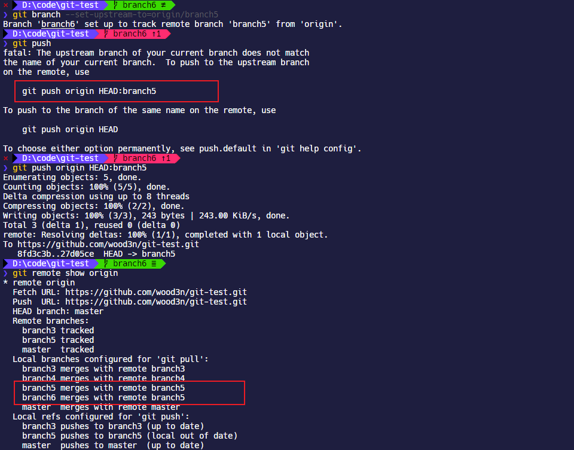

### git checkout

```shell
git checkout <branchname>
git checkout -b <newbranchname>

eg:
git checkout testing
```

`git checkout`是切换到某个分支去，使用`git checkout -b <newbranchname>`可以合并`git branch`和`git checkout`，即创建分支以后自动切换过去。

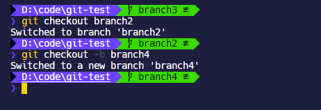

然后就可以进行本地新增，修改文件等操作，通过`git add`等命令提交，然后推送的时候注意要指定分支名`git push origin <branchname>`，如果远程不存在分支，那么会自动新建并合并提交记录。

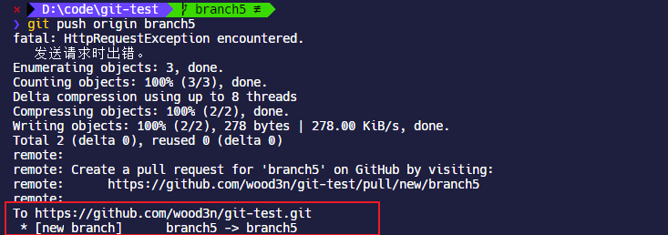

### git merge

```shell
git merge <branchname>
```

如果要合并分支，首先切换到合并后的分支上去，然后使用`git merge <branchname>`选择要合并到当前分支的分支，需要注意合并分支并不会删除分支，要删除分支需要`git branch -d`命令。

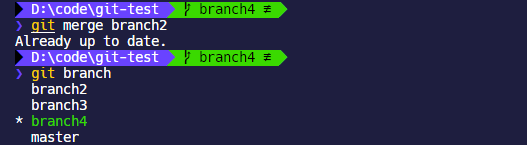

例如使用`git checkout master`先切换到`master`分支，然后使用`git merge testing`将`testing`分支合并到`master`分支中。

```shell
git checkout master

git merge testing
```

如果遇到两个仓库具有路径相同的文件合并冲突的情况，git 会暂停合并，并提示冲突信息，等待开发者手动解决冲突。例如，我们新建`branch3`和`branch4`，然后都编辑一份`test.js`文件并提交，然后在`branch3`中合并`branch4`，就出现了冲突；此时可以使用`git status`检查所有处于冲突状态的文件，如下所示：

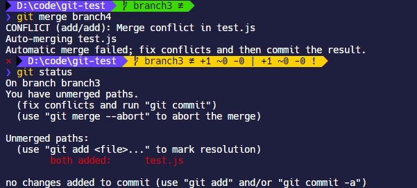

然后打开文件解决冲突，解决冲突完了以后再使用`git add`和 `git commit`提交就可以了。

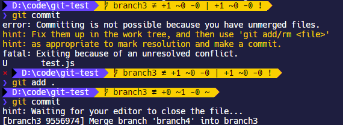

### git rebase

```shell
git rebase <branchname>

git rebase --continue
git rebase --skip
git rebase --abort
```

`rebase`有重新设定，变基的意思，可以用它来合并分支。

现在我们使用`git reset --hard HEAD~`取消刚才`git merge`的合并记录，现在历史提交记录已经恢复到之前的状态。

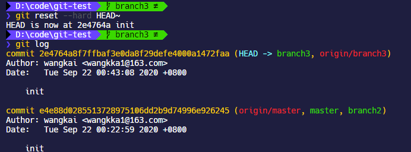

刚才是要把`branch4`合并到`branch3`中，现在我们切换到`branch4`下执行`git rebase branch3`，依然会出现冲突

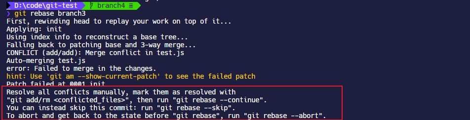

现在解决冲突，然后注意对于修改后的文件执行`git add .`以后，不是要去`git commit`，而是要去`git rebase --continue`，有时候`git rebase --continue`会抽风，可以使用`git rebase --skip`跳过本次提交，然后使用`git merge`再重新 merge 回主分支就行了。

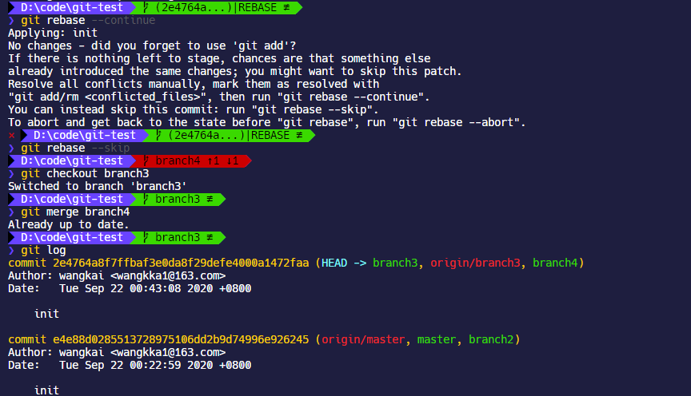

可以看到`git rebase`的合并操作的提交历史很整洁。

## 查询历史记录

### git log

```shell
git log
```

`git log`可以显示历史提交记录，并从最近的提交记录往前排列。

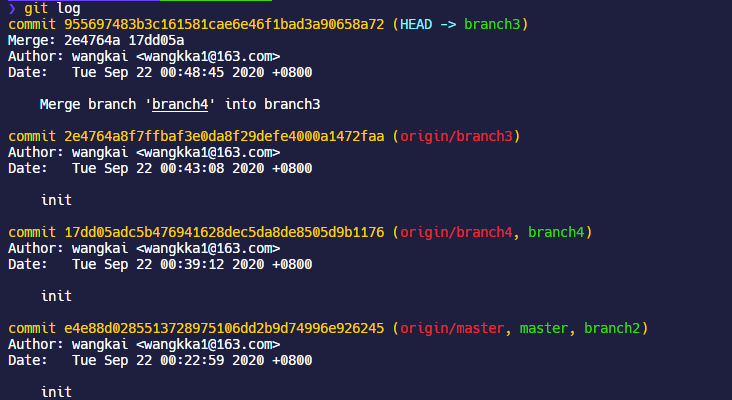

## 重置

### git reset

```shell
git reset [--soft | --mixed | --hard] [HEAD] <file1>,<file2>...

eg:
git reset --hard HEAD~
```

上文说到[`git reset`](https://git-scm.com/docs/git-reset)命令可以重置已经暂存的文件的状态，同时`git reset`也具有撤销全部修改的能力。

`--mixed`为默认后缀，可以不用带该参数，即`git reset HEAD`，用于**重置暂存区**的文件，也就是重置上一次`git add`的操作；

`--soft`参数用于回退到某个版本；

`--hard`参数撤销工作区中所有未提交的修改内容，将暂存区与工作区都回到上一次版本，并删除之前的所有信息提交

如果指定`HEAD` 表示当前版本

- `HEAD^` 上一个版本
- `HEAD^^` 上上一个版本
- `HEAD^^^` 上上上一个版本

- `HEAD~0` 表示当前版本
- `HEAD~1` 上一个版本
- `HEAD^2` 上上一个版本
- `HEAD^3` 上上上一个版本

例如`git reset --hard HEAD^`就是完全重置到上一个版本的提交，包括分支 merge 的记录也会重置，提交记录和本地文件都会重置到上一个版本。

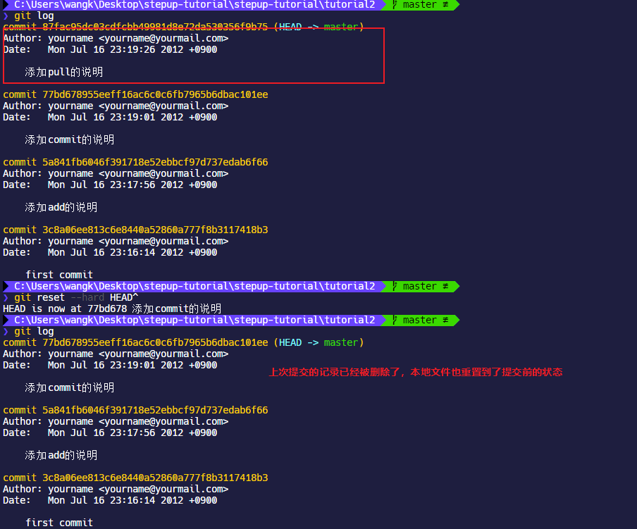

### git revert

```shell
git revert [HEAD]
```

如果使用`git revert`也能做到重置提交的目的，例如使用`git revert HEAD`是重置到上一版本，同时会创建一个新的提交记录。注意这点是和`git reset`主要的区别，`git reset`是连提交记录都会重置，`git revert`是创建一个新的提交去覆盖之前的提交记录。

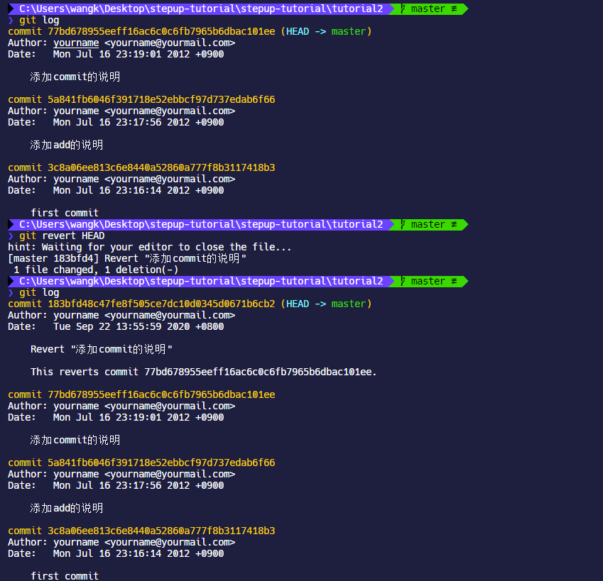
