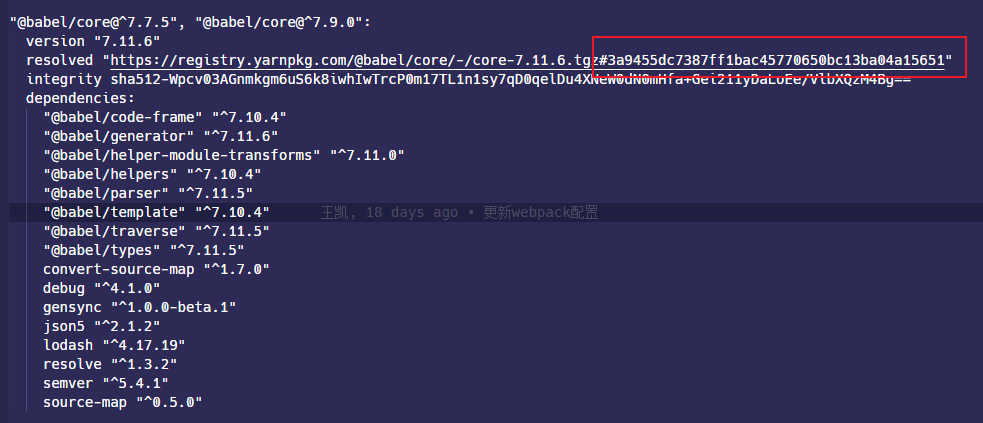
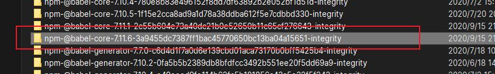
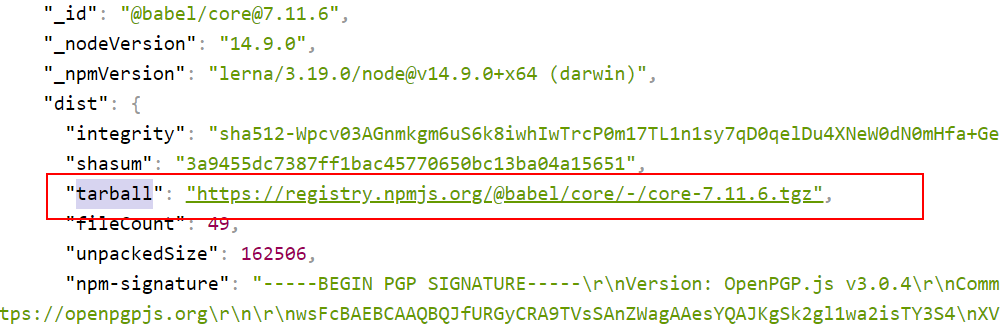
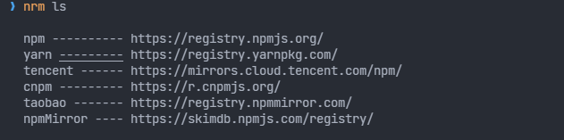

## npm install

`npm install`本身支持多种形式的命名，一般来说常用的有：

```shell
npm install (with no args, in package dir)
npm install [<@scope>/]<name>
npm install [<@scope>/]<name>@<tag>
npm install [<@scope>/]<name>@<version>
npm install [<@scope>/]<name>@<version range>
npm install <git-host>:<git-user>/<repo-name>
npm install <git repo url>
npm install <tarball file>
npm install <tarball url>
npm install <folder>

//简写
npm i
npm add
```

### `npm install`

不带任何参数的`npm install`命令默认用于整体安装所有在`package.json`中依赖包到本地项目的`node_modules`文件夹。

如果带有`--production`后缀，`npm install --production`不会安装`devDependencies`下的依赖。

如果带有`-g`或`--global`是安装全局依赖，则依赖会被安装在计算机用户文件夹或者 nodejs 的安装目录下，可以使用以下命令查看全局安装路径：

```bash
npm root -g
```

### `npm install <folder>`

安装到具体文件夹，如果和当前项目根目录一致，那么会提升到`node_modules`文件夹中

```javascript
npm install ./src
```

### `npm install <tarball file>`

安装本地压缩包文件，压缩包必须满足以下要求：

- 使用`.tar`，`.tar.gz`或者`.tgz`作为后缀
- 包必须位于`.tar`文件内部的子文件夹中，例如`package/`
- 包必须包含`package.json`文件

```shell
npm install ./package.tgz
```

### `npm install <tarball url>`

从远程服务器下载并安装压缩包，路径必须以`http://`或者`https://`开头

```shell
npm install https://github.com/indexzero/forever/tarball/v0.5.6
```

### `git`

`npm install <git repo url>`和`npm install <git-host>:<git-user>/<repo-name>`两个可以通过 git 将仓库代码克隆下来放在本地

### `npm install [<@scope>/]<name>`

默认情况下，安装依赖会添加到`package.json`的`dependencies`中，可以通过以下后缀控制：

- `-p`，`--save-prod`：默认行为，即安装依赖会添加到`package.json`的`dependencies`中
- `-D`，`--save-dev`：安装依赖会添加到`package.json`的`devDependencies`中
- `-O`，`--save-optional`：安装依赖会添加到`package.json`的`optionalDependencies`中
- `--no-save`：安装依赖不会添加到`package.json`的`dependencies`中

### @version

`@latest`安装最新的稳定版本的 package

```shell
npm install @myorg/mypackage@latest
```

`@next`安装最新的未发行版本的 package

```shell
npm install @myorg/mypackage@next
```

`@[version]`可以限定 package 的版本

```shell
npm install sax@0.1.1
```

`@[version range]`安装在版本范围内的 package

```shell
npm install sax@">=0.1.0 <0.2.0"
```

## install 命令的机制

> [参考 —— npm install 原理分析](https://cloud.tencent.com/developer/article/1555982)

使用`npm i --timing=true --loglevel=verbose`或者`yarn install --verbose`可以观察 install 命令的安装过程，大致经过以下步骤

### 检查配置文件

npm 会检查`.npmrc`文件，yarn 会检查`.yarnrc`配置文件，`rc`表示 runtime configuration 的意思，配置文件保存着 npm 的一些[基本配置](https://docs.npmjs.com/using-npm/config.html)，例如：

- `cache`：设置 npm 保存缓存的本地目录，可以使用`yarn cache dir`或者`npm config get cache`获取本地默认的缓存目录
- `cache-max`：设置缓存最长时间，默认是永久
- `package-lock`：设置在 install package 的时候是否忽略`package-lock.json`文件
- `registry`：设置 npm 源地址，默认是`https://registry.npmjs.org/`

### 检查 lock 文件

检查项目的根目录是否存在[`package-lock.json`](https://docs.npmjs.com/configuring-npm/package-lock-json.html)文件，`package-lock.json`会保存项目实际需要安装的依赖的具体信息，以保证在不同机器，团队协作开发，或者 CI/CD 的情况下安装的都是一样版本的 package，以`yarn.lock`中的`@babel/core`为例，大致有以下信息：

- `name`：package 的名称，`yarn.lock`直接以 package 的名称作为键名来匹配
- `version`：安装到本地`node_modules`中的 package 的版本
- `resolved`：package 的下载地址



### 获取依赖信息

从`package.json`中的`dependencies`和`devDependencies`获取所有依赖名称和它们的语义化版本信息。

如果存在 lock 文件，会检查其内部的版本信息和`package.json`里的版本是否存在冲突，即是否满足`package.json`内部的版本范围。

- 如果不存在冲突，会使用 lock 文件中的`resolved`字段，去本地缓存目录获取 package，例如上文提到的`@babel/core`这个 package，对应保存的目录名是`resolved`属性的 URL 的 hash 部分。缓存目录保存的是 package 的压缩版本，会拷贝到项目目录进行解压。



- 如果存在冲突，就去 [npm registry](https://registry.npmjs.org) 注册源（这玩意就是一个数据库，保存着同名 package 下的所有版本信息）查找具体版本的 package。例如`@babel/core`可以通过`https://registry.npmjs.org/@babel/core`查找其所有版本信息，在`package.json`中显示的是`^7.11.1`，那么会去查找`<8.0.0`版本的最新的 package，最终确定是`7.11.6`。

如果不存在 lock 文件，就直接去`npm registry`地址查询 package 的信息，npm registry 获取到具体的 package 的信息中会包含 package 的压缩包地址`dist.tarball`和`dist.shasum` hash 值等。



### 构建抽象依赖树

从`package.json`中的`dependencies`和`devDependencies`中获取到的只是最顶层的依赖项，它们各自内部还可能包含自己的依赖关系，然后子依赖还可能存在子依赖，这样就会形成一个树状的依赖关系图。

如果单纯根据这个树状的依赖项将各自模块的依赖都单独存放，有可能不同的模块保存着相同的依赖包，这样会导致`node_modules`文件夹有很多重复的文件，占用存储。

所以构建抽象依赖树的过程会**扁平化处理模块间的依赖**，不管是顶层依赖还是子依赖，都会判断优先放在项目的`node_modules`文件夹中，当下次查询到相同版本范围内的依赖项时就跳过下载该 package 的过程，如果版本不符合，就会放置在那个模块的目录的`node_modules`文件夹中。

### 安装依赖

构建完抽象依赖树后会从缓存查询每个 package 是否存在，如果存在即拷贝，不存在就根据`dist.tarball`下载下来，然后复制一份到缓存目录中，最后解压到对应依赖项的`node_modules`文件夹中。

由于是首次安装，不会存在本地缓存，那么就会根据这个地址下载 package 到项目目录的`node_modules`文件夹中，然后继续查找该模块的依赖，比方说`@babel/core`这个 package，它还依赖于其他 package，而其他 package 也可能还依赖于更深层次的 package，最终就会形成一个树状的依赖关系，这样需要递归查找直到找不到依赖项为止。

### 生成 lock 文件

`package-lock.json`文件会在使用`npm`修改`node_modules`树，或者`package.json`文件以后自动产生的，如果使用`yarn`对应的是一个`yarn.lock`文件。

## npm publish

```bash
npm publish [<tarball>|<folder>] [--tag <tag>] [--access <public|restricted>] [--otp otpcode] [--dry-run]

Publishes '.' if no argument supplied
Sets tag 'latest' if no --tag specified
```

执行`npm publish`命令会把项目内部在`gitignore`或者`npmignore`忽略的文件打包上传到`npm`的管理系统。

需要注意以下几点：

### 登录账号

发布之前需要使用`npm adduser`或者`npm login`登录`npm`账户。

### 发布版本号禁止重复

发布版本号禁止重复，及时发布失败或者使用`npm unpublish`取消发布。

### QA

#### 403

通常来说发布的出现`403`的原因是包名重复，可以先去 npm 官网搜一下`package.json`指定的`name`有没有已经被别人使用了。

#### 400 npm cannot publish over previously published version

版本号重复。

## nrm

[`nrm`](https://www.npmjs.com/package/nrm)是一个 npm 源管理工具，本地安装以后，可以通过`nrm`十分方便的切换 npm 源地址。

```bash
npm install -g nrm
```

查看不同源

```bash
nrm ls
```



使用特定源

```bash
nrm use xxx
```
