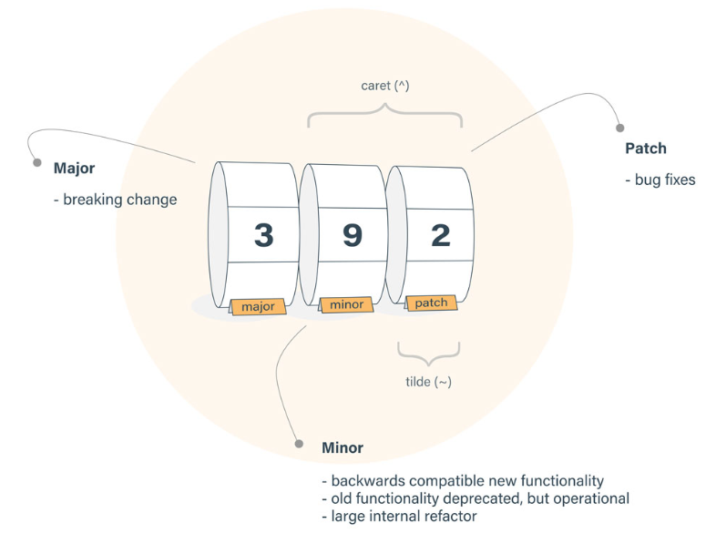

## package.json 的版本定义

> [npm 版本号语义](https://docs.npmjs.com/misc/semver.html)

- npm package 的版本号最多只有三位，用`.`连接起来；第一位表示主版本号，第二位一般表示更新向后兼容的新功能，重构等，最后一位表示修复 bug



- `~version`：近似等于版本

```json
~1.2.3   >=1.2.3 <1.3.0
~1.2	 >=1.2.0 <1.3.0			1.2.x
~1								1.x
```

- `^version`：根据 npm 版本号最多只有三位的情况，允许在最左侧同一非 0 版本号的范围内匹配

```json
^1.2.3 	>=1.2.3 <2.0.0				//最左侧非0版本号就是第一个
^0.2.3  >=0.2.3 <0.3.0				//最左侧非0版本号是第二个
^0.0.3 	>=0.0.3 <0.0.4
```

- 其它还能用大于小于这些符号`>version`等，分别就表示大于小于版本号的匹配
- `-beta.2`：有时候会在版本号的后面带上`beta`的测试版本符号

## install 命令的机制

## dependency 的不同

### dependencies

### devDependencies

### peerDependencies
