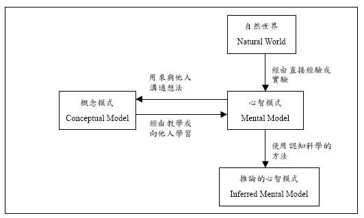
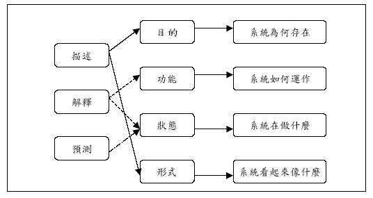
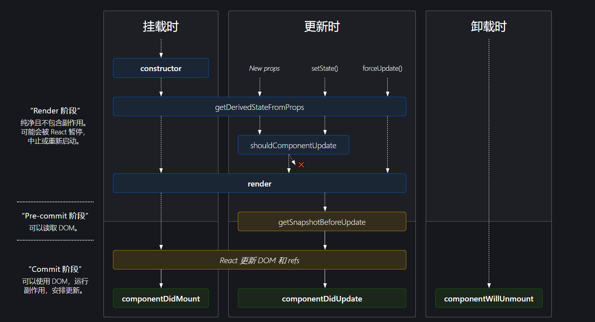

## 心智模型

> 心智模型（mental model）：A **mental model** is an explanation of someone's thought process about how something works in the real world. —— [wikipedia - Mental_model](https://en.wikipedia.org/wiki/Mental_model)
>
> 心智模型是对某人关于某物在现实世界中如何工作的思考过程的解释。

我个人觉得，心智模型就是伴随一个人成长过程中，对客观事物所建立的个人的认知。所以，心智模型会有一个建立以及不断修改的过程，通过日常的学习，所接触的事，人等都会影响心智模型的改变。



心智模型的形成会先从信息刺激开始，然后个人会观察或者直接运用得到进一步的信息反馈，若自己主观认为是好的就会保留下来，不好的就会被放弃，内心自然也是拒绝的。

放在计算机中，这是一个涉及到用户体验的话题，计算机的操作基本来自于人机交互，人机交互系统的设计要充分考虑到用户对系统的理解，这就是要求用户建立自己对于系统的思考，慢慢完善系统对于用户的反馈，从而在用户的心智模型中保留下来。



## 函数组件的特点

我记得曾经有一次我面试的时候，面试官问我一个问题，函数组件能不能被实例化，我当时还傻傻地回答*可以*，因为我当时完全没有写过函数组件，按照过去对构造函数和现在 ES 中的`class`的认识，我把函数组件大写开头的形式类比成了构造函数！

### this

如果从作用域的角度来看的话，`this`是 JS 里比较令人头疼的问题，`class`的出现从一定程度解决了`this`的乱用，也就是仅限于在`class`中使用`this`访问`class`内

部的成员，这是 OOP 语言的特性，但是`class`里有个严格的规定是继承的`class`必须首先使用`super`去塑造内部构造函数`constructor`的`this`，并且由于 React 组

件的特殊性，在事件回调函数中使用`this`必须在构造实例的时候就严格绑定到实例上，否则当 JSX 最终渲染到 DOM 中的时候，事件回调函数中的`this`就会丢失。

诸如此类可以说是`class`组件的复杂性，记得我当初学习也是花了个把月，甚至到知乎等地方提问才搞清楚`super`以及`bind`的问题，如果没有 OOP 编程的经验，这

是一个难点。

函数组件则十分简单，如果写过 JS 的函数，就能轻松上手，无非就是`return`一些 JSX 语法而已，这里最大的区别就是无需`this`来访问函数组件的内部成员，因为它

们始终都位于函数作用域内。

### 渲染方式

在`class`组件中，依赖生命周期方法我们可以很好的组织组件内部的逻辑，每一个生命周期函数都有严格的执行时机限制：



但是函数组件，没有声明周期的限制，每次渲染都会以调用的形式去执行内部所有的逻辑，这就涉及到函数组件所利用的 JS 的一个重要的特性 —— 闭包，在函数组件中

声明的函数，他们访问的`state`，`ref`，以及其他变量等都会保存在其作用域链中。总之返回的组件最终都要渲染到 DOM 中的，所以这些函数最终都会以事件回调函

数的形式去执行，尽管现代浏览器已经对闭包进行了相应优化，在函数中未使用的变量都不会保存在其作用域链中，这将减少很大一部分内存占用，但是错误的声明大量

的`state`，仍然会导致内存泄漏的问题。

### 闭包的执行时机

在函数组件中声明的函数基本都用于 DOM 事件的回调，但是 React 中使用 virtual DOM 来做 diff，尽管 React 可以对前后两次更新渲染过程中返回的 virtual DOM 进行 diff，但是无法阻止函数组件中任一逻辑的执行，以一个 TODO 组件来观察函数组件中闭包函数的执行时机

<code src="@/demo/todo" />

现在每当我们输入一个值，可以看到负责计算`hasDoneItem`，`undoList`的函数都会被执行一遍，实际上这些函数计算所依赖的状态值`listData`根本就没发生变化，我们只是在输入而已，并没有将事项添加到`listData`中。


现在我们用`useMemo`来缓存`undoList`的计算值，仅当`listData`发生变化时才重新计算`undoList`的值，主要修改代码部分如下：

```typescript
const memoUndoList = useMemo(() => {
  console.log('计算undoList');
  return listData.filter(item => !item.done);
}, [listData]);

<UndoList listData={memoUndoList} />;
```

可以清楚的观察到传入`useMemo`的负责计算`undoList`的函数不会在每次输入都执行了！！！


