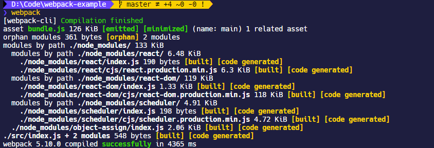
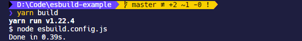
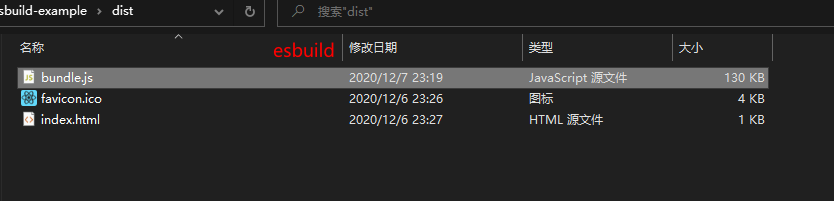

## esbuild 是什么

> [evanw/esbuild: An extremely fast JavaScript bundler and minifier (github.com)](https://github.com/evanw/esbuild#esbuild)

一个可配置的 JS 打包工具。其具有以下特点：

- 使用`go`语言编写而成
- 其 API 可以通过`CLI`，可执行 js 文件，或者`go`语言编写的可执行文件来执行
- 默认能够对`.jsx`后缀的 React 代码进行编译
- 非常快

## API

`esbuild`提供两种 API：

- `transform`：用于编译单条语句，这意味着你可以用这个 API 写一个即时编译的`playground`放在网页中

```javascript
require('esbuild').transform('let x: number = 1', {
  loader: 'ts',
});
```

- `build`：类似于`webpack`，基于文件系统进行递归查找编译最终生成`bundle`文件

```javascript
require('esbuild').build({
  entryPoints: ['in.ts'],
  outfile: 'out.js',
});
```

并且两种 API 都提供同步编译的选项：

- `transformSync`
- `buildSync`

同步和异步的差别在这里主要就是基于``esbuild`的`plugins`插件系统只能使用异步的，所以一般都是推荐使用异步。

## 实践

### 安装 esbuild，React

使用`yarn init`初始化`package.json`文件，然后安装`esbuild`，`react`

```shell
yarn add react react-dom

yarn add esbuild -D
```

### 新建项目目录

建立如下的项目目录，其中`esbuild.config.js`就是`esbuild`的执行文件，`dist`是`bundle`输出目录。

```shell
.
├─ dist
│    ├─ favicon.ico
│    └─ index.html
├─ src
│    ├─ index.jsx
│    └─ pages
│           ├─ App.jsx
├─ esbuild.config.js
├─ package.json
```

### hello world

搭建基础的 HTML 页面，这里注意 HTML 页面引入`bundle.js`路径

```html
<!DOCTYPE html>
<html lang="zh-hans">
  <head>
    <meta charset="utf-8" />
    <title>esbuild-example</title>
    <link rel="icon" href="favicon.ico" />
  </head>
  <body>
    <div id="root"></div>
    <script src="bundle.js"></script>
  </body>
</html>
```

在`pages/App.jsx`中编写`hello world`

```jsx | pure
import React from 'react';

const App = () => {
  return (
    <div>
      <span>hello world!</span>
    </div>
  );
};

export default App;
```

在`src/index.jsx`中`import`进来`hello world`程序，然后渲染到 HTML 页面中

```jsx | pure
import React from 'react';
import ReactDOM from 'react-dom';
import App from './pages/App';

ReactDOM.render(<App />, document.getElementById('root'));
```

### 配置 esbuild

简单的配置一下`esbuild.config.js`

```javascript
require('esbuild').build({
  entryPoints: ['src/index.jsx'],
  outfile: 'dist/bundle.js',
  bundle: true,
  minify: true,
  define: {
    'process.env.NODE_ENV': '"production"',
  },
});
```

在`package.json`的`scripts`写入`build`字段，到这准备工作就完成了。

```json
"scripts": {
  "build": "node esbuild.config.js"
},
```

最后执行`yarn build`就能看到`dist`目录成功输出`bundle.js`文件了。


## 对比 webpack

### 易用性

首先从易用性上来说比`webpack`要简单许多，对于上面一个简单的 React 项目，`webpack`需要安装`babel`，`babel-loader`等工具，需要使用`webpack`那谜一样的 API 来配置`babel`编译`jsx`模块的代码，一个最简单的`webpack`配置需要指定以下内容

```javascript
const path = require('path');

module.exports = {
  entry: path.resolve(__dirname, 'src'),
  output: {
    filename: 'bundle.js',
    path: path.resolve(__dirname, 'dist'),
  },
  module: {
    rules: [
      {
        test: /\.m?jsx?$/,
        exclude: /(node_modules)/,
        use: {
          loader: 'babel-loader',
          options: {
            presets: ['@babel/preset-env', '@babel/preset-react'],
            // 如果在class组件中使用属性或者箭头函数之类的语法，必须要引入这个plugin
            plugins: ['@babel/plugin-proposal-class-properties'],
          },
        },
        resolve: { extensions: ['.js', '.jsx'] },
      },
    ],
  },
};
```

### 编译速度

React 项目中影响`webpack`编译速度一个关键点就是`babel-loader`很慢，基于以上的同一个项目，`webpack`需要`4s`左右



但是`esbuild`不到`1s`，😂😂😂😂😂😂😂😂



### bundle 大小

就最终生成的`bundle`文件大小来说，两者相差不大



