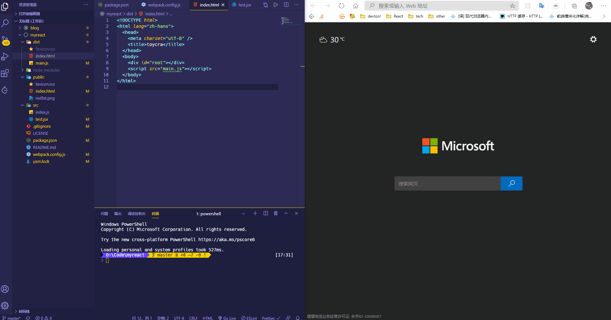
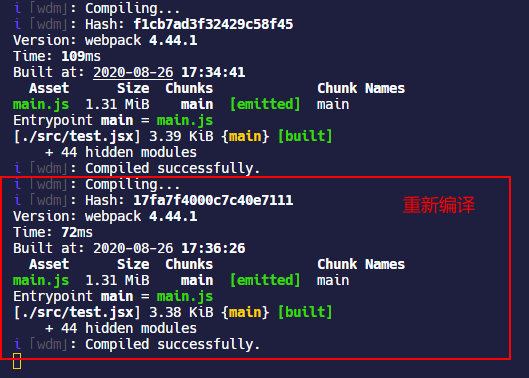
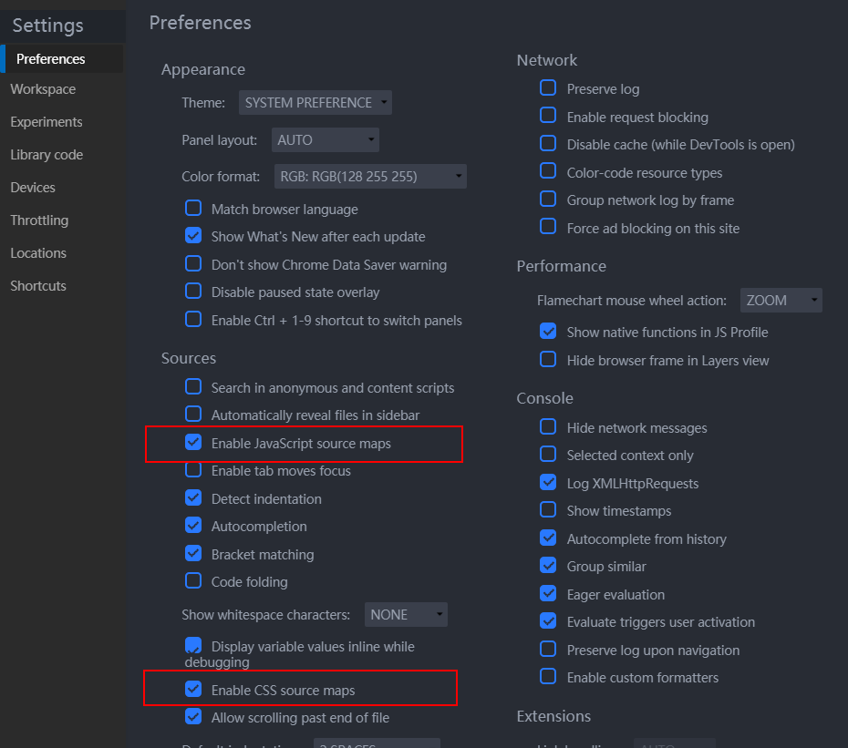
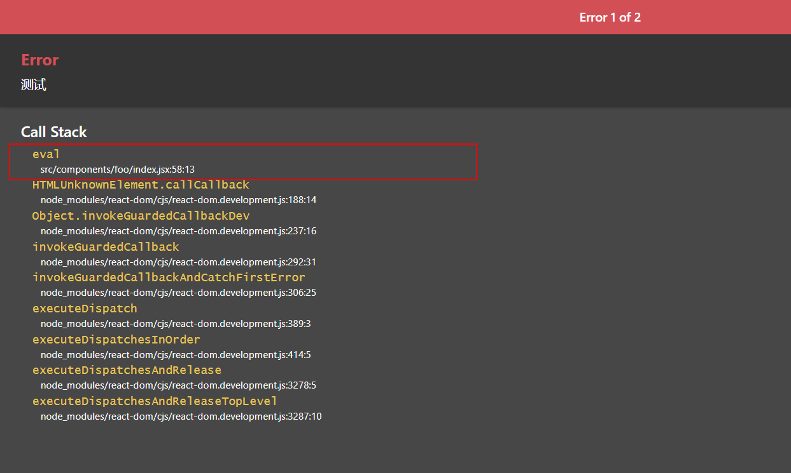
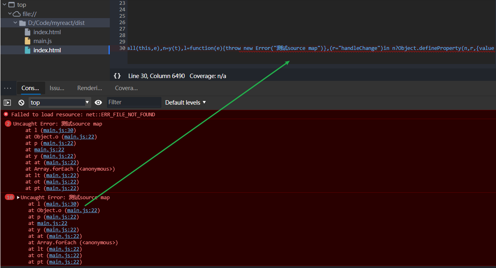
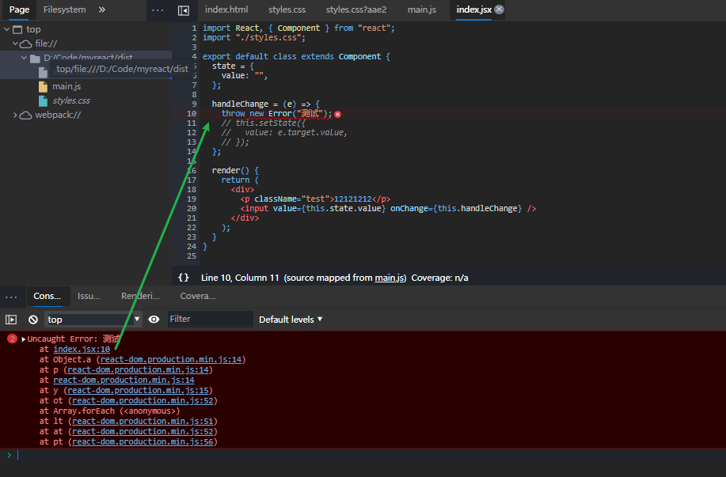
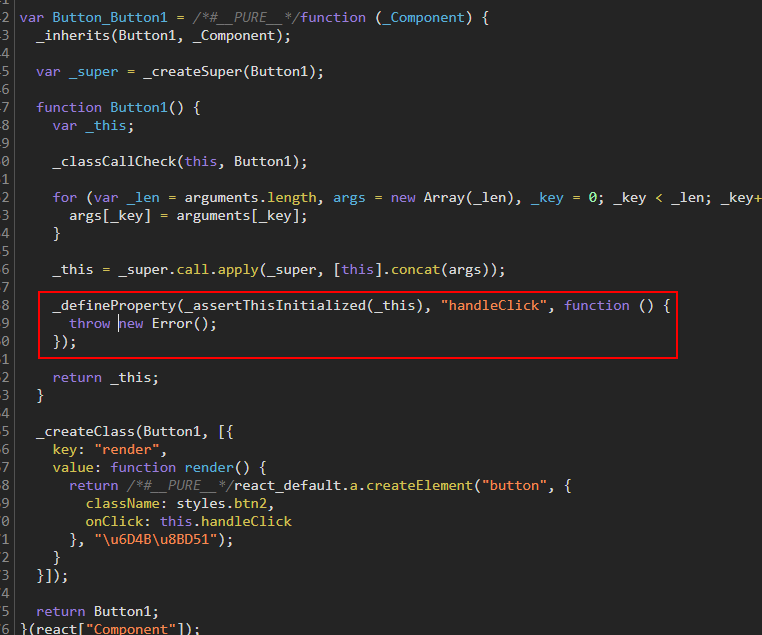

---
title: 搭建React项目（2）
---## 开发环境配置

之前通过一些 webpack 的简单配置，项目可以使用 React 来编写基本组件了，但是每次编写组件，都需要重新执行`webpack`命令打包，然后再手动在浏览器中打开页面才能看到开发结果，这是十分影响开发效率的，我们要的效果`yarn start`启动项目运行，在开发过程中使用`ctrl+s`保存文件，然后页面能自动更新，为此需要配置 HMR 和 webpack-dev-server。

## 开发模式

> [模式（Mode）](https://webpack.docschina.org/configuration/mode/)

如果要使用开发模式的功能，需要为 webpack 指定开发模式，因为执行`webpack`命令的时候如果不指定模式，那么默认就是生产环境`production`。

```javascript
module.exports = {
  mode: 'development',
};
```

针对不同的模式，webpack 使用相应模式的内置优化，例如开启一些内置的`plugin`等，具体如下：

### development

- 在`DefinePlugin`中注册全局环境变量属性`process.env.NODE_ENV = "development"`

- 启用`NamedChunksPlugin`
- 启用`NamedModulesPlugin`

### production

- 在`DefinePlugin`中注册全局环境变量属性`process.env.NODE_ENV = "production"`
- 启用`FlagDependencyUsagePlugin`，用于标记当前模块中`import`部分使用到的`import`，后续可以删除无用的`import`
- 启用[`FlagIncludedChunksPlugin`](https://webpack.js.org/plugins/internal-plugins/#flagincludedchunksplugin)，用于为每个 chunk 引入的其它 chunks 添加 id，消除无用的 chunk
- 启用[`ModuleConcatenationPlugin`](https://webpack.docschina.org/plugins/module-concatenation-plugin/#root)，将所有模块连接到一个闭包函数内，可以提高代码的执行效率，这个插件是开启 *tree shaking*功能必须启用的插件
- 启用[`NoEmitOnErrorsPlugin`](https://www.webpackjs.com/plugins/no-emit-on-errors-plugin/)，在编译出现错误时，使用 `NoEmitOnErrorsPlugin` 来跳过输出阶段。这样可以确保输出资源不会包含错误
- 启用`OccurrenceOrderPlugin`，这个插件以前叫`OccurenceOrderPlugin`，通过模块调用次数给模块分配 ids，常用的 ids 就会分配更短的 id，使 ids 可预测，减小文件大小
- 启用`SideEffectsFlagPlugin`，副作用代码标记，配合`package.json` 的`"sideEffects"`配置项使用，对于无副作用的代码，可以删除一些无用的`export`导出
- 启用[`TerserPlugin`](https://webpack.js.org/plugins/terser-webpack-plugin/)，使用 [terser](https://github.com/terser-js/terser) 压缩 JS 代码

### 针对不同模式的配置

#### 函数配置

webpack 支持多种[配置类型](https://www.webpackjs.com/configuration/configuration-types/#%E5%AF%BC%E5%87%BA%E4%B8%BA%E4%B8%80%E4%B8%AA%E5%87%BD%E6%95%B0)，一般来说简单配置的话，都可以使用`module.exports`导出一个 webpack 配置对象的方式来做，但是对于复杂业务情况，例如需要针对不同环境启用不同的`loader`，`plugin`等功能，这时候需要使用 webpack 的函数配置方式来解决。

webpack 函数方式的配置可以接受两个参数：

- 第一个参数是一个[环境变量](https://webpack.docschina.org/guides/environment-variables/)对象`env`，内置一些环境变量属性，webpack 命令行 [环境配置](https://webpack.docschina.org/api/cli/#environment-options) 的 `--env` 参数，可以允许你传入任意数量的环境变量。而在 `webpack.config.js` 中可以访问到这些环境变量

```javascript
// 执行webpack命令，并指定生产环境，并配置环境变量NODE_ENV
webpack --env.NODE_ENV=development --progress
```

- 第二个参数是一个 map 对象（`argv`），可以从`argv`中获取配置项信息传递到 webpack 的配置中

```javascript
// webpack.config.js
module.exports = function(env, argv) {
  // 接受NODE_ENV环境变量
  const NODE_ENV = env.NODE_ENV;

  return {
    // 判断执行命令时为webpack指定的环境模式
    mode: env.production ? 'production' : 'development',
    ...
    plugins: [
      new webpack.optimize.UglifyJsPlugin({
        // 通过argv传递参数
        compress: argv['optimize-minimize']
      })
    ]
  };
};
```

#### 不同的配置文件

如果不想都在一个`webpack.config.js`中杂糅所有配置项，出于维护性更高的目的，可以使用[不同的 webpack 配置文件](https://webpack.docschina.org/configuration/#use-different-configuration-file)，例如开发环境指定`webpack.development.config.js`，并在执行`webpack`命令的时候通过命令行接口参数`--config`指定使用不同的配置文件。

```javascript
// 指定使用配置文件，config后面串接配置文件路径
webpack --config webpack.config.js

// 指定config文件夹中的webpack.development.config.js文件
webpack --config config/webpack.development.config.js
```

### 不同模式的切换

如果直接在`webpack.config.js`的`mode`配置项中写死在 webpack 不同模式中自由的切换，一般来说有两种方式：

- 第一种是在执行`webpack`命令的时候，通过 webpack 提供的[命令行接口](https://webpack.docschina.org/api/cli/#environment-options)参数`--mode`指定模式

```javascript
// 指定开发模式
webpack --mode=development

// 指定开发模式
webpack --mode=production
```

- 第二种方式也是通过 webpack 提供的命令行接口参数`--mode`指定模式，不过结合了[npm-scripts](https://docs.npmjs.com/misc/scripts.html)在`package.json`文件中配置命令，这样就能通过`npm run xxx`或者`yarn xxx`来指定 webpack 的模式了

```json
{
  ...
  "scripts": {
    "start": "webpack --mode=development",
    "build": "webpack --mode=production"
  },
}
```

- 最后一种是推荐方式，上文说过，webpack 支持函数配置方式，函数可以接受使用命令行接口参数`--env`传递的环境变量对象，所以这种方式是通过在 npm-scripts 中配置启动命令，传递给 webpack 配置函数的`env`环境对象，然后在函数内部通过`env`判断当前所处的模式，再写入到`mode`配置项中

```json
// package.json的scripts命令配置
{
  ...
  "scripts": {
    "start": "webpack --env.NODE_ENV=development",
    "build": "webpack --env.NODE_ENV=production"
  },
}
```

```javascript
module.exports = function(env){
  const isDevelopment = env.NODE_ENV === "development";
  const isProduction = env.NODE_ENV === "production";
  return {
    mode: isProduction ? "production" : isDevelopment && "development",
    ...
  }
}
```

## WDS

> [使用 webpack-dev-server](https://webpack.docschina.org/guides/development/#using-webpack-dev-server)

WDS，webpack-dev-server，webpack 开发服务器。根据 webpack 的介绍，webpack-dev-server 可以在本地开启一个简单的 web 服务器，并且具有 live reloading(实时重新加载) 功能，也可以使用 webpack 的观察模式来做到文件修改自动构建，但是观察模式无法在浏览器中自动刷新页面，为了看到修改后的实际效果，需要手动刷新浏览器。

webpack-dev-server 能做到自动打包文件，并且自动刷新浏览器页面。

首先安装 webpack-dev-server

```shell
yarn add webpack-dev-server -D
```

在`webpack.config.js`中简单配置启用 webpack-dev-server

```javascript
module.exports = {
  ...
  devServer: {
    open: true,
    port: 9999,
    compress: true,
    writeToDisk: false,
  },
}
```

同时修改 npm-scripts 中的`start`配置

```json
{
  ...
  "scripts": {
    "start": "webpack-dev-server --env.NODE_ENV=development",
    ...
  },
}
```

接下来就可以执行`yarn start`命令查看 webpack-dev-server 的效果了。



接下来测试一下修改自动刷新页面


关于 webpack-dev-server 的详细配置项还有很多，需要注意的是，部分配置项带见`CLI only` 的表示该配置项只能用在命令行中，不能在`webpack.config.js`使用，见 —— [配置 - DevServer](https://webpack.docschina.org/configuration/dev-server/)。

| 配置项             | 值类型    | default      | 含义                                                                                                                                                                                                         |
| ------------------ | --------- | ------------ | ------------------------------------------------------------------------------------------------------------------------------------------------------------------------------------------------------------ |
| `port`             | `number`  | 8000         | 域名端口号                                                                                                                                                                                                   |
| `compress`         | `boolean` | false        | 为每个静态文件开启 gzip 压缩                                                                                                                                                                                 |
| `https`            | `boolean` | false        | 启用 https，如果开启 https 需要自定义的证书，否则浏览器会报错                                                                                                                                                |
| `open`             | `boolean` | false        | 告诉 dev-server 在服务器启动后在系统默认浏览器中显示页面                                                                                                                                                     |
| `openPage`         | `string`  | `index.html` | 指定打开浏览器要浏览的页面，默认是根目录的`index.html`                                                                                                                                                       |
| `proxy`            | `object`  | null         | 这个配置那是相当有用，直接用途可以不通过服务端解决开发环境的跨域请求问题，文档见 —— [http-proxy-middleware](https://github.com/chimurai/http-proxy-middleware)                                               |
| `contentBase`      | `boolean` | `false`      | 指定提供给 devServer 的静态文件的路径                                                                                                                                                                        |
| `watchContentBase` | `boolean` | false        | 监听 [`devServer.contentBase`]选项提供的静态文件，启用后，文件更改将触发整个页面重新加载                                                                                                                     |
| `writeToDisk`      | `boolean` | false        | 告诉 `devServer` 将自动打包的文件写入硬盘，写入的文件目录路径为`webpack.config.js`中配置的`output.path`                                                                                                      |
| `stats`            | `string`  |              | 采用[stats 对象](https://webpack.docschina.org/configuration/stats/)，控制在控制台中显示哪些信息，例如`'errors-only'`只在发生错误或有新的编译时输出；<br />与下面的`noInfo`或`quiet`一起使用时，该选项无效。 |
| `overlay`          | `object`  | false        | 出现编译器错误或警告时，在浏览器中全屏显示出来                                                                                                                                                               |
| `noInfo`           | `boolean` | false        | 在终端隐藏 webpack 打包过程等信息，只在出错或者警告的时候才显示这些信息                                                                                                                                      |
| `quiet`            | `boolean` | false        | 在终端隐藏 webpack 的错误或警告等信息，只在控制台显示初始启动信息                                                                                                                                            |
| `liveReload`       | `boolean` | true         | 热重载，默认情况下，检测到文件更改时，devser 就将重新编译打包，然后刷新页面；如果启动 HMR，这个选项会被自动禁用                                                                                              |
| `inline`           | `boolean` | true         | `inline`模式会自动刷新页面，并且构建消息将出现在浏览器控制台中，如果设置为`false`，那么页面内容将放在一个`iframe`里调试，并且页面顶部会出现一个调试进度条，当组件更新时，看不到页面刷新的过程                |
| `hot`              | `boolean` | false        | 启用 HMR                                                                                                                                                                                                     |
| `hotOnly`          | `boolean` | false        | `hotOnly`将作为构建失败时的回退；如果将`hotOnly`设置为`true`，那么组件更新以后，浏览器不会自动刷新                                                                                                           |

## HMR

> [概念 - HMR](https://webpack.docschina.org/concepts/hot-module-replacement/)

webpack-dev-server 默认情况下，会开启热重载`liveReload`功能，检测到文件更改时，devser 就将重新编译打包，然后刷新页面；



对于代码量小的项目，重新编译的时间损耗不会太多，但是项目需要使用的组件，模块等越来越多，打包过程也会越来越慢，会越来越影响开发效率。

HMR，hot module replacement，模块热替换，是 webpack 提供的在本地开发环境的程序运行过程中，替换，添加和删除模块代码以后，无需重新加载整个页面，便能完成页面更新的功能。同时，当前页面的状态也能保存下来。

使用 HMR，无需安装额外的插件，只需要在 devserver 的配置项中启用`hot:true`即可，当设置`hot:true`时，将自动添加`HotModuleReplacementPlugin`这个插件，无需其他配置。

```javascript
module.exports = {
  ...
  devServer: {
    hot: true
  },
}
```

成功启用 HMR 以后，浏览器的 devtool 一般会输出 HMR 的信息，例如


对 React 来说，在 HMR 里做的是重新引入 root component，然后重新渲染。因为 HMR 是对 root component 的热替换，所以替换之后 root component 和它内部的 component 的 state 都会丢失，但是对于保存在像 Redux store 等外部数据容器中的状态则可以保持。

## React Fast Refresh

社区过去一直使用[React Hot Loader](https://github.com/gaearon/react-hot-loader#react-hot-loader)作为热更新 React 组件的方案，但是 19 年的时候，React 团队将 React Native 的 fast refresh 功能移植出来，支持在 web 开发中使用。

对于**React Fast Refresh**，目前没有正式的介绍文档，其相关概念只存在于 GitHub 的 issue 讨论中 —— [What Is Fast Refresh?](https://github.com/facebook/react/issues/16604#issuecomment-528663101)

目前，社区已经有了支持 React Fast Refresh 的 webpack 插件 —— [React Refresh Webpack Plugin](https://github.com/pmmmwh/react-refresh-webpack-plugin/#react-refresh-webpack-plugin)

```shell
yarn add @pmmmwh/react-refresh-webpack-plugin react-refresh -D
```

使用 React Fast Refresh，需要在`webpack.config.js`中配置两步：

- 启用引入 ReactRefreshWebpackPlugin；
- 在`babel-loader`中启用`react-refresh/babel`这个 plugin；

```javascript
// 引入ReactRefreshWebpackPlugin
const ReactRefreshWebpackPlugin = require('@pmmmwh/react-refresh-webpack-plugin');

module.exports = function(env){
  const isDevelopment = env.NODE_ENV === "development";
  return {
    plugins: [
      ...
      isDevelopment && new ReactRefreshWebpackPlugin(),
    ].filter(Boolean),
    module: {
      rules: [
        {
          test: /\.m?jsx?$/,
          exclude: /(node_modules)/,
          use: {
            loader: "babel-loader",
            options: {
              ...
              plugins: [
                ...
                isDevelopment && require.resolve("react-refresh/babel"),
              ].filter(Boolean),
            },
          },
        },
      ],
    },
  }
}
```

这里`filter(Boolean)`是一个小技巧，`Array`的`filter(callback)`方法本身是删除掉数组中不满足条件的元素，也就是它只会把调用`callback`返回`true`的元素放入到新生成的数组中；当构造函数`Boolean`作为回调函数的时候，对传入`Boolean`只有在**非**`false`，`undefined`，`NaN`，`0`，空字符串`“”`的时候才会返回`true`。

使用`&&`语法的时候，那些不会在当前环境中使用的 plugin 或者 loader，它们也会返回`false`，有时候这种情况是会报错的，于是就使用`filter(Boolean)`过滤掉那些在当前环境中不使用的 plugin 或者 loader 了。

## source map

### 什么是 source map

最初的 JS 代码都会经过[压缩（minify）](https://zh.wikipedia.org/wiki/%E6%A5%B5%E7%B0%A1%E5%8C%96)操作，来移除代码中非必要性的空格，注释，换行符等内容，以减小代码体积。因为 JS 是嵌入在 HTML 中的，需要先通过网络获取才能解析执行，减小代码体积有利于缩短网络请求时间，进而间接地缩短网页加载的时间。

后来又出现了[代码混淆](https://zh.wikipedia.org/wiki/%E4%BB%A3%E7%A0%81%E6%B7%B7%E6%B7%86)技术，通过将代码中的各种元素，如变量、函数、类的名字改写成无意义的名字，来提升 JS 在客户端的安全性。

这些操作虽然有利于提升客户端体验，但是不利于开发人员调试，于是就出现了 source map 这项技术，将源代码和压缩后的代码对应起来，通过开启 source map 就能很好的找到映射的源代码，从而方便调试。

source map 本质上就是一个以`.map`为后缀名的 JSON 文件，里面写入了一些源文件和压缩文件的映射关系属性，例如

```json
{
  "version": 3, //版本
  "file": "script.js.map", //source map文件名
  "sources": [
    //源文件名
    "app.js",
    "content.js",
    "widget.js"
  ],
  "sourceRoot": "/", //源文件路径
  "names": ["slideUp", "slideDown", "save"], //包含源文件中所有变量和函数名称的数组
  "mappings": "AAA0B,kBAAhBA,QAAOC,SACjBD,OAAOC,OAAO..." //
}
```

根据 source map 文件，在压缩后的代码文件底部通过一个注释字段`sourceMappingURL`写入 source map 文件的路径，告知浏览器我这个压缩文件有一个源代码文件映射可以用，例如

```javascript
//# sourceMappingURL=/path/to/script.js.map
```

后来，在 JS 基础上衍生出来的语言，例如 JSX，TS，CoffeeScript 等也都能通过这样技术映射出来。一些浏览器也都内置了对 source map 的支持，例如 Chrome 可以在 devtool 的设置面板中开启 JS 和 CSS 的 source map。



如果用了 WDS，是不需要使用 source map 的，因为开发环境的 WDS 有直观的错误提示，尤其在 React 中配合**React Fast Refresh**使用更加强大，可以在页面测试一下，给定以下代码：

```jsx | pure
export default class extends Component {
  state = {
    value: '',
  };

  /*当输入的时候直接报错*/
  handleChange = e => {
    throw new Error('测试');
  };

  render() {
    return (
      <div>
        <input value={this.state.value} onChange={this.handleChange} />
      </div>
    );
  }
}
```

当输入出错的时候，浏览器页面立即弹出了如下的错误提示框



但是，source map 在生产环境中仍然有使用的必要性，对于上面的错误测试代码，当我们执行`yarn build`打包代码以后，生成的目录如下：

```shell
dist
├─ favicon.ico
├─ index.html
└─ main.js
```

在浏览器中打开 html 页面，输入之后立刻就会报错，从 devtool 可以获知报错信息如下：



可以看到这样的报错信息指向的代码位置已经糊成一团了，如果是复杂的错误，这种代码错误定位屁用没有。

### devtool

要在 webpack 中开启 source map，只需要一个配置项`devtool`，可以传入指定的模式字符串，或者使用`devtool:false`禁用它；如果省略`devtool`配置项，也就是不会生成 source map 文件。

> [Devtool](https://webpack.docschina.org/configuration/devtool/)
>
> [参考 —— devtool 里的 7 种 SourceMap 模式](https://juejin.im/post/6844903450644316174#heading-4)

```javascript
module.exports = {
	...
  devtool: isProduction ? "source-map" : false,
};
```

推荐在生产环境下使用`devtool: "source-map"`，执行`yarn build`重新打包一下，看到目录下多了一个`.map`文件

```shell
dist
├─ favicon.ico
├─ index.html
└─ main.js
└─ main.js.map
```

这时候打开 html 页面测试输入报错，可以看到已经成功定位到了源代码的错误点，OK！



除了 webpack 自带的输出 source map 文件的功能，一些 loader 也会提供生成 source map 的配置选项，不过它们最终都依赖于`devtool`配置项是否启用，例如`css-loader`提供`sourceMap`的配置项，可以为 CSS 文件生成 source map。

不过需要注意的是，生产环境如果配置`devtool`选项，依据不同的`devtool`，对构建速度的影响也不同，一般来说：

- 指定`devtool:source-map`可以详细追踪到错误信息的位置，但是出现错误可以在 devtool 中直接跟踪到源码，例如上图
- 指定`devtool:eval`可以显示错误位置，但是代码会是经过 babel 等编译过的代码，如果是 React 组件，大致也能分析出错误的代码位置



- 指定`devtool:eval-cheap-source-map`和`devtool:eval`看起来差不多，依旧是编译过的代码
- 指定`devtool:eval-cheap-module-source-map`也能显示具体的源码位置，不过相对于`devtool:source-map`构建速度会大幅减少，webpack 是推荐使用这个配置项

- 指定`devtool:eval-source-map`，`eval-nosources-source-map`，`eval-nosources-cheap-source-map`，`eval-nosources-cheap-module-source-map`也都能显示源码位置

### 注意点

如果在 webpack 的配置项`optimization.minimizer`中自定义`terser-webpack-plugin`的相关配置，哪怕只写了一个初始化`terser-webpack-plugin`的实例，也会对 webpack 开发环境生成的 source map 造成影响，所以必须保证开启`terser-webpack-plugin`的`sourceMap`配置项，如果这个没配置，`devtool`也没指定，那么开发环境的代码映射就会直接映射到打包生成的 chunk 下，并不会映射到源代码。

```javascript
const TerserPlugin = require('terser-webpack-plugin'); //压缩JS代码

module.exports = {
  optimization: {
    minimizer: [
      new TerserPlugin({
        sourceMap: true,
      }),
    ],
  },
};
```
