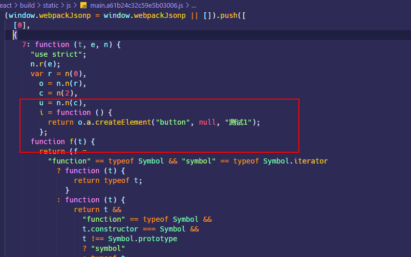

## include 和 exclude

在使用 loader 的时候通过`include`或者`exclude`属性传入必要的路径和文件，避免全局匹配，可以提升 webpack 构建的速度。

## tree shaking

tree shaking 是 webpack 里的术语，用于移除 JS 上下文中未引用过的`export`导出的代码或者移除未使用过的`import`引入的代码。需要注意的是 tree shaking 依赖于 ES6 的模块语法 —— `import`和`export`。

例如，在一个 module 中声明了两个函数组件，通过`import`的语法全部引入：

```jsx | pure
// Button/index.jsx
import React from 'react';

export const Button1 = () => {
  return <button>测试1</button>;
};

export const Button2 = () => {
  return <button>测试2</button>;
};
```

```jsx | pure
// src/index.jsx
import { Button1, Button2 } from '../Button/index.jsx';

export default class extends Component {
  render() {
    return <Button1 />;
  }
}
```

经过`yarn build`打包以后，最终生成的 main chunk 只会包含`Button1`组件的代码，因为只有它在上下文中被用到了。



### optimization.providedExports

`optimization.usedExports`默认是`true`的。这个属性会指定 webpack 去收集模块都提供了哪些`export`的内容，从而为`export * from ...`这种语法生成更有效的代码。`export * from ...`通常用于重定向导出，也就是在当前模块导出另一个模块的所有代码，通过`providedExports`收集其他模块到底导出了哪些内容，就可以在`export * from ...`的基础上导出具体的模块，方便 tree shaking。

### optimization.usedExports

`optimization.usedExports`默认是`true`的，不过也取决于`optimization.usedExports`是否为`true`。这个属性会指定 webpack 去收集哪些`export`或者`import`的内容在上下文中有用到，而哪些没用到。这些信息可以被 tree shaking 使用，也可以被代码压缩和优化工具使用，方便它们清理未使用过的代码。

### sideEffects

tree shaking 是 webpack 内置的优化功能，`"sideEffects"` 属性标记代码是否具有 side effect，对于标记了`"sideEffects":false`的代码，就会通过 tree shaking 删除掉未用到过的`export`的代码。`"sideEffects"`可以通过三种方式来标记：

- 通过`package.json` 的 `"sideEffects"`属性
- 通过`module.rule.sideEffects`属性，这个属性默认是`true`
- 通过`optimization.sideEffects`属性
