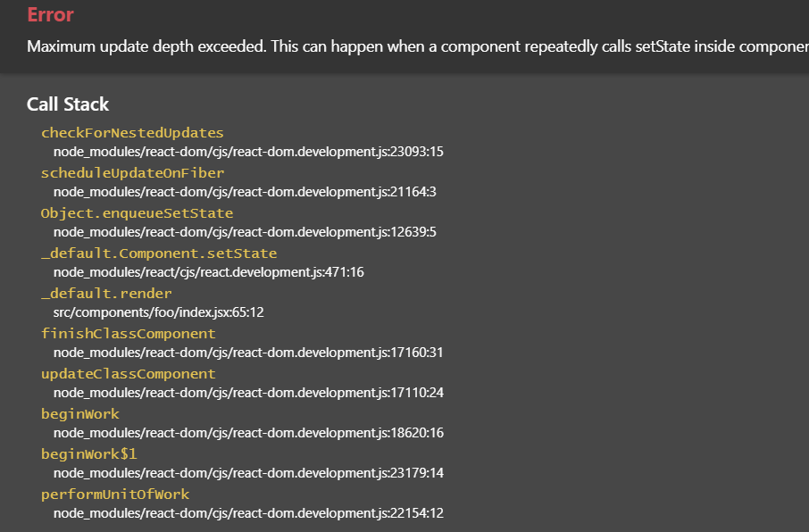
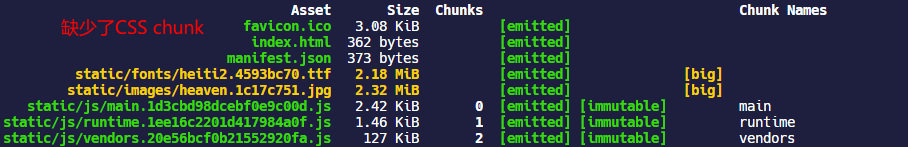

## include 和 exclude

在使用 loader 的时候通过`include`或者`exclude`属性传入必要的路径和文件，避免全局匹配，可以提升 webpack 构建的速度。

## tree shaking

tree shaking 这个词，我觉得很有意思，图源自 —— [掘金 - Tree-Shaking 性能优化实践](https://juejin.im/post/6844903544756109319)


tree shaking 是 webpack 里的术语，用于移除 JS 上下文中未引用过的`export`导出的代码或者移除未使用过的`import`引入的代码。需要注意的是 tree shaking 依赖于 ES6 的模块语法 —— `import`和`export`。

例如，在一个 module 中声明了两个函数组件，通过`import`的语法全部引入：

```jsx | pure
// Button/index.jsx
import React from 'react';

export const Button1 = () => {
  return <button>测试1</button>;
};

export const Button2 = () => {
  return <button>测试2</button>;
};
```

```jsx | pure
// src/index.jsx
import { Button1, Button2 } from '../Button/index.jsx';

export default class extends Component {
  render() {
    return <Button1 />;
  }
}
```

经过`yarn build`打包以后，最终生成的 main chunk 只会包含`Button1`组件的代码，因为只有它在上下文中被用到了。


### optimization.providedExports

`optimization.providedExports`默认是`true`的。这个属性会指定 webpack 去收集模块都`export`哪些内容，可以为`export * from ...`这种语法生成更有效的代码。`export * from ...`通常用于重定向导出，也就是在当前模块导出另一个模块的所有代码，通过`providedExports`收集其他模块到底导出了哪些内容，就可以在`export * from ...`的基础上导出具体的模块，方便 tree shaking。

### optimization.usedExports

`optimization.usedExports`默认是`true`的，不过也取决于`optimization.providedExports`是否为`true`。这个属性会指定 webpack 去收集哪些`export`或者`import`的内容在上下文中有用到，而哪些没用到。这些信息可以被 tree shaking 使用，也可以被代码压缩和优化工具使用，方便它们清理未使用过的代码。

`usedExports` 依赖于 [terser](https://github.com/terser-js/terser) （terser 是一个 JS 的高版本 ES6+的解析器，同时也提供压缩优化 JS 代码的功能）去检测语句中的副作用，它不能做到像下文的`sideEffects`标记那样直接标记一个模块被 tree shaking，同时它可能在 React 高阶组件中会发生问题，有时候可以看到在函数调用前标有`/*#__PURE__*/`这样的注释，它会告诉 terser 后面的函数是没有 side effect 的，可以通过 tree shaking 干掉。

### sideEffects

side effect 是计算机领域的一个术语 —— [副作用 (计算机科学)](<https://zh.wikipedia.org/wiki/%E5%89%AF%E4%BD%9C%E7%94%A8_(%E8%AE%A1%E7%AE%97%E6%9C%BA%E7%A7%91%E5%AD%A6)>)。函数副作用指的是调用函数的时候，其内部除了返回函数值，还对外界的全局变量等产生了影响。例如：

```javascript
let fruits = ['apple', 'orange', 'pear'];

const addFruit = function(fruit) {
  fruits.push(fruit); // 修改全局变量
};

addFruit('banana');
```

React 的`React.Component`的`render`方法就应该是纯函数，它只负责根据`state`或者`props`来更新组件，一个规范就是`render`方法内部不应该产生对`state`的更改，这种情况往往不容易控制，因为`render`方法会在`state`修改以后去调用，如果内部再去修改`state`，这种情况很可能会造成死循环。

```jsx | pure
export default class extends Component {
  state = {
    value: 1,
  };

  render() {
    this.setState({
      value: this.state.value++,
    });

    return <div>{this.state.value}</div>;
  }
}
```



tree shaking 是 webpack 内置的优化功能，`sideEffects`属性标记代码是否具有 side effect，对于标记了`sideEffects:false`的代码，就会通过 tree shaking 在打包时就会忽略掉未用到过的`export`的代码。`"sideEffects"`可以通过三种方式来标记：

- 通过`package.json` 的 `sideEffects`属性，可以是`Boolean`或者一个`Array`
- 通过`module.rule.sideEffects`属性，这个属性默认是`true`，表示该 loader 解析类型的模块不应该被 tree shaking
- 通过`optimization.sideEffects`属性，这个属性需要配合`package.json` 的 `sideEffects`来使用，指定 webpack 在打包的时候忽略那些`export`没有被任何其他模块用到，且本身被标记为`sideEffects:false`的模块。。`optimization.sideEffects`默认启用，不过也取决于`optimization.providedExports`是否启用；其会对打包时间有一定的损耗，但是通过 tree shaking 干掉没用的模块可以可观的减少代码体积，带来网页性能上的提升。

首先来看一下`package.json` 的 `sideEffects`属性，这个属性可以全局设为`false`，也就是全局模块默认可以通过 tree shaking 来干掉没用的代码。

> Note：如果全局设为`false`，这种情况可能会对 CSS 造成影响，例如下面这种单纯的使用 CSS 的语法，CSS 在打包的时候就会被干掉

```javascript
import './styles.css';
```



要解决其它类型的模块是否受影响，可以在`package.json` 的 `sideEffects`为其指定一个数组，支持相对路径、绝对路径传入模块路径和 [glob 模式](<https://en.wikipedia.org/wiki/Glob_(programming)>)匹配相关文件（glob 模式也就类似于 gitignore 那种形式，使用通配符例如`*`来匹配文件名）例如：

```json
// package.json
{
  "sideEffects": [
    "*.css", //表明css文件是有副作用的，这样tree shaking就会跳过css文件
    "*.less" //表明less文件是有副作用的
  ]
}
```

同时也可以通过`module.rule.sideEffects`属性，指定当前 loader 解析的模块类型具有副作用，tree shaing 需要跳过它，经过测试，这个优先级要高于`package.json` 的 `sideEffects`。

```javascript
module.exports = {
  module: {
    rules: [
      {
        test: /\.css$/i,
        use: [
          isDevelopment && {
            loader: 'style-loader',
          },
          isProduction && {
            loader: MiniCssExtractPlugin.loader,
            options: {
              publicPath: '../../',
              esModule: true,
            },
          },
          {
            loader: 'css-loader',
            options: {
              modules: {
                localIdentName: isDevelopment
                  ? '[path][name]__[local]'
                  : '[hash:base64]',
              },
            },
          },
        ].filter(Boolean),
        sideEffects: true, //指定当前css具有side effect
      },
    ],
  },
};
```

### 如何使用 tree shaking

- tree shaking 功能是 webpack 默认在生产环境下提供的，但是由于 tree shaking 依赖 ES6 的模块语法，所以首先考虑在代码中使用`import`和`export`
- 禁用`@babel/preset-env`的编译，babel 编译器默认上来说会将 ES6 模块语法转换成 CommonJS 的形式，这种行为不利于 tree shaking，如果希望 tree shaking 更好的工作，可以禁用 babel 对该语法的编译。

```javascript
module.exports = {
  module: {
    rules: [
      {
        test: /\.m?jsx?$/,
        exclude: /(node_modules)/,
        use: {
          loader: 'babel-loader',
          options: {
            presets: [
              [
                '@babel/preset-env',
                {
                  modules: false,
                },
              ],
              ['@babel/preset-react'],
            ],
          },
        },
      },
    ],
  },
};
```

- 指定`optimization.providedExports:true`，`optimization.usedExports:true`以及指定`package.json` 的 `sideEffects`属性，可能还需要配合指定`module.rule.sideEffects`属性
- 同时也可以在纯函数调用前指定`/*#__PURE__*/`的注释，例如 babel 在编译 ES6 的`class`生成的 ES5 的代码时，就会为子类 IIFE 指定`/*#__PURE__*/`的注释

## 懒加载
