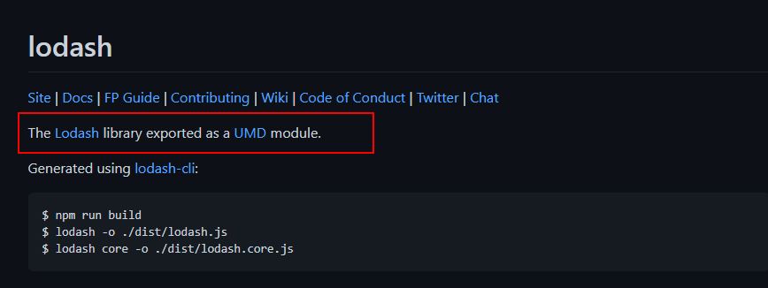
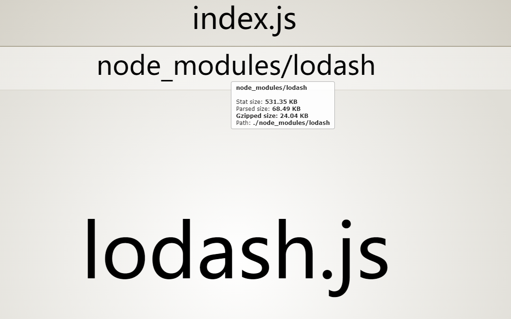
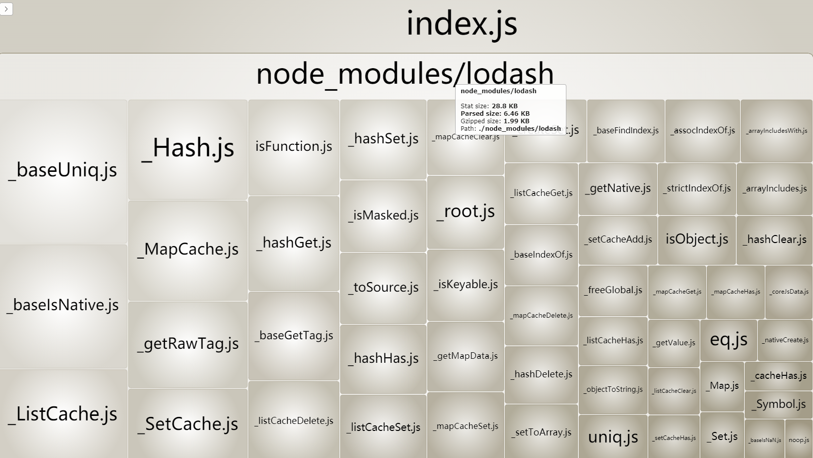
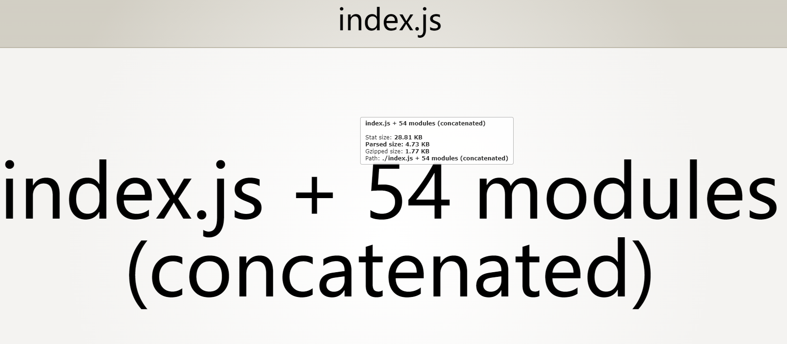

## 优化 lodash 打包

### lodash 为什么不能被 Tree Shaking

Tree Shaking 依赖 ES Modules 语法；`lodash`根本不支持 ES Modules。



### lodash 这种写法有用吗

我所见的最多的就是`lodash`下面这种写法

```javascript
import { uniq } from 'lodash';
```

下面来测试一下这种写法在使用`webpack`构建的时候有没有按需打包的效果。

新建一个项目，结构如下：

```
.
├─ index.js
├─ package.json
├─ webpack.config.js
```

`webpack`的配置也很简单，只使用了`webpack-bundle-analyzer`这个打包分析工具，方便查看最终生成的代码结构，配置如下：

```javascript
const path = require('path');
const BundleAnalyzerPlugin = require('webpack-bundle-analyzer')
  .BundleAnalyzerPlugin;

module.exports = function() {
  return {
    entry: path.resolve(__dirname, 'index.js'),
    mode: 'production',
    output: {
      filename: 'index.js',
    },
    plugins: [
      new BundleAnalyzerPlugin({
        analyzerMode: 'disabled',
        openAnalyzer: false,
        generateStatsFile: true,
        statsFilename: 'stats.json',
      }),
    ],
  };
};
```

`index.js`里我们使用一个`lodash`的函数，代码如下：

```javascript
import { uniq } from 'lodash';

function test() {
  return uniq([1, 2, 2, 2, 3, 4, 5, 5, 6]);
}

test();
```

执行`webpack`以后获得打包的分析依赖图如下所示，可以清楚地看到`lodash`被全部打包进来了



### 如何优化 lodash 的打包

优化`lodash`的打包结果，可以从以下方面进行

#### 修改 lodash 的使用语法

```javascript
import { uniq } from 'lodash';

// 改为一下导入方式
import uniq from 'lodash/uniq';
```

修改以后，打包体积立马就小了下来 😂



#### 使用 lodash-es

[`lodash-es`](https://www.npmjs.com/package/lodash-es)是`lodash`按照 ES Modules 暴露入口的 package，可以被`webpack`的 Tree Shaking 给优化。

```
yarn add lodash-es
```

```javascript
import { uniq } from 'lodash-es';

function test() {
  return uniq([1, 2, 2, 2, 3, 4, 5, 5, 6]);
}

test();
```

打包以后依赖图如下


