## tree shaking

tree shaking 这个词，我觉得很有意思，图源自 —— [掘金 - Tree-Shaking 性能优化实践](https://juejin.im/post/6844903544756109319)


tree shaking 是 webpack 里的术语，**用于移除 JS 上下文中未引用过的代码，以减小代码体积，间接减少代码在网络请求过程中的耗时**。需要注意的是 tree shaking 依赖于 ES6 的模块语法 —— `import`和`export`。

例如，在一个 module 中声明了两个函数组件，通过`import`的语法全部引入：

```jsx | pure
// Button/index.jsx
import React from 'react';

export const Button1 = () => {
  return <button>测试1</button>;
};

export const Button2 = () => {
  return <button>测试2</button>;
};
```

```jsx | pure
// src/index.jsx
import { Button1, Button2 } from '../Button/index.jsx';

export default class extends Component {
  render() {
    return <Button1 />;
  }
}
```

经过`yarn build`打包以后，最终生成的 main chunk 只会包含`Button1`组件的代码，因为只有它在上下文中被用到了。


### optimization.providedExports

`optimization.providedExports`默认是`true`的。这个属性会指定 webpack 去收集模块都`export`哪些内容，可以为`export * from ...`这种语法生成更有效的代码。`export * from ...`通常用于重定向导出，也就是在当前模块导出另一个模块的所有代码，通过`providedExports`收集其他模块到底导出了哪些内容，就可以在`export * from ...`的基础上导出具体的模块，方便 tree shaking。

### optimization.usedExports

`optimization.usedExports`默认是`true`的，不过也取决于`optimization.providedExports`是否为`true`。这个属性会指定 webpack 去收集哪些`export`或者`import`的内容在上下文中有用到，而哪些没用到。这些信息可以被 tree shaking 使用，也可以被代码压缩和优化工具使用，方便它们清理未使用过的代码。

`usedExports` 依赖于 [terser](https://github.com/terser-js/terser) （terser 是一个 JS 的高版本 ES6+的解析器，同时也提供压缩优化 JS 代码的功能）去检测语句中的副作用，它不能做到像下文的`sideEffects`标记那样直接标记一个模块被 tree shaking，同时它可能在 React 高阶组件中会发生问题，有时候可以看到在函数调用前标有`/*#__PURE__*/`这样的注释，它会告诉 terser 后面的函数是没有 side effect 的，可以通过 tree shaking 干掉。

下面测试一下，`/*#__PURE__*/`对于函数调用的影响，新建一个`test.js`文件，写入下面的代码，并修改 webpack 的`entry`，指向`test.js`文件；

在正常情况下，下面的代码会按顺序执行，最终在控制台打印出 2，3，打包的结果也很简单，如下图所示

```javascript
let a = 1;

function func() {
  a = 2;
  console.log(a);
}
func();

function test() {
  a = 3;
  console.log(a);
}
test();

// 2,3
```

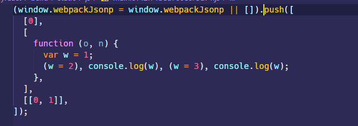

现在修改`func()`的调用，在前面加上`/*#__PURE__*/`注释，最终在控制台只会打印出 3，打包结果如下图所示，可以看到，尽管

`func`函数修改了全局变量，但是`/*#__PURE__*/`注释让 webpack 以为这个`func`是没有 side effect 的，我也不管你改没改全局变量，直接在打包的时候给干掉；

而如果在`test`里面调用`func()`，那么结果也是一样的，不管其它地方用没用到你，也是直接干掉。

```javascript
let a = 1;

function func() {
  a = 2;
  console.log(a);
}
/*#__PURE__*/ func();

function test() {
  a = 3;
  console.log(a);
}
test();
```

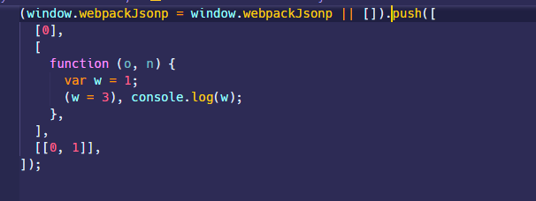

### sideEffects

side effect 是计算机领域的一个术语 —— [副作用 (计算机科学)](<https://zh.wikipedia.org/wiki/%E5%89%AF%E4%BD%9C%E7%94%A8_(%E8%AE%A1%E7%AE%97%E6%9C%BA%E7%A7%91%E5%AD%A6)>)。函数副作用指的是调用函数的时候，其内部除了返回函数值，还对外界的全局变量等产生了影响。例如：

```javascript
let fruits = ['apple', 'orange', 'pear'];

const addFruit = function(fruit) {
  fruits.push(fruit); // 修改全局变量
};

addFruit('banana');
```

React 的`React.Component`的`render`方法就应该是纯函数，它只负责根据`state`或者`props`来更新组件，一个规范就是`render`方法内部不应该产生对`state`的更改，这种情况往往不容易控制，因为`render`方法会在`state`修改以后去调用，如果内部再去修改`state`，这种情况很可能会造成死循环。

```jsx | pure
export default class extends Component {
  state = {
    value: 1,
  };

  render() {
    this.setState({
      value: this.state.value++,
    });

    return <div>{this.state.value}</div>;
  }
}
```


tree shaking 是 webpack 内置的优化功能，`sideEffects`属性标记代码是否具有 side effect，对于标记了`sideEffects:false`的代码，就会通过 tree shaking 在打包时就会忽略掉未用到过的`export`的代码。`"sideEffects"`可以通过三种方式来标记：

- 通过`package.json` 的 `sideEffects`属性，可以是`Boolean`或者一个`Array`
- 通过`module.rule.sideEffects`属性，这个属性默认是`true`，表示该 loader 解析类型的模块不应该被 tree shaking
- 通过`optimization.sideEffects`属性，这个属性需要配合`package.json` 的 `sideEffects`来使用，指定 webpack 在打包的时候忽略那些`export`没有被任何其他模块用到，且本身被标记为`sideEffects:false`的模块。。`optimization.sideEffects`默认启用，不过也取决于`optimization.providedExports`是否启用；其会对打包时间有一定的损耗，但是通过 tree shaking 干掉没用的模块可以可观的减少代码体积，带来网页性能上的提升。

首先来看一下`package.json` 的 `sideEffects`属性，这个属性可以全局设为`false`，也就是全局模块默认可以通过 tree shaking 来干掉没用的代码。

> Note：如果全局设为`false`，这种情况可能会对 CSS 造成影响，例如下面这种单纯的使用 CSS 的语法，CSS 在打包的时候就会被干掉

```javascript
import './styles.css';
```


要解决其它类型的模块是否受影响，可以在`package.json` 的 `sideEffects`为其指定一个数组，支持相对路径、绝对路径传入模块路径和 [glob 模式](<https://en.wikipedia.org/wiki/Glob_(programming)>)匹配相关文件（glob 模式也就类似于 gitignore 那种形式，使用通配符例如`*`来匹配文件名）例如：

```json
// package.json
{
  "sideEffects": [
    "*.css", //表明css文件是有副作用的，这样tree shaking就会跳过css文件
    "*.less" //表明less文件是有副作用的
  ]
}
```

同时也可以通过`module.rule.sideEffects`属性，指定当前 loader 解析的模块类型具有副作用，tree shaing 需要跳过它，经过测试，这个优先级要高于`package.json` 的 `sideEffects`。

```javascript
module.exports = {
  module: {
    rules: [
      {
        test: /\.css$/i,
        use: [
          isDevelopment && {
            loader: 'style-loader',
          },
          isProduction && {
            loader: MiniCssExtractPlugin.loader,
            options: {
              publicPath: '../../',
              esModule: true,
            },
          },
          {
            loader: 'css-loader',
            options: {
              modules: {
                localIdentName: isDevelopment
                  ? '[path][name]__[local]'
                  : '[hash:base64]',
              },
            },
          },
        ].filter(Boolean),
        sideEffects: true, //指定当前css具有side effect
      },
    ],
  },
};
```

### 如何使用 tree shaking

- tree shaking 功能是 webpack 默认在生产环境下提供的，但是由于 tree shaking 依赖 ES6 的模块语法，所以首先考虑在代码中使用`import`和`export`
- 禁用`@babel/preset-env`的编译，babel 编译器默认上来说会将 ES6 模块语法转换成 CommonJS 的形式，这种行为不利于 tree shaking，如果希望 tree shaking 更好的工作，可以禁用 babel 对该语法的编译。

```javascript
module.exports = {
  module: {
    rules: [
      {
        test: /\.m?jsx?$/,
        exclude: /(node_modules)/,
        use: {
          loader: 'babel-loader',
          options: {
            presets: [
              [
                '@babel/preset-env',
                {
                  modules: false,
                },
              ],
              ['@babel/preset-react'],
            ],
          },
        },
      },
    ],
  },
};
```

- 指定`optimization.providedExports:true`，`optimization.usedExports:true`以及指定`package.json` 的 `sideEffects`属性，可能还需要配合指定`module.rule.sideEffects`属性

## optimization

`optimization`这个配置项内部的很多优化策略都是在生产环境默认开启的，启用这些规则从一定程序上来讲可以显著减少 bundle 体积，优化代码生成，帮助长期缓存等。

### optimization.minimize

`optimization.minimize`指定 webpack 默认使用 [`terser-webpack-plugin`](https://github.com/webpack-contrib/terser-webpack-plugin) 来压缩 JS 代码，或者使用其它在`optimization.minimizer`定义的插件。在生产环境下，这个配置项默认是`true`。

### optimization.minimizer

`optimization.minimizer`指定一个插件数组，其中包含使用的插件配置项。

例如可以单独指定一个针对`terser-webpack-plugin`的配置项：

```javascript
const TerserPlugin = require('terser-webpack-plugin');

module.exports = {
  optimization: {
    minimizer: [
      new TerserPlugin({
        //... Terser options
      }),
    ],
  },
};
```

也可以使用其它插件，之前我们是在`plugin`中配置压缩 CSS 的插件`optimize-css-assets-webpack-plugin`，现在可以把它挪出来放在这里去处理

```javascript
const TerserPlugin = require('terser-webpack-plugin'); //压缩JS代码
const OptimizeCssAssetsPlugin = require('optimize-css-assets-webpack-plugin'); //压缩CSS代码

module.exports = {
  optimization: {
    minimizer: [
      new TerserPlugin(),
      new OptimizeCssAssetsPlugin({
        assetNameRegExp: /\.css$/g,
        cssProcessor: require('cssnano'),
        cssProcessorPluginOptions: {
          preset: ['default', { discardComments: { removeAll: true } }],
        },
        canPrint: true,
      }),
    ],
  },
};
```

### optimization.noEmitOnErrors

`optimization.noEmitOnErrors`配置项默认是`false`。

在开发环境下，当 webpack 打包遇到程序错误时，会显示错误的堆栈信息，例如：

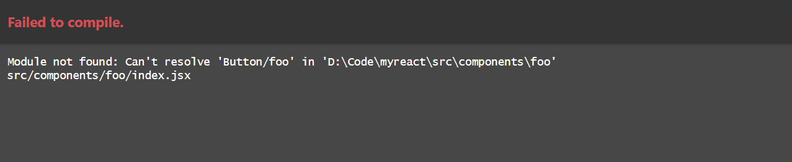

在生产环境下打包，当 webpack 打包遇到程序错误时，仍然会继续执行打包，在控制台会输出错误信息

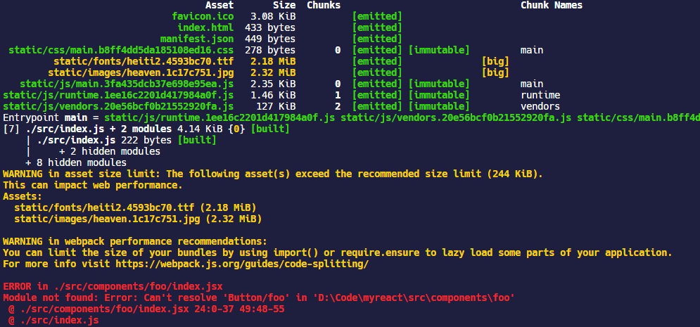

如果设置`noEmitOnErrors:true`，在开发环境下，当 webpack 打包遇到程序错误时，不会显示错误信息，而是显示当前项目目录的信息

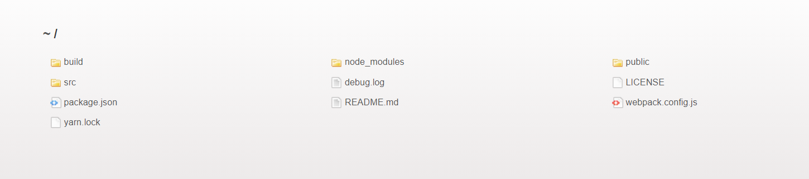

在生产环境下，打包程序遇到错误不会继续执行，会在控制台输出错误信息，也就是最终不会生成任何打包文件。

### optimization.namedModules

在开发环境下默认是`true`，生产环境下会禁用。

webpack 在打包的时候会为每一个模块按照解析顺序分配一个整数 id，如果将`optimization.namedModules`设为`false`，那么打包生成的 bundle 内部使用的模块也会使用 id 来作为键名，这样不便于阅读。

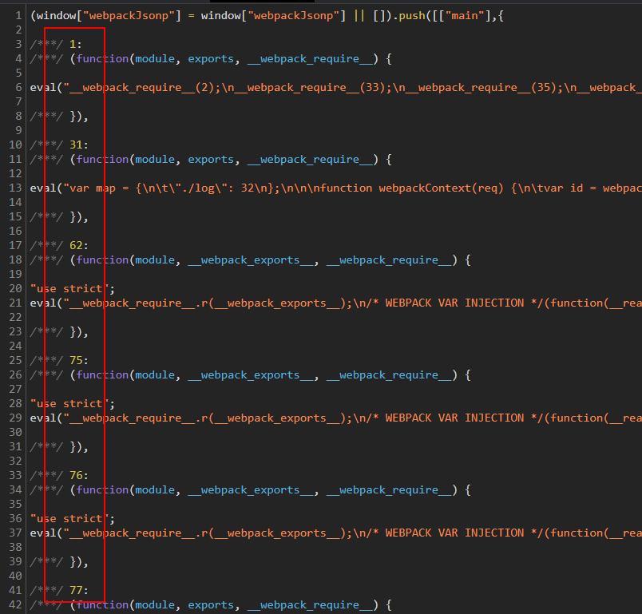

如果将`optimization.namedModules`设为`true`，打包的模块键名将是模块的路径

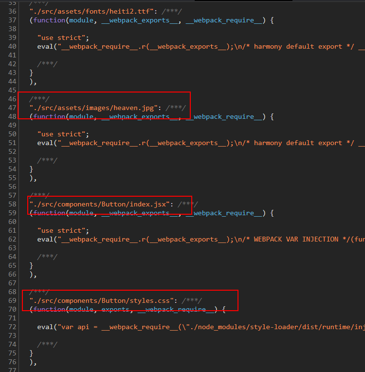

### optimization.moduleIds

指定 webpack 生成模块 id 的时候使用什么算法，webpack 官网的团队也不知多久没更新了，目前这个配置项支持的值如下：

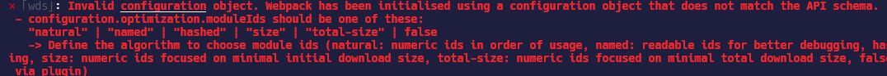

- `natural`：默认值，也就是按模块顺序解析的整数 id
- `named`：根据模块的路径作为模块 id
- `hashed`：根据 hash 算法生成`4`个字符的模块 id

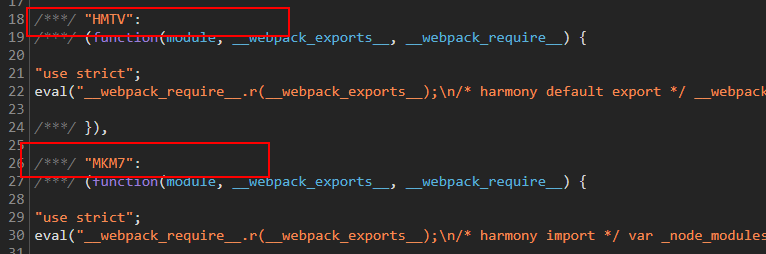

- `size`：也是整数 id，貌似和模块大小有关
- `deterministic`：deterministic 翻译过来是确定的意思，当 `optimization.moduleIds` 被设置成 `deterministic`，至少使用 3 位数字 Id 来标识 module；相比`hashed`来说，可以让 bundle 的数据量更小，并且有益于长期缓存。

- `total-size`和`hashed`在 webpack 5 都会被弃用。

### optimization.namedChunks

在开发环境下默认是`true`，生产环境下会禁用。

使用 code splitting 拆分出 chunk 的时候，webpack 默认会为其指定整数 id 作为名称，例如`1.bundle.js`等

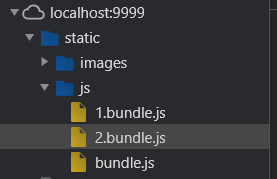

而当`optimization.namedChunks`为`true`时，则会使用`optimization.splitChunks.name`指定的 chunk 名称。

```javascript
module.exports = {
  optimization: {
    runtimeChunk: "single",
    splitChunks: {
      cacheGroups: {
        vendor: {
          test: /[\\/]node_modules[\\/]/,
          name: "vendors_node",
          chunks: "all",
        },
      },
    },
  }
```

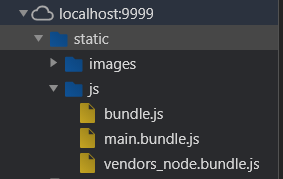

### optimization.chunkIds

指定 webpack 生成 chunk id 时的算法。

| Option            | Description                                                             |
| :---------------- | :---------------------------------------------------------------------- |
| `'natural'`       | 按使用顺序的数字 Id                                                     |
| `'named'`         | 可读的 Id                                                               |
| `'deterministic'` | 至少使用 3 位数字 Id 标识 chunk，在编译时候不会发生改变，有益于长期缓存 |
| `'size'`          | Numeric ids focused on minimal initial download size.                   |
| `'total-size'`    | numeric ids focused on minimal total download size.                     |

- 如果`optimization.occurrenceOrder`是`true`，那么`optimization.chunkIds`默认就是`total-size`；
- 如果`optimization.namedChunks`是`true`，那么`optimization.chunkIds`默认就是`named`；

- 如果是开发环境，`optimization.chunkIds`默认就是`named`；生产环境默认是`deterministic`

- 如果上述条件都不满足，`optimization.chunkIds`默认就是`natural`

### 其它：

- `removeAvailableModules` ：如果模块已经包含在所有父级模块中，告知 webpack 从 chunk 中检测出这些模块，或移除这些模块；
- `removeEmptyChunks`：如果 chunk 为空，告知 webpack 检测或移除这些 chunk；

- `mergeDuplicateChunks`：告知 webpack 合并含有相同模块的 chunk
- `flagIncludedChunks`：告知 webpack 确定和标记出作为其他 chunk 子集的那些 chunk，在已经加载过较大的 chunk 之后，就不再去加载这些 chunk 子集

- `occurrenceOrder`：告诉 webpack 找出模块的顺序，以减小 initial bundle 的体积

- `concatenateModules`：指定 webpack 去寻找模块依赖图中的片段，将它们安全地合并，取决于启用了`optimization.providedExports:true`，`optimization.usedExports:true`
