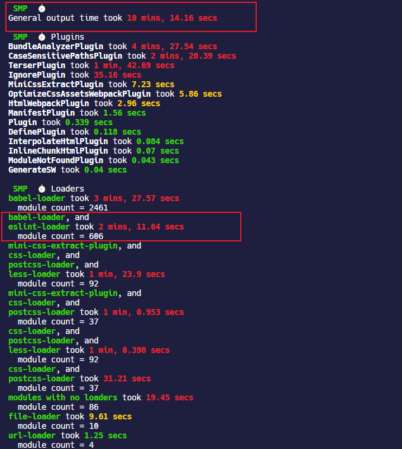
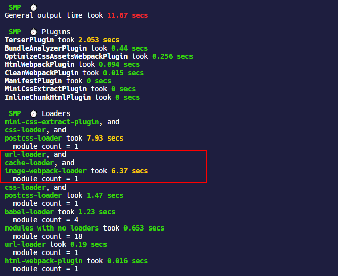
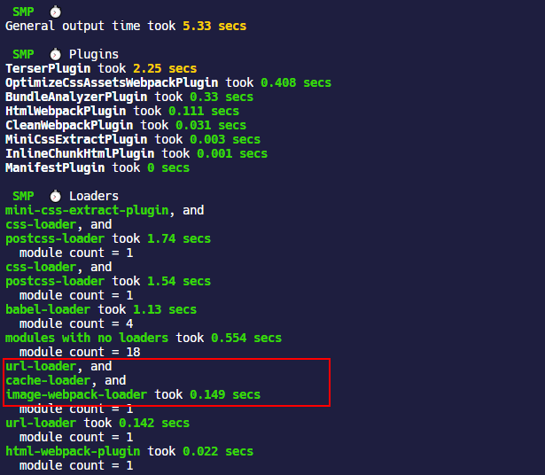
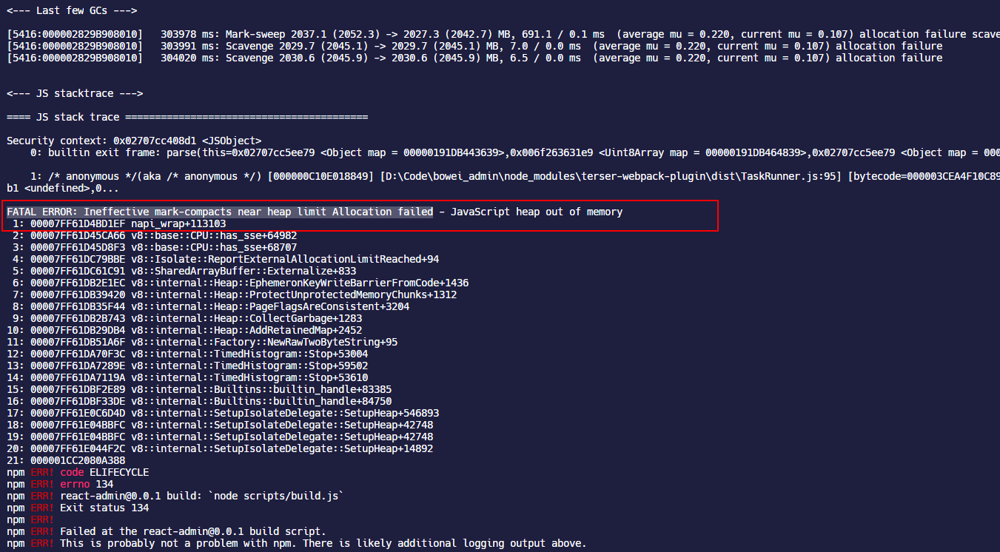
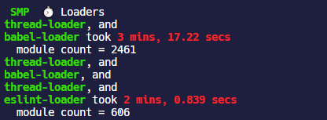

> Note：webpack 文档提供了一些优化构建性能的建议 —— [webpack - 构建性能](https://webpack.docschina.org/guides/build-performance/)，对于一些小型项目来说，这些建议很有用！

## 优化模块解析规则

### rule.include 和 rule.exclude

在使用 loader 的时候通过`include`或者`exclude`属性传入必要的路径和文件，避免全局匹配，可以提升 webpack 构建的速度。

例如`babel-loader`忽略`node_modules`内部的模块

```javascript
module.exports = {
  module: {
    rules: [
      {
        test: /\.m?jsx?$/,
        exclude: /(node_modules)/, //剔除node_modules
        loader: 'babel-loader',
        options: {
          presets: [
            [
              '@babel/preset-env',
              {
                modules: false,
              },
            ],
            ['@babel/preset-react'],
          ],
          plugins: [
            '@babel/plugin-proposal-class-properties',
            isDevelopment && require.resolve('react-refresh/babel'),
          ].filter(Boolean),
        },
      },
    ],
  },
};
```

在匹配图片文件的时候，指定具体的文件夹：

```javascript
module.exports = {
  module: {
    rules: [
      {
        test: [/\.bmp$/, /\.gif$/, /\.jpe?g$/, /\.png$/, /\.svg$/i],
        include: path.resolve(__dirname, 'src/assets/images'), //仅包含图片文件夹
        use: [
          {
            loader: 'url-loader',
            options: {
              limit: 10 * 1024,
              name: 'static/images/[name].[contenthash:8].[ext]',
            },
          },
          {
            loader: 'image-webpack-loader',
            options: {
              disable: isDevelopment,
            },
          },
        ],
      },
    ],
  },
};
```

### resolve.modules

`resolve.modules`指定 webpack 解析模块时应该搜索的目录，默认是`['node_modules']`，也就是 webpack 会首先查找项目根目录的`node_modules`文件夹去寻找模块，如果找不到就往上一级目录 `../node_modules` 中去找，实际上这种查找是不需要的，毕竟项目一般也不会使用层层嵌套的结构。

可以通过`path.resolve`来构造绝对路径值，这样就只会在给定目录中查找模块了。并且，有时候这个配置比`alias`还简洁，比方说对于项目中封装通用业务组件库位于`src/components`下面，然后通过`resolve.modules`配置模块解析规则如下

```javascript
module.exports = {
  resolve: {
    modules: [
      path.resolve(__dirname, './src/components'),
      path.resolve(__dirname, 'node_modules'),
    ],
  },
};
```

这时候在编写页面的时候，如果`import`一个`src/components`下里面的组件，就不用带任何路径前缀直接写文件夹就行了，nice！不过这时候的弊端就是如果你的组件和第三方库的组件同名，就会把第三方库的组件覆盖掉了。

```javascript
import { Button } from 'Button/index.jsx';
```

这个配置加上上文提到的`rule.resolve.extensions`，结合在一起就是神器，对于`src/components`的组件，例如`src/components/Button`，直接一句话就搞定，webpack 会自动查找`src/components/Button`文件夹下的`index`文件。

```javascript
import { Button } from 'Button';
```

### resolve.symlinks

在开发若干个有相互依赖关系的库的时候，通常都会采用 symlink 的方式互相引用。对于单个项目来说，直接将`resolve.symlinks`禁用比较好。

```javascript
module.exports = {
  resolve: {
    symlinks: false,
  },
};
```

### module.noParse

`module.noParse`指定一个字符串或者正则表达式，对于匹配的模块名，webpack 不会去解析它们。这在忽略一些大型库时，可以提高构建性能。

```javascript
module.exports = {
  module: {
    noParse: /jquery|lodash/,
  },
};
```

## 利用缓存

合理利用缓存可以加快 webpack 二次构建的速度，尽管在首次使用这些 loader 或者 plugin 的时候耗时可能会很长，但是后续执行可能会带来飞速提升。

### 优化 babel-loader

`babel-loader`是最主要的 loader，它需要处理大量的 JS，JSX 等涉及 JS 的模块，可以通过其内置的缓存配置来缓存其执行结果。

`babel-loader`支持以下有关缓存的配置项：

- `cacheDirectory`：默认是`false`，当设置成`true`以后，`babel-loader`会使用默认的缓存目录 `node_modules/.cache/babel-loader`缓存 loader 的执行结果，在以后的 webpack 打包的时候，将会尝试读取缓存，来避免每次都重新编译
- `cacheIdentifier`：用来指定缓存的标识符，默认是由 `@babel/core` 版本号，`babel-loader` 版本号，`.babelrc` 文件内容（存在的情况下），环境变量 `BABEL_ENV` 的值（没有时降级到 `NODE_ENV`）组成的一个字符串，通过改变`cacheIdentifier`来使缓存失效
- `cacheCompression`：默认是`true`，会使用 Gzip 压缩每个 Babel 编译的结果

```javascript
module.exports = {
  module: {
    rules: [
      {
        test: /\.m?jsx?$/,
        loader: 'babel-loader',
        options: {
          //...
          cacheDirectory: true,
        },
      },
    ],
  },
};
```

### 优化 eslint-loader

如果项目在使用`eslint-loader`，一定要使用`exclude`忽略`node_modules`文件夹，并开启`cache:true`缓存项，因为`eslint-loader`检查代码真的超级耗时间！

过去的项目使用经验，大概是 10 分钟的打包时间，`eslint-loader`在不开启缓存的时候，占用了 **1/5** 的打包时间！



### cache-loader

[`cache-loader`](https://github.com/webpack-contrib/cache-loader)是一个 webpack loader，可以缓存 loader 的执行结果到本地磁盘文件夹中或者放在一个数据库中。但是本身来说，缓存到本地文件夹中涉及到 IO 操作，在 webpack 执行打包的过程中会带来更大的内存占用问题，所以，只在需要编译大量模块的 loader 中使用`cache-loader`。

- `babel-loader`：需要编译大量 JS 代码，但是上文说了，它默认带有缓存选项
- `css-loader`：可能会需要；其他类似的处理 CSS 预处理器的 loader 也可以使用
- `image-webpack-loader`：压缩图片的 loader，这个耗时比较多，可以考虑缓存其执行结果

#### 配置项

`cache-loader`虽然已经接近一年没有更新过了，但是它是 webpack 团队维护的，所以还是值得信赖的。

| 配置项                | 类型                                             | 默认值                                                  | 含义                                                                                                                          |
| --------------------- | ------------------------------------------------ | ------------------------------------------------------- | ----------------------------------------------------------------------------------------------------------------------------- |
| **`cacheContext`**    | `{String}`                                       | `undefined`                                             | 相对于设置的路径生成缓存                                                                                                      |
| **`cacheKey`**        | `{Function(options, request) -> {String}}`       | `undefined`                                             | 重写生成缓存项的键的函数                                                                                                      |
| **`cacheDirectory`**  | `{String}`                                       | `findCacheDir({ name: 'cache-loader' }) or os.tmpdir()` | 设置缓存写入和读取的目录                                                                                                      |
| **`cacheIdentifier`** | `{String}`                                       | `cache-loader:{version} {process.env.NODE_ENV}`         | 设置一个用于生成 hash 的标识符                                                                                                |
| **`compare`**         | `{Function(stats, dep) -> {Boolean}}`            | `undefined`                                             | 修改缓存比较的函数，如果返回`true`就表示使用缓存而不是去执行 loader 生成新资源                                                |
| **`precision`**       | `{Number}`                                       | `0`                                                     | Round `mtime` by this number of milliseconds both for `stats` and `dep` before passing those params to the comparing function |
| **`read`**            | `{Function(cacheKey, callback) -> {void}}`       | `undefined`                                             | 使用函数生成一个新的内容来覆盖缓存的内容                                                                                      |
| **`readOnly`**        | `{Boolean}`                                      | `false`                                                 | 如果不希望更新缓存，只是读取它可以将这个配置项设为`true`                                                                      |
| **`write`**           | `{Function(cacheKey, data, callback) -> {void}}` | `undefined`                                             | 使用函数生成新资源来替换缓存内容                                                                                              |

#### 使用

```shell
yarn add cache-loader -D
```

使用的时候在耗时长的 loader 前面添加`cache-loader`就可以了，至于如何分析 loader 的执行时间，可以借助`speed-measure-webpack-plugin`这个工具。

下面是我在`image-webpack-loader`这个负责压缩图片的 loader 前添加的配置，**一定要注意在`image-webpack-loader`前引入`cache-loader`**，我现在还不明白`cache-loader`到底什么原理，我测试是在`url-loader`前使用`cache-loader`打包会丢失图片。

```javascript
module.exports = {
  module: {
    rules: [
      {
        test: [/\.bmp$/, /\.gif$/, /\.jpe?g$/, /\.png$/, /\.svg$/i],
        include: path.resolve(__dirname, 'src/assets/images'),
        use: [
          {
            loader: 'url-loader',
            options: {
              limit: 10 * 1024, //10KB
              name: 'static/images/[name].[contenthash:8].[ext]',
            },
          },
          'cache-loader', //引入cache-loader
          {
            loader: 'image-webpack-loader',
            options: {
              disable: isDevelopment, //开发环境下禁用压缩图片
            },
          },
        ],
      },
    ],
  },
};
```

在引入`cache-loader`前，我的页面中包含一张`7MB`左右的图片需要压缩，打包的耗时是这样的：



使用`cache-loader`打包一次后，再次打包，明显缩短了`image-webpack-loader`的处理时长。



## 多线程打包

### thread-loader

[`thread-loader`](https://github.com/webpack-contrib/thread-loader)是 webpack 团队提供的一个 webpack loader，如果正在使用[happypack](https://github.com/amireh/happypack)也建议迁移到`thread-loader`上来，happypack 已经不再维护了。

`thread-loader`利用的是 nodejs 的 [worker pool 机制](https://nodejs.org/zh-cn/docs/guides/dont-block-the-event-loop/)，或者叫 thread pool；当使用 node 启动 webpack 打包程序的时候，webpack 主程序会运行在事件循环的主线程上，还有 worker pool 负责处理高成本的任务。

#### 配置项

| 配置项               | 类型      | 含义                                                                                                   |
| -------------------- | --------- | ------------------------------------------------------------------------------------------------------ |
| `workers`            | `Number`  | 产生的 worker 的数量，默认是`cpu 核心数 - 1`                                                           |
| `workerParallelJobs` | `Number`  | 一个 worker 进程中并行执行工作的数量；默认是`20`                                                       |
| `workerNodeArgs`     | `Array`   | 额外的 node.js 参数，例如`['--max-old-space-size=1024']`                                               |
| `poolRespawn`        | `Boolean` | 允许重新开启一个死掉的 work 池；重新开启会减慢整个编译速度，并且开发环境应该设置为`false`              |
| `poolTimeout`        | `Number`  | 设置超过一定时间自动终止 worker，默认是`500ms`，可以设置为`Infinity`，这样会让 worker 一直处于活跃状态 |
| `poolParallelJobs`   | `Number`  | 池分配给 worker 的工作数量，默认是`200`，减少的话会降低效率但是会使分配更加合理                        |
| `name`               | `String`  | worker 池的名称，可用于创建具有其他相同选项的不同 worker pool                                          |

这个额外的 nodejs 参数，在 nodejs 文档中介绍的有，这个 CLI 参数是配置 V8 引擎在执行 JS 时候最大可以使用的系统内存的，单位是`MB`，默认值是`512MB`。在 nodejs 执行的时候，如果内存限制太小，V8 就不得不频繁执行 GC 来释放哪些用不到的变量占用的内存，当程序需要的内存太大时，有时候 V8 会直接终止程序执行。stack overflow 上有一个相关问题 —— [Node.js recommended “max-old-space-size”](https://stackoverflow.com/questions/48387040/node-js-recommended-max-old-space-size/48392705#48392705)。

webpack 打包程序也是一样，对于超出内存限制，打包程序会被终止。



解决这种问题的方法就是通过在`package.json`的 npm- script 中指定 CLI 参数，例如：

```shell
  "scripts": {
    "build": "node --max-old-space-size=8192 scripts/build.js"
  },
```

#### 使用

在其它 loader 的配置前面添加`thread-loader`，则它们将会在一个 worker pool 中运行。每个 worker 都是一个独立的 node.js 进程，开启 worker 本身会产生额外开销的，每一个 worker 都会产生大于`600ms`的延迟。

此外对使用线程池执行的 loader 也会有限制：

- loader 不能产生新的文件
- loader 不能使用自定义的 loader API
- loader 不能获取 webpack 的配置

```shell
yarn add thread-loader -D
```

```javascript
module.exports = {
  module: {
    rules: [
      {
        test: /\.js$/,
        include: path.resolve('src'),
        use: [
          'thread-loader',
          'babel-loader', //在babel-loader前使用
        ],
      },
    ],
  },
};
```

为了避免开启 worker 前耗时过长，可以预热 worker pool，例如对于要使用的 loader，提前将其加载到 node.js 模块高速缓存中。

```javascript
const threadLoader = require('thread-loader');

threadLoader.warmup(
  {
    // worker的配置项，可以是传递给loader的配置项
  },
  [
    // loader
    'babel-loader',
    'sass-loader',
  ],
);
```

经过我在`babel-loader`和`eslint-loader`前添加`thread-loader`并开启线程预热以后，确实让相关 loader 的执行时间减少了大概 10 几秒的样子，总体来说影响不是很明显。




## DllPlugin

DLL（Dynamic-link library，动态链接库）这个词来源于微软的打包技术。其实 DLL 有点类似于按需加载的意味，把一些共享的代码抽成 DLL，当可执行文件调用到 DLL 中的函数时，操作系统才会把 DLL 文件加载到内存中。
