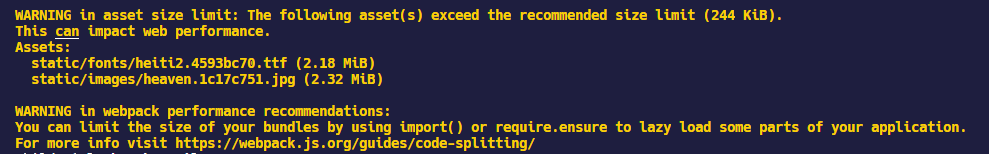
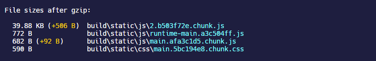
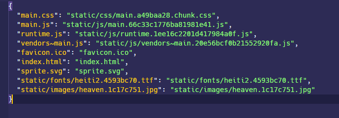
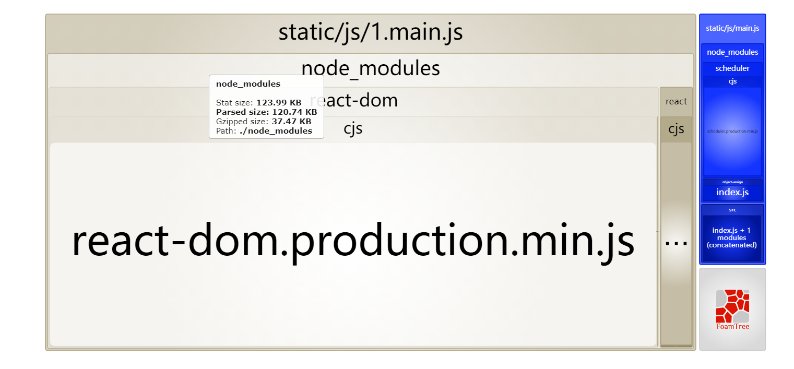

## stats

## performance

`performance`是 webpack 内置的负责进行打包性能评估的配置，它提示当前项目内部可能需要进行优化的点，将提示信息输出在控制台。例如，如果一个资源超过 250kb，webpack 会在打包的时候输出到控制台提示信息。



### performance.hints

`performance.hints`指定 webpack 是否在控制台打印性能提示信息，只有三个可选值：

- `warning`：仅作为提示
- `error`：把提示信息当成错误来输出

- `false`：禁用性能提示信息

### performance.maxEntrypointSize

`performance.maxEntrypointSize`配置入口文件的大小，默认是`250000`字节，当入口文件超过这个限制就会显示性能提示。

### performance.maxAssetSize

当 webpack 生成的 bundle 等文件超过`performance.maxAssetSize`指定的大小时，就会发出性能提示信息，默认是`250000`字节。

### performance.assetFilter

一个函数配置，接收 webpack 打包生成的文件名，然后根据规则指定使用哪些文件来计算性能提示。

## FileSizeReporter

CRA 内部是直接禁用了这个配置项，使用它们自己开发的[`FileSizeReporter`](https://github.com/facebook/create-react-app/tree/master/packages/react-dev-utils#filesizereporter)来进行性能评估。



应该可以通过`react-dev-utils`集成`FileSizeReporter` ，但是我还没找到这玩意怎么用的。

## webpack-manifest-plugin

[`webpack-manifest-plugin`](https://github.com/danethurber/webpack-manifest-plugin)可以根据项目打包生成一个保存所有模块到最终生成的 chunk，或者静态文件之间的映射关系的 JSON 文件。

```shell
yarn add webpack-manifest-plugin -D
```

```javascript
module.exports = {
  // ...
  plugins: [isProduction && new ManifestPlugin()],
};
```

生成的 JSON 文件如下图所示



## webpack-bundle-analyzer

[`webpack-bundle-analyzer`](https://github.com/webpack-contrib/webpack-bundle-analyzer)是一个 plugin 和 CLI 工具，它将 bundle 内容展示为一个便捷的、交互式、可缩放的树状图形式。

### 配置项

| Name                    | Type                                                                            | Description                                                                                                                                                                                                                                                                                                                                                                                                                             |
| ----------------------- | ------------------------------------------------------------------------------- | --------------------------------------------------------------------------------------------------------------------------------------------------------------------------------------------------------------------------------------------------------------------------------------------------------------------------------------------------------------------------------------------------------------------------------------- |
| **`analyzerMode`**      | 默认是`server`, 其它可选`static`, `json`, `disabled`                            | `server`模式会开启一个服务器展示打包结果；<br />`static`模式会生成一个 HTML 页面；<br />`json`模式会生成一个 JSON 文件；<br />`disabled`模式需要同时设置`generateStatsFile:true`，只会生成一个 JSON 文件                                                                                                                                                                                                                                |
| **`analyzerHost`**      | `{String}`                                                                      | Default: `127.0.0.1`. Host that will be used in `server` mode to start HTTP server.                                                                                                                                                                                                                                                                                                                                                     |
| **`analyzerPort`**      | `{Number}` or `auto`                                                            | Default: `8888`. Port that will be used in `server` mode to start HTTP server.                                                                                                                                                                                                                                                                                                                                                          |
| **`reportFilename`**    | `{String}`                                                                      | Default: `report.html`. Path to bundle report file that will be generated in `static` mode. It can be either an absolute path or a path relative to a bundle output directory (which is output.path in webpack config).                                                                                                                                                                                                                 |
| **`reportTitle`**       | `{String|function}`                                                             | Default: function that returns pretty printed current date and time. Content of the HTML `title` element; or a function of the form `() => string` that provides the content.                                                                                                                                                                                                                                                           |
| **`defaultSizes`**      | One of: `stat`, `parsed`, `gzip`                                                | Default: `parsed`. Module sizes to show in report by default. [Size definitions](https://github.com/webpack-contrib/webpack-bundle-analyzer#size-definitions) section describes what these values mean.                                                                                                                                                                                                                                 |
| **`openAnalyzer`**      | `{Boolean}`                                                                     | 默认是`true`，是否默认在浏览器打开打包结果页面                                                                                                                                                                                                                                                                                                                                                                                          |
| **`generateStatsFile`** | `{Boolean}`                                                                     | 默认是`false`，是否生成打包结果的 JSON 文件                                                                                                                                                                                                                                                                                                                                                                                             |
| **`statsFilename`**     | `{String}`                                                                      | 默认是`stats.json`，生成打包结果的 JSON 文件的文件名                                                                                                                                                                                                                                                                                                                                                                                    |
| **`statsOptions`**      | `null` or `{Object}`                                                            | Default: `null`. Options for `stats.toJson()` method. For example you can exclude sources of your modules from stats file with `source: false` option. [See more options here](https://webpack.js.org/configuration/stats/).                                                                                                                                                                                                            |
| **`excludeAssets`**     | `{null|pattern|pattern[]}` where `pattern` equals to `{String|RegExp|function}` | Default: `null`. Patterns that will be used to match against asset names to exclude them from the report. If pattern is a string it will be converted to RegExp via `new RegExp(str)`. If pattern is a function it should have the following signature `(assetName: string) => boolean` and should return `true` to _exclude_ matching asset. If multiple patterns are provided asset should match at least one of them to be excluded. |
| **`logLevel`**          | One of: `info`, `warn`, `error`, `silent`                                       | Default: `info`. Used to control how much details the plugin outputs.                                                                                                                                                                                                                                                                                                                                                                   |

### 使用

```shell
yarn add webpack-bundle-analyzer -D
```

下面的配置是让`webpack-bundle-analyzer`针对打包结果只生成一个 JSON 文件，然后使用其内置的 CLI 和 npm-script 结合的方式，在需要的时候使用命令行在浏览器打开显示打包结果的页面。

`analyzerMode: "disabled"`或者`analyzerMode: "json"`这个配置是需要的，如果不加这个配置项虽然打包结束不会自动打开浏览器页面，但是还是会开启一个 HTTP 服务，这样打包运行完，控制台终端还是处于运行状态，不会结束。

```javascript
module.exports = {
  ...
  plugins: [
    // 仅在生产环境打包时使用
    isProduction &&
      new BundleAnalyzerPlugin({
        analyzerMode: "disabled",			//或者设置成"json"
        openAnalyzer: false,
        generateStatsFile: true,
        statsFilename: "stats.json",
      }),
  ]
}
```

然后在`package.json`中配置打开[`webpack-bundle-analyzer`的 CLI 命令](https://github.com/webpack-contrib/webpack-bundle-analyzer#options-for-cli)

```json
"scripts": {
  "analyze": "webpack-bundle-analyzer --port 8888 ./build/stats.json"
}
```

然后执行`yarn analyze`就可以在默认浏览器打开生成的 JSON 文件，显示 bundle 分析树状图。



### 树状图怎么看

对于上面这张树状图，可以了解出以下信息：

- 打包过程生成了 2 个 bundle 文件，对应于图中最外层包裹的 bundle 文件名 —— `1.mian.js`和`main.js`
- `1.mian.js`中的模块全部来自`node_modules`，这对应于上文中我们说的 SplitChunksPlugin 的默认拆分，它将项目中所有从`node_modules`导入的以来单独打包成一个 chunk；除此之外还能层层深入分析 chunk 之间包含了其它哪些模块
- 在整个依赖图中，可以清楚的看到`react-dom.production.min.js`所占的体积最大，所以它占的图的面积最大
- 根据这个就能具体分析项目中具体哪个模块生成的代码需要进行拆分优化

## speed-measure-webpack-plugin

[`speed-measure-webpack-plugin`](https://github.com/stephencookdev/speed-measure-webpack-plugin)是一个分析 webpack 打包流程执行时间的插件。

```shell
yarn add speed-measure-webpack-plugin -D
```

```javascript
const SpeedMeasurePlugin = require('speed-measure-webpack-plugin'); //代码打包速度分析工具
const smp = new SpeedMeasurePlugin();

module.exports = function(env) {
  return smp.wrap({
    //...
  });
};
```

这样配置完了以后，就可以在执行`yarn start`或者`yarn build` 的时候在控制台显示出每一步执行 webpack 的 loader 或者 plugin 所耗费的时间，例如：


