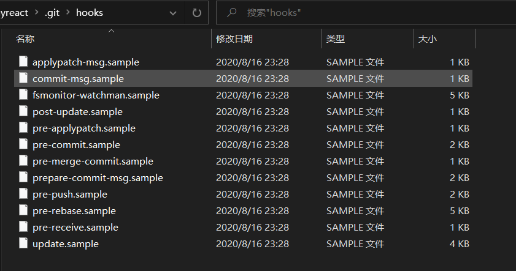
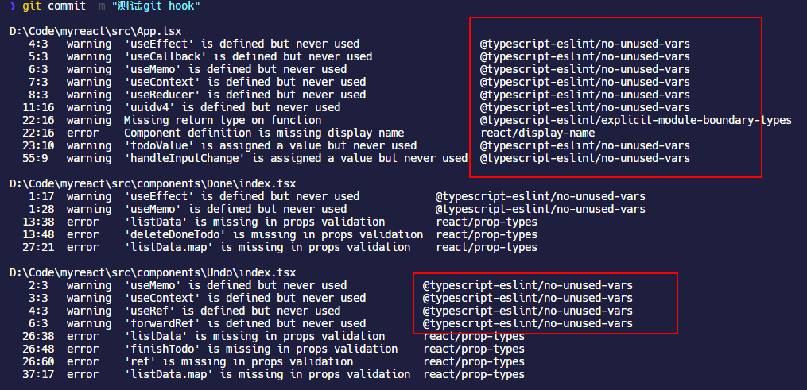

## git hook

关于 [git hook](https://git-scm.com/book/zh/v2/%E8%87%AA%E5%AE%9A%E4%B9%89-Git-Git-%E9%92%A9%E5%AD%90) ，在 git 官方文档中介绍的很详细，简而言之就是在执行 git 命令的时候自动触发的脚本命令。git hook 分为两种：

- 客户端，主要是本地执行`git commit`等命令时执行的 hook；
- 服务端，主要用于服务器接收到`git push`等命令推送的代码以后执行的命令，比较常见的就是 CI/CD 的自动化工作流；

## 如何使用

git hook 都被以脚本的形式存储在项目内的`.git/hooks`目录下，如果是新项目使用 `git init` 初始化一个新版本库时，Git 默认会在这个目录中放置一些示例脚本，这些示例脚本统一使用`.sample`后缀，可以在 vscode 等编辑器中打开，如果要启用这些示例脚本的化，需要去掉`sample`后缀。



### 客户端 hook

#### pre-commit

最为常用的一个客户端 hook 就是`pre-commit`，这个 hook 命令会在执行`git commit`之后运行，所以最常用的功能就是配合代码检查工具来使用，这样不规范的代码就无法提交。不过可以用 `git commit --no-verify` 来绕过这个环节。

#### prepare-commit-msg

`prepare-commit-msg`会在启动提交信息编辑器之前触发，也就是可以利用它来自定义默认`git commit`的`message`的格式，这个 hook 应该在一些提交规范严格的团队中比较常用。

#### post-merge

`post-merge`会在 `git merge` 成功运行后执行

### 服务端 hook

#### pre-receive

`pre-receive`会在服务端接收到推送的代码以后触发，这个 hook 一般用来进行代码语法等低级错误的检测，如果`pre-receive`返回非`0`的值，则当前的 push 操作会被拒绝。

#### post-receive

`post-receive`会在`git push`，检查代码错误等前面一系列操作通过后执行，所以主要用来触发 CI/CD 的自动化工作流程，或者给代码库作者发送邮件等。

## ESLint

将 ESLint 和 git hook 结合进行代码规范检查可以极大的约束团队的代码规范，在开发环境解决代码提交不规范的问题，既有助于形成个人良好的代码风格，也有助于提高代码 CR 的效率，避免代码提交以后 CR 时出现代码规范上的低级错误。

### 安装 pre-commit

首先安装`pre-commit`这个 hook，安装完以后，会自动在上面介绍的`.git/hooks`目录下生成一个`pre-commit`文件。

```shell
yarn add pre-commit -D
```

### 安装 ESLint 等工具

安装 ESLint，`eslint-plugin-react`，`@typescript-eslint/eslint-plugin`等系列插件

```shell
yarn add eslint eslint-plugin-react @typescript-eslint/parser @typescript-eslint/eslint-plugin -D
```

简单配置一下`.eslintrc.js`文件，实现对项目`JSX`，`TSX`等代码的检查

```javascript
module.exports = {
  env: {
    browser: true,
    es2020: true,
    node: true,
  },
  parser: '@typescript-eslint/parser',
  plugins: ['react', '@typescript-eslint'],
  extends: [
    'eslint:recommended',
    'plugin:react/recommended',
    'plugin:@typescript-eslint/eslint-recommended',
    'plugin:@typescript-eslint/recommended',
  ],
  settings: {
    react: {
      version: 'detect',
    },
  },
};
```

### 配置`package.json`

在`package.json`文件的`scripts`属性中写入 ESLint 内置支持的执行命令以及`pre-commit` hook 执行以后触发的命令

```json
"scripts": {
  "lint": "eslint --ext .jsx,.js,.ts,.tsx ./src  --fix ./src"
},
"pre-commit": [
  "lint"
],
```

### 测试

接下来执行`git commit`以后就会自触发`pre-commit` hook，进而执行 ESLint 检查代码，如果出现不规范的地方，就会发生错误：



## 其他工具

我在查询 git hook 和 ESLint 结合相关资料的时候，看到网上推荐比较多的工具是`husky`和 [`lint-staged`](https://github.com/okonet/lint-staged)。

### husky

[typicode/husky(哈士奇)](https://github.com/typicode/husky)是一个能通过一些指定的命令自动创建 git hook 的工具，当前有两个版本可以选择，V4 版本的 husky 在安装以后能自动在项目`.git/hooks`目录下生成 git hook 文件，例如上述的 git hook 都能自动生成，并且如果把 husky 卸载掉，这些文件也会跟着删除。


要使用这些 git hook，只需要在`package.json`写入如下配置即可：

```json
// package.json
{
  "scripts": {
    "lint": "eslint --ext .jsx,.js,.ts,.tsx ./src  --fix ./src"
  },
  "husky": {
    "hooks": {
      "pre-commit": "lint"
    }
  }
}
```

但是 V5 版本改动比较大，安装完以后不会自动创建 git hook 文件，如果要创建刚才的`pre-commit`这个文件，需要使用一些命令，首先需要安装哈士奇

```shell
yarn add husky@next -D
```

然后执行`yarn husky install`确保启动 git hook；最后要添加一个 hook 触发执行的命令，需要使用`npx husky add <hookname> [cmd]`

```shell
yarn husky install

npx husky add pre-commit "lint"
```

### lint-staged

`lint-staged`这个工具比较人性化，它只会对使用`git add`添加到暂存区的代码进行检查。如果一个项目之前没有使用过 ESLint 这种代码约束工具，突然集成以后肯

定会发生各种报错，那些没有修改的代码等修改完了再提交就很耽误效率了，所以需要`lint-staged`这样的工具，只对修改完添加到暂存区的代码进行检查。

这个工具本身和`husky`集成一起使用非常的方便，其针对`husky`内置了`npx mrm lint-staged`这个命令，和`husky`一起安装完以后，使用这个命令就会自动在`package.json`下生成和`husky`结合的配置。

```shell
yarn add husky lint-staged -D

// 然后执行
npx mrm lint-staged
```


`lint-staged`下属性名是 glob 匹配模式的文件路径，属性值是要执行的命令。

```json
"husky": {
  "hooks": {
    "pre-commit": "lint-staged"
  }
},
"lint-staged": {
  "*.{jsx,js,ts,tsx}": "eslint --fix"
}
```

### standard

[standard/README-zhcn.md at master · standard/standard (github.com)](https://github.com/standard/standard/blob/master/docs/README-zhcn.md)就比较厉害了，号称 JavaScript 代码规范，自带 linter & 代码自动修正，具有以下特点：

- **无须配置。** 不用维护 `.eslintrc`等配置文件
- **自动代码格式化。** 只需运行 `standard --fix` 从此和脏乱差的代码说再见

在`standard`中使用的 JS 代码规范也比较多，见 —— [JavaScript Standard Style](https://github.com/standard/standard/blob/master/docs/RULES-zhcn.md#javascript-standard-style)，大部分在 ESLint 中都有对应的规则。
