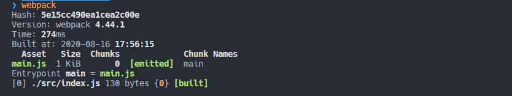
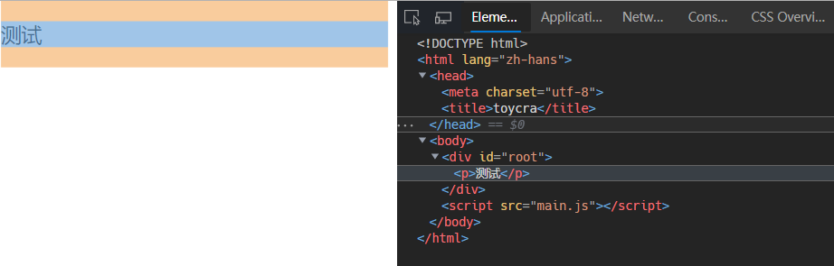

> [Tutorial: How to set up React](https://www.valentinog.com/blog/babel/)

## 配置 webpack

### webpack 介绍

根据 webpack 官网的解释来说，它是一个现代 JS 应用的 bundler，翻译过来就是打包器。webpack 会根据模块之间的依赖最终合并模块形成一个或者多个 bundles。

安装 webpack 脚手架，以及命令行工具

```shell
yarn init

yarn global add webpack webpack-cli
```

### 修改项目目录

添加 dist 文件夹，在 dist 文件夹添加一个`index.html`文件，插入`<script>`脚本；一方面，单页面应用都需要一个基础的 html 页面；另一方面，因为 webpack 只能识别 js 和 json 文件，所以 html 文件需要手动添加到输出目录，放在其它文件夹里也行，比如`public/index.html`，不过这时候引入`<script>`的`src`属性要和 webpack 打包输出的目录路径相匹配才行。

```html
<!DOCTYPE html>
<html lang="zh-hans">
  <head>
    <meta charset="utf-8" />
    <title>toycra</title>
  </head>
  <body>
    <div id="root"></div>
    <script src="main.js"></script>
  </body>
</html>
```

添加 src 文件夹，在 src 文件夹下新建`index.js`文件作为 webpack 启动的入口文件；

```javascript
var p = document.createElement('p');
p.innerText = 'test';

var root = document.getElementById('root');
root.appendChild(p);
```

### 修改 webpack 配置

新建一个`webpack.config.js`配置文件，配置项目入口和输出目录。`entry`的默认值其实就是`./src/index.js`，而`output`的默认值也是`./dist/main.js`。

webpack 本身遵循 CommonJS 模块规范，所以使用`require`导入模块，`module.exports`导出模块。

`__dirname`表示当前模板的目录名，用在`webpack.config.js`这个文件里，也就是项目的根目录，`path.resolve`根据传入的路径从右往左构造绝对路径值，最终结果就是`/dist`。也可以直接写成本地的绝对路径值，但是这样在共享代码的时候会带来困难。

```javascript
const path = require('path');

module.exports = {
  entry: './src/index.js',
  output: {
    filename: 'main.js',
    path: path.resolve(__dirname, 'dist'),
  },
};
```

### 测试 webpack 打包

执行`webpack`命令以后，在终端看到这样的提示就表示打包成功，接下来可以去`dist`目录找`index.html`使用浏览器打开，看到 html 页面根据 js 脚本写入的片段就完成了 webpack 初始化阶段配置。



## 配置 React

### 安装 React 基础库

先安装 React 的基本组件库。

```shell
yarn add react react-dom
```

### 安装 babel

> [Babel 是什么？](<[https://www.babeljs.cn/docs/#jsx-%E4%B8%8E-react](https://www.babeljs.cn/docs/#jsx-与-react)>)

根据 babel 官网的介绍，Babel 主要用于将 ECMAScript 2015+ 版本的代码转换为向后兼容的 JavaScript 语法，以便能够运行在当前和旧版本的浏览器或其他环境中。

Babel 提供的有各种`plugin`用于转换不同的语法，`plugin`的存在让 Babel 可以轻松地应对本地高版本的 ES 代码，如果你想使用最新的 ES 语法，需要引入对应的`plugin`来转换，例如你只想转换代码中的箭头函数，可以使用`@babel/plugin-transform-arrow-functions`。

同时 Babel 还提供`preset`的功能，将一些`plugin`集合起来，通过一个简单的`presets`配置，就可以使用一些`plugin`的功能，但是`presets`同时引入多个`plugin`，里面很可能存在不需要的`plugin`配置，从而导致性能上的损失。

所以根据 Babel 官网的指示，安装相关组件：

- [`@babel/core`](https://babeljs.io/docs/en/core-packages)：Babel 的核心模块，将其他 Babel 的核心代码封装到一块，用于和其他插件进行集成开发；例如将源代码转换成 AST，AST 是代码的抽象语法树，类似于一个 JSON 一样的树状结构，方便 Babel 的插件来解析 AST 进行代码转换
- [`@babel/preset-env`](https://babeljs.io/docs/en/babel-preset-env)：负责将 ECMAScript 2015+ 版本的代码转换为向后兼容的 JavaScript 语法
- [`@babel/preset-react`](https://babeljs.io/docs/en/babel-preset-react)：负责转换 React 的 JSX 代码，以及支持 React 的 API 的命名，例如`React.createxxx`等内容

```shell
yarn add @babel/core @babel/preset-env @babel/preset-react -D
```

### 安装 babel-loader

```shell
yarn add babel-loader -D
```

使用 webpack 的 loader，需要熟悉以下几部分内容：

- webpack 的 loader 是什么 —— [概念 - loader](https://webpack.docschina.org/concepts/loaders/#configuration)
- webpack 的 loader 如何配置 —— [`module.rules`](https://webpack.docschina.org/configuration/module/#modulerules)

- `babel-loader`的配置方式 —— [babel-loader](https://webpack.js.org/loaders/babel-loader/)

简而言之，loader 为 webpack 提供了处理除`.js`，`.json`以外其它所有代码的功能，而`babel-loader`就是许多 loader 的其中之一，提供在 webpack 打包过程中调用 Babel 代码来处理 React，ECMAScript 2015+ 等相关代码的功能。

webpack 官方对 loader 的配置提供了三种方式，并且推荐使用配置文件在[`module.rules`](https://webpack.docschina.org/configuration/module/#modulerules)中指定 loader，这种方式将配置和代码分离，使得项目层次更加分明，维护也更方便。

以下按照推荐的方式在`module.rules`中配置`babel-loader` 。

```javascript
module: {
  rules: [
    {
      test: /\.m?jsx?$/,
      exclude: /(node_modules)/,
      use: {
        loader: 'babel-loader',
        options: {
          presets: ['@babel/preset-env', '@babel/preset-react'],
          // 如果在class组件中使用属性或者箭头函数之类的语法，必须要引入这个plugin
          plugins: ['@babel/plugin-proposal-class-properties'],
        },
      },
    },
  ];
}
```

### 测试 JSX 编写

在 src 目录下新建一个`test.jsx`文件，根据 React 的语法来编写一个组件

```jsx | pure
import React, { Component } from 'react';

export default class extends Component {
  render() {
    return <p>测试</p>;
  }
}
```

在之前的`index.js`中引入组件，并通过`ReactDOM.render`渲染到页面中

```jsx | pure
import React from 'react';
import ReactDOM from 'react-dom';
import TestComponent from './test.jsx';

ReactDOM.render(<TestComponent />, document.getElementById('root'));
```

执行`webpack`打包看一下`dist`目录的输出文件，如果不出意外就能看到页面`root`节点已经渲染出了组件中的`<p>`元素



到这里，完成了基本的 React 的项目配置，这才刚开始！🤪🤪🤪
